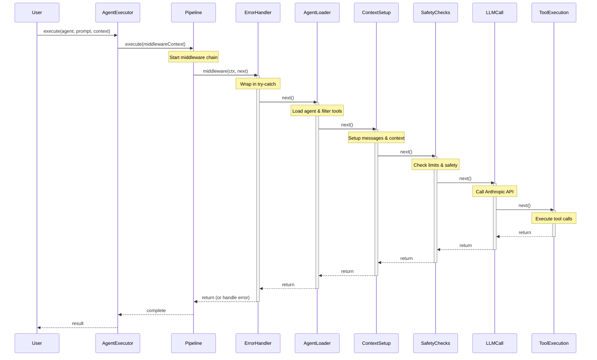
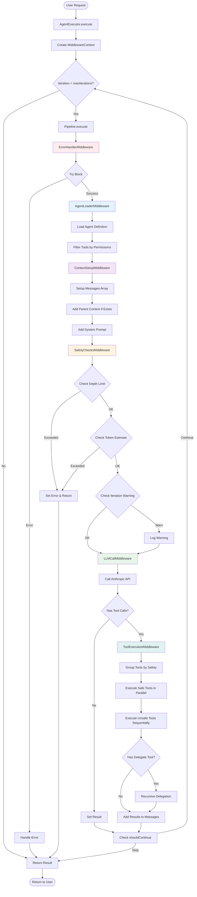
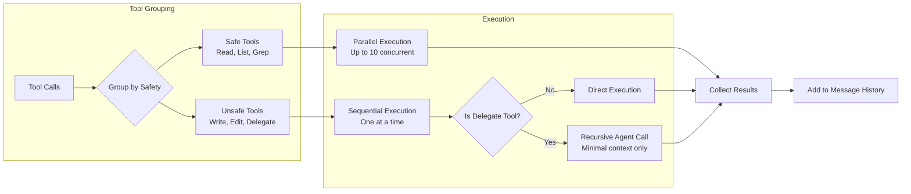

# Agent Orchestration System

**Production-ready TypeScript framework for building autonomous, collaborative AI agents**

Key capabilities:

- **Autonomous Agents**: Agents gather information via tools, making independent decisions without massive context dumps
- **Deep Reasoning**: Multi-provider thinking support (Claude, OpenAI o1/o3, OpenRouter) for complex planning and problem-solving
- **Agent Collaboration**: Agents delegate to specialized sub-agents, forming dynamic teams for complex tasks
- **Multi-Provider Support**: Switch between Anthropic, OpenAI, OpenRouter, or custom providers with simple configuration
- **Production-Ready**: Built-in security, retry logic, session persistence, and comprehensive monitoring
- **Cost Efficient**: Smart caching delivers up to 90% cost savings on multi-agent workflows

## 🎯 Architecture Highlights

### Clean Middleware Pipeline
```typescript
type Middleware = (ctx: MiddlewareContext, next: () => Promise<void>) => Promise<void>;
```

The monolithic 500-line `AgentExecutor` has been refactored into a clean pipeline of focused middleware:
- **ErrorHandlerMiddleware** - Global error boundary
- **AgentLoaderMiddleware** - Loads agents and filters tools
- **ThinkingMiddleware** - Validates and normalizes thinking configuration
- **ContextSetupMiddleware** - Manages conversation context
- **ProviderSelectionMiddleware** - Selects LLM provider (Anthropic, OpenRouter, etc.)
- **SafetyChecksMiddleware** - Enforces limits (depth, iterations, tokens)
- **SmartRetryMiddleware** - Retries on rate limits (429) with exponential backoff
- **LLMCallMiddleware** - Handles LLM communication
- **ToolExecutionMiddleware** - Orchestrates tool execution

### Everything is an Agent
- No special orchestrator class - all agents use the same pipeline
- Agents are defined as markdown files with YAML frontmatter
- Orchestration emerges through the `Delegate` tool for delegation

### Pull Architecture with Caching
When agent A delegates to agent B:
1. B receives **minimal context** (~5-500 tokens) - just the task prompt
2. B uses tools (Read, Write, List, Grep, Delegate) to **pull** information it needs
3. Anthropic's cache makes "redundant" reads efficient (90% cost savings)
4. Clean separation - each agent has independent context

## 🔄 Core Patterns

### The Agentic Loop (ReAct Pattern)
Each agent automatically implements the **Reason → Act → Observe** loop:
1. **Reason**: Agent analyzes prompt and decides what to do
2. **Act**: Agent calls tools to gather information or take action
3. **Observe**: Agent processes tool results
4. **Repeat**: Continue until task is complete (no more tool calls)

This iterative refinement allows agents to:
- Build understanding incrementally
- Correct mistakes
- Ground responses in actual data
- Never hallucinate file contents

See [Agentic Loop Pattern](docs/agentic-loop-pattern.md) for details.

### Iteration vs Delegation
- **Iteration**: Same agent refining its response (limited by MAX_ITERATIONS)
- **Delegation**: Calling another agent via Delegate tool (limited by MAX_DEPTH)

## 🚀 Quick Start

```bash
# Install dependencies
npm install

# Set up API keys (at least one required)
cp .env.example .env
# Edit .env with your ANTHROPIC_API_KEY or OPENROUTER_API_KEY

# Optional: Configure providers
cp providers-config.example.json providers-config.json

# Build the project
npm run build

# Run tests
npm test              # Run all tests
npm run test:unit     # Unit tests only (no API)
npm run test:integration # Integration tests (requires API key)

# Use CLI
npm run cli -- -p "Hello, world!"       # CLI tool
echo "Analyze this" | npm run cli       # stdin support

# Run examples
npx tsx examples/quickstart.ts          # Simple quickstart
npx tsx examples/orchestration.ts       # Agent orchestration
npx tsx examples/configuration.ts       # Config file usage
npx tsx examples/logging.ts             # Logging features
npx tsx examples/mcp-integration.ts     # MCP server support
npx tsx examples/werewolf-game.ts       # Autonomous multi-agent game
npx tsx examples/coding-team/coding-team.ts  # Collaborative coding agents
```

## 🎮 Examples

### Basic Agent Execution (quickstart.ts)
Simple demonstration of agent execution with file operations.

### Agent Orchestration (orchestration.ts)
Shows how agents delegate tasks to specialized sub-agents using the Delegate tool.

### Configuration Files (configuration.ts)
Demonstrates loading agent system configuration from JSON files.

### Werewolf Game - Autonomous Agents (werewolf-game.ts)
A complex multi-agent game demonstrating true agent autonomy:
- **Game-master agent** orchestrates the entire game independently
- **Role agents** (werewolf, seer, villager) make strategic decisions
- **Evidence-based gameplay** with alibis, deductions, and voting
- **No hardcoded logic** - all game rules exist in agent prompts

This example showcases how agents can be truly autonomous entities that receive high-level requests ("run a game") and handle all implementation details themselves.

```bash
# Run the werewolf game
npx tsx examples/werewolf-game.ts
```

### Coding Team - Collaborative Development (coding-team/)
Demonstrates how specialized agents collaborate to implement software features:
- **Driver agent** orchestrates the development process and tracks progress
- **Implementer agent** writes production code following existing patterns
- **Test-writer agent** creates comprehensive test suites
- **Shell tool integration** enables running tests and type checking
- **TodoWrite tracking** provides real-time progress visibility

This example shows the practical application of the pull architecture where each agent independently discovers what they need, rather than receiving massive context dumps.

```bash
# Set up the sample project
cd examples/coding-team/sample-project && npm install && cd -

# Run the coding team
npx tsx examples/coding-team/coding-team.ts
```

## 💻 Command-Line Interface

The `@agent-system/cli` package provides a production-ready CLI tool for interacting with agents:

### Installation
```bash
# Install globally
npm install -g @agent-system/cli

# Or use from workspace
npm run cli
```

### Features
- **Unix-friendly**: stdin/stdout support, proper exit codes, EPIPE handling
- **Security**: 10MB input limit, 30s timeout, signal handling (SIGINT/SIGTERM)
- **Output modes**: clean (default), verbose, json
- **Flexible**: Use -p flag or pipe from stdin

### Usage Examples
```bash
# Basic usage
agent -p "Hello, world!"

# Read from stdin (Unix-style)
echo "Analyze this code" | agent
cat file.txt | agent

# JSON output for scripting
agent -p "List 3 colors" --json | jq '.result'

# Custom agent
agent -p "Review code" -a code-reviewer

# List available
agent --list-agents
agent --list-tools

# Verbose output with metrics
agent -p "Test" --output verbose
```

For complete CLI documentation, see [packages/cli/README.md](packages/cli/README.md).

## 🎨 Agent Behavior Configuration

Agents can specify behavioral characteristics through presets that control temperature and top_p:

```yaml
# In agent markdown frontmatter
---
name: validator
behavior: deterministic  # Uses preset for consistency
---
```

Available presets (catalog in `providers-config.json`, defaults in `agent-config.json`):
- **deterministic** (0.1/0.5): Validation, routing, business logic
- **precise** (0.2/0.6): Code analysis, verification, structured outputs
- **balanced** (0.5/0.85): Default - orchestration, tool use, reasoning
- **creative** (0.7/0.95): Storytelling, game mastering, creative content
- **exploratory** (0.9/0.98): Research, brainstorming, alternatives

## 🧠 Extended Thinking & Reasoning

Agents can use extended thinking to reason deeply before responding - significantly improving performance on complex tasks like planning, code design, and problem-solving.

### Quick Start

```yaml
# In agent markdown frontmatter
---
name: orchestrator
tools: ["delegate", "todowrite"]
thinking:
  type: enabled
  budget_tokens: 16000
---

You are a project orchestrator. Before delegating tasks, think through:
- What is the end goal?
- What order makes sense?
- What could go wrong?
```

### How It Works

When thinking is enabled, agents:
1. **Think internally** before responding (you see this process with 🧠 emoji)
2. **Plan their approach** step-by-step
3. **Consider alternatives** and edge cases
4. **Generate better responses** based on reasoning

### Multi-Provider Support

The same configuration works across all providers:

- **Anthropic**: Extended thinking (Claude 3.7) & Interleaved thinking (Claude 4+)
- **OpenRouter**: Reasoning tokens (available on 200+ models)
- **OpenAI**: Automatic reasoning (o1, o3 series)

### Token Budget Guide

| Task Complexity | Budget | Use Case |
|----------------|--------|----------|
| Simple | 2,000-5,000 | Basic analysis, routing |
| Moderate | 5,000-10,000 | Code implementation, planning |
| Complex | 10,000-16,000 | Multi-agent orchestration, code review |
| Very Complex | 16,000-24,000 | Deep analysis, complex problem solving |

### Example: Thinking in Action

```
🧠 Agent Thinking:
Let me analyze this request step by step:

1. The user wants to implement a factorial function
2. I need to consider edge cases: 0!, negative numbers
3. I should delegate to the implementer agent
4. The implementer will need the project path and requirements
5. After implementation, tests should verify correctness

Plan: First explore project structure, then delegate with clear
      requirements including edge case handling.

[Agent then executes the planned approach]
```

For complete documentation, see [Extended Thinking Guide](docs/extended-thinking.md).

## 📁 Project Structure

```
agent-orchestration-system/
├── packages/                 # Workspace packages
│   ├── core/                # Core agent system (@agent-system/core)
│   │   ├── src/             # Source code
│   │   │   ├── config/      # Configuration system
│   │   │   ├── middleware/  # Middleware pipeline
│   │   │   ├── agents/      # Agent domain
│   │   │   ├── tools/       # Tool domain
│   │   │   ├── providers/   # LLM providers
│   │   │   ├── logging/     # Logging
│   │   │   └── lib/         # Utilities
│   │   ├── tests/           # Test suite
│   │   └── examples/        # Usage examples
│   ├── cli/                 # CLI tool (@agent-system/cli)
│   │   ├── src/
│   │   │   ├── index.ts     # CLI entry point with stdin support
│   │   │   └── output.ts    # Output formatting utilities
│   │   ├── tests/           # CLI tests
│   │   └── README.md        # CLI documentation
│   └── web/                 # Web UI (@agent-system/web)
│       ├── src/             # React frontend
│       └── server/          # Express backend
├── agents/                   # Shared agent definitions
├── docs/                     # Documentation
└── examples/                 # Legacy examples (moving to packages/core/examples)
```

## 🏗️ Middleware Architecture Benefits

### Clean Separation of Concerns
- Each middleware ~60 lines (was 500+ in monolith)
- Single responsibility per middleware
- Easy to test, modify, and extend

### Type Safety
- Full TypeScript types throughout
- No `any` types in critical paths
- Compile-time safety

### Error Resilience
- Global error boundaries
- Graceful degradation
- User-friendly error messages

### POC Stability
- Fixed race conditions in pipeline
- 5-minute execution timeout
- Proper concurrency handling

## 📊 Performance & Efficiency

### Model Selection

Models must be specified with their provider prefix:

```typescript
// Format: provider/model[:modifier]

// Direct to provider APIs
.withModel('anthropic/claude-3-5-haiku-latest')
.withModel('openai/gpt-4-turbo')

// Via OpenRouter (supports :nitro and :floor modifiers)
.withModel('openrouter/meta-llama/llama-3.1-70b-instruct')        // Default routing
.withModel('openrouter/meta-llama/llama-3.1-70b-instruct:nitro')  // Fast throughput
.withModel('openrouter/meta-llama/llama-3.1-70b-instruct:floor')  // Lowest price
```

### Caching Metrics
- **90% reduction** in token costs for repeated context
- **2000x efficiency** for multi-agent workflows
- **5-minute cache window** perfect for interactive sessions

### Execution Strategy
- **Parallel execution** for read-only tools (up to 10 concurrent)
- **Sequential execution** for write operations
- **Smart batching** based on tool safety

## 🧪 Creating New Agents

Create a markdown file in `agents/` directory:

```markdown
---
name: my-specialist
tools: ["read", "list"]  # or "*" for all tools
---

# My Specialist Agent

You are a specialist agent that focuses on...
[Define the agent's role and capabilities]
```

## ⚙️ Configuration System

The new `AgentSystemBuilder` provides a fluent API for configuring the system:

```typescript
import { AgentSystemBuilder } from './src/config/system-builder';

// Minimal configuration
const minimal = await AgentSystemBuilder.minimal().build();

// Default with file tools
const withTools = await AgentSystemBuilder.default()
  .withModel('anthropic/claude-3-5-haiku-latest')
  .withSessionId('my-session')
  .build();

// Full configuration with MCP support
const full = await AgentSystemBuilder.default()
  .withMCPServers({
    'time': {
      command: 'uvx',
      args: ['mcp-server-time'],
      description: 'Time utilities'
    }
  })
  .withSafetyLimits({ maxIterations: 100 })
  .withLogging({ verbose: true })
  .build();

// From config file
const fromFile = await AgentSystemBuilder
  .fromConfigFile('./agent-config.json')
  .build();

// Always cleanup when done
await full.cleanup();
```

## 🔧 Adding Custom Middleware

```typescript
import { Middleware } from './middleware/middleware-types';

export function createCustomMiddleware(): Middleware {
  return async (ctx, next) => {
    // Pre-processing
    console.log(`Processing: ${ctx.agentName}`);
    
    // Call next middleware
    await next();
    
    // Post-processing
    console.log(`Completed: ${ctx.agentName}`);
  };
}
```

## 🎯 Key Design Decisions

### Pull Architecture
Unlike traditional systems that pass full context to child agents, we implement a "pull, don't push" architecture:

- **Minimal Context**: Child agents receive only the task prompt (~5-500 tokens)
- **Tool-Based Discovery**: Agents use Read, Grep, List to gather what they need
- **No Confusion**: No mixed contexts or role confusion
- **Cache Efficiency**: Anthropic's cache makes "redundant" reads ~90% cheaper

```typescript
// Traditional (problematic)
parentMessages: ctx.messages.slice() // 10,000+ tokens of confusion

// Our approach (pull architecture)
parentMessages: []  // Clean slate, agent pulls what it needs
```

### Why Middleware?
- **Composable**: Easy to add/remove/reorder functionality
- **Testable**: Each piece can be tested in isolation
- **Maintainable**: Clear boundaries and responsibilities
- **Familiar**: Express.js-like pattern widely understood

### Why Anthropic?
- **Caching is essential**: Architecture depends on context reuse
- **OpenAI lacks caching**: Would make delegation prohibitively expensive
- **Anthropic's ephemeral cache**: Makes the architecture economically viable

## 🧪 Testing

The project includes comprehensive test coverage with separate unit and integration tests:

### Unit Tests
```bash
npm run test:unit
```
- No API calls required
- Tests system structure and configuration
- Fast execution (~1 second)
- 100% reliable

### Integration Tests
```bash
npm run test:integration
```
- Requires real API key (Anthropic or OpenRouter)
- Tests actual agent orchestration
- Tests caching behavior
- Tests parallel execution
- **Note**: May hit rate limits if run too frequently

### Test Configuration
Create `.env.test` for test-specific settings:
```bash
ANTHROPIC_API_KEY=your-test-key
MODEL=claude-3-5-haiku-latest
LOG_DIR=./test-logs
MAX_ITERATIONS=10
MAX_DEPTH=3
```

## 🔌 MCP (Model Context Protocol) Support

The system supports MCP servers for extending functionality with external tools:

### Configuration
```json
{
  "mcpServers": {
    "time": {
      "command": "uvx",
      "args": ["mcp-server-time"],
      "description": "Time and timezone utilities"
    },
    "weather": {
      "command": "npx",
      "args": ["-y", "@modelcontextprotocol/server-weather"],
      "description": "Weather information"
    }
  }
}
```

### Usage
```typescript
const builder = await AgentSystemBuilder
  .fromConfigFile('./agent-config.json')
  .build();

// MCP tools are automatically registered with server prefix
// e.g., "time.get_current_time", "weather.get_forecast"
```

## 📈 Example Workflow

```
User Request
  ↓
Middleware Pipeline
  ├─ Error Handler (catches all errors)
  ├─ Agent Loader (loads agent definition)
  ├─ Context Setup (prepares messages)
  ├─ Safety Checks (enforces limits)
  ├─ LLM Call (gets response)
  └─ Tool Execution
      ├─ Parallel batch (read operations)
      ├─ Sequential batch (write operations)
      └─ Delegation (recursive with context)
```

## 🔄 Pipeline Flow Diagrams

### Middleware Pipeline Sequence



### Detailed Middleware Flow



### Tool Execution Strategy



## 🚦 Safety Features

- **Max depth**: Prevents infinite delegation chains
- **Max iterations**: Limits execution loops (default: 100)
- **Token estimation**: Prevents context overflow
- **Execution timeout**: 5-minute maximum per request
- **Error boundaries**: Graceful error handling

## 📝 Testing

```bash
# Structure test (no API calls)
npm run example:structure

# Full orchestration test
npm run example:orchestration

# Parallel execution test
npm run example:parallel

# Caching demonstration
npm run example:cache
```
