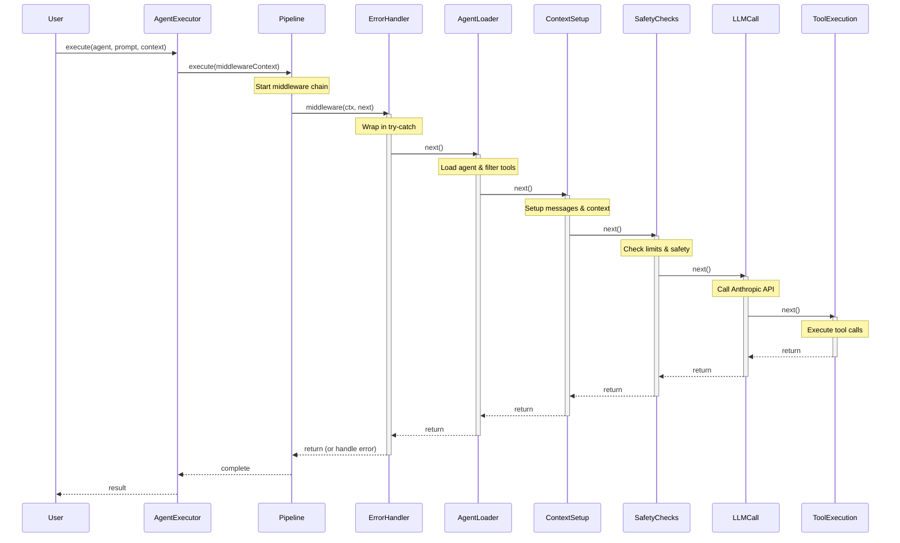

# Agent Orchestration POC - Pull Architecture with Middleware Pipeline

A TypeScript implementation of Claude Code's agent orchestration system using **pull architecture** where child agents autonomously gather information via tools rather than inheriting parent context. Built with a **middleware pipeline architecture** (Chain of Responsibility pattern) and leverages Anthropic's ephemeral caching for efficiency.

## 🆕 Recent Updates
- **Behavior Presets**: Semantic temperature/top_p control (deterministic, precise, balanced, creative, exploratory)
- **Multi-Provider Support**: Dynamic provider selection (Anthropic, OpenRouter) based on model patterns
- **Grep Tool**: Fast file searching using ripgrep for pattern matching
- **Improved Error Handling**: Clear messages for missing API keys and unavailable models
- **Provider Factory**: Automatic provider selection with per-agent behavior configuration
- **Fail-Fast Behavior**: Agents now fail immediately when required models are unavailable

## 🎯 Architecture Highlights

### Clean Middleware Pipeline
```typescript
type Middleware = (ctx: MiddlewareContext, next: () => Promise<void>) => Promise<void>;
```

The monolithic 500-line `AgentExecutor` has been refactored into a clean pipeline of focused middleware:
- **ErrorHandlerMiddleware** - Global error boundary
- **AgentLoaderMiddleware** - Loads agents and filters tools
- **ContextSetupMiddleware** - Manages conversation context
- **ProviderSelectionMiddleware** - Selects LLM provider (Anthropic, OpenRouter, etc.)
- **SafetyChecksMiddleware** - Enforces limits (depth, iterations, tokens)
- **LLMCallMiddleware** - Handles LLM communication
- **ToolExecutionMiddleware** - Orchestrates tool execution

### Everything is an Agent
- No special orchestrator class - all agents use the same pipeline
- Agents are defined as markdown files with YAML frontmatter
- Orchestration emerges through the `Task` tool for delegation

### Pull Architecture with Caching (Claude Code Style)
When agent A delegates to agent B:
1. B receives **minimal context** (~5-500 tokens) - just the task prompt
2. B uses tools (Read, Write, List, Grep, Task) to **pull** information it needs
3. Anthropic's cache makes "redundant" reads efficient (90% cost savings)
4. Clean separation - each agent has independent context

## 🚀 Quick Start

```bash
# Install dependencies
npm install

# Set up API keys (at least one required)
cp .env.example .env
# Edit .env with your ANTHROPIC_API_KEY or OPENROUTER_API_KEY

# Optional: Configure providers
cp providers-config.example.json providers-config.json

# Build the project
npm run build

# Run tests
npm test              # Run all tests
npm run test:unit     # Unit tests only (no API)
npm run test:integration # Integration tests (requires API key)

# Run examples
npx tsx examples/quickstart.ts          # Simple quickstart
npx tsx examples/orchestration.ts       # Agent orchestration
npx tsx examples/configuration.ts       # Config file usage
npx tsx examples/logging.ts             # Logging features
npx tsx examples/mcp-integration.ts     # MCP server support
npx tsx examples/werewolf-game.ts       # Autonomous multi-agent game
```

## 🎮 Examples

### Basic Agent Execution (quickstart.ts)
Simple demonstration of agent execution with file operations.

### Agent Orchestration (orchestration.ts)
Shows how agents delegate tasks to specialized sub-agents using the Task tool.

### Configuration Files (configuration.ts)
Demonstrates loading agent system configuration from JSON files.

### Werewolf Game - Autonomous Agents (werewolf-game.ts)
A complex multi-agent game demonstrating true agent autonomy:
- **Game-master agent** orchestrates the entire game independently
- **Role agents** (werewolf, seer, villager) make strategic decisions
- **Evidence-based gameplay** with alibis, deductions, and voting
- **No hardcoded logic** - all game rules exist in agent prompts

This example showcases how agents can be truly autonomous entities that receive high-level requests ("run a game") and handle all implementation details themselves.

```bash
# Run the werewolf game
npx tsx examples/werewolf-game.ts

# The game-master will:
# 1. Set up players and roles
# 2. Run night phases (kills, investigations)
# 3. Facilitate day discussions with evidence
# 4. Manage voting and eliminations
# 5. Continue until one side wins
```

## 🎨 Agent Behavior Configuration

Agents can specify behavioral characteristics through presets that control temperature and top_p:

```yaml
# In agent markdown frontmatter
---
name: validator
behavior: deterministic  # Uses preset for consistency
---
```

Available presets (configured in `providers-config.json`):
- **deterministic** (0.1/0.5): Validation, routing, business logic
- **precise** (0.2/0.6): Code analysis, verification, structured outputs
- **balanced** (0.5/0.85): Default - orchestration, tool use, reasoning
- **creative** (0.7/0.95): Storytelling, game mastering, creative content
- **exploratory** (0.9/0.98): Research, brainstorming, alternatives

## 📁 Project Structure

```
poc-typescript/
├── src/
│   ├── config/               # Configuration system
│   │   ├── system-builder.ts # Fluent API for configuration
│   │   └── types.ts          # Configuration types
│   ├── middleware/           # Middleware pipeline components
│   │   ├── *.middleware.ts   # Individual middleware
│   │   ├── middleware-types.ts # Middleware types
│   │   └── pipeline.ts       # Pipeline executor
│   ├── agents/               # Agent domain
│   │   ├── executor.ts       # Main executor with pipeline
│   │   ├── loader.ts         # Loads agents from markdown
│   │   └── types.ts          # Agent-specific types
│   ├── tools/                # Tool domain
│   │   ├── registry/         # Tool infrastructure
│   │   │   ├── executor.ts   # Tool execution logic
│   │   │   ├── loader.ts     # Tool loading
│   │   │   └── registry.ts   # Tool management
│   │   ├── task.tool.ts      # Delegation tool
│   │   ├── file.tool.ts      # File operations
│   │   ├── grep.tool.ts      # Pattern searching
│   │   └── todowrite.tool.ts # Todo management
│   ├── providers/            # LLM providers (renamed from llm/)
│   │   ├── anthropic-provider.ts  # Anthropic with caching
│   │   └── openai-compatible-provider.ts # OpenRouter support
│   ├── logging/              # Logging (flattened from core/logging/)
│   │   ├── console.logger.ts # Console output
│   │   └── jsonl.logger.ts   # JSONL format
│   └── lib/                  # Utilities (renamed from utils/)
├── tests/                    # Comprehensive test suite
│   ├── unit/                 # Unit tests (no API)
│   ├── integration/          # Integration tests (with API)
│   └── README.md             # Testing documentation
└── examples/                 # Example demonstrations
    ├── quickstart.ts         # Simple getting started
    ├── orchestration.ts      # Agent delegation
    ├── configuration.ts      # Config file usage
    ├── logging.ts            # Logging features
    ├── mcp-integration.ts    # MCP server support
    └── werewolf-game/        # Autonomous multi-agent game
        ├── werewolf-game.ts       # Main game runner
        └── agents/                 # Game agent definitions
            ├── game-master.md      # Autonomous game orchestrator
            ├── werewolf.md         # Werewolf role agent
            ├── seer.md             # Seer role agent
            └── villager.md         # Villager role agent
```

## 🏗️ Middleware Architecture Benefits

### Clean Separation of Concerns
- Each middleware ~60 lines (was 500+ in monolith)
- Single responsibility per middleware
- Easy to test, modify, and extend

### Type Safety
- Full TypeScript types throughout
- No `any` types in critical paths
- Compile-time safety

### Error Resilience
- Global error boundaries
- Graceful degradation
- User-friendly error messages

### POC Stability
- Fixed race conditions in pipeline
- 5-minute execution timeout
- Proper concurrency handling

## 📊 Performance & Efficiency

### Caching Metrics
- **90% reduction** in token costs for repeated context
- **2000x efficiency** for multi-agent workflows
- **5-minute cache window** perfect for interactive sessions

### Execution Strategy
- **Parallel execution** for read-only tools (up to 10 concurrent)
- **Sequential execution** for write operations
- **Smart batching** based on tool safety

## 🧪 Creating New Agents

Create a markdown file in `agents/` directory:

```markdown
---
name: my-specialist
tools: ["read", "list"]  # or "*" for all tools
---

# My Specialist Agent

You are a specialist agent that focuses on...
[Define the agent's role and capabilities]
```

## ⚙️ Configuration System

The new `AgentSystemBuilder` provides a fluent API for configuring the system:

```typescript
import { AgentSystemBuilder } from './src/config/system-builder';

// Minimal configuration
const minimal = await AgentSystemBuilder.minimal().build();

// Default with file tools
const withTools = await AgentSystemBuilder.default()
  .withModel('claude-3-5-haiku-latest')
  .withSessionId('my-session')
  .build();

// Full configuration with MCP support
const full = await AgentSystemBuilder.default()
  .withMCPServers({
    'time': {
      command: 'uvx',
      args: ['mcp-server-time'],
      description: 'Time utilities'
    }
  })
  .withSafetyLimits({ maxIterations: 100 })
  .withLogging({ verbose: true })
  .build();

// From config file
const fromFile = await AgentSystemBuilder
  .fromConfigFile('./agent-config.json')
  .build();

// Always cleanup when done
await full.cleanup();
```

## 🔧 Adding Custom Middleware

```typescript
import { Middleware } from './middleware/middleware-types';

export function createCustomMiddleware(): Middleware {
  return async (ctx, next) => {
    // Pre-processing
    console.log(`Processing: ${ctx.agentName}`);
    
    // Call next middleware
    await next();
    
    // Post-processing
    console.log(`Completed: ${ctx.agentName}`);
  };
}
```

## 🎯 Key Design Decisions

### Pull Architecture (Claude Code Style)
Unlike traditional systems that pass full context to child agents, we implement Claude Code's "pull, don't push" architecture:

- **Minimal Context**: Child agents receive only the task prompt (~5-500 tokens)
- **Tool-Based Discovery**: Agents use Read, Grep, List to gather what they need
- **No Confusion**: No mixed contexts or role confusion
- **Cache Efficiency**: Anthropic's cache makes "redundant" reads ~90% cheaper

```typescript
// Traditional (problematic)
parentMessages: ctx.messages.slice() // 10,000+ tokens of confusion

// Our approach (Claude Code style)
parentMessages: []  // Clean slate, agent pulls what it needs
```

### Why Middleware?
- **Composable**: Easy to add/remove/reorder functionality
- **Testable**: Each piece can be tested in isolation
- **Maintainable**: Clear boundaries and responsibilities
- **Familiar**: Express.js-like pattern widely understood

### Why Anthropic?
- **Caching is essential**: Architecture depends on context reuse
- **OpenAI lacks caching**: Would make delegation prohibitively expensive
- **Anthropic's ephemeral cache**: Makes the architecture economically viable

## 🧪 Testing

The project includes comprehensive test coverage with separate unit and integration tests:

### Unit Tests
```bash
npm run test:unit
```
- No API calls required
- Tests system structure and configuration
- Fast execution (~1 second)
- 100% reliable

### Integration Tests
```bash
npm run test:integration
```
- Requires real API key (Anthropic or OpenRouter)
- Tests actual agent orchestration
- Tests caching behavior
- Tests parallel execution
- **Note**: May hit rate limits if run too frequently

### Test Configuration
Create `.env.test` for test-specific settings:
```bash
ANTHROPIC_API_KEY=your-test-key
MODEL=claude-3-5-haiku-latest
LOG_DIR=./test-logs
MAX_ITERATIONS=10
MAX_DEPTH=3
```

## 🔌 MCP (Model Context Protocol) Support

The system supports MCP servers for extending functionality with external tools:

### Configuration
```json
{
  "mcpServers": {
    "time": {
      "command": "uvx",
      "args": ["mcp-server-time"],
      "description": "Time and timezone utilities"
    },
    "weather": {
      "command": "npx",
      "args": ["-y", "@modelcontextprotocol/server-weather"],
      "description": "Weather information"
    }
  }
}
```

### Usage
```typescript
const builder = await AgentSystemBuilder
  .fromConfigFile('./agent-config.json')
  .build();

// MCP tools are automatically registered with server prefix
// e.g., "time.get_current_time", "weather.get_forecast"
```

## 📈 Example Workflow

```
User Request
  ↓
Middleware Pipeline
  ├─ Error Handler (catches all errors)
  ├─ Agent Loader (loads agent definition)
  ├─ Context Setup (prepares messages)
  ├─ Safety Checks (enforces limits)
  ├─ LLM Call (gets response)
  └─ Tool Execution
      ├─ Parallel batch (read operations)
      ├─ Sequential batch (write operations)
      └─ Delegation (recursive with context)
```

## 🔄 Pipeline Flow Diagrams

### Middleware Pipeline Sequence



### Detailed Middleware Flow


### Tool Execution Strategy


## 🚦 Safety Features

- **Max depth**: Prevents infinite delegation chains
- **Max iterations**: Limits execution loops (default: 100)
- **Token estimation**: Prevents context overflow
- **Execution timeout**: 5-minute maximum per request
- **Error boundaries**: Graceful error handling

## 📝 Testing

```bash
# Structure test (no API calls)
npm run example:structure

# Full orchestration test
npm run example:orchestration

# Parallel execution test
npm run example:parallel

# Caching demonstration
npm run example:cache
```
