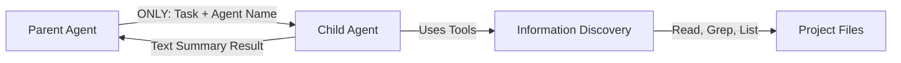
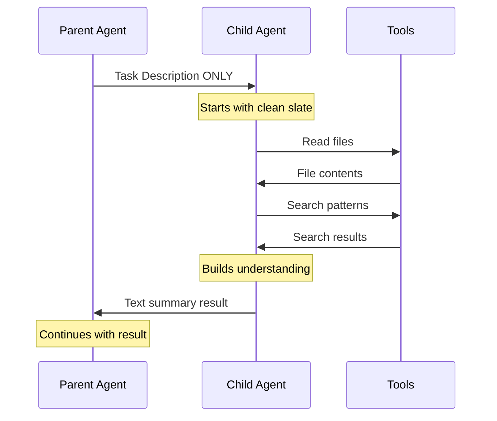

# Agent Communication: Pull Architecture

## Table of Contents
1. [Core Philosophy](#core-philosophy)
2. [What Is Communicated](#what-is-communicated)
3. [What Is NOT Shared](#what-is-not-shared)
4. [How Agents Discover Information](#how-agents-discover-information)
5. [Real Examples](#real-examples)
6. [Why This Architecture](#why-this-architecture)

## Core Philosophy

**The Pull Architecture Principle**: Child agents start with minimal context and actively pull the information they need using tools.



## What Is Communicated

### From Parent to Child (Delegation)

When a parent agent delegates to a child agent via the Task tool, **ONLY** the following is passed:

```typescript
// This is ALL that gets passed to child agent:
{
  subagent_type: "code-reviewer",     // Which agent to invoke
  prompt: "Review the auth.ts file"   // The specific task
}
```

The child agent also receives:
- **Execution Context**: Metadata about the delegation
  - `depth`: How deep in the delegation chain (prevents infinite recursion)
  - `parentAgent`: Name of the delegating agent (for context in logs)
  - `isSidechain`: Boolean flag for tracking delegation type

### From Child to Parent (Return)

When a child agent completes its task, it returns:

```typescript
// Child agent returns a simple text result:
{
  content: "I reviewed auth.ts and found 3 security issues:\n1. Password not hashed\n2. No rate limiting\n3. Session tokens never expire",
  error?: undefined  // Optional error if task failed
}
```

**That's it!** No conversation history, no tool traces, just the result.

## What Is NOT Shared

### ❌ Parent's Conversation History
```typescript
// Parent agent has this conversation:
messages: [
  { role: "system", content: "You are a helpful assistant..." },
  { role: "user", content: "Fix the login bug" },
  { role: "assistant", content: "I'll investigate..." },
  { role: "tool", content: "..." }
]

// Child agent gets NONE of this!
// Child starts fresh with only its own system prompt + delegated task
```

### ❌ Parent's Tool Results
```typescript
// Parent used these tools:
- Read("src/app.ts")  // Parent read this file
- Grep("login")       // Parent searched for login

// Child knows NOTHING about these!
// Child must discover files itself if needed
```

### ❌ Parent's Variables or State
```typescript
// Parent has discovered:
const bugLocation = "src/auth/login.ts:45"
const errorType = "TypeError"

// Child gets NONE of these variables!
// Child must rediscover through its own investigation
```

## How Agents Discover Information

Since child agents receive minimal context, they use tools to discover what they need:

### Discovery Pattern 1: Specific File Task
```typescript
// Parent delegates:
"Review the authentication in src/auth/login.ts"

// Child agent's process:
1. Read("src/auth/login.ts")       // Get the file content
2. Analyze the code
3. Return findings
```

### Discovery Pattern 2: General Investigation
```typescript
// Parent delegates:
"Find and fix memory leaks in the application"

// Child agent's process:
1. Grep("leak|memory|gc")          // Search for relevant code
2. List("src/")                    // Explore project structure  
3. Read("src/services/cache.ts")   // Read suspicious files
4. Read("src/utils/cleanup.ts")    // Read more files
5. Analyze and return findings
```

### Discovery Pattern 3: Architecture Understanding
```typescript
// Parent delegates:
"Document the authentication flow"

// Child agent's process:
1. List("src/")                    // See project structure
2. Grep("auth|login|session")      // Find auth-related files
3. Read("src/auth/")               // Read auth directory
4. Read("src/middleware/auth.ts")  // Read middleware
5. Read("src/routes/login.ts")     // Read routes
6. Synthesize and document flow
```

## Real Examples

### Example 1: Code Review Delegation

**Parent Agent (orchestrator)**:
```typescript
// Parent is working on a feature
await executor.execute('Task', {
  subagent_type: 'code-reviewer',
  prompt: 'Review the changes I made to user-service.ts for security issues'
});
```

**Child Agent (code-reviewer) receives**:
```typescript
// System prompt (from agent definition)
"You are a code review specialist..."

// User prompt (from delegation)
"Review the changes I made to user-service.ts for security issues"

// That's ALL! No information about what changes were made
```

**Child Agent must discover**:
```typescript
// Child uses tools to gather context:
1. Read("user-service.ts")  // Read the current file
2. Grep("security|auth|password|token")  // Search for security patterns
3. Read("user-service.test.ts")  // Check tests
// Analyze and return findings
```

### Example 2: Bug Fixing Delegation

**Parent Agent**:
```typescript
// Parent knows there's a login bug but delegates investigation
await executor.execute('Task', {
  subagent_type: 'debugger',
  prompt: 'Users report "undefined is not a function" error during login. Find and explain the cause.'
});
```

**Child Agent receives only**:
```
"Users report 'undefined is not a function' error during login. Find and explain the cause."
```

**Child Agent investigates from scratch**:
```typescript
1. Grep("login")  // Find login-related files
2. Read("src/auth/login.controller.ts")
3. Read("src/auth/login.service.ts")  
4. Grep("undefined is not a function")  // Search for error
5. // Discovers the bug and returns explanation
```

## Why This Architecture

### 1. **Efficient Caching**
```typescript
// With Anthropic's prompt caching:
// - Parent's long conversation: Cached
// - Child's tools (Read, Grep): Cached after first use
// - Result: 90% cost reduction on repeated file reads
```

### 2. **True Agent Autonomy**
```typescript
// Each agent is self-contained:
- Has its own investigation strategy
- Not biased by parent's assumptions
- Can discover things parent missed
```

### 3. **Clean Separation of Concerns**
```typescript
Parent Agent: Orchestration and high-level planning
Child Agent: Focused, specialized task execution
// No confusion about responsibilities
```

### 4. **Scalability**
```typescript
// Can delegate to multiple agents in parallel
// Each starts fresh, no complex state management
const results = await Promise.all([
  delegate('code-reviewer', 'Review auth.ts'),
  delegate('test-writer', 'Write tests for auth.ts'),
  delegate('documenter', 'Document auth.ts')
]);
```

## Key Takeaways

### What Flows Between Agents



### The Three Rules

1. **Minimal Input**: Child receives ONLY the task description
2. **Self-Discovery**: Child uses tools to gather ALL needed context
3. **Simple Output**: Child returns ONLY a text summary result

### Remember

- **Parent's conversation history?** ❌ Not shared
- **Parent's tool results?** ❌ Not shared  
- **Parent's discovered context?** ❌ Not shared
- **Task description?** ✅ Shared
- **Agent name for logging?** ✅ Shared
- **Text result back to parent?** ✅ Shared

This architecture ensures each agent is truly autonomous, discovering information through its own investigation rather than inheriting potentially biased or incomplete context from its parent.