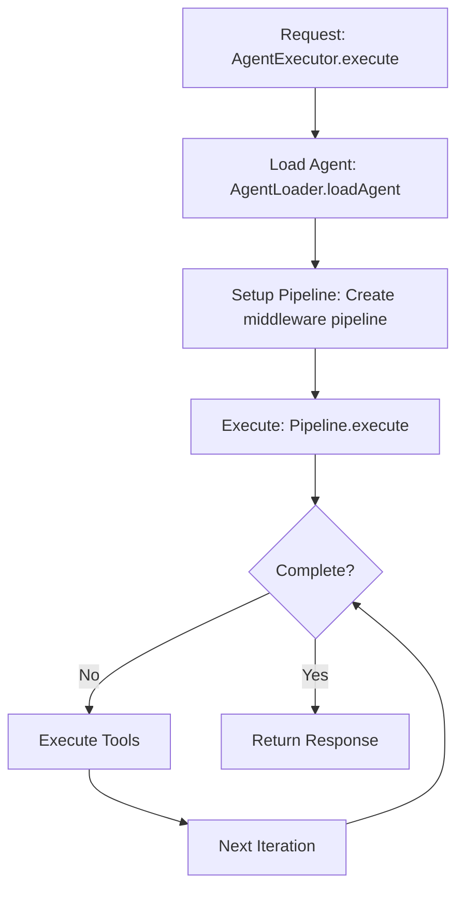
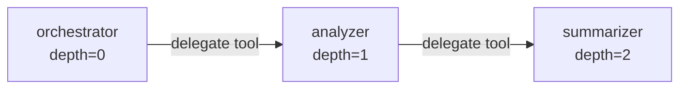

# Agent System

## Overview

Agents are autonomous entities defined as markdown files with YAML frontmatter. They represent specialized capabilities
that can be composed to solve complex tasks. The system treats "everything as an agent" - there's no special
orchestrator class, just agents that can delegate to other agents.

## Agent Definition

### Structure

Agents are markdown files with three parts:

```markdown
---
name: agent-name
tools: ["read", "write", "delegate"]
model: claude-3-5-haiku-latest  # optional
---

# Agent prompt/instructions

You are an expert at...

## Your responsibilities:
- Task 1
- Task 2
```

### Frontmatter Configuration

```yaml
---
name: string           # Required: Unique agent identifier
tools: string[]        # Required: Tool access list or ["*"] for all
model?: string         # Optional: Override default model
temperature?: number   # Optional: LLM temperature (0-1)
maxTokens?: number    # Optional: Max response tokens
---
```

## Agent Loading

**File**: `src/agents/loader.ts`

### Loading Process

```typescript
export class AgentLoader {
  async loadAgent(agentPath: string): Promise<Agent> {
    // 1. Read markdown file
    const content = await fs.readFile(agentPath, 'utf-8');
    
    // 2. Parse frontmatter
    const { data: frontmatter, content: prompt } = matter(content);
    
    // 3. Validate configuration
    if (!frontmatter.name) {
      throw new Error('Agent must have a name');
    }
    
    // 4. Create agent object
    return {
      name: frontmatter.name,
      prompt: prompt.trim(),
      tools: frontmatter.tools || [],
      model: frontmatter.model,
      temperature: frontmatter.temperature,
      maxTokens: frontmatter.maxTokens
    };
  }
}
```

### Agent Discovery

Agents can be loaded from:

1. **Individual files**: `agents/my-agent.md`
2. **Directories**: `agents/` (all .md files)
3. **Nested directories**: `examples/werewolf-game/agents/`

```typescript
// System builder configuration
const builder = AgentSystemBuilder.default()
  .withAgentsFrom('agents')  // Load all from directory
  .withAgent('agents/specialist.md')  // Load specific agent
  .withAgentsFrom('examples/game/agents');  // Multiple sources
```

## Default Agent

### Overview

The system includes a built-in **default agent** that serves as a fallback and general-purpose handler. This ensures all
tasks can be executed even when specific agents aren't available.

### Key Features

1. **Always Available**: The default agent is built into the system and always present
2. **Universal Tool Access**: Has access to ALL tools (`tools: "*"`)
3. **Automatic Fallback**: Used when a requested agent doesn't exist
4. **Explicit Usage**: Can be explicitly called for general-purpose tasks

### How It Works

```typescript
// Built-in definition in AgentLoader
private readonly DEFAULT_AGENT: AgentDefinition = {
  name: 'default',
  description: 'Versatile assistant capable of handling any task...',
  tools: '*',  // Access to all tools
  model: undefined  // Uses system default
};
```

### Usage Scenarios

#### 1. Automatic Fallback

When a non-existent agent is requested:

```typescript
// User requests agent that doesn't exist
await executor.execute('Task', {
  subagent_type: 'analyzer',  // This agent doesn't exist
  prompt: 'Analyze the code structure'
});
// → System automatically uses default agent
// → Logs: "Agent 'analyzer' not found, using default agent as fallback"
```

#### 2. Explicit Usage

For general-purpose tasks without creating specific agents:

```typescript
// Explicitly use default agent
await executor.execute('Task', {
  subagent_type: 'default',
  prompt: 'Find all TODO comments and create a summary'
});
// → Uses default agent for ad-hoc task
```

### Benefits

- **Resilience**: System never fails due to missing agents
- **Flexibility**: Quick tasks without creating specific agent files
- **Development Speed**: Prototype without defining agents first
- **Safety Net**: Ensures all delegated tasks can be handled

### Default Agent Capabilities

The default agent:

- Can read, write, and manipulate files
- Can search through codebases
- Can delegate to other agents (if they exist)
- Adapts its approach based on the task
- Has access to all registered tools

### Philosophy

This aligns with the system principle: **"All tasks are handled by an agent"**. The default agent ensures this principle
holds even when specific agents aren't defined, making the system more robust and user-friendly.

## Agent Execution

**File**: `src/core/agent-executor.ts`

### Execution Flow



### Execution Context

Each agent execution has its own context:

```typescript
interface AgentContext {
  // Identity
  agentName: string;
  sessionId: string;
  
  // Input
  prompt: string;
  
  // State
  messages: Message[];
  iterationCount: number;
  depth: number;  // Delegation depth
  
  // Configuration
  agent: Agent;
  availableTools: Map<string, Tool>;
  
  // Services
  logger: Logger;
  llmProvider: LLMProvider;
}
```

## Agent Autonomy

### Principles

1. **Self-Contained**: Agents contain all knowledge needed for their domain
2. **Pull Architecture**: Agents gather information they need via tools
3. **Minimal Context**: Receive only task description, not parent's context
4. **Independent Memory**: Each agent maintains its own conversation

### Example: Autonomous Game Master

```markdown
---
name: game-master
tools: ["*"]
---

You are the Game Master for Werewolf. You know how to:

## Game Setup
When asked to "start a game", you:
1. Create 5 players with names
2. Assign roles (1 werewolf, 1 seer, 3 villagers)
3. Start the game loop

## Game Flow
For each round:
1. Night phase: Werewolf kills, Seer investigates
2. Day phase: Discussion and voting
3. Check win conditions
4. Continue until someone wins

[Full game rules and logic in the prompt...]
```

The game-master agent receives just "start a game" and handles everything autonomously.

## Agent Communication

### Direct Invocation

```typescript
const result = await executor.execute('analyzer', 'Analyze this code');
```

### Delegation via Delegate Tool

```json
{
  "tool": "delegate",
  "input": {
    "agent": "specialist",
    "delegate": "Handle this specific subtask"
  }
}
```

### Delegation Chain



## Agent Patterns

### 1. Specialist Agent

Focused on a single domain:

```markdown
---
name: sql-expert
tools: ["read", "write"]
---

You are an SQL expert. You can:
- Write complex queries
- Optimize database schemas
- Explain query plans
```

### 2. Orchestrator Agent

Coordinates other agents:

```markdown
---
name: orchestrator
tools: ["delegate"]
---

You coordinate complex tasks by delegating to specialists:
- Use 'analyzer' for code analysis
- Use 'writer' for documentation
- Use 'tester' for test generation
```

### 3. Tool-Focused Agent

Primarily uses tools:

```markdown
---
name: file-manager
tools: ["read", "write", "list"]
---

You manage files and directories. You can:
- Organize file structures
- Search for files
- Modify content
```

### 4. Hybrid Agent

Combines thinking and action:

```markdown
---
name: debugger
tools: ["read", "write", "delegate"]
---

You debug code by:
1. Analyzing symptoms (thinking)
2. Reading relevant files (tools)
3. Delegating tests to tester (delegation)
4. Applying fixes (tools)
```

## Agent Lifecycle

### 1. Initialization

```typescript
// Agent loaded and validated
const agent = await agentLoader.loadAgent('agents/my-agent.md');
```

### 2. Execution

```typescript
// Multiple iterations until complete
for (let i = 0; i < maxIterations; i++) {
  const response = await llm.complete(messages);
  if (response.toolCalls) {
    await executeTools(response.toolCalls);
  } else {
    break;  // Task complete
  }
}
```

### 3. Cleanup

```typescript
// Log final state
logger.logCompletion(agentName, result);
```

## Agent Configuration Examples

### Minimal Agent

```yaml
---
name: simple
tools: []
---
You answer questions directly without tools.
```

### Full-Featured Agent

```yaml
---
name: advanced
tools: ["*"]
model: claude-3-5-sonnet-latest
temperature: 0.7
maxTokens: 4000
---
You have access to all tools and can handle complex tasks.
```

### Restricted Agent

```yaml
---
name: reader
tools: ["read", "list"]
---
You can only read files, not modify them.
```

## Best Practices

### 1. Agent Design

- **Single Responsibility**: Each agent should have one clear purpose
- **Clear Instructions**: Detailed prompts with examples
- **Tool Selection**: Only include necessary tools
- **Error Handling**: Include fallback behaviors

### 2. Prompt Engineering

```markdown
## Your Role
[Clear description of what the agent does]

## Your Capabilities
[List of specific things the agent can do]

## Guidelines
[Rules and constraints]

## Examples
[Concrete examples of expected behavior]
```

### 3. Tool Access

- Start with minimal tools
- Add tools as needed
- Use `["*"]` only for orchestrators
- Consider security implications

### 4. Testing Agents

```typescript
// Test with mock tools
const builder = AgentSystemBuilder.forTest()
  .withMockTool('read', async () => ({success: true, output: 'mock data'}))
  .withAgent('agents/my-agent.md');

const result = await executor.execute('my-agent', 'test prompt');
```

## Troubleshooting

**Issue**: Agent not found

- Check file path is correct
- Verify .md extension
- Ensure frontmatter has `name` field

**Issue**: Tools not available

- Check tools listed in frontmatter
- Verify tools are registered
- Use `["*"]` for all tools

**Issue**: Agent loops infinitely

- Check safety limits (maxIterations)
- Verify termination conditions in prompt
- Add explicit stop conditions

**Issue**: Wrong agent behavior

- Review prompt clarity
- Add more specific examples
- Check tool access permissions

## Performance Optimization

### 1. Prompt Caching

Anthropic's ephemeral cache reuses agent prompts:

- First call: Full prompt sent
- Subsequent calls: Cached prompt reused
- 90% cost reduction on repeated calls

### 2. Agent Reuse

Load agents once, execute multiple times:

```typescript
const executor = await builder.build();
// Reuse for multiple executions
await executor.execute('agent', 'task1');
await executor.execute('agent', 'task2');
```

### 3. Delegation Overhead

Each delegation creates new context:

- Increases depth counter
- New conversation history
- Additional LLM calls
- Balance autonomy vs efficiency

## Advanced Topics

### Dynamic Agent Creation

Agents can be created at runtime:

```typescript
const dynamicAgent = {
  name: 'dynamic',
  prompt: generatePrompt(requirements),
  tools: determineTools(requirements)
};
```

### Agent Composition

Combine multiple agents:

```typescript
// Meta-agent that coordinates others
const metaAgent = {
  name: 'meta',
  prompt: 'You coordinate: ' + agents.map(a => a.name).join(', '),
  tools: ['delegate']
};
```

### Agent Versioning

Track agent versions:

```yaml
---
name: analyzer-v2
version: 2.0.0
tools: ["read", "write"]
---
```

## Related Files

- Agent loader: `src/core/agent-loader.ts`
- Agent executor: `src/agents/executor.ts`
- Agent middleware: `src/middleware/agent-loader.middleware.ts`
- Agent examples: `agents/*.md`, `examples/*/agents/*.md`
- Types: `src/core/types.ts` (Agent interface)