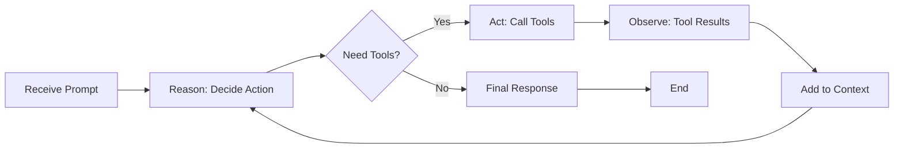

# The Agentic Loop Pattern (ReAct)

## Core Pattern Overview

The **agentic loop** is where an agent iterates on itself, using tools to gather information and refine its response. This is fundamentally different from delegation (calling other agents).

## The Pattern: Reason → Act → Observe → Repeat



## How It Works in This System

The agentic loop is implemented in `src/agents/executor.ts`:

```typescript
while (
  middlewareContext.shouldContinue &&           // Still need to work
  middlewareContext.iteration < maxIterations && // Haven't hit limit
  !middlewareContext.error                       // No errors
) {
  // Run the middleware pipeline
  await this.pipeline.execute(middlewareContext);

  // Pipeline will set shouldContinue = false when done
}
```

### The Key Insight

The loop continues **as long as the agent makes tool calls**:

```typescript
// In tool-execution.middleware.ts
if (!ctx.response?.tool_calls || ctx.response.tool_calls.length === 0) {
  // No tool calls = final answer
  ctx.result = ctx.response.content;
  ctx.shouldContinue = false;  // ENDS THE LOOP
} else {
  // Has tool calls = continue looping
  // Execute tools, add results to context
  // shouldContinue remains true
}
```

## Example: Agent Processing a Claim

```yaml
Iteration 1:
  Think: "I need to read the claim details"
  Act: Call Read tool on claim.json
  Observe: Get claim data
  Continue: Yes (made tool call)

Iteration 2:
  Think: "Now I need to validate the illness type"
  Act: Call Delegate tool to delegate to validator
  Observe: Get validation result
  Continue: Yes (made tool call)

Iteration 3:
  Think: "I have all info, can now decide"
  Response: "Claim approved for $50,000"
  Continue: No (no tool calls = done)
```

## Iteration vs Delegation

### Iteration (Agentic Loop)
- **Same agent** refining its understanding
- **Builds context** with each tool call
- **Maintains conversation history**
- **Limited by MAX_ITERATIONS** (default: 10)

```
Agent A → Tool → Agent A → Tool → Agent A → Response
         ↑_______|        ↑_______|
    (same agent, enriched context)
```

### Delegation (Task Tool)
- **Different agent** handles subtask
- **New context** for child agent
- **Pull architecture** - child gathers own info
- **Limited by MAX_DEPTH** (default: 5)

```
Agent A → Task Tool → Agent B (new context)
                      ↓
                      Agent B's own loop
                      ↓
                      Response to A
```

## Why This Matters

### 1. Intelligence Emerges from Iteration
Each iteration allows the agent to:
- Gather more information
- Correct mistakes
- Refine understanding
- Build complex responses

### 2. Tool Use is Grounded
Instead of hallucinating, agents:
- Read actual files
- Search for real patterns
- Get concrete data
- Base decisions on evidence

### 3. Transparent Reasoning
The loop creates an audit trail:
- Every tool call is logged
- Every decision point is visible
- Every iteration is tracked
- Debugging is straightforward

## Configuration

```typescript
// In agent markdown frontmatter
---
name: analytical-agent
maxIterations: 20  // Override default if needed for complex analysis
---
```

## Common Patterns

### Pattern 1: Search → Read → Process
```
Iteration 1: Grep for pattern
Iteration 2: Read found files
Iteration 3: Process and respond
```

### Pattern 2: Validate → Decide → Act
```
Iteration 1: Read input data
Iteration 2: Validate against rules
Iteration 3: Make decision
Iteration 4: Write output
```

### Pattern 3: Explore → Narrow → Conclude
```
Iteration 1-3: Explore multiple files
Iteration 4: Focus on relevant ones
Iteration 5: Draw conclusions
```

## Safety Mechanisms

The loop has built-in safety:

1. **MAX_ITERATIONS**: Prevents infinite loops
   - Default: 10 iterations
   - Warning at iteration 5
   - Hard stop at limit

2. **Timeout**: Prevents hanging
   - 5-minute execution limit
   - Graceful termination

3. **Token Estimation**: Prevents context explosion
   - Pre-flight token check
   - Stops before API limits

## Testing the Loop

```typescript
// Test that agent iterates appropriately
test('agent uses multiple iterations for complex task', () => {
  const fixture = loadFixture('complex-analysis');
  const iterations = countIterations(fixture);

  expect(iterations).toBeGreaterThan(1);  // Used loop
  expect(iterations).toBeLessThanOrEqual(10);  // Respected limit
});

// Test that agent builds on context
test('agent uses information from previous iterations', () => {
  const fixture = loadFixture('research-task');
  const toolCalls = extractToolCalls(fixture);

  // Second read should be informed by first grep
  const grepResults = toolCalls[0].results;
  const readPath = toolCalls[1].params.file_path;

  expect(grepResults).toContain(readPath);  // Used grep to find file
});
```

## The Philosophy

The agentic loop embodies the core principle of **thoughtful, iterative problem-solving**:

1. **Don't guess** - Use tools to get facts
2. **Don't rush** - Take multiple iterations if needed
3. **Don't assume** - Verify with concrete data
4. **Don't hallucinate** - Ground responses in tool results

## Comparison with Other Systems

| System | Loop Type | Context Management |
|--------|-----------|-------------------|
| **This System** | Tool-based iterations | Builds within conversation |
| **LangChain** | Explicit chains | Passed between steps |
| **AutoGPT** | Goal-driven loops | Persistent memory |
| **ChatGPT** | Single-shot | No iteration (without plugins) |

## Conclusion

The agentic loop is not a bug or missing feature - **it's THE core feature**. Every agent automatically gets this capability:

- Iterative refinement
- Tool-grounded reasoning
- Context building
- Safe termination

This pattern, combined with delegation via Delegate tool, creates a powerful system where agents can both **think deeply** (iteration) and **work together** (delegation).

The system already implements this beautifully - it just wasn't explicitly documented as the "agentic loop" or "ReAct pattern". But it's there, in every agent execution.