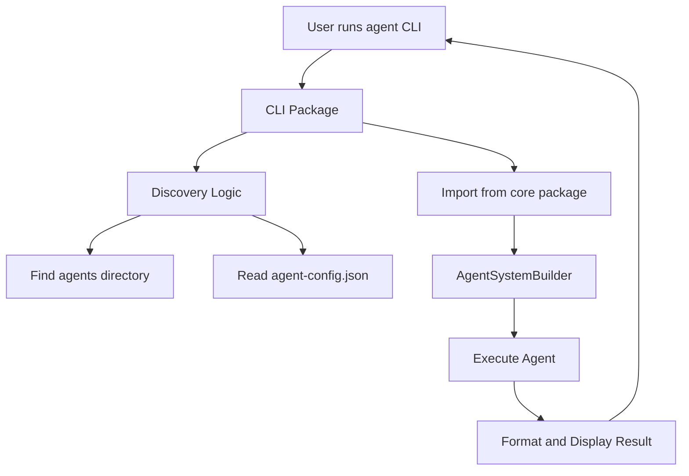

# Agent CLI Tool Plan (DRAFT - Not Yet Implemented)

> **Note**: This document describes a planned feature that has not been implemented yet. The CLI tool described here is
> a proposal for future development. Updated for workspace structure.

## Goal

Create a CLI tool that allows running agents from any directory without writing TypeScript setup code.

## Usage Examples

```bash
# From any directory with agents/ folder:
agent -p "multiply 7 and 6"                    # Uses default agent
agent -a text-analyzer -p "analyze this text"  # Uses specific agent
agent --list-agents                            # Shows available agents
agent --list-tools                             # Shows available tools

# Global installation
npm install -g @agent-system/cli
agent -p "hello world"

# Local development
npx @agent-system/cli -p "test"
```

## Workspace Architecture

### New Package: `packages/cli/`

```
packages/
├── core/              # @agent-system/core (existing)
├── web/               # @agent-system/web (existing)
└── cli/               # @agent-system/cli (NEW)
    ├── src/
    │   ├── index.ts         # CLI entry point
    │   ├── commands/        # Command implementations
    │   ├── discovery.ts     # Agent/tool auto-discovery
    │   └── output.ts        # Output formatting
    ├── package.json         # With bin field
    └── tsconfig.json
```

## Implementation Steps

### 1. Create CLI Package

```bash
# Create package structure
mkdir -p packages/cli/src/{commands}
cd packages/cli
```

**packages/cli/package.json:**
```json
{
  "name": "@agent-system/cli",
  "version": "1.0.0",
  "type": "module",
  "description": "CLI tool for agent orchestration system",
  "bin": {
    "agent": "./dist/index.js"
  },
  "main": "./dist/index.js",
  "scripts": {
    "build": "tsc",
    "dev": "tsx src/index.ts",
    "test": "vitest run"
  },
  "dependencies": {
    "@agent-system/core": "*",
    "commander": "^12.0.0",
    "chalk": "^5.3.0",
    "dotenv": "^16.4.5"
  },
  "devDependencies": {
    "@types/node": "^20.11.30",
    "tsx": "^4.7.1",
    "typescript": "^5.9.2",
    "vitest": "^2.1.8"
  }
}
```

**packages/cli/tsconfig.json:**
```json
{
  "extends": "../../tsconfig.json",
  "compilerOptions": {
    "outDir": "./dist",
    "rootDir": "./src"
  },
  "include": ["src/**/*"],
  "references": [
    { "path": "../core" }
  ]
}
```

### 2. Create CLI Entry Point

**packages/cli/src/index.ts:**
```typescript
#!/usr/bin/env node
import * as dotenv from 'dotenv';
import { Command } from 'commander';
import { AgentSystemBuilder } from '@agent-system/core';
import { discoverAgents } from './discovery.js';
import { formatOutput } from './output.js';

// Load environment variables (like examples do)
dotenv.config();

const program = new Command();

program
  .name('agent')
  .description('CLI tool for running agents')
  .version('1.0.0');

program
  .option('-p, --prompt <text>', 'The prompt to send to the agent')
  .option('-a, --agent <name>', 'Agent to use', 'default')
  .option('-m, --model <model>', 'Model to use')
  .option('-v, --verbose', 'Show detailed execution logs')
  .option('--list-agents', 'List available agents')
  .option('--list-tools', 'List available tools')
  .option('--json', 'Output as JSON');

program.parse();

const options = program.opts();

async function main() {
  try {
    // Discover agents directory
    const agentsDir = await discoverAgents();

    // Build system (similar to examples)
    const builder = new AgentSystemBuilder();

    if (options.model) {
      builder.withModel(options.model);
    }

    builder
      .withAgentsFrom(agentsDir)
      .withDefaultTools();

    const { executor, toolRegistry, cleanup } = await builder.build();

    // Handle --list-agents
    if (options.listAgents) {
      // Implementation
      return;
    }

    // Handle --list-tools
    if (options.listTools) {
      const tools = toolRegistry.getAllTools().map(t => t.name);
      console.log(tools.join('\n'));
      await cleanup();
      return;
    }

    // Execute agent
    if (!options.prompt) {
      console.error('Error: --prompt is required');
      process.exit(1);
    }

    const result = await executor.execute(options.agent, options.prompt);

    // Format output
    if (options.json) {
      console.log(JSON.stringify({ success: true, result }, null, 2));
    } else {
      console.log(result);
    }

    // Cleanup (like examples do)
    await cleanup();
  } catch (error) {
    if (options.json) {
      console.log(JSON.stringify({ success: false, error: (error as Error).message }, null, 2));
    } else {
      console.error('Error:', (error as Error).message);
    }
    process.exit(1);
  }
}

main().catch(console.error);
```

### 3. Auto-Discovery Logic

**packages/cli/src/discovery.ts:**
```typescript
import * as fs from 'fs/promises';
import * as path from 'path';

export async function discoverAgents(cwd: string = process.cwd()): Promise<string> {
  // Search order:
  // 1. ./agents
  // 2. ../agents
  // 3. From agent-config.json

  const candidates = [
    path.join(cwd, 'agents'),
    path.join(cwd, '..', 'agents'),
  ];

  for (const dir of candidates) {
    try {
      await fs.access(dir);
      return dir;
    } catch {
      continue;
    }
  }

  // Check for config file
  const configPath = path.join(cwd, 'agent-config.json');
  try {
    const config = JSON.parse(await fs.readFile(configPath, 'utf-8'));
    if (config.agents?.directory) {
      return path.resolve(cwd, config.agents.directory);
    }
  } catch {
    // No config file
  }

  // Default to current directory agents/
  return path.join(cwd, 'agents');
}

export async function discoverTools(cwd: string = process.cwd()): Promise<string[]> {
  // Similar logic for tools discovery
  return [];
}
```

### 4. Update Root Workspace

**Root package.json additions:**
```json
{
  "scripts": {
    "build:cli": "npm run build -w @agent-system/cli",
    "dev:cli": "npm run dev -w @agent-system/cli",
    "cli": "tsx packages/cli/src/index.ts"
  }
}
```

### 5. Command-Line Arguments

```
Usage: agent [options]

Options:
  -p, --prompt <text>     The prompt to send to the agent
  -a, --agent <name>      Agent to use (default: "default")
  -m, --model <model>     Model to use (default: from config)
  -v, --verbose           Show detailed execution logs
  --list-agents           List available agents
  --list-tools            List available tools
  -h, --help              Display help
  -V, --version           Display version
```

## Development Workflow

### Local Development

```bash
# From workspace root
npm run dev:cli -- -p "hello world"

# Or directly
tsx packages/cli/src/index.ts -p "test"
```

### Testing

```bash
# Build CLI package
npm run build:cli

# Link for local testing
cd packages/cli
npm link

# Now available globally
agent -p "test"

# Unlink when done
npm unlink -g @agent-system/cli
```

### Publishing

```bash
# Build all packages
npm run build

# Publish CLI package
cd packages/cli
npm publish --access public
```

## Configuration Discovery

The CLI searches for configuration in this order:

1. **Local config**: `./agent-config.json` in current directory
2. **Parent config**: `../agent-config.json`
3. **Home config**: `~/.agent-config.json`
4. **Environment variables**: `AGENT_MODEL`, `ANTHROPIC_API_KEY`, etc.

**Example agent-config.json:**
```json
{
  "agents": {
    "directory": "./agents",
    "default": "default"
  },
  "tools": {
    "builtin": ["read", "write", "list", "grep", "delegate"],
    "custom": ["./tools"]
  },
  "llm": {
    "model": "anthropic/claude-3-5-haiku-latest",
    "behavior": "balanced"
  },
  "safety": {
    "maxIterations": 20,
    "maxDepth": 5
  },
  "storage": {
    "type": "filesystem",
    "path": ".agent-sessions"
  }
}
```

## Output Formatting

### Default Mode (Clean)
```bash
$ agent -p "what is 2+2"
The answer is 4.
```

### Verbose Mode
```bash
$ agent -v -p "what is 2+2"
🤖 Loading agent: default
📂 Agents directory: ./agents
🔧 Available tools: Read, Write, List, Grep, Delegate
💬 Prompt: what is 2+2
⚡ Executing...

Iteration 1:
  → No tool calls
  ✓ Response: The answer is 4.

✅ Complete (1 iteration, 0.8s)
Result: The answer is 4.
```

### JSON Mode
```bash
$ agent --json -p "what is 2+2"
{
  "success": true,
  "result": "The answer is 4.",
  "iterations": 1,
  "duration": 812,
  "model": "claude-3-5-haiku-latest"
}
```

## Error Handling

```bash
# Missing API key
$ agent -p "test"
❌ Error: ANTHROPIC_API_KEY not set
Set it via: export ANTHROPIC_API_KEY=your-key

# No agents found
$ agent -p "test"
⚠️  No agents directory found at ./agents
Create one with: mkdir agents
Or specify path in agent-config.json

# Agent not found
$ agent -a analyzer -p "test"
❌ Error: Agent 'analyzer' not found
Available agents: default, researcher, code-reviewer
```

## Benefits

- **Zero setup**: Just create `agents/` folder
- **Workspace-aware**: Imports from `@agent-system/core`
- **Familiar CLI**: Intuitive command-line interface
- **Portable**: Can run from any directory
- **Discoverable**: `--list-agents` and `--list-tools` help explore
- **Simple**: No TypeScript knowledge needed to use
- **Publishable**: Can be installed globally via npm

## Installation Options

### Global Installation
```bash
npm install -g @agent-system/cli
agent -p "hello"
```

### Local in Project
```bash
npm install --save-dev @agent-system/cli
npx agent -p "hello"
```

### Development
```bash
# From workspace root
git clone https://github.com/nielspeter/agent-orchestration-system
cd agent-orchestration-system
npm install
npm run build:cli
npm link packages/cli
```

## Future Enhancements

1. **Interactive mode**: `agent -i` for REPL-like interaction
2. **Pipe support**: `echo "text" | agent -a analyzer`
3. **Init command**: `agent init` to create starter project
4. **Tool scaffolding**: `agent create-tool my-tool`
5. **Agent templates**: `agent create-agent my-agent --template researcher`
6. **Session management**: `agent resume <session-id>`
7. **Watch mode**: `agent watch -a validator` for continuous validation
8. **Configuration wizard**: `agent config` interactive setup

## Implementation Priority

### Phase 1: MVP (1-2 days)
- Basic CLI with prompt execution
- Agent discovery
- Simple output formatting

### Phase 2: Polish (1 day)
- Verbose mode
- Error handling
- List commands

### Phase 3: Advanced (2-3 days)
- JSON output
- Configuration file support
- Tool discovery
- Session management

### Phase 4: Publishing (1 day)
- Documentation
- npm package setup
- GitHub Actions for publishing

## Testing Strategy

```typescript
// packages/cli/tests/discovery.test.ts
describe('Agent Discovery', () => {
  it('finds agents in current directory', async () => {
    const dir = await discoverAgents('/path/to/project');
    expect(dir).toBe('/path/to/project/agents');
  });

  it('falls back to parent directory', async () => {
    const dir = await discoverAgents('/path/to/project/subdir');
    expect(dir).toBe('/path/to/project/agents');
  });

  it('respects agent-config.json', async () => {
    // Test config file override
  });
});
```

## Workspace Integration

The CLI package benefits from the workspace:

- **Shared dependencies**: TypeScript, testing tools
- **Cross-package references**: Uses `@agent-system/core`
- **Unified build**: `npm run build` builds all packages
- **Consistent tooling**: Same ESLint, Prettier config

## Architecture Diagram



## Notes

- This replaces the old single-package approach with workspace-aware design
- The CLI can be published independently of core library
- Users can `npm install -g @agent-system/cli` without full workspace
- Development happens within the monorepo for convenience
- Publishing workflow allows separate versioning of CLI vs core
