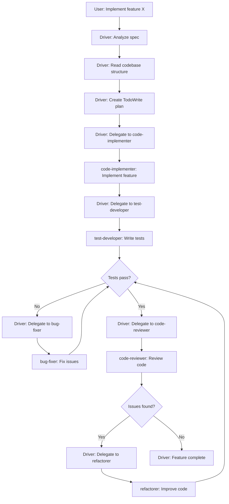

# Coding Agent Example Design

## Concept: Claude Code-like Implementation

A practical example demonstrating how agents can collaborate to implement software features, similar to Claude Code but using our orchestration system.

## Architecture

### 1. Driver Agent (Orchestrator)
**Role**: Project manager ensuring feature implementation matches specifications

**Responsibilities**:
- Parse feature specifications
- Create implementation plan using TodoWrite
- Delegate tasks to specialist agents
- Validate implementation against spec
- Ensure tests pass
- Coordinate iterations if needed

**Key Pattern**: Uses the agentic loop to refine understanding and track progress

### 2. Specialist Agents

#### code-implementer
- Implements new features
- Reads existing code to understand patterns
- Writes code following existing conventions
- Uses Grep to find similar patterns
- Uses Read/Write for implementation

#### test-developer
- Writes tests for new features
- Reads implementation to understand API
- Creates unit and integration tests
- Follows existing test patterns

#### code-reviewer
- Reviews implementation for issues
- Checks for security problems
- Validates code quality
- Suggests improvements

#### bug-fixer
- Debugs failing tests
- Fixes compilation errors
- Resolves integration issues
- Uses iterative refinement

#### refactorer
- Improves code structure
- Removes duplication
- Optimizes performance
- Maintains backward compatibility

## Example Flow



## Key Patterns to Demonstrate

### 1. Pull Architecture
Each specialist agent:
- Receives minimal context (just the task)
- Uses Grep to find relevant files
- Uses Read to understand existing code
- Makes informed decisions based on codebase

### 2. Agentic Loop
Each agent iterates to refine their work:
```
Iteration 1: Grep for similar patterns
Iteration 2: Read relevant files
Iteration 3: Plan implementation
Iteration 4: Write code
Iteration 5: Verify result
```

### 3. TodoWrite Integration
Driver maintains a task list:
```typescript
[
  { content: "Implement user authentication", status: "completed" },
  { content: "Write tests for auth", status: "in_progress" },
  { content: "Add documentation", status: "pending" }
]
```

### 4. No Context Inheritance
- Driver doesn't pass full codebase to specialists
- Each agent discovers what they need
- Promotes focused, efficient execution
- Reduces token usage

## Implementation Considerations

### Tools Needed
- **Read**: Understanding existing code
- **Write**: Implementing features
- **Grep**: Finding patterns and files
- **List**: Exploring project structure
- **Task**: Delegation between agents
- **TodoWrite**: Task tracking

### Shell Tool Consideration
**Current Limitation**: No Shell tool for running tests directly

**Workarounds**:
1. **Simulation**: Mock test results in example
2. **External Validation**: User runs tests manually
3. **Future Enhancement**: Add restricted Shell tool for safe commands

### Safety Mechanisms
- MAX_ITERATIONS prevents infinite coding loops
- MAX_DEPTH prevents excessive delegation chains
- File size limits prevent memory issues
- Path validation prevents unauthorized access

## Example Specification

```yaml
Feature: User Authentication
Requirements:
  - Username/password login
  - Session management
  - Password hashing with bcrypt
  - Rate limiting on login attempts

Constraints:
  - Follow existing code patterns
  - Include comprehensive tests
  - Add JSDoc documentation
  - Maintain backward compatibility
```

## Benefits of This Approach

### 1. Realistic Demonstration
- Shows practical software development workflow
- Demonstrates real-world agent collaboration
- Proves system can handle complex tasks

### 2. Educational Value
- Clear separation of concerns
- Shows iteration vs delegation
- Demonstrates pull architecture benefits
- Illustrates TodoWrite for task management

### 3. Extensibility
- Easy to add new specialist agents
- Can handle various project types
- Adapts to different coding standards
- Scales with project complexity

## Potential Challenges

### 1. Test Execution
Without Shell tool, can't actually run tests. Solutions:
- Parse test files to validate structure
- Use type checking via TypeScript compiler API
- Create mock test runner
- Document as known limitation

### 2. Complex Dependencies
- Agents might need multiple iterations to understand complex codebases
- Could hit token limits on large files
- Solution: Implement file chunking strategy

### 3. Validation
- Hard to validate "correctness" without running code
- Solution: Focus on structural validation and conventions

## Success Metrics

The example succeeds if it demonstrates:
1. **Autonomous Implementation**: Agents implement features with minimal guidance
2. **Quality Code**: Following patterns, tested, documented
3. **Clear Workflow**: Observable delegation and iteration patterns
4. **Practical Value**: Could be adapted for real projects

## Next Steps

1. Create agent definitions:
   - `agents/driver.md`
   - `agents/code-implementer.md`
   - `agents/test-developer.md`
   - `agents/code-reviewer.md`
   - `agents/bug-fixer.md`
   - `agents/refactorer.md`

2. Implement example:
   - `examples/coding-team.ts`
   - Sample project structure
   - Feature specifications
   - Expected outputs

3. Create fixtures:
   - Capture real execution
   - Prove it works
   - Enable regression testing

## Comparison with Claude Code

| Aspect | Claude Code | Our Implementation |
|--------|------------|-------------------|
| Driver | Human user | Driver agent |
| Context | Full codebase visibility | Pull architecture |
| Iteration | User-guided | Autonomous via agentic loop |
| Tools | Extensive built-in | Composable, extensible |
| Testing | Can run tests | Currently simulated |
| Deployment | Integrated | Not included |

## Conclusion

This coding agent example would be the most sophisticated demonstration of the system, showing:
- Real-world applicability
- Complex agent orchestration
- Practical use of all core patterns
- Value of the pull architecture

It would serve as both a powerful example and a potential foundation for actual development automation tools.