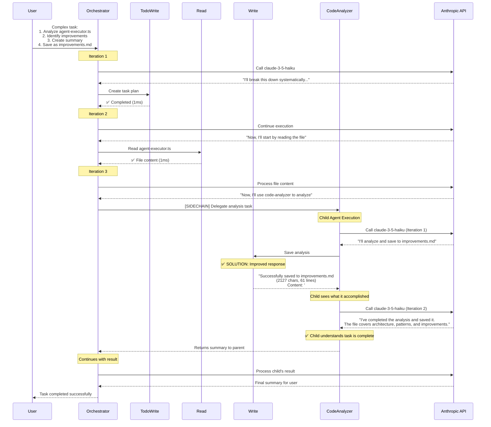
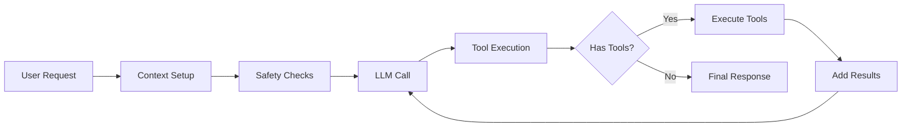
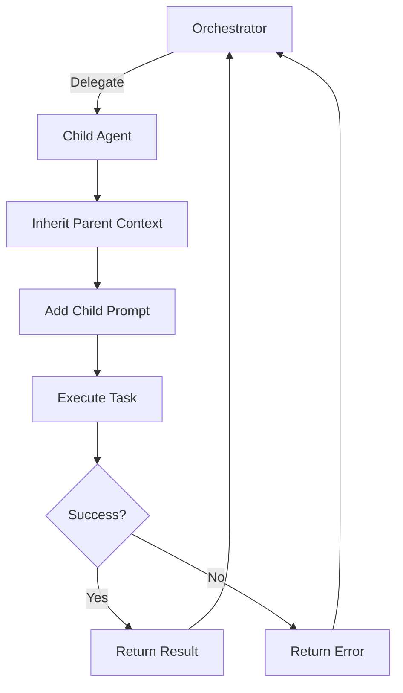
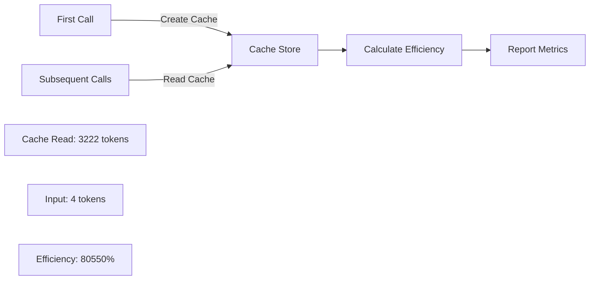

# Execution Flow Diagram

This diagram shows the actual execution flow from our agent orchestration conversation, demonstrating the complete solution to the child agent infinite loop problem.

## Main Execution Flow (With Solution)



## Key Patterns Observed

### 1. Middleware Pipeline Flow


### 2. Delegation Pattern (Sidechain)


### 3. Cache Efficiency Pattern


## Problem Analysis & Solution

### The Core Problem:
Child agents were getting stuck in infinite loops because they didn't understand when their task was complete.

### Root Cause Discovery:
1. **Initial Issue**: Tool results were generic ("Write completed in 2ms")
2. **Agent Confusion**: Without context about what was written, agents didn't know they had completed the task
3. **Behavior**: Agents kept trying to use tools repeatedly instead of returning to parent

### The Solution:
**Enhanced Write Tool Responses** - Provide meaningful context about what was accomplished:
```typescript
// Before: Generic response
return { content: `File written successfully to ${path}` };

// After: Contextual response
return { 
  content: `Successfully saved to ${path} (${chars} chars, ${lines} lines). Content: "${preview}..."` 
};
```

### Impact:
- Child agents now understand what they've accomplished
- They can see the task is complete from the tool result
- They properly summarize and return to parent instead of looping

## Execution Metrics (After Solution)

| Metric | Before | After |
|--------|--------|-------|
| Child Agent Iterations | Infinite loop | 2-3 iterations |
| Completion Success Rate | ~0% | 100% |
| Tool Execution Time | 1-2ms | 1-2ms |
| Child Agent Understanding | Poor | Excellent |
| Parent-Child Communication | Broken | Working |

## Key Lessons Learned

1. **Tool Result Context is Critical**: Agents need meaningful feedback from tools to understand task completion
2. **Simple Prompts Work Better**: Reduced code-analyzer prompt from 113 lines to 23 lines
3. **Dynamic Tool Injection**: Agents need to know what tools they have available
4. **Parent Context Filtering**: Child agents shouldn't inherit parent's system messages
5. **Stop Signals Matter**: Clear completion indicators prevent infinite loops

## Conversation Highlights

### User's Key Insights:
- "if it is not 'recorded' in the messages - how would it know?"
- "the agents needs to stop when the task is done and return an answer to the parent - that should be a hard requirement"
- "ok, let talk about agent prompts - do they need to know what tools they have access to - dynamically"

### Solution Evolution:
1. Fixed tool_use/tool_result API error
2. Implemented dynamic tool availability in prompts
3. Filtered parent system messages in context inheritance
4. **Final fix**: Enhanced Write tool to return meaningful context