# Agent Orchestration Conversation Flow

This document shows the actual conversation flow from our agent orchestration system, displaying the messages exchanged between agents in a human-readable format.

## Visual Flow Diagram

```mermaid
sequenceDiagram
    participant User
    participant Orchestrator
    participant TodoWrite
    participant Read
    participant Write
    participant CodeAnalyzer
    participant API as Claude API

    User->>Orchestrator: Complex task request
    Orchestrator->>API: "I'll break this down systematically..."
    Orchestrator->>TodoWrite: Create task plan
    TodoWrite-->>Orchestrator: ✅ Completed
    
    Orchestrator->>API: "Now, I'll start by reading the file"
    Orchestrator->>Read: Read agent-executor.ts
    Read-->>Orchestrator: ✅ File content
    
    Orchestrator->>API: "Now, I'll use code-analyzer..."
    Orchestrator->>CodeAnalyzer: [SIDECHAIN] Delegate analysis
    
    CodeAnalyzer->>API: "I'll provide comprehensive analysis..."
    CodeAnalyzer->>Write: Save analysis
    Write-->>CodeAnalyzer: "Successfully saved to improvements.md (2127 chars, 61 lines)"
    
    CodeAnalyzer->>API: "I've completed the analysis..."
    CodeAnalyzer-->>Orchestrator: Returns summary
    
    Orchestrator-->>User: Task completed
```



## Actual Conversation Content

### Orchestrator Example (Complex Multi-Agent Task)

#### User Request
```
I need you to:
1. Analyze the src/core/agent-executor.ts file to understand how it works
2. Identify any potential improvements or issues
3. Create a summary of your findings
4. Write a brief improvement proposal and save it as improvements.md

This is a complex task that will require multiple specialists.
```

#### Orchestrator - Iteration 1
**Claude says:** "I'll break this down into a systematic workflow using TodoWrite and specialized agents."

**Tool Use:** TodoWrite
- Creates task plan for the complex request
- Result: "TodoWrite completed in 1ms"

#### Orchestrator - Iteration 2
**Claude says:** "Now, I'll start by reading the file:"

**Tool Use:** Read (src/core/agent-executor.ts)
- Reads the AgentExecutor class file
- Result: "Read completed in 1ms"
- File content: 200+ lines of TypeScript code loaded into context

#### Orchestrator - Iteration 3
**Claude says:** "Now, I'll use the code-analyzer to help me analyze the file:"

**Tool Use:** Task (Delegates to code-analyzer)
```
Analyze the AgentExecutor class in agent-executor.ts. Focus on:
1. Overall architecture and design patterns
2. Middleware pipeline implementation
3. Execution flow and safety mechanisms
4. Logging and tracing capabilities
5. Potential performance or scalability considerations
```

#### Code-Analyzer Child Agent - Iteration 1
**System:** "Starting execution with claude-3-5-haiku-latest (delegated from orchestrator)"
**System:** "Inheriting 6 messages from parent context (filtered out system message)"

**Claude says:** 
```
I'll provide a comprehensive analysis of the AgentExecutor class:

### Architecture and Design Patterns Analysis

1. **Middleware Pipeline Pattern**
   - The class uses a sophisticated middleware pipeline design pattern
   - MiddlewarePipeline allows for modular, chainable processing
   - Middleware stack includes: Error Handling, Agent Loading, Context Setup, Safety Checks, LLM Call, Tool Execution

2. **Dependency Injection**
   - Constructor accepts key dependencies: AgentLoader, ToolRegistry, Optional modelName, Optional logger
   - Promotes loose coupling and testability

3. **Configuration Management**
   - Uses ConfigManager for centralized configuration
   - Supports dynamic model selection
```

**Tool Use:** Write (improvements.md)
- Saves comprehensive analysis document

#### Code-Analyzer Child Agent - Iteration 2
**Tool Result:** "Successfully saved to improvements.md (2127 chars, 61 lines). Content: '# AgentExecutor Analysis...'"

**Claude says:** "I've completed the analysis and saved it. The file covers architecture, patterns, and improvements."

**Returns to Parent:** Summary of completed analysis

---

### Direct Code-Analyzer Test

#### User Request
```
Analyze the file src/core/agent-executor.ts and provide:
1. A brief overview of what this class does
2. Key architectural patterns used
3. Potential improvements

Save your analysis to analysis-test.md
```

#### Code-Analyzer - Iteration 1
**Claude says:** 
```
I'll help you analyze the agent-executor.ts file. I'll break this down into steps:
1. First, I'll read the contents of the file
2. Analyze the code
3. Write the analysis to analysis-test.md

Let's begin by reading the file:
```

**Tool Use:** Read (src/core/agent-executor.ts)
- Result: "Read completed in 1ms"

#### Code-Analyzer - Iteration 2
**Claude says:** "Now, I'll prepare a comprehensive analysis and save it to `analysis-test.md`:"

**Tool Use:** Write (analysis-test.md)
- Creates detailed analysis document

#### Code-Analyzer - Iteration 3
**Tool Result:** "Successfully saved to analysis-test.md (2127 chars, 61 lines). Content: '# AgentExecutor Analysis...'"

**Claude says:** 
```
I've completed the analysis of the agent-executor.ts file and saved the detailed insights to analysis-test.md. 
The analysis covers:
1. A brief overview of the class's purpose
2. Key architectural patterns used, including middleware pipeline, dependency injection, and execution context management
3. Potential improvements in performance, error handling, configurability, monitoring, and concurrency

Would you like me to elaborate on any part of the analysis?
```

---

## Key Messages and Tool Results

### System Messages
- "Starting execution with claude-3-5-haiku-latest"
- "Agent loaded: orchestrator"
- "Calling claude-3-5-haiku-latest (iteration N)"
- "[PARALLEL] Executing 1 tool(s) in parallel (max 10)"
- "[SEQUENTIAL] Executing 1 tool(s) sequentially"
- "[SIDECHAIN] Delegating to code-analyzer with full context"
- "Inheriting 6 messages from parent context (filtered out system message)"

### Cache Metrics
```
📊 Cache Metrics:
  Input tokens: 4
  Cache creation: 4480 tokens
  Output tokens: 302

📊 Cache Metrics (with cache hit):
  Input tokens: 5
  Cache creation: 269 tokens
  Cache read: 4480 tokens
  Cache efficiency: 89600.0%
  Output tokens: 71
```

### Tool Results Evolution

#### Before Fix (Generic)
```
Tool: Write
Result: "Write completed in 2ms"
Problem: Agent doesn't know what was written!
```

#### After Fix (Contextual)
```
Tool: Write
Result: "Successfully saved to improvements.md (2127 chars, 61 lines). Content: '# AgentExecutor Analysis...'"
Impact: Agent understands task completion!
```

---

## Conversation Patterns

### 1. Parent-Child Delegation
```
Parent (Orchestrator): "I'll use code-analyzer to analyze this"
   ↓ Delegates with full context
Child (Code-Analyzer): Inherits parent's messages
   ↓ Performs task
Child: "I've completed the analysis"
   ↓ Returns to parent
Parent: Continues with result
```

### 2. Tool Execution Flow
```
Assistant: "I'll read the file"
   ↓ tool_use
Tool: Read → Returns content
   ↓ tool_result  
Assistant: "Now I'll analyze..." (sees the content)
```

### 3. Iteration Pattern
```
Iteration 1: Plan the task (TodoWrite)
Iteration 2: Gather information (Read)
Iteration 3: Process/Delegate (Task/Write)
Iteration 4: Summarize results
```

---

## Actual Execution Metrics

| Metric | Value |
|--------|-------|
| Total Orchestrator Iterations | 3-4 |
| Child Agent Iterations | 2-3 |
| Tool Execution Time | 1-2ms |
| Cache Efficiency | Up to 89600% |
| Typical Completion Time | 15-20 seconds |

## The Solution That Made It Work

The key insight came from examining what the agent actually sees in its message history:

**Before (Agent Confused):**
```json
{
  "role": "assistant",
  "content": "I'll save the analysis..."
  "tool_use": { "name": "Write", "input": "..." }
}
{
  "role": "user", 
  "content": "Write completed in 2ms"  // ← No context!
}
```

**After (Agent Understands):**
```json
{
  "role": "assistant",
  "content": "I'll save the analysis..."
  "tool_use": { "name": "Write", "input": "..." }
}
{
  "role": "user",
  "content": "Successfully saved to improvements.md (2127 chars, 61 lines). Content: '# AgentExecutor Analysis...'"  // ← Clear context!
}
```

This simple change - providing meaningful context in tool results - allows agents to understand what they've accomplished and properly complete their tasks.