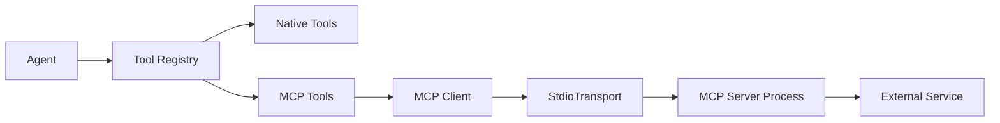

# MCP (Model Context Protocol) Integration

## Overview

The Model Context Protocol (MCP) is an open standard that enables seamless integration of external tools and services with AI systems. Our agent orchestration system fully supports MCP servers, allowing agents to access a wide variety of tools without modifying the core system.

## What is MCP?

MCP provides:
- **Standardized tool interface** - Any MCP server exposes tools in a consistent format
- **Language agnostic** - MCP servers can be written in any language
- **Process isolation** - Tools run in separate processes for safety
- **Dynamic discovery** - Tools are discovered at runtime from MCP servers

## Architecture



## Configuration

### Basic MCP Server Configuration

```typescript
const builder = AgentSystemBuilder.default()
  .withMCPServers({
    filesystem: {
      command: "npx",
      args: ["-y", "@modelcontextprotocol/server-filesystem", "/tmp"],
      env: {
        // Optional environment variables
      },
      description: "Filesystem access via MCP"
    }
  });
```

### Configuration File (agent-config.json)

```json
{
  "model": "claude-3-5-haiku-latest",
  "mcpServers": {
    "filesystem": {
      "command": "npx",
      "args": ["-y", "@modelcontextprotocol/server-filesystem", "/tmp"],
      "description": "File system operations"
    },
    "time": {
      "command": "npx",
      "args": ["-y", "@modelcontextprotocol/server-time"],
      "description": "Time and timezone utilities"
    },
    "fetch": {
      "command": "npx",
      "args": ["-y", "@modelcontextprotocol/server-fetch"],
      "description": "HTTP requests"
    }
  }
}
```

### Configuration Types

```typescript
interface MCPServerConfig {
  command: string;        // Command to run the server
  args: string[];        // Arguments to pass
  env?: Record<string, string>;  // Environment variables
  description?: string;   // Optional description
}

interface MCPConfig {
  servers: Record<string, MCPServerConfig>;
}
```

## How MCP Tools Work

### 1. Server Initialization

When you configure an MCP server, the system:
1. Spawns the server process using `StdioClientTransport`
2. Establishes communication via standard input/output
3. Discovers available tools from the server
4. Registers each tool in the ToolRegistry

### 2. Tool Naming

MCP tools are namespaced with their server name:
- Server: `filesystem`
- Tool: `read_file`
- Registered as: `filesystem.read_file`

This prevents naming conflicts between different MCP servers.

### 3. Tool Execution

```typescript
// Behind the scenes in system-builder.ts
const mcpTool: BaseTool = {
  name: `${serverName}.${tool.name}`,
  description: tool.description,
  parameters: tool.inputSchema,
  execute: async (input) => {
    const result = await client.callTool({
      name: tool.name,
      arguments: input
    });
    return { content: result.content };
  }
};
```

## Available MCP Servers

### Official Servers

1. **Filesystem** - File operations
   ```typescript
   "@modelcontextprotocol/server-filesystem"
   ```

2. **Time** - Time and timezone utilities
   ```typescript
   "@modelcontextprotocol/server-time"
   ```

3. **Fetch** - HTTP requests
   ```typescript
   "@modelcontextprotocol/server-fetch"
   ```

4. **PostgreSQL** - Database queries
   ```typescript
   "@modelcontextprotocol/server-postgres"
   ```

5. **Slack** - Slack integration
   ```typescript
   "@modelcontextprotocol/server-slack"
   ```

### Community Servers

Check the [MCP servers list](https://github.com/modelcontextprotocol/servers) for community-contributed servers.

## Usage Examples

### Example 1: File Operations with MCP

```typescript
// Configure with filesystem server
const system = await AgentSystemBuilder.default()
  .withMCPServers({
    fs: {
      command: "npx",
      args: ["-y", "@modelcontextprotocol/server-filesystem", "/workspace"]
    }
  })
  .withAgentsFrom('agents')
  .build();

// Agent can now use filesystem tools
const result = await system.executor.execute(
  'file-manager',
  'List all TypeScript files in /workspace'
);
```

### Example 2: Time Server Integration

```typescript
const builder = AgentSystemBuilder.default()
  .withMCPServers({
    time: {
      command: "npx",
      args: ["-y", "@modelcontextprotocol/server-time"]
    }
  });

const { executor, toolRegistry, cleanup } = await builder.build();

// Use time tools directly
const getCurrentTime = toolRegistry.get('time.get_current_time');
if (getCurrentTime) {
  const result = await getCurrentTime.execute({ 
    timezone: 'America/New_York' 
  });
  console.log(result.content);
}

// Clean up when done
await cleanup();
```

### Example 3: Agent Using MCP Tools

```markdown
---
name: timezone-assistant
tools: ["time.*"]
---

You are a timezone conversion assistant.

You can:
- Get current time in any timezone
- Convert times between timezones
- Calculate time differences

Use the time.* tools to help users with timezone questions.
```

### Example 4: Multiple MCP Servers

```typescript
const system = await AgentSystemBuilder.default()
  .withMCPServers({
    filesystem: {
      command: "npx",
      args: ["-y", "@modelcontextprotocol/server-filesystem", "/data"]
    },
    database: {
      command: "npx",
      args: ["-y", "@modelcontextprotocol/server-postgres"],
      env: {
        DATABASE_URL: process.env.DATABASE_URL
      }
    },
    http: {
      command: "npx",
      args: ["-y", "@modelcontextprotocol/server-fetch"]
    }
  })
  .build();
```

## Creating Custom MCP Servers

### Basic MCP Server (Node.js)

```javascript
// my-mcp-server.js
import { Server } from '@modelcontextprotocol/sdk/server/index.js';
import { StdioServerTransport } from '@modelcontextprotocol/sdk/server/stdio.js';

const server = new Server({
  name: 'my-custom-server',
  version: '1.0.0'
});

// Register a tool
server.setRequestHandler('tools/list', async () => ({
  tools: [{
    name: 'hello',
    description: 'Say hello',
    inputSchema: {
      type: 'object',
      properties: {
        name: { type: 'string' }
      },
      required: ['name']
    }
  }]
}));

// Handle tool execution
server.setRequestHandler('tools/call', async (request) => {
  if (request.params.name === 'hello') {
    const name = request.params.arguments.name;
    return {
      content: [{ 
        type: 'text', 
        text: `Hello, ${name}!` 
      }]
    };
  }
});

// Start server
const transport = new StdioServerTransport();
await server.connect(transport);
```

### Using Custom Server

```typescript
const system = await AgentSystemBuilder.default()
  .withMCPServers({
    custom: {
      command: "node",
      args: ["./my-mcp-server.js"]
    }
  })
  .build();
```

## Tool Discovery

### List Available MCP Tools

```typescript
const { toolRegistry } = await builder.build();

// List all MCP tools
const mcpTools = toolRegistry.list()
  .filter(tool => tool.name.includes('.'));

mcpTools.forEach(tool => {
  console.log(`${tool.name}: ${tool.description}`);
});
```

### Check for Specific MCP Server

```typescript
const hasFilesystemTools = toolRegistry.list()
  .some(tool => tool.name.startsWith('filesystem.'));

if (hasFilesystemTools) {
  console.log('Filesystem MCP server is available');
}
```

## Best Practices

### 1. Server Lifecycle Management

Always clean up MCP connections:

```typescript
const { cleanup } = await builder.build();

try {
  // Use the system
} finally {
  await cleanup(); // Closes all MCP connections
}
```

### 2. Error Handling

MCP servers can fail to start:

```typescript
try {
  const system = await builder
    .withMCPServers({ /* ... */ })
    .build();
} catch (error) {
  if (error.message.includes('MCP server')) {
    console.error('Failed to start MCP server:', error);
    // Fall back to system without MCP
    const system = await builder.build();
  }
}
```

### 3. Tool Permissions in Agents

Be specific about MCP tool access:

```yaml
# Grant access to all tools from a specific server
tools: ["filesystem.*"]

# Grant access to specific MCP tools
tools: ["filesystem.read_file", "filesystem.list_directory"]

# Mix native and MCP tools
tools: ["read", "write", "database.*"]
```

### 4. Environment Variables

Pass sensitive data via environment:

```typescript
.withMCPServers({
  database: {
    command: "npx",
    args: ["-y", "@modelcontextprotocol/server-postgres"],
    env: {
      DATABASE_URL: process.env.DATABASE_URL,
      DATABASE_PASSWORD: process.env.DB_PASSWORD
    }
  }
})
```

## Debugging MCP Issues

### Enable Verbose Logging

```typescript
const system = await AgentSystemBuilder.default()
  .withLogging({ verbose: true })
  .withMCPServers({ /* ... */ })
  .build();
```

### Common Issues

**MCP server fails to start**
```bash
# Check if command exists
which npx

# Test server manually
npx -y @modelcontextprotocol/server-filesystem /tmp
```

**Tools not appearing**
```typescript
// Wait for server initialization
const { toolRegistry } = await builder.build();
await new Promise(resolve => setTimeout(resolve, 1000));

// Then check tools
console.log(toolRegistry.list());
```

**Permission errors**
```typescript
// Ensure server has necessary permissions
.withMCPServers({
  filesystem: {
    command: "npx",
    args: ["-y", "@modelcontextprotocol/server-filesystem", "."],
    env: {
      USER: process.env.USER,
      HOME: process.env.HOME
    }
  }
})
```

## Performance Considerations

### 1. Server Startup Time
- MCP servers take time to initialize (typically 1-3 seconds)
- Reuse system instances when possible

### 2. Process Overhead
- Each MCP server runs in a separate process
- Limit the number of concurrent MCP servers

### 3. Communication Overhead
- Tool calls cross process boundaries
- Batch operations when possible

## Security Considerations

### 1. Process Isolation
- MCP servers run in separate processes
- Crashes don't affect the main system

### 2. Restricted Access
- Configure servers with minimal permissions
- Use read-only mounts where possible

### 3. Input Validation
- MCP tools validate inputs against schemas
- Additional validation in agent prompts recommended

## Troubleshooting

### Server Won't Start

1. Check command exists:
   ```bash
   which npx
   npm list -g @modelcontextprotocol/server-filesystem
   ```

2. Test manually:
   ```bash
   npx @modelcontextprotocol/server-filesystem /tmp
   ```

3. Check logs:
   ```typescript
   // Errors are logged during initialization
   console.log(`Failed to initialize MCP server ${serverName}:`, error);
   ```

### Tools Not Available

1. Check server connected:
   ```typescript
   console.log(`✓ MCP server ${serverName} connected with ${tools.length} tools`);
   ```

2. List registered tools:
   ```typescript
   toolRegistry.list().forEach(t => console.log(t.name));
   ```

3. Verify tool naming:
   ```typescript
   // MCP tools are prefixed
   const tool = toolRegistry.get('servername.toolname');
   ```

## Related Files

- MCP configuration types: `src/config/types.ts` (MCPConfig, MCPServerConfig)
- MCP initialization: `src/config/system-builder.ts` (lines 292-373)
- MCP example: `examples/mcp-integration.ts`
- MCP SDK types: `@modelcontextprotocol/sdk`

## Resources

- [MCP Specification](https://modelcontextprotocol.com)
- [Official MCP Servers](https://github.com/modelcontextprotocol/servers)
- [MCP SDK Documentation](https://github.com/modelcontextprotocol/sdk)
- [Creating MCP Servers](https://modelcontextprotocol.com/docs/server)