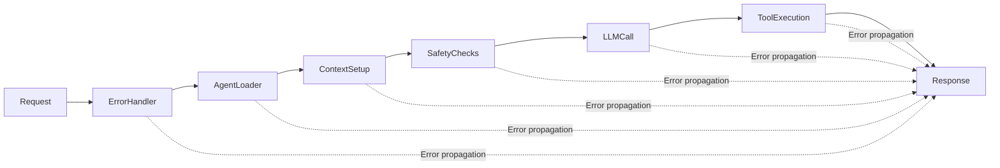
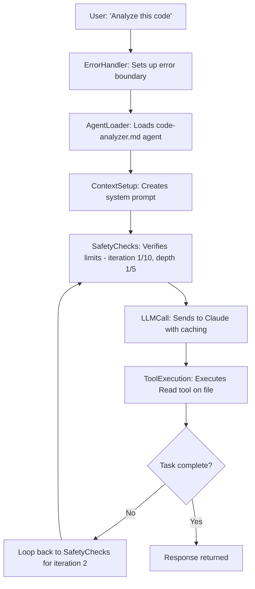

# Middleware Architecture

## Overview

The agent orchestration system is built on a **middleware pipeline pattern** (Chain of Responsibility), where each
middleware handles a specific concern.

## Core Concept

```typescript
type Middleware = (ctx: MiddlewareContext, next: () => Promise<void>) => Promise<void>;
```

Each middleware:

1. Receives a context object containing the current state
2. Performs its specific task
3. Calls `next()` to invoke the next middleware
4. Can handle post-processing after `next()` returns

## The Pipeline



## Middleware Components

### 1. ErrorHandlerMiddleware

**File**: `src/middleware/error-handler.middleware.ts`
**Purpose**: Global error boundary for the entire pipeline

```typescript
export function createErrorHandlerMiddleware(): Middleware {
  return async (ctx: MiddlewareContext, next: () => Promise<void>) => {
    try {
      await next();
    } catch (error) {
      // Log error, set fallback response
      ctx.response = { 
        content: `Error: ${error.message}`,
        toolCalls: [] 
      };
    }
  };
}
```

**Key responsibilities**:

- Catches all errors from downstream middleware
- Provides fallback responses
- Ensures pipeline never crashes
- Logs errors for debugging

### 2. AgentLoaderMiddleware

**File**: `src/middleware/agent-loader.middleware.ts`
**Purpose**: Loads agent definitions from markdown files

```typescript
export function createAgentLoaderMiddleware(
  agentLoader: AgentLoader,
  toolRegistry: ToolRegistry
): Middleware
```

**Key responsibilities**:

- Loads agent from markdown file
- Parses YAML frontmatter for configuration
- Filters available tools based on agent config
- Sets agent context in middleware context

### 3. ContextSetupMiddleware

**File**: `src/middleware/context-setup.middleware.ts`
**Purpose**: Initializes conversation context

**Key responsibilities**:

- Sets up system prompt from agent
- Initializes message history
- Manages conversation state
- Handles context for delegated agents

### 4. SafetyChecksMiddleware

**File**: `src/middleware/safety-checks.middleware.ts`
**Purpose**: Enforces resource limits and prevents runaway execution

```typescript
export function createSafetyChecksMiddleware(safetyLimits: SafetyConfig): Middleware {
  return async (ctx: MiddlewareContext, next: () => Promise<void>) => {
    // Check iteration limit
    if (ctx.iterationCount >= safetyLimits.maxIterations) {
      throw new Error(`Max iterations (${safetyLimits.maxIterations}) exceeded`);
    }
    
    // Check depth limit
    if (ctx.depth > safetyLimits.maxDepth) {
      throw new Error(`Max depth (${safetyLimits.maxDepth}) exceeded`);
    }
    
    // Warn at threshold
    if (ctx.iterationCount === safetyLimits.warnAtIteration) {
      console.warn('⚠️ Approaching iteration limit');
    }
    
    await next();
  };
}
```

**Safety limits**:

- `maxIterations`: Max LLM calls per execution (default: 10)
- `maxDepth`: Max delegation chain depth (default: 5)
- `warnAtIteration`: Warning threshold (default: 5)
- `maxTokensEstimate`: Pre-flight token check (default: 100000)

### 5. LLMCallMiddleware

**File**: `src/middleware/llm-call.middleware.ts`
**Purpose**: Handles communication with the LLM provider

```typescript
export function createLLMCallMiddleware(provider: AnthropicProvider): Middleware
```

**Key responsibilities**:

- Prepares messages for LLM
- Makes API call to Anthropic
- Handles caching with ephemeral cache
- Manages token counting
- Processes LLM response

### 6. ToolExecutionMiddleware

**File**: `src/middleware/tool-execution.middleware.ts`
**Purpose**: Executes tools requested by the LLM

**Key responsibilities**:

- Parses tool calls from LLM response
- Validates tool availability
- Executes tools in parallel groups
- Handles agent delegation (Task tool)
- Formats tool results for next iteration

## Middleware Context

```typescript
interface MiddlewareContext {
  // Input
  agentName: string;
  prompt: string;
  sessionId: string;
  
  // Agent info
  agent?: Agent;
  availableTools: Map<string, Tool>;
  
  // Conversation state
  messages: Message[];
  
  // Execution state
  iterationCount: number;
  depth: number;
  tokenUsage: TokenUsage;
  
  // Output
  response?: LLMResponse;
  
  // Services
  logger: JSONLLogger;
  llmProvider: AnthropicProvider;
  agentExecutor: AgentExecutor;
}
```

## Pipeline Execution

```typescript
// src/middleware/pipeline.ts
export class MiddlewarePipeline {
  private middlewares: NamedMiddleware[] = [];
  
  use(name: string, middleware: Middleware): this {
    this.middlewares.push({ name, handler: middleware });
    return this;
  }
  
  async execute(initialContext: MiddlewareContext): Promise<void> {
    const runMiddleware = (index: number): Promise<void> => {
      if (index >= this.middlewares.length) {
        return Promise.resolve();
      }
      
      const { handler } = this.middlewares[index];
      return handler(initialContext, () => runMiddleware(index + 1));
    };
    
    await runMiddleware(0);
  }
}
```

## Creating Custom Middleware

To add new functionality, create a middleware:

```typescript
export function createMetricsMiddleware(): Middleware {
  return async (ctx: MiddlewareContext, next: () => Promise<void>) => {
    const startTime = Date.now();
    
    // Pre-processing
    console.log(`Starting ${ctx.agentName}`);
    
    // Call next middleware
    await next();
    
    // Post-processing
    const duration = Date.now() - startTime;
    console.log(`Completed in ${duration}ms`);
  };
}
```

Then add it to the pipeline:

```typescript
pipeline
  .use('error-handler', createErrorHandlerMiddleware())
  .use('metrics', createMetricsMiddleware()) // Custom middleware
  .use('agent-loader', createAgentLoaderMiddleware(...))
// ... rest of pipeline
```

## Benefits of Middleware Architecture

1. **Separation of Concerns**: Each middleware has one job
2. **Composability**: Easy to add, remove, or reorder functionality
3. **Testability**: Each middleware can be tested in isolation
4. **Maintainability**: Small, focused files instead of monolithic classes
5. **Extensibility**: Add new features without modifying existing code
6. **Familiarity**: Express.js-like pattern widely understood

## Execution Flow Example



## Common Patterns

### Pre/Post Processing

```typescript
async (ctx, next) => {
  // Pre-processing
  console.log('Before');
  
  await next();
  
  // Post-processing
  console.log('After');
}
```

### Short-Circuit

```typescript
async (ctx, next) => {
  if (ctx.response) {
    return; // Skip remaining middleware
  }
  await next();
}
```

### Error Recovery

```typescript
async (ctx, next) => {
  try {
    await next();
  } catch (error) {
    ctx.response = fallbackResponse;
  }
}
```

## Troubleshooting

**Issue**: Middleware not executing

- Check pipeline order - middleware executes sequentially
- Ensure `next()` is called
- Verify middleware is added to pipeline

**Issue**: Context not propagating

- Context object is shared across all middleware
- Mutations are visible to all middleware
- Use context for communication between middleware

**Issue**: Infinite loops

- SafetyChecksMiddleware prevents runaway execution
- Check iteration and depth limits
- Monitor token usage

## Related Files

- Pipeline implementation: `src/middleware/pipeline.ts`
- Middleware types: `src/middleware/middleware-types.ts`
- All middleware: `src/middleware/*.middleware.ts`
- Pipeline setup: `src/core/agent-executor.ts`