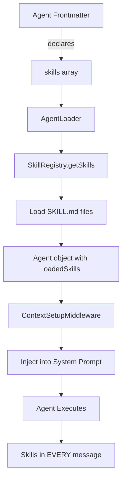
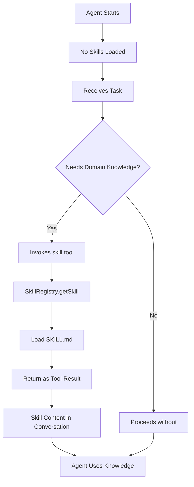

# Dynamic Skills System Implementation Plan

**Date**: 2025-10-18
**Status**: Planning Phase
**Goal**: Transform build-time skills system to runtime dynamic loading (Claude Code approach)
**Breaking Changes**: Yes (acceptable - not in production)

---

## Table of Contents

1. [Executive Summary](#executive-summary)
2. [Philosophical Rationale](#philosophical-rationale)
3. [Architecture Transformation](#architecture-transformation)
4. [Implementation Phases](#implementation-phases)
5. [Detailed Design](#detailed-design)
6. [Code Changes](#code-changes)
7. [Testing Strategy](#testing-strategy)
8. [Migration Impact](#migration-impact)
9. [Success Criteria](#success-criteria)

---

## Executive Summary

### Current State (Build-Time)
```typescript
Agent Frontmatter → Load Skills → Inject to System Prompt → Agent Executes
```
- Skills declared in frontmatter
- Pre-loaded at agent instantiation
- Injected into every message
- Fixed per agent execution
- **Cost**: All skills in every prompt (high token usage)

### Target State (Runtime/Dynamic with Auto-Triggering)
```typescript
Agent Starts → System Analyzes Task → Auto-Load Relevant Skills → Agent Executes with Knowledge
           OR → Agent Manually Loads Skill → Agent Executes with Knowledge
```
- No skills in frontmatter
- Skills auto-loaded based on task keywords (primary)
- Can also manually load via `skill` tool (fallback)
- Added to conversation context
- System decides which skills to load (auto-trigger)
- Agent can override/supplement (manual tool)
- **Benefit**: Pay only for skills used + automatic skill selection

### Key Changes
1. ✅ **Create** `skill` tool for runtime loading
2. ❌ **Remove** skills field from agent frontmatter
3. ❌ **Remove** ContextSetupMiddleware skill injection
4. ✅ **Add** dynamic skill catalog to tool description
5. 🔄 **Update** all agents to use skill tool
6. ⭐ **Auto-triggering** based on task description (Claude Code style)

### Effort Estimate
- **Total Implementation**: 24-32 hours
- **Phase 1-3 (Core Dynamic Loading)**: 12-16 hours
- **Phase 4 (Auto-Triggering)**: 12-16 hours
- **Approach**: Full Claude Code implementation with auto-triggering

---

## Philosophical Rationale

### Why This Matches Reality Better

**Knowledge Workers Don't Memorize Everything**

Current approach (build-time):
```
Doctor memorizes entire medical textbook → Sees patient → Diagnoses from memory
```

Claude Code approach (runtime):
```
Doctor sees patient → Realizes needs cardiology reference → Consults book → Diagnoses
```

### The Fundamental Insight

**Tools vs Skills Are Different**

| Aspect | Tools | Skills |
|--------|-------|--------|
| **Nature** | Capabilities (actions) | Knowledge (information) |
| **Side Effects** | Yes (write files, call APIs) | No (just context) |
| **Security** | Requires permission system | No security risk |
| **Declaration** | Must be static (for safety) | Can be dynamic (safe) |
| **Analogy** | Workshop tools (hammer, saw) | Reference books (manuals) |

**Why This Matters:**

Tools MUST be declared upfront:
```typescript
tools: ["read", "write", "shell"]  // ⚠️ Security boundary
// Can't allow: Agent: "I think I need shell access now" → DANGEROUS
```

Skills CAN be dynamic:
```typescript
Agent: "I need Danish tender guidelines"
System: "Here's the content" // ✅ Just text, completely safe
```

### Context Window Economics

**Current Approach (Wasteful):**
```
System Prompt: 50K tokens
- Agent instructions: 5K
- danish-tender-guidelines: 25K ← Always loaded even if not needed
- complexity-calculator: 20K ← Always loaded even if not needed

Task: "Extract deadline from document"
Total: 50K tokens (paid for 45K unused skills)
```

**Dynamic Approach (Efficient):**
```
System Prompt: 5K tokens
- Agent instructions: 5K

Task: "Extract deadline from document"
Agent: Loads danish-tender-guidelines (25K)
Total: 30K tokens (saved 20K)

Task: "Estimate complexity"
Agent: Loads complexity-calculator (20K)
Total: 25K tokens (saved 25K)
```

**At Scale**: If you have 50 skills × 20K tokens each = 1M tokens every execution vs load 1-2 skills = 20-40K tokens

### Agent Autonomy

**Current (Passive):**
```
System: "You have these skills: [list]"
Agent: "I'll use what I was given"
```

**Dynamic (Active):**
```
System: "Skills available in catalog"
Agent: "I realize I need complexity formulas... let me load that"
```

More human-like decision making.

---

## Architecture Transformation

### Current Architecture



**Problems:**
- ❌ Skills loaded even if not needed
- ❌ All skills in every API call (token waste)
- ❌ Agent can't choose which skills to use
- ❌ Fixed skills per execution

### Target Architecture



**Benefits:**
- ✅ Skills loaded only when needed
- ✅ Token efficient (pay for what you use)
- ✅ Agent chooses skills based on task
- ✅ Different skills per task

### Component Changes

| Component | Current Role | New Role | Change Type |
|-----------|-------------|----------|-------------|
| **Agent Frontmatter** | Declares `skills: []` | NO skills field | REMOVE |
| **AgentLoader** | Loads skills from frontmatter | No skill loading | SIMPLIFY |
| **ContextSetupMiddleware** | Injects skills to system prompt | No skill injection | REMOVE |
| **SkillRegistry** | Batch load skills | Single skill getter | MODIFY |
| **SkillTool** | Doesn't exist | Load skills on-demand | CREATE |
| **ToolRegistry** | Existing tools | Register SkillTool | ADD |

---

## Implementation Phases

### Phase 1: Create Skill Tool ⏱️ 4-6 hours

**Goal**: Add `skill` tool that agents can use to load domain knowledge

**Tasks:**
1. Create `SkillTool` class
2. Implement dynamic skill catalog in description
3. Register tool in ToolRegistry
4. Add to default tools
5. Unit tests for SkillTool

**Deliverable**: Agents can load skills via tool (existing agents still work)

### Phase 2: Remove Static Loading ⏱️ 3-4 hours

**Goal**: Remove all build-time skill loading

**Tasks:**
1. Remove skills field from agent frontmatter schema
2. Remove skill loading from AgentLoader
3. Remove skill injection from ContextSetupMiddleware
4. Remove skills from logAgentStart metadata
5. Update AgentValidation schema

**Deliverable**: Clean codebase, skills only via tool

### Phase 3: Update Agents ⏱️ 2-3 hours

**Goal**: Rewrite agents to use skill tool

**Tasks:**
1. Add `skill` to agent tools
2. Update agent instructions (tell them about skill tool)
3. Remove `skills:` from frontmatter
4. Test each agent

**Deliverable**: All agents use dynamic skills

### Phase 4: Auto-Triggering ⏱️ 12-16 hours

**Goal**: Auto-load skills based on task keywords (Claude Code style - CORE FEATURE)

**Tasks:**
1. Create SkillAutoTrigger pattern matcher
2. Extract keywords from skill descriptions
3. Match task description to skills
4. Create auto-trigger middleware
5. Add configuration options
6. Extensive testing

**Deliverable**: Skills auto-load when task matches description

### Phase 5: Testing & Validation ⏱️ 3-4 hours

**Goal**: Ensure everything works

**Tasks:**
1. Unit tests (SkillTool, pattern matching)
2. Integration tests (agents using skills)
3. Update existing tests
4. Performance testing
5. Documentation

**Deliverable**: Production-ready system

---

## Detailed Design

### 1. Skill Tool Design

**File**: `packages/core/src/tools/builtin/skill.tool.ts`

**Interface:**
```typescript
Input: { name: string }
Output: string (skill content as markdown)
```

**Behavior:**

```typescript
// Success case
skill({ name: "danish-tender-guidelines" })
→ Returns:
"""
# danish-tender-guidelines

*Danish public tender compliance rules and formatting standards*

## Critical Marker System
[Full skill instructions...]

## Available Resources
- reference/marker-system.md (reference)
- assets/analysis-template.md (asset)

Use Read tool to access specific resources.
"""

// Failure case
skill({ name: "non-existent" })
→ Returns:
"""
Skill "non-existent" not found.

Available skills:
  - danish-tender-guidelines: Danish tender compliance
  - complexity-calculator: Software estimation formulas

Use one of the above skill names.
"""
```

**Key Features:**
1. **Dynamic Catalog**: Tool description includes list of available skills
2. **Resource Discovery**: Lists available reference/asset files
3. **Lazy Loading**: Resources loaded only when skill is accessed
4. **Error Handling**: Helpful message with skill catalog
5. **Integration**: Works with existing Read tool for resources

**Tool Description Template:**
```typescript
description = `Load domain expertise and specialized knowledge on-demand.

<skills_instructions>
Skills provide guidelines, templates, formulas, and best practices.
Load skills only when you need specialized knowledge for your task.

How to use:
- Invoke: skill(name: "skill-name")
- Content loads into conversation
- Reference it in your response
- Load multiple skills if needed

Available Skills:
{{DYNAMIC_CATALOG}}

Examples:
- Load tender analysis: skill(name: "danish-tender-guidelines")
- Load estimation formulas: skill(name: "complexity-calculator")
</skills_instructions>

When to load:
- You need domain-specific knowledge
- Task requires specialized expertise
- You want to follow specific standards
- Templates or formulas would help
`;
```

**{{DYNAMIC_CATALOG}}** replaced at runtime with:
```
- danish-tender-guidelines: Danish public tender compliance rules, marker system
- complexity-calculator: Software development complexity and effort estimation formulas
- [auto-discovered from skills/]
```

### 2. Skill Registry Modifications

**Current:**
```typescript
class SkillRegistry {
  async loadSkills(): Promise<void> {
    // Loads ALL skills from directory
  }

  getSkills(names: string[]): Skill[] {
    // Returns multiple skills
  }
}
```

**New:**
```typescript
class SkillRegistry {
  async loadSkills(): Promise<void> {
    // Still loads all skill metadata (names, descriptions)
    // But NOT the full content or resources
  }

  getSkill(name: string): Skill | undefined {
    // Returns SINGLE skill
    // Lazy loads content and resources on first access
  }

  listSkills(): SkillMetadata[] {
    // Returns skill catalog (names + descriptions only)
    // For tool description generation
  }
}
```

**Benefits:**
- Fast startup (load metadata only)
- Lazy resource loading (only when skill used)
- Single skill getter (simpler API)

### 3. Agent Frontmatter Changes

**Before:**
```yaml
---
name: technical-analyst
tools: ["read", "write", "list", "grep"]
skills:
  - danish-tender-guidelines
  - complexity-calculator
---
```

**After:**
```yaml
---
name: technical-analyst
tools: ["read", "write", "list", "grep", "skill"]
---
```

**That's it.** No skills field.

### 4. Agent Instructions Update

**Before:**
```markdown
You are a Technical Analyst with expertise in Danish tender analysis.

[Agent instructions...]
```

**After:**
```markdown
You are a Technical Analyst agent.

## Available Domain Knowledge

You have access to specialized skills via the `skill` tool:
- **danish-tender-guidelines**: Load when analyzing Danish tenders
- **complexity-calculator**: Load when estimating development effort

**When to load skills:**
- Analyzing Danish tender → Load `danish-tender-guidelines`
- Calculating complexity → Load `complexity-calculator`
- General analysis → Proceed without loading skills

## Your Process

1. Analyze the task
2. Determine if specialized knowledge needed
3. Load relevant skill(s) using skill tool
4. Apply skill guidelines to your work
5. Generate output following skill standards

[Rest of instructions...]
```

**Teaching the agent:**
- Skills exist and what they contain
- When to load each skill
- How to use the skill tool

### 5. Auto-Triggering Design (Optional)

**Pattern Matching Engine:**

```typescript
interface SkillTrigger {
  skill: Skill;
  confidence: number;  // 0.0 to 1.0
  matchedKeywords: string[];
  reason: string;
}

class SkillAutoTrigger {
  /**
   * Analyze task and suggest skills
   */
  analyzeTask(task: string): SkillTrigger[] {
    // Extract keywords from task
    const taskKeywords = this.extractKeywords(task.toLowerCase());

    // For each skill, check description
    const triggers: SkillTrigger[] = [];

    for (const skill of this.registry.listSkills()) {
      const skillKeywords = this.extractSkillKeywords(skill.description);
      const matches = this.findMatches(taskKeywords, skillKeywords);

      if (matches.length > 0) {
        const confidence = matches.length / skillKeywords.length;
        triggers.push({
          skill,
          confidence,
          matchedKeywords: matches,
          reason: `Matched keywords: ${matches.join(', ')}`
        });
      }
    }

    return triggers.sort((a, b) => b.confidence - a.confidence);
  }

  private extractSkillKeywords(description: string): string[] {
    // Look for "Use when..." pattern
    const match = description.match(/Use when ([^.]+)/i);
    if (!match) return [];

    // Split on commas, clean up
    return match[1]
      .split(',')
      .map(s => s.trim().toLowerCase());
  }
}
```

**Example:**

Skill description:
```
Use when analyzing Danish tenders, creating tender specifications,
or calculating compliance requirements
```

Task:
```
"Analyze this Danish tender document for compliance"
```

Matching:
```typescript
skillKeywords = ["analyzing danish tenders", "creating tender specifications", "calculating compliance"]
taskKeywords = ["analyze", "danish", "tender", "compliance"]

matches = ["analyzing danish tenders", "calculating compliance"]
confidence = 2/3 = 0.67 (67%)
```

**Auto-Trigger Middleware:**

```typescript
async execute(ctx: AgentContext): Promise<void> {
  const config = ctx.config.skills?.autoTrigger;
  if (!config?.enabled) {
    return this.next(ctx);
  }

  // Get task from first user message
  const firstMessage = ctx.messages.find(m => m.role === 'user');
  if (!firstMessage) {
    return this.next(ctx);
  }

  // Analyze for triggers
  const triggers = this.autoTrigger
    .analyzeTask(firstMessage.content)
    .filter(t => t.confidence >= config.confidenceThreshold)
    .slice(0, config.maxSkills);

  if (triggers.length === 0) {
    return this.next(ctx);
  }

  // Log what's being auto-loaded
  ctx.logger.logSystemMessage(
    `Auto-loaded ${triggers.length} skill(s): ${triggers.map(t =>
      `${t.skill.name} (${Math.round(t.confidence * 100)}% confidence)`
    ).join(', ')}`
  );

  // Load skills and inject as system messages
  for (const trigger of triggers) {
    const skill = this.registry.getSkill(trigger.skill.name);
    if (skill) {
      await skill.loadResources?.();

      ctx.messages.push({
        role: 'system',
        content: `[Auto-loaded skill: ${skill.name}]\n\n${skill.instructions}`
      });
    }
  }

  return this.next(ctx);
}
```

**Configuration:**

```typescript
const system = await AgentSystemBuilder.default()
  .with({
    skills: {
      directories: ['skills/'],
      autoTrigger: {
        enabled: true,
        confidenceThreshold: 0.5,  // 50% keyword match required
        maxSkills: 2,  // Max 2 skills auto-loaded
      }
    }
  })
  .build();
```

**Trade-offs:**

Pros:
- ✅ Agent doesn't need to know about skills
- ✅ Automatic "smart" behavior
- ✅ Claude Code-like UX

Cons:
- ❌ Complex pattern matching logic
- ❌ False positives possible
- ❌ Less predictable
- ❌ Adds 12-16 hours development

**Recommendation:** Skip for MVP, add later if needed

---

## Code Changes

### Files to Create

1. **`packages/core/src/tools/builtin/skill.tool.ts`** (200 lines)
   - SkillTool class
   - Dynamic catalog generation
   - Tool description template
   - Execution logic

2. **`packages/core/tests/unit/tools/skill.tool.test.ts`** (150 lines)
   - Load skill by name
   - Skill not found
   - List available skills
   - Resource discovery

3. **(Optional) `packages/core/src/skills/auto-trigger.ts`** (300 lines)
   - Pattern matching engine
   - Keyword extraction
   - Confidence scoring

4. **(Optional) `packages/core/src/middleware/skill-auto-trigger.middleware.ts`** (150 lines)
   - Auto-trigger middleware
   - Configuration handling
   - Skill injection

5. **(Optional) `packages/core/tests/unit/skills/auto-trigger.test.ts`** (200 lines)
   - Pattern matching tests
   - Confidence scoring
   - Edge cases

### Files to Modify

1. **`packages/core/src/agents/validation.ts`** (-10 lines)
   - Remove `skills` field from AgentFrontmatterSchema
   - Remove skills validation

2. **`packages/core/src/agents/loader.ts`** (-30 lines)
   - Remove skill loading logic
   - Remove skillRegistry parameter
   - Simplify loadAgent method

3. **`packages/core/src/middleware/context-setup.middleware.ts`** (-15 lines)
   - Remove skill injection block
   - Simplify system prompt generation

4. **`packages/core/src/middleware/agent-loader.middleware.ts`** (-10 lines)
   - Remove skills metadata logging
   - Remove logAgentStart skills parameter

5. **`packages/core/src/logging/types.ts`** (-1 line)
   - Remove skills parameter from logAgentStart

6. **`packages/core/src/logging/*.logger.ts`** (-5 lines each)
   - Remove skills parameter from implementations

7. **`packages/core/src/config/system-builder.ts`** (+20 lines)
   - Register SkillTool
   - Add 'skill' to default tools
   - (Optional) Add auto-trigger middleware

8. **`packages/core/src/skills/registry.ts`** (+30 lines)
   - Add `getSkill(name)` method
   - Add `listSkills()` method
   - Lazy loading optimization

9. **`packages/examples/udbud/agents/*.md`** (-2 lines, +10 lines each)
   - Remove `skills:` from frontmatter
   - Add `"skill"` to tools
   - Add skill usage instructions

10. **`packages/core/tests/unit/config/system-builder.test.ts`** (-20 lines)
    - Remove skills configuration tests
    - Or update to test SkillTool registration

11. **`packages/core/tests/unit/test-agents/*.md`** (-2 lines each)
    - Remove skills from test agents

12. **`packages/core/tests/integration/skills-system/*.ts`** (rewrite)
    - Update to test dynamic loading
    - Agent uses skill tool

### Total Code Changes (Full Implementation with Auto-Trigger)

**Complete Implementation:**
- New files: 5 (1000 lines total)
  - SkillTool (200 lines)
  - SkillTool tests (150 lines)
  - SkillAutoTrigger (300 lines)
  - Auto-trigger middleware (150 lines)
  - Auto-trigger tests (200 lines)
- Modified files: 13 (~120 lines net change)
- Deleted code: ~80 lines
- Added code: ~1200 lines
- **Net: +1120 lines**

**Breakdown by Phase:**
- Phase 1-3 (Core): +180 lines
- Phase 4 (Auto-trigger): +940 lines
- Net: +1120 lines total

---

## Testing Strategy

### Unit Tests

**SkillTool Tests:**
```typescript
describe('SkillTool', () => {
  test('should load skill by name');
  test('should return skill content as markdown');
  test('should include resource summary');
  test('should list available skills when not found');
  test('should handle skill without resources');
  test('should lazy load resources on access');
  test('should generate dynamic catalog in description');
});
```

**SkillRegistry Tests (Updates):**
```typescript
describe('SkillRegistry', () => {
  test('getSkill should return single skill');
  test('getSkill should return undefined for non-existent');
  test('listSkills should return metadata only');
  test('should lazy load skill content');
  test('should lazy load resources');
});
```

**(Optional) Auto-Trigger Tests:**
```typescript
describe('SkillAutoTrigger', () => {
  test('should match keywords in task');
  test('should calculate confidence score');
  test('should sort by confidence');
  test('should handle no matches');
  test('should extract keywords from description');
  test('should respect confidence threshold');
});
```

### Integration Tests

**Dynamic Skills Test:**
```typescript
test('agent loads skill via tool and applies it', async () => {
  const system = await AgentSystemBuilder.default()
    .withAgentsFrom('test-agents/')
    .withSkillsFrom('test-skills/')
    .build();

  const result = await system.executor.execute(
    'test-agent',
    'Analyze this Danish tender using proper guidelines'
  );

  // Verify agent called skill tool
  expect(result).toContain('skill');
  expect(result).toContain('danish-tender-guidelines');

  // Verify skill was applied
  expect(result).toContain('[FAKTA');
  expect(result).toContain('[ESTIMAT');
});
```

**Multiple Skills Test:**
```typescript
test('agent loads multiple skills for complex task', async () => {
  const result = await executor.execute(
    'technical-analyst',
    'Analyze Danish tender and estimate development complexity'
  );

  // Should load both skills
  expect(result).toContain('danish-tender-guidelines');
  expect(result).toContain('complexity-calculator');
});
```

**(Optional) Auto-Trigger Test:**
```typescript
test('skills auto-trigger based on task keywords', async () => {
  const system = await AgentSystemBuilder.default()
    .with({
      skills: {
        autoTrigger: {
          enabled: true,
          confidenceThreshold: 0.5
        }
      }
    })
    .build();

  const result = await system.executor.execute(
    'test-agent',
    'Analyze this Danish tender document'
  );

  // Skill should auto-load without tool call
  expect(result).toContain('Auto-loaded skill: danish-tender-guidelines');
});
```

### Performance Tests

```typescript
test('skill loading should be lazy and fast', async () => {
  const start = Date.now();
  const skill = registry.getSkill('complex-skill');
  const metadataTime = Date.now() - start;

  expect(metadataTime).toBeLessThan(10); // Metadata loads instantly
  expect(skill.resources).toBeUndefined(); // Resources not loaded yet

  await skill.loadResources();
  const loadTime = Date.now() - start;
  expect(loadTime).toBeLessThan(100); // Resources load fast
});
```

### Test Coverage Goals

- Unit tests: 90%+ coverage
- Integration tests: All critical paths
- Performance tests: Baseline metrics
- Edge cases: Error handling, missing skills, malformed input

---

## Migration Impact

### What Breaks

1. **All Agents** ❌
   - Frontmatter `skills:` field invalid
   - Must add `skill` to tools
   - Must update instructions

2. **Agent Loader** ❌
   - Skills parameter removed
   - Validation schema changed

3. **Context Setup** ❌
   - No skill injection
   - Simpler system prompt

4. **Logging** ❌
   - No skills in agent_start events
   - Simpler event structure

5. **Existing Tests** ❌
   - Skills config tests removed
   - Agent tests need updates

### What Still Works

1. **SkillRegistry** ✅
   - Core loading logic unchanged
   - Just adds new methods

2. **Skill File Format** ✅
   - SKILL.md format unchanged
   - Resources unchanged

3. **Tool System** ✅
   - Just adding one more tool
   - No changes to existing tools

4. **Middleware Pipeline** ✅
   - Still same execution flow
   - Just simpler context setup

### Migration Steps

**Step 1: Implement Changes**
```bash
# Create SkillTool
# Modify middleware
# Update SkillRegistry
# Remove frontmatter skills
```

**Step 2: Update Agents**
```bash
# For each agent in agents/ and examples/udbud/agents/:
# 1. Remove skills: [] from frontmatter
# 2. Add "skill" to tools
# 3. Update instructions to mention skill tool
```

**Step 3: Update Tests**
```bash
# Remove skill config tests
# Update agent tests to expect skill tool usage
# Add SkillTool tests
```

**Step 4: Update Documentation**
```bash
# README.md - New skills usage
# CLAUDE.md - Update skill examples
# Skills README - Dynamic loading guide
```

**Step 5: Test Everything**
```bash
npm run build
npm test
npm run test:integration
```

**Step 6: Commit**
```bash
git add .
git commit -m "feat(skills): convert to dynamic runtime loading (Claude Code approach)"
```

---

## Success Criteria

### Functional Requirements

✅ Agent can load skill via tool
✅ Skill content added to conversation
✅ Agent can load multiple skills
✅ Skill tool shows available skills catalog
✅ Resources lazy load when needed
✅ Error handling for missing skills

### Performance Requirements

✅ Skill metadata loads < 100ms
✅ Single skill loads < 50ms
✅ Resource lazy loading works
✅ No regression in agent execution time
✅ Token usage reduced (measure with real agents)

### Quality Requirements

✅ All tests pass (unit + integration)
✅ Code coverage > 85%
✅ No TypeScript errors
✅ Lint passes
✅ Documentation updated

### Validation Tests

**Test 1: Basic Skill Loading**
```
Agent: technical-analyst
Task: "Analyze tender complexity"
Expected: Agent calls skill tool, loads complexity-calculator, uses formulas
```

**Test 2: Multiple Skills**
```
Agent: technical-analyst
Task: "Analyze Danish tender and estimate effort"
Expected: Loads danish-tender-guidelines + complexity-calculator
```

**Test 3: No Skills Needed**
```
Agent: technical-analyst
Task: "List files in directory"
Expected: No skill tool calls, proceeds directly
```

**Test 4: Wrong Skill Name**
```
Agent calls: skill(name: "non-existent")
Expected: Returns skill catalog, agent tries correct name
```

**Test 5: Token Efficiency**
```
Before: 50K tokens (all skills pre-loaded)
After: 30K tokens (only loaded skills used)
Savings: 40%
```

---

## Implementation Approach (Full Claude Code Style)

### Complete Implementation: All Phases (24-32 hours)

**Scope:**
- Phase 1-3: Core dynamic loading (SkillTool, remove static, update agents)
- Phase 4: Auto-triggering (pattern matching, middleware, configuration)
- Phase 5: Testing and validation

**Deliverable**: Full Claude Code-style skills system with auto-triggering

**Risk**: Medium (auto-trigger complexity, but manageable)

### Why All-at-Once Instead of Phased?

**Decision**: Implement complete system in one go

**Rationale:**
1. **Cohesive Design**: Auto-trigger and manual tool work together
2. **Avoid Partial Migration**: Don't want agents half-using, half-not-using skills
3. **Test Once**: Validate complete behavior in integration tests
4. **Not in Production**: Can afford to take time and do it right

**Timeline:**
- Week 1: Phases 1-3 (Core system)
- Week 2: Phase 4 (Auto-triggering)
- Week 3: Phase 5 (Testing, polish, docs)

---

## Decision: Full Claude Code Implementation

### Confirmed Approach

**DECISION: Implement complete system with auto-triggering**

**Full Implementation: Phases 1-5 (All Features)**
- Phase 1-3: Core dynamic loading (12-16 hours)
- Phase 4: Auto-triggering with pattern matching (12-16 hours)
- Phase 5: Testing and validation (3-4 hours)
- Total: 24-32 hours

**Why Full Implementation:**
1. **Best UX**: Auto-triggering provides Claude Code-like experience
2. **Complete Solution**: Both manual and automatic skill loading
3. **Not in Production**: Can afford to implement full feature set
4. **Cohesive Design**: Auto-trigger + manual tool work together seamlessly

---

## Next Steps

**Implementation Plan:**

1. Create feature branch: `feature/skills-dynamic-auto-trigger`
2. Implement Phases 1-3: Core dynamic loading
   - SkillTool creation
   - Remove static loading
   - Update agents
3. Implement Phase 4: Auto-triggering
   - Pattern matching engine
   - Auto-trigger middleware
   - Configuration system
4. Implement Phase 5: Testing & validation
   - Unit tests for all components
   - Integration tests
   - Performance validation
5. Update documentation
6. Commit and merge

**Estimated timeline:**
- Week 1: Phases 1-3 (Core system) - 12-16 hours
- Week 2: Phase 4 (Auto-triggering) - 12-16 hours
- Week 3: Phase 5 (Testing/Polish) - 3-4 hours
- **Total: 3-4 weeks part-time or 1-1.5 weeks full-time**

**Ready to begin implementation!**
