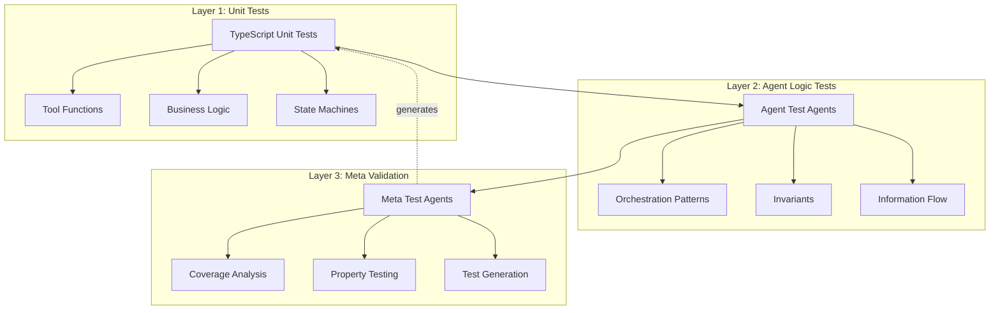
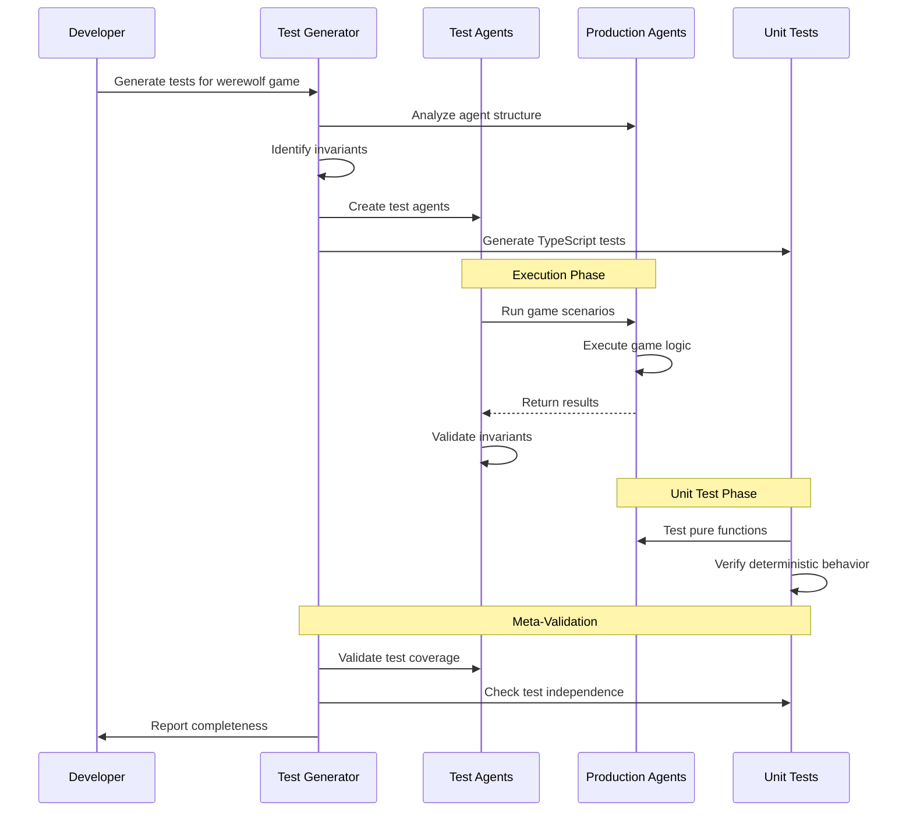

# Testing Philosophy for Agent Orchestration Systems

## Core Principle: Deterministic Behavior Enables Comprehensive Testing

The key insight of this system is that **functional agents with deterministic behavior** can be tested as rigorously as any other software component. By treating agents as pure functions that map inputs to outputs, we enable a three-layer testing strategy that provides confidence in both individual components and emergent system behavior.

## The Three-Layer Testing Strategy



### Layer 1: Traditional Unit Tests (TypeScript/Vitest)

Tests deterministic components directly:
- **Pure Functions**: Vote counting, win condition evaluation
- **State Transitions**: Player states, game phases
- **Business Rules**: Majority calculations, turn order
- **Tool Execution**: File operations, parsing logic

Example from generated test:
```typescript
it('should require majority for elimination', async () => {
  const voteScenarios = [
    { votes: [1, 1, 2, 2, 2], eliminated: 2 },     // Clear majority
    { votes: [1, 1, 2, 2], eliminated: null },      // Tie - no elimination
  ];
  // Deterministic vote counting logic
});
```

### Layer 2: Agent Logic Tests (Agent-based)

Test agents that validate orchestration behavior:
- **Delegation Patterns**: No cycles, proper depth limiting
- **State Invariants**: Dead players stay dead, conservation of players
- **Information Boundaries**: Role knowledge restrictions
- **Win Conditions**: Proper game termination

Example test agent:
```markdown
---
name: property-based-validator
tools: ["get_session_log"]
---

Validate these invariants hold for ALL games:
- P1: Conservation of Players (living + dead = total)
- P2: Monotonic Death (death count never decreases)
- P3: Turn Alternation (Night → Day → Night...)
```

### Layer 3: Meta Validation (Recursive Testing)

Agents that test the test suite itself:
- **Coverage Analysis**: Ensure all critical paths tested
- **Test Independence**: No test depends on another
- **Determinism Verification**: Same input → same output
- **Test Generation**: Agents create new test cases

## Why This Works: Deterministic Thoroughness

Traditional agent systems are hard to test because:
1. **Non-deterministic LLM responses**: Same input → different outputs
2. **Shared mutable state**: Side effects across agent boundaries
3. **Hidden dependencies**: Agents rely on global context

Our system solves this through:

### 1. Functional Agents
```typescript
// Agent as pure function
type Agent = (request: string) => Promise<string>

// No shared state, no side effects beyond tool use
// Same request → same logical outcome
```

### 2. Pull Architecture
- Agents fetch what they need via tools
- No hidden context or global state
- Each execution is independent

### 3. Explicit Delegation
- Parent-child relationships are explicit
- Information flow is traceable
- Orchestration patterns are testable

## Agent-Generated Test Suites

The ultimate validation: **agents can generate comprehensive test suites for themselves**.

### The Process

1. **Test Generator Agent** analyzes the system:
   ```markdown
   ---
   name: test-suite-generator
   tools: ["Read", "Write", "Grep", "List"]
   ---
   
   Analyze an agent system and generate tests for:
   1. Orchestration patterns
   2. State invariants
   3. Business rules
   4. Information flow
   ```

2. **Generated Test Types**:
   - **Property-based tests**: Mathematical invariants
   - **Orchestration tests**: Delegation and depth limits
   - **State machine tests**: Valid transitions only
   - **Edge case tests**: Boundary conditions

3. **Recursive Validation**:
   - Test agents validate production agents
   - Meta-test agents validate test agents
   - Coverage agents ensure completeness

### Example: Werewolf Game Tests

The test generator created comprehensive TypeScript tests:

```typescript
describe('Werewolf Game - Deterministic Logic', () => {
  describe('Player State Transitions', () => {
    it('should never resurrect dead players', async () => {
      // Tests invariant: Dead players MUST stay dead
      const validation = await executor.execute('dead-players-immutable',
        'Validate no resurrections occurred');
      expect(result.passed).toBe(true);
    });
  });

  describe('Vote Counting Logic', () => {
    it('should require majority for elimination', async () => {
      // Tests deterministic vote counting
      const voteScenarios = [
        { votes: [1, 1, 2, 2, 2], eliminated: 2 },
        { votes: [1, 1, 2, 2], eliminated: null },
      ];
      // Mathematical validation
    });
  });
});
```

## What Can and Cannot Be Tested

### Testable (Deterministic)

#### Execution Mechanics
✅ **Tool Invocation**
```typescript
// Test that tools are actually called, not simulated
it('should invoke Read tool with absolute path', async () => {
  const spy = vi.spyOn(toolRegistry, 'execute');
  await executor.execute('file-analyzer', 'Analyze /src/index.ts');
  
  expect(spy).toHaveBeenCalledWith('Read', {
    file_path: '/src/index.ts'  // Verify exact parameters
  });
});

// Test tool sequencing
it('should read before writing', async () => {
  const calls: string[] = [];
  toolRegistry.on('execute', (tool) => calls.push(tool));
  
  await executor.execute('editor', 'Modify file.ts');
  expect(calls).toEqual(['Read', 'Edit']); // Never Edit before Read
});
```

✅ **Parameter Validation**
```typescript
// Test correct parameter types and values
it('should pass correct grep parameters', async () => {
  const grepSpy = vi.spyOn(GrepTool, 'execute');
  await executor.execute('searcher', 'Find TODO comments');
  
  expect(grepSpy).toHaveBeenCalledWith({
    pattern: 'TODO',           // Correct regex
    path: expect.any(String),  // Valid path
    multiline: false           // Appropriate flag
  });
});
```

✅ **Delegation Chains**
```typescript
// Test delegation depth and patterns
it('should track complete delegation chain', async () => {
  const delegations = trackDelegations(executor);
  await executor.execute('orchestrator', 'Complex task');
  
  expect(delegations).toEqual([
    { from: 'orchestrator', to: 'analyzer', depth: 1 },
    { from: 'analyzer', to: 'validator', depth: 2 },
  ]);
  expect(maxDepth(delegations)).toBeLessThanOrEqual(5);
});
```

✅ **Safety Boundaries**
```typescript
// Test iteration and depth limits
it('should enforce iteration limits', async () => {
  const result = await executor.execute('infinite-loop', 'Keep going');
  expect(result).toContain('Maximum iterations (10) reached');
  
  const log = getSessionLog();
  expect(log.iterations).toBe(10);
  expect(log.abortReason).toBe('iteration_limit');
});

// Test token estimation
it('should reject oversized requests', async () => {
  const hugeContext = 'x'.repeat(500000);
  await expect(
    executor.execute('agent', hugeContext)
  ).rejects.toThrow('Estimated tokens (125000) exceeds limit');
});
```

✅ **Tool Concurrency**
```typescript
// Test parallel vs sequential execution
it('should execute safe tools in parallel', async () => {
  const timings = await trackTimings(executor);
  await executor.execute('multi-reader', 'Read 3 files');
  
  // All reads should start within 50ms (parallel)
  expect(Math.max(...timings.readStarts) - Math.min(...timings.readStarts))
    .toBeLessThan(50);
});

it('should execute writes sequentially', async () => {
  const timings = await trackTimings(executor);
  await executor.execute('multi-writer', 'Write 3 files');
  
  // Each write should start after previous completes
  expect(timings.writeStarts[1]).toBeGreaterThan(timings.writeEnds[0]);
  expect(timings.writeStarts[2]).toBeGreaterThan(timings.writeEnds[1]);
});
```

✅ **Middleware Pipeline**
```typescript
// Test each middleware executes in order
it('should execute middleware pipeline correctly', async () => {
  const executed: string[] = [];
  
  // Spy on each middleware
  middlewares.forEach(m => {
    vi.spyOn(m, 'handle').mockImplementation(async (ctx, next) => {
      executed.push(m.constructor.name);
      return next(ctx);
    });
  });
  
  await executor.execute('test', 'task');
  
  expect(executed).toEqual([
    'ErrorHandlerMiddleware',
    'AgentLoaderMiddleware',
    'ContextSetupMiddleware',
    'ProviderSelectionMiddleware',
    'SafetyChecksMiddleware',
    'LLMCallMiddleware',
    'ToolExecutionMiddleware'
  ]);
});
```

✅ **Cache Behavior**
```typescript
// Test Anthropic prompt caching
it('should use cache for repeated reads', async () => {
  const apiCalls = trackAPICalls();
  
  // First execution
  await executor.execute('reader', 'Read config.json');
  expect(apiCalls[0].cacheTokens).toBe(0);
  
  // Second execution should hit cache
  await executor.execute('reader', 'Read config.json again');
  expect(apiCalls[1].cacheTokens).toBeGreaterThan(0);
  expect(apiCalls[1].cost).toBeLessThan(apiCalls[0].cost * 0.2);
});
```

✅ **Error Propagation**
```typescript
// Test error handling through the stack
it('should propagate tool errors correctly', async () => {
  vi.spyOn(fs, 'readFileSync').mockImplementation(() => {
    throw new Error('Permission denied');
  });
  
  const result = await executor.execute('reader', 'Read /etc/passwd');
  
  expect(result).toContain('Error executing Read tool');
  expect(result).toContain('Permission denied');
  expect(getSessionLog().errors).toHaveLength(1);
});
```

✅ **Configuration Loading**
```typescript
// Test agent configuration parsing
it('should load agent configuration correctly', async () => {
  const agent = await loadAgent('test-agent.md');
  
  expect(agent).toEqual({
    name: 'test-agent',
    tools: ['Read', 'Write'],
    behavior: 'precise',
    temperature: 0.2,
    maxIterations: 5
  });
});

// Test provider selection
it('should select correct provider for model', async () => {
  const provider = selectProvider('openrouter/llama-3.1-70b');
  expect(provider).toBeInstanceOf(OpenRouterProvider);
  
  const provider2 = selectProvider('claude-3-5-haiku-latest');
  expect(provider2).toBeInstanceOf(AnthropicProvider);
});
```

✅ **Message Format**
```typescript
// Test message construction and parsing
it('should format tool calls correctly', async () => {
  const messages = captureMessages();
  await executor.execute('multi-tool', 'Complex task');
  
  const toolMessage = messages.find(m => m.role === 'assistant');
  expect(toolMessage.content).toMatch(/<function_calls>/);
  expect(toolMessage.content).toMatch(/<parameter name=".*">/);
});
```

✅ **Session Management**
```typescript
// Test session state tracking
it('should maintain session state correctly', async () => {
  const session = await executor.execute('stateful', 'Task 1');
  const log = getSessionLog(session.sessionId);
  
  expect(log).toMatchObject({
    sessionId: expect.any(String),
    agentName: 'stateful',
    startTime: expect.any(Number),
    iterations: expect.any(Number),
    toolCalls: expect.arrayContaining([
      { tool: expect.any(String), timestamp: expect.any(Number) }
    ])
  });
});
```

#### Business Logic
✅ **Business Rules**: Vote counting, win conditions, state machines
✅ **Orchestration**: Delegation patterns, depth limits, termination
✅ **Invariants**: Conservation laws, monotonic properties
✅ **Information Flow**: Knowledge boundaries, role restrictions

### Not Fully Testable (Non-deterministic)
❌ **LLM Reasoning**: Exact phrasing of responses
❌ **Creative Content**: Story generation, role-playing dialogue
❌ **Strategic Decisions**: Which player to eliminate
❌ **Natural Language**: Precise wording of explanations

### The Key Insight
**We test the rails, not the train**: The system ensures agents follow rules (testable) while allowing creative problem-solving within those constraints (non-testable).

## Testing Tool Usage Patterns

### Common Patterns to Test

#### 1. Read-Before-Write Pattern
```typescript
// Agents MUST read before editing
it('should always read file before editing', async () => {
  const toolCalls = await trackTools(executor, 'editor', 'Fix typo in README');
  
  const readIndex = toolCalls.findIndex(t => t.tool === 'Read');
  const editIndex = toolCalls.findIndex(t => t.tool === 'Edit');
  
  expect(readIndex).toBeGreaterThanOrEqual(0);
  expect(editIndex).toBeGreaterThan(readIndex);
});
```

#### 2. Search-Then-Navigate Pattern
```typescript
// Agents should search broadly, then read specifically
it('should use Grep before Read for exploration', async () => {
  const tools = await trackTools(executor, 'explorer', 'Find all TODO comments');
  
  const grepCalls = tools.filter(t => t.tool === 'Grep');
  const readCalls = tools.filter(t => t.tool === 'Read');
  
  expect(grepCalls.length).toBeGreaterThan(0);
  expect(grepCalls[0].timestamp).toBeLessThan(readCalls[0]?.timestamp || Infinity);
});
```

#### 3. Validation After Modification
```typescript
// Agents should verify their changes
it('should validate after making changes', async () => {
  const tools = await trackTools(executor, 'refactorer', 'Rename function');
  
  const writeIndex = tools.findIndex(t => t.tool === 'Write' || t.tool === 'Edit');
  const postValidation = tools.slice(writeIndex + 1);
  
  const hasValidation = postValidation.some(t => 
    t.tool === 'Read' || 
    t.tool === 'Bash' && t.params.command.includes('test')
  );
  
  expect(hasValidation).toBe(true);
});
```

### Anti-Patterns to Detect

#### 1. Tool Hallucination
```typescript
// Ensure agents use real tools, not imagine results
it('should not hallucinate tool results', async () => {
  const response = await executor.execute('analyzer', 'Check file.ts');
  
  // Agent should not claim to have read without tool call
  if (response.includes('The file contains')) {
    const tools = getSessionLog().toolCalls;
    expect(tools).toContainEqual(
      expect.objectContaining({ tool: 'Read' })
    );
  }
});
```

#### 2. Infinite Delegation
```typescript
// Prevent delegation cycles
it('should not create delegation cycles', async () => {
  const delegations = new Map<string, string[]>();
  
  trackDelegations((from, to) => {
    if (!delegations.has(from)) delegations.set(from, []);
    delegations.get(from)!.push(to);
  });
  
  await executor.execute('orchestrator', 'Complex task');
  
  // Check for cycles using DFS
  const hasCycle = detectCycle(delegations);
  expect(hasCycle).toBe(false);
});
```

#### 3. Resource Wastage
```typescript
// Ensure efficient tool use
it('should not repeatedly read unchanged files', async () => {
  const tools = await trackTools(executor, 'analyzer', 'Analyze codebase');
  
  const readCalls = tools.filter(t => t.tool === 'Read');
  const duplicates = readCalls.filter((call, i) => 
    readCalls.findIndex(c => c.params.file_path === call.params.file_path) < i
  );
  
  // Same file shouldn't be read more than twice
  const fileCounts = new Map();
  readCalls.forEach(r => {
    const path = r.params.file_path;
    fileCounts.set(path, (fileCounts.get(path) || 0) + 1);
  });
  
  const excessiveReads = Array.from(fileCounts.values()).filter(c => c > 2);
  expect(excessiveReads.length).toBe(0);
});
```

## Comprehensive Test Coverage Strategy

### Level 1: System Integrity Tests
```typescript
describe('System Integrity', () => {
  it('should load all configured agents', async () => {
    const agents = await loadAllAgents('./agents');
    agents.forEach(agent => {
      expect(agent.name).toBeDefined();
      expect(agent.tools).toBeInstanceOf(Array);
    });
  });

  it('should register all required tools', () => {
    const requiredTools = ['Read', 'Write', 'Edit', 'Grep', 'List', 'Task'];
    requiredTools.forEach(tool => {
      expect(toolRegistry.has(tool)).toBe(true);
    });
  });

  it('should enforce all safety limits', async () => {
    const limits = await testAllLimits();
    expect(limits.iteration).toBe('enforced');
    expect(limits.depth).toBe('enforced');
    expect(limits.token).toBe('enforced');
  });
});
```

### Level 2: Execution Flow Tests
```typescript
describe('Execution Flow', () => {
  it('should maintain correct execution order', async () => {
    const flow = await traceExecution('complex-task');
    
    expect(flow).toMatchObject({
      phases: [
        { phase: 'load_agent', success: true },
        { phase: 'setup_context', success: true },
        { phase: 'select_provider', success: true },
        { phase: 'safety_check', success: true },
        { phase: 'llm_call', success: true },
        { phase: 'tool_execution', success: true },
      ]
    });
  });
});
```

### Level 3: Integration Pattern Tests
```typescript
describe('Integration Patterns', () => {
  it('should handle multi-agent workflows', async () => {
    const workflow = await executeWorkflow([
      { agent: 'analyzer', task: 'Identify issues' },
      { agent: 'fixer', task: 'Fix identified issues' },
      { agent: 'validator', task: 'Verify fixes' }
    ]);
    
    expect(workflow.success).toBe(true);
    expect(workflow.dataFlow).toEqual([
      { from: 'analyzer', to: 'fixer', data: 'issues_list' },
      { from: 'fixer', to: 'validator', data: 'fixes_applied' }
    ]);
  });
});
```

### The Key Insight
**We test the rails, not the train**: The system ensures agents follow rules (testable) while allowing creative problem-solving within those constraints (non-testable).

## Practical Implementation Guide

### 1. Start with Invariants
Identify what MUST always be true:
```markdown
- Players cannot resurrect
- Votes must sum to living player count
- Games must terminate at win conditions
```

### 2. Create Test Agents
Write agents that validate invariants:
```markdown
---
name: vote-validator
tools: ["get_session_log"]
---

Verify all votes are valid:
1. Only living players vote
2. Votes target living players
3. Majority determines outcome
```

### 3. Generate Unit Tests
Let agents create TypeScript tests:
```typescript
// Agent-generated test
it('should enforce majority rule', async () => {
  const result = await executor.execute('vote-counter',
    'Count votes: [1, 1, 2, 2, 2]');
  expect(JSON.parse(result).eliminated).toBe(2);
});
```

### 4. Add Meta-Validation
Ensure test coverage:
```markdown
---
name: test-coverage-analyzer
tools: ["get_session_log", "Read"]
---

Analyze test suite completeness:
- All invariants have tests
- All edge cases covered
- Tests are independent
```

## Benefits of This Approach

### 1. Confidence in Autonomy
- Agents can operate independently
- Behavior is predictable within constraints
- Edge cases are handled correctly

### 2. Rapid Development
- Test agents find bugs during development
- Property tests catch logic errors
- Meta-tests ensure coverage

### 3. Documentation as Tests
- Test agents document expected behavior
- Invariants serve as specifications
- Tests demonstrate correct usage

### 4. Recursive Improvement
- Agents can improve their own tests
- Test generation becomes more sophisticated
- Coverage naturally increases

## Example: Complete Test Hierarchy



## The Power of Execution Testing

By testing the execution mechanics comprehensively, we achieve something remarkable: **confidence in non-deterministic systems**. Even though we can't predict exactly what an LLM will say, we can guarantee:

1. **Tools are called correctly** - No hallucinated file contents
2. **Parameters are valid** - Proper types, ranges, and formats  
3. **Sequences are logical** - Read before write, search before navigate
4. **Resources are managed** - No infinite loops, no memory leaks
5. **Errors are handled** - Graceful degradation, proper propagation
6. **Safety is enforced** - Hard limits on iterations, depth, tokens

This creates a **sandwich of determinism**:
```
Deterministic Test Layer (Top)
    ↓ validates ↓
Non-deterministic LLM Layer (Middle)  
    ↓ operates on ↓
Deterministic Tool Layer (Bottom)
```

## Real-World Testing Examples

### Testing a Code Refactoring Agent
```typescript
describe('RefactoringAgent', () => {
  it('should follow safe refactoring practices', async () => {
    const session = await executor.execute('refactorer', 
      'Rename all instances of getUserId to fetchUserId');
    
    const tools = getSessionLog().toolCalls;
    
    // 1. Discovery phase - find all occurrences
    const grepPhase = tools.filter(t => t.tool === 'Grep');
    expect(grepPhase[0].params.pattern).toMatch(/getUserId/);
    
    // 2. Read phase - understand context
    const readPhase = tools.filter(t => t.tool === 'Read');
    expect(readPhase.length).toBeGreaterThan(0);
    
    // 3. Edit phase - make changes
    const editPhase = tools.filter(t => t.tool === 'Edit');
    editPhase.forEach(edit => {
      expect(edit.params.old_string).toContain('getUserId');
      expect(edit.params.new_string).toContain('fetchUserId');
    });
    
    // 4. Validation phase - run tests
    const testPhase = tools.filter(t => 
      t.tool === 'Bash' && t.params.command.includes('test')
    );
    expect(testPhase.length).toBeGreaterThan(0);
  });
});
```

### Testing an Analysis Agent
```typescript
describe('AnalysisAgent', () => {
  it('should gather comprehensive data before conclusions', async () => {
    const result = await executor.execute('analyzer', 
      'Analyze the authentication system');
    
    const tools = getSessionLog().toolCalls;
    
    // Should explore before diving deep
    const explorationTools = tools.slice(0, 5);
    const hasExploration = explorationTools.some(t => 
      t.tool === 'Grep' || t.tool === 'List'
    );
    expect(hasExploration).toBe(true);
    
    // Should read relevant files
    const authFiles = tools
      .filter(t => t.tool === 'Read')
      .filter(t => t.params.file_path.includes('auth'));
    expect(authFiles.length).toBeGreaterThan(0);
    
    // Should not make claims without evidence
    if (result.includes('vulnerability')) {
      const hasEvidence = tools.some(t => 
        t.tool === 'Read' && 
        (t.params.file_path.includes('auth') || 
         t.params.file_path.includes('security'))
      );
      expect(hasEvidence).toBe(true);
    }
  });
});
```

## Conclusion

By embracing **deterministic thoroughness**, we transform agent testing from a challenge into a strength. The same properties that make our agents predictable and reliable also make them testable at every level.

The recursive nature of agent-generated tests creates a virtuous cycle:
1. Agents help us write better tests
2. Better tests help us write better agents
3. Better agents can generate even better tests

This comprehensive testing approach—from execution mechanics to business logic to meta-validation—proves that **functional agent architectures** can be as rigorous and reliable as traditional software systems while maintaining the flexibility and autonomy that makes them powerful.

## Quick Start Checklist

- [ ] **Test execution mechanics**: Tool calls, parameters, sequencing
- [ ] **Test safety boundaries**: Iteration limits, token limits, timeouts
- [ ] **Test delegation patterns**: No cycles, proper depth, clear chains
- [ ] **Test tool patterns**: Read-before-write, search-then-navigate
- [ ] **Test error handling**: Propagation, recovery, graceful failure
- [ ] **Test invariants**: Business rules that must always hold
- [ ] **Generate test agents**: Let agents create validation agents
- [ ] **Generate unit tests**: Let agents create TypeScript tests
- [ ] **Add meta-validation**: Test the tests themselves
- [ ] **Monitor anti-patterns**: Tool hallucination, infinite loops, wastage

Remember: **Test the rails, not the train**. Ensure your agents follow the rules, and the emergent behavior will be both powerful and predictable.