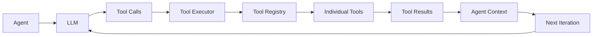

# Tool System

## Overview

The tool system provides agents with capabilities to interact with the environment. Tools are the bridge between agent
intelligence and real-world actions - from reading files to delegating tasks to other agents.

## Architecture



## Core Interfaces

### Tool Interface

**File**: `src/tools/types.ts`

```typescript
interface Tool {
  name: string;
  description: string;
  inputSchema: object; // JSON Schema for validation
  execute: (input: ToolInput, context: ExecutionContext) => Promise<ToolOutput>;
}

interface ToolInput {
  [key: string]: unknown;
}

interface ToolOutput {
  success: boolean;
  output?: unknown;
  error?: string;
}
```

## Tool Registry

**File**: `src/tools/tool-registry.ts`

The registry manages all available tools in the system:

```typescript
export class ToolRegistry {
  private tools = new Map<string, Tool>();

  register(tool: Tool): void {
    this.tools.set(tool.name, tool);
  }

  get(name: string): Tool | undefined {
    return this.tools.get(name);
  }

  list(): Tool[] {
    return Array.from(this.tools.values());
  }

  filter(names: string[]): Map<string, Tool> {
    const filtered = new Map<string, Tool>();
    for (const name of names) {
      const tool = this.tools.get(name);
      if (tool) filtered.set(name, tool);
    }
    return filtered;
  }
}
```

## Built-in Tools

### 1. Read Tool

**Purpose**: Read files from the filesystem
**File**: `src/tools/file.tool.ts`

```typescript
{
  name: 'read',
  description: 'Read a file from the filesystem',
  inputSchema: {
    type: 'object',
    properties: {
      path: {
        type: 'string',
        description: 'File path to read'
      }
    },
    required: ['path']
  }
}
```

**Usage Example**:

```json
{
  "tool": "read",
  "input": {
    "path": "src/index.ts"
  }
}
```

### 2. Write Tool

**Purpose**: Write content to files
**File**: `src/tools/file.tool.ts`

```typescript
{
  name: 'write',
  description: 'Write content to a file',
  inputSchema: {
    type: 'object',
    properties: {
      path: {
        type: 'string',
        description: 'File path to write'
      },
      content: {
        type: 'string',
        description: 'Content to write'
      }
    },
    required: ['path', 'content']
  }
}
```

### 3. List Tool

**Purpose**: List directory contents
**File**: `src/tools/file.tool.ts`

```typescript
{
  name: 'list',
  description: 'List files in a directory',
  inputSchema: {
    type: 'object',
    properties: {
      path: {
        type: 'string',
        description: 'Directory path to list'
      },
      recursive: {
        type: 'boolean',
        default: false,
        description: 'List recursively'
      }
    },
    required: ['path']
  }
}
```

### 4. Delegate Tool (Delegation)

**Purpose**: Delegate tasks to other agents
**File**: `src/tools/task.tool.ts`

```typescript
{
  name: 'delegate',
  description: 'Delegate a task to another agent',
  inputSchema: {
    type: 'object',
      properties
  :
    {
      agent: {
        type: 'string', description
      :
        'Agent to delegate to'
      }
    ,
      task: {
        type: 'string', description
      :
        'Task description'
      }
    }
  ,
    required: ['agent', 'delegate']
  }
}
```

**Special behavior**:

- Creates new agent execution context
- Increases depth counter
- Returns agent's complete response
- Enables multi-agent orchestration

### 5. TodoWrite Tool

**Purpose**: Manage task lists for complex workflows
**File**: `src/tools/todowrite.tool.ts`

```typescript
interface TodoItem {
  id: string;
  task: string;
  status: 'pending' | 'in-progress' | 'completed';
  priority?: 'low' | 'medium' | 'high';
}
```

## Tool Execution Flow

**File**: `src/tools/registry/executor.ts`, `src/tools/registry/executor-service.ts`

### 1. Tool Call Parsing

```typescript
// From LLM response
const toolCalls = response.tool_calls;
// Format: { name: string, input: object }[]
```

### 2. Parallel Execution Groups

Tools are executed in parallel groups based on dependencies:

```typescript
async executeTools(toolCalls: ToolCall[]): Promise<ToolResult[]> {
  const groups = this.groupToolCalls(toolCalls);
  const results = [];

  for (const group of groups)
{
  // Execute group in parallel
  const groupResults = await Promise.all(
    group.map(call => this.executeTool(call))
  );
  results.push(...groupResults);
}

return results;
}
```

### 3. Individual Tool Execution

```typescript
async executeTool(call: ToolCall): Promise<ToolResult> {
  const tool = this.registry.get(call.name);

  if (!tool) {
    return {
      success: false,
      error: `Unknown tool: ${call.name}`
    };
  }

try {
  // Validate input against schema
  validateInput(call.input, tool.inputSchema);

  // Execute tool
  const result = await tool.execute(call.input, this.context);

  // Log execution
  this.logger.logToolExecution(call, result);

  return result;
} catch (error) {
  return {
    success: false,
    error: error.message
  };
}
}
```

## Creating Custom Tools

### Step 1: Define the Tool

```typescript
// src/tools/custom-tool.ts
import {Tool, ToolInput, ToolOutput} from './types';

export class CustomTool implements Tool {
  name = 'custom';
  description = 'Does something custom';

  inputSchema = {
    type: 'object',
    properties: {
      param1: {type: 'string'},
      param2: {type: 'number'}
    },
    required: ['param1']
  };

  async execute(input: ToolInput, context: ExecutionContext): Promise<ToolOutput> {
    try {
      // Tool logic here
      const result = await this.doSomething(input.param1, input.param2);

      return {
        success: true,
        output: result
      };
    } catch (error) {
      return {
        success: false,
        error: error.message
      };
    }
  }

  private async doSomething(param1: string, param2?: number): Promise<string> {
    // Implementation
    return `Processed ${param1} with ${param2 || 'default'}`;
  }
}
```

### Step 2: Register the Tool

```typescript
// In system builder or setup
const toolRegistry = new ToolRegistry();
toolRegistry.register(new CustomTool());
```

### Step 3: Make Available to Agents

```yaml
# In agent markdown frontmatter
---
name: my-agent
tools: [ "read", "write", "custom" ]
---
```

Or use wildcard:

```yaml
tools: [ "*" ]  # Access to all registered tools
```

## Tool Safety

### Input Validation

- All inputs validated against JSON Schema
- Type checking at runtime
- Required fields enforced

### Execution Context

Tools receive limited context:

```typescript
interface ExecutionContext {
  sessionId: string;
  agentName: string;
  depth: number;
  logger: Logger;
  // No access to full conversation or other sensitive data
}
```

### Resource Limits

- File operations limited to working directory
- Network requests can be restricted
- Execution timeouts can be configured

## Tool Patterns

### Idempotent Tools

Tools should be idempotent when possible:

```typescript
// Good: Can be called multiple times safely
async
execute(input)
{
  const content = await fs.readFile(input.path);
  return {success: true, output: content};
}
```

### Error Handling

Always return structured errors:

```typescript
async
execute(input)
{
  try {
    // Tool logic
  } catch (error) {
    // Don't throw - return error in result
    return {
      success: false,
      error: `Failed to process: ${error.message}`
    };
  }
}
```

### Progress Reporting

For long-running tools:

```typescript
async
execute(input, context)
{
  context.logger.log('Starting processing...');

  for (let i = 0; i < items.length; i++) {
    await processItem(items[i]);
    context.logger.log(`Progress: ${i + 1}/${items.length}`);
  }

  return {success: true, output: 'Complete'};
}
```

## Tool Execution Examples

### Single Tool Call

```json
{
  "tool_calls": [
    {
      "name": "read",
      "input": {
        "path": "README.md"
      }
    }
  ]
}
```

### Multiple Tools (Parallel)

```json
{
  "tool_calls": [
    {
      "name": "read",
      "input": {
        "path": "file1.txt"
      }
    },
    {
      "name": "read",
      "input": {
        "path": "file2.txt"
      }
    }
  ]
}
```

### Delegation Chain

```json
{
  "tool_calls": [
    {
      "name": "delegate",
      "input": {
        "agent": "code-analyzer",
        "delegate": "Analyze the architecture of src/"
      }
    }
  ]
}
```

## Troubleshooting

**Issue**: Tool not found

- Check tool is registered in ToolRegistry
- Verify agent has access (check tools in frontmatter)
- Ensure tool name matches exactly

**Issue**: Input validation fails

- Check input matches schema
- Verify required fields are present
- Check type compatibility

**Issue**: Tool execution fails

- Check error message in result
- Verify file permissions (for file tools)
- Check execution context has required services

## Performance Considerations

1. **Parallel Execution**: Tools in same group run in parallel
2. **Caching**: Read operations benefit from OS file cache
3. **Delegation Overhead**: Delegate tool creates new execution context
4. **Resource Pooling**: Reuse connections/resources across calls

## Related Files

- Tool interfaces: `src/tools/types.ts`
- Tool registry: `src/tools/tool-registry.ts`
- Built-in tools: `src/tools/*.ts`
- Tool executor: `src/core/tool-executor.ts`
- Middleware integration: `src/middleware/tool-execution.middleware.ts`