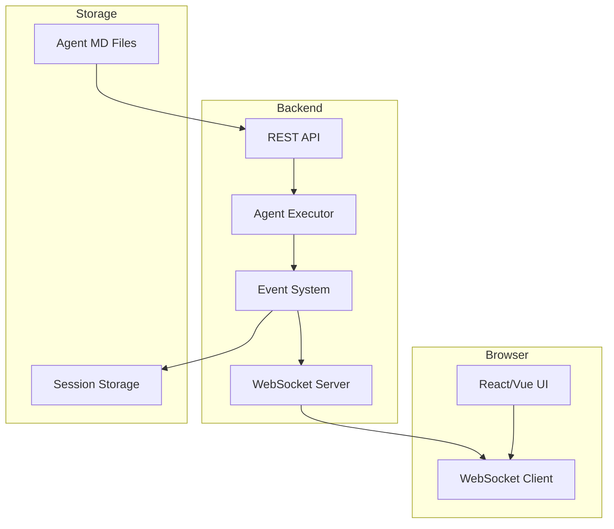

# Web UI Architecture: Why Events Are ESSENTIAL

## The Vision 🎯

A web interface for non-technical users to:
- Upload/edit agent markdown files
- Configure agents visually
- Run agents and see real-time execution
- No CLI knowledge required

## The Event System is the HEART of This

Without events, a web UI is **impossible**. With events, it becomes **elegant**.

## Web UI Requirements Mapped to Events

### 1. Real-Time Execution Visualization
```typescript
// Backend emits events
eventSystem.on('*', (event) => {
  websocket.send(JSON.stringify({
    sessionId: context.sessionId,
    event: event
  }));
});
```

```javascript
// Frontend React component
function ExecutionView() {
  const [events, setEvents] = useState([]);

  useEffect(() => {
    socket.on('event', (data) => {
      setEvents(prev => [...prev, data.event]);
    });
  }, []);

  return (
    <Timeline>
      {events.map(event => (
        <TimelineEvent
          type={event.type}
          data={event.data}
          timestamp={event.timestamp}
        />
      ))}
    </Timeline>
  );
}
```

### 2. Progress Tracking
```typescript
eventSystem.on('agent:start', (e) => {
  ui.send({
    type: 'progress',
    status: 'started',
    agent: e.data.agent,
    task: e.data.task
  });
});

eventSystem.on('tool:call', (e) => {
  ui.send({
    type: 'progress',
    status: 'running',
    action: `Calling ${e.data.tool}...`
  });
});

eventSystem.on('agent:complete', (e) => {
  ui.send({
    type: 'progress',
    status: 'complete',
    duration: e.data.duration
  });
});
```

### 3. Live Streaming Output
```typescript
// Stream assistant messages as they arrive
eventSystem.on('message:assistant', (event) => {
  websocket.send({
    type: 'stream',
    content: event.data.content,
    agent: event.data.agent
  });
});
```

```jsx
// React UI showing live output
<Card>
  <CardHeader>{currentAgent}</CardHeader>
  <CardBody>
    <StreamingText content={streamingContent} />
  </CardBody>
  <CardFooter>
    <StatusIndicator status={agentStatus} />
  </CardFooter>
</Card>
```

### 4. Tool Execution Visualization
```typescript
eventSystem.on('tool:call', (event) => {
  ui.addToolCard({
    id: event.data.toolId,
    tool: event.data.tool,
    params: event.data.params,
    status: 'executing'
  });
});

eventSystem.on('tool:result', (event) => {
  ui.updateToolCard(event.data.toolId, {
    status: 'complete',
    result: event.data.result
  });
});
```

### 5. Delegation Tree Visualization
```typescript
// Build visual delegation tree
const delegationTree = {};

eventSystem.on('delegation:start', (event) => {
  delegationTree[event.data.parent] = delegationTree[event.data.parent] || {};
  delegationTree[event.data.parent][event.data.child] = {
    task: event.data.task,
    status: 'running'
  };

  ui.updateDelegationTree(delegationTree);
});
```

```jsx
// Visual tree component
<TreeView>
  <TreeNode label="orchestrator" status="complete">
    <TreeNode label="analyzer" status="running">
      <TreeNode label="validator" status="pending" />
    </TreeNode>
  </TreeNode>
</TreeView>
```

## The Complete Web Architecture



## Web UI Features Enabled by Events

### 1. **Execution Dashboard**
```jsx
<Dashboard>
  <MetricsPanel>
    <Metric label="Agents Run" value={agentCount} />
    <Metric label="Tools Called" value={toolCount} />
    <Metric label="Tokens Used" value={tokenCount} />
    <Metric label="Cost" value={`$${cost.toFixed(4)}`} />
  </MetricsPanel>

  <ExecutionTimeline events={events} />

  <CurrentActivity>
    {currentEvent && (
      <ActivityCard
        type={currentEvent.type}
        data={currentEvent.data}
      />
    )}
  </CurrentActivity>
</Dashboard>
```

### 2. **Agent Editor with Live Preview**
```jsx
<SplitPane>
  <MarkdownEditor
    value={agentMarkdown}
    onChange={handleEdit}
  />

  <LivePreview>
    <AgentCard agent={parsedAgent} />
    <TestRunner onRun={runWithEvents} />
    <EventStream events={testEvents} />
  </LivePreview>
</SplitPane>
```

### 3. **Interactive Execution Control**
```jsx
function ExecutionControl({ sessionId }) {
  const [isPaused, setIsPaused] = useState(false);

  const handlePause = () => {
    socket.emit('control', {
      sessionId,
      action: 'pause'
    });
    setIsPaused(true);
  };

  const handleStop = () => {
    socket.emit('control', {
      sessionId,
      action: 'stop'
    });
  };

  return (
    <ControlBar>
      <Button onClick={handlePause} disabled={isPaused}>
        Pause
      </Button>
      <Button onClick={handleStop} variant="danger">
        Stop
      </Button>
    </ControlBar>
  );
}
```

### 4. **Cost Monitoring & Limits**
```javascript
// Frontend shows real-time costs
socket.on('event', (data) => {
  if (data.event.type === 'llm:response') {
    const cost = data.event.metadata.cost;
    setCumulativeCost(prev => prev + cost);

    if (cumulativeCost > userLimit) {
      socket.emit('control', {
        action: 'stop',
        reason: 'Cost limit exceeded'
      });
    }
  }
});
```

### 5. **Collaborative Viewing**
```typescript
// Multiple users can watch same execution
eventSystem.on('*', (event) => {
  // Broadcast to all connected clients watching this session
  broadcastToSession(sessionId, {
    type: 'event',
    event: event,
    user: currentUser
  });
});
```

## API Endpoints Needed

```typescript
// REST API
POST   /api/agents              // Upload/create agent
GET    /api/agents              // List agents
GET    /api/agents/:id          // Get agent details
PUT    /api/agents/:id          // Update agent
DELETE /api/agents/:id          // Delete agent

POST   /api/executions          // Start execution
GET    /api/executions/:id      // Get execution status
DELETE /api/executions/:id      // Stop execution

GET    /api/sessions/:id/events // Get historical events

// WebSocket events
ws.on('execute', { agent, prompt })
ws.on('control', { action: 'pause'|'stop'|'resume' })
ws.emit('event', { sessionId, event })
ws.emit('status', { sessionId, status })
```

## Implementation Example

### Backend WebSocket Handler
```typescript
class WebUIHandler {
  constructor(private eventSystem: EventSystem) {
    this.setupEventForwarding();
  }

  private setupEventForwarding() {
    // Forward all events to connected clients
    this.eventSystem.on('*', (event) => {
      this.broadcast({
        type: 'event',
        sessionId: this.sessionId,
        event: {
          ...event,
          formatted: this.formatForUI(event)
        }
      });
    });
  }

  private formatForUI(event: SessionEvent) {
    switch(event.type) {
      case 'tool:call':
        return {
          icon: '🔧',
          title: `Calling ${event.data.tool}`,
          description: this.summarizeParams(event.data.params)
        };

      case 'message:assistant':
        return {
          icon: '🤖',
          title: event.data.agent,
          description: event.data.content.substring(0, 100)
        };

      // ... format each event type for UI
    }
  }
}
```

### Frontend Event Visualization
```jsx
function EventTimeline({ events }) {
  return (
    <Timeline>
      {events.map((event, i) => (
        <TimelineItem key={i}>
          <TimelineIcon>{getIcon(event.type)}</TimelineIcon>
          <TimelineContent>
            <TimelineTitle>
              {formatTitle(event)}
              <TimelineTime>
                {formatTime(event.timestamp)}
              </TimelineTime>
            </TimelineTitle>
            <TimelineBody>
              {renderEventBody(event)}
            </TimelineBody>
          </TimelineContent>
        </TimelineItem>
      ))}
    </Timeline>
  );
}
```

## Why Events Make This Possible

### Without Events (Current System)
- ❌ Can't show real-time progress
- ❌ Can't stream output to browser
- ❌ Can't visualize execution flow
- ❌ Can't interrupt execution
- ❌ Can't show tool calls as they happen
- ❌ Web UI would be "run and wait" only

### With Events
- ✅ Real-time execution streaming
- ✅ Live progress indicators
- ✅ Interactive controls (pause/stop)
- ✅ Visual delegation trees
- ✅ Cost monitoring
- ✅ Collaborative viewing
- ✅ Rich, interactive experience

## The Business Case

### Target Users (Non-Technical)
- **Product Managers** - Run analysis agents
- **Content Writers** - Run content generation agents
- **QA Teams** - Run test automation agents
- **Business Analysts** - Run data processing agents
- **Customer Support** - Run support automation agents

### Value Proposition
```
Current: "Install Node, run npm install, edit YAML, use terminal..."
With Web UI: "Click 'New Agent', paste prompt, click 'Run', see results"
```

## Monetization Opportunities

With event-driven Web UI, you can:
1. **SaaS Model** - Host agent execution platform
2. **Usage Billing** - Track tokens/executions via events
3. **Team Features** - Share agents, collaborative execution
4. **Enterprise** - Private deployments with audit logs
5. **Marketplace** - Share/sell agent templates

## Technical Requirements

### Minimal Stack
```json
{
  "backend": {
    "framework": "Express/Fastify",
    "websocket": "Socket.io or ws",
    "storage": "SQLite for metadata, FS for events"
  },
  "frontend": {
    "framework": "React/Vue/Svelte",
    "ui": "Tailwind + Shadcn/ui",
    "websocket": "Socket.io-client"
  }
}
```

## Conclusion

**The event system isn't just helpful for a Web UI - it's ESSENTIAL.**

Without events, you get a basic "submit and wait" interface.
With events, you get a rich, real-time, interactive experience that non-technical users can actually use and enjoy.

This completely justifies adding EventEmitter to the system. It's not over-engineering - it's building the foundation for a real product that real users need.

## Next Steps

1. Add EventEmitter to EventLogger (enables everything)
2. Build simple WebSocket server that forwards events
3. Create basic React UI that visualizes events
4. Iterate based on user feedback

The event system is the bridge between your powerful agent system and users who need it but can't use CLI.