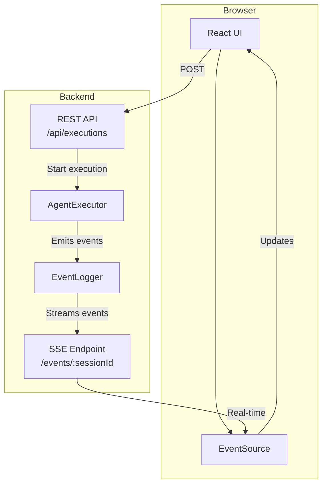

# Web UI Integration Guide

## Overview

The agent system includes a web UI (`packages/web`) that provides real-time visualization of agent execution using Server-Sent Events (SSE) for event streaming.

## Architecture



## Backend: Express + SSE

### Starting the Web Server

```bash
# From workspace root
npm run dev:web

# Server starts on:
# - Client: http://localhost:3000 (Vite dev server)
# - Server: http://localhost:3001 (Express API + SSE)
```

### REST API Endpoints

#### Start Execution

```http
POST /api/executions
Content-Type: application/json

{
  "agentPath": "agents/orchestrator.md",
  "prompt": "Analyze the latest React docs",
  "sessionId": "optional-session-id"
}
```

Response:
```json
{
  "sessionId": "session-1234567890",
  "status": "started",
  "message": "Execution started. Connect to /events/:sessionId for real-time updates."
}
```

#### Get Execution Status

```http
GET /api/executions/:sessionId
```

Response:
```json
{
  "sessionId": "session-1234567890",
  "status": "active"
}
```

#### Control Execution (Placeholder)

```http
POST /api/executions/:sessionId/control
Content-Type: application/json

{
  "action": "pause" | "stop" | "resume"
}
```

Note: Control actions are not yet implemented.

#### List Available Agents

```http
GET /api/agents
```

Response:
```json
{
  "agents": [
    { "id": "orchestrator", "path": "agents/orchestrator.md" },
    { "id": "analyzer", "path": "agents/analyzer.md" }
  ]
}
```

### SSE Event Streaming

#### Endpoint

```http
GET /events/:sessionId
Accept: text/event-stream
```

#### Server Implementation

```typescript
// packages/web/server/src/index.ts
app.get('/events/:sessionId', (req: Request, res: Response) => {
  const { sessionId } = req.params;

  // Set SSE headers
  res.setHeader('Content-Type', 'text/event-stream');
  res.setHeader('Cache-Control', 'no-cache');
  res.setHeader('Connection', 'keep-alive');
  res.setHeader('X-Accel-Buffering', 'no'); // Disable nginx buffering

  // Send initial connection event
  res.write(`data: ${JSON.stringify({
    type: 'connected',
    sessionId,
    timestamp: Date.now()
  })}\n\n`);

  // Get event logger for this session
  const eventLogger = activeSessions.get(sessionId);

  if (!eventLogger) {
    res.write(`data: ${JSON.stringify({
      type: 'error',
      message: 'Session not found. Start an execution first.'
    })}\n\n`);
    return;
  }

  // Subscribe to all events
  const handler = (event: unknown) => {
    try {
      res.write(`data: ${JSON.stringify(event)}\n\n`);
    } catch (error) {
      console.error('Error sending event:', error);
    }
  };

  eventLogger.on('*', handler);

  // Clean up when client disconnects
  req.on('close', () => {
    eventLogger.off('*', handler);
    console.log(`Client disconnected from session ${sessionId}`);
  });
});
```

#### Session Management

```typescript
// Store active event loggers by sessionId
const activeSessions = new Map<string, EventLogger>();

// When starting execution:
app.post('/api/executions', async (req, res) => {
  const system = await AgentSystemBuilder.default()
    .withSessionId(sessionId)
    .build();

  // Store event logger for SSE streaming
  activeSessions.set(sessionId, system.eventLogger);

  // Start execution in background (non-blocking)
  system.executor.execute(agentName, prompt)
    .then((result) => console.log('Completed:', result))
    .catch((error) => console.error('Failed:', error));

  // Return immediately
  res.json({ sessionId, status: 'started' });
});
```

## Frontend: React + EventSource

### Connecting to SSE

```typescript
// packages/web/client/src/App.tsx
const [events, setEvents] = useState<Event[]>([]);
const [isConnected, setIsConnected] = useState(false);
const eventSourceRef = useRef<EventSource | null>(null);

const handleStart = async () => {
  // 1. Start execution via REST API
  const response = await fetch('/api/executions', {
    method: 'POST',
    headers: { 'Content-Type': 'application/json' },
    body: JSON.stringify({ agentPath, prompt, sessionId })
  });

  const data = await response.json();
  setSessionId(data.sessionId);

  // 2. Connect to SSE stream
  const eventSource = new EventSource(`/events/${data.sessionId}`);
  eventSourceRef.current = eventSource;

  eventSource.onopen = () => {
    console.log('SSE connection opened');
    setIsConnected(true);
  };

  eventSource.onmessage = (e) => {
    const event = JSON.parse(e.data);
    setEvents(prev => [...prev, event]);

    // Handle completion
    if (event.type === 'agent_complete' || event.type === 'agent_error') {
      setIsRunning(false);
    }
  };

  eventSource.onerror = (error) => {
    console.error('SSE error:', error);
    setIsConnected(false);
    setIsRunning(false);
    eventSource.close();
  };
};
```

### Cleanup

```typescript
useEffect(() => {
  return () => {
    if (eventSourceRef.current) {
      eventSourceRef.current.close();
    }
  };
}, []);
```

### Event Timeline Display

```tsx
<div className="event-timeline">
  <h2>Event Timeline ({events.length})</h2>
  <div className="events">
    {events.map((event, i) => (
      <div key={i} className="event">
        <div className="event-header">
          <span className="event-type">{event.type}</span>
          <span className="event-timestamp">
            {new Date(event.timestamp).toLocaleTimeString()}
          </span>
        </div>
        {event.data && (
          <pre className="event-data">
            {JSON.stringify(event.data, null, 2)}
          </pre>
        )}
      </div>
    ))}
  </div>
</div>
```

## Session Continuity

The web UI supports session continuity - you can send multiple prompts to the same session:

```typescript
const handleStart = async () => {
  // Only clear events if starting a new session
  if (!sessionId) {
    setEvents([]);
  }

  const response = await fetch('/api/executions', {
    method: 'POST',
    headers: { 'Content-Type': 'application/json' },
    body: JSON.stringify({
      agentPath,
      prompt,
      sessionId: sessionId || undefined  // Reuse existing session
    })
  });

  // ...
};
```

Benefits:
- Conversation history preserved
- Anthropic prompt caching (90% cost savings on subsequent calls)
- Event timeline shows full session history

## Development Workflow

### Local Development

```bash
# Terminal 1: Start web server (Express + Vite)
npm run dev:web

# Browser: Open http://localhost:3000
# - Client UI served by Vite on :3000
# - API requests proxied to Express on :3001
```

### Environment Variables

Required in workspace root `.env`:

```bash
ANTHROPIC_API_KEY=sk-ant-...
# or
OPENROUTER_API_KEY=sk-or-...
```

The server loads `.env` from workspace root:

```typescript
import dotenv from 'dotenv';
import { resolve } from 'path';

// Load .env from workspace root (2 levels up from packages/web)
dotenv.config({ path: resolve(process.cwd(), '../../.env') });
```

## Event Types Received

All events from the core event system are streamed to the browser:

### Initial Connection
```json
{
  "type": "connected",
  "sessionId": "session-123",
  "timestamp": 1234567890
}
```

### Agent Start
```json
{
  "type": "agent_start",
  "timestamp": 1234567890,
  "data": {
    "agent": "orchestrator",
    "task": "Analyze React docs"
  }
}
```

### Tool Calls
```json
{
  "type": "tool_call",
  "timestamp": 1234567891,
  "data": {
    "id": "call_abc123",
    "tool": "WebFetch",
    "params": { "url": "https://react.dev" },
    "agent": "orchestrator"
  }
}
```

### Assistant Messages
```json
{
  "type": "assistant",
  "timestamp": 1234567892,
  "data": {
    "role": "assistant",
    "content": "Based on the React docs...",
    "agent": "orchestrator"
  },
  "metadata": {
    "tokens": 1234,
    "cost": 0.0234,
    "model": "claude-3-5-haiku-20241022"
  }
}
```

### Completion
```json
{
  "type": "agent_complete",
  "timestamp": 1234567893,
  "data": {
    "agent": "orchestrator",
    "result": "Analysis complete..."
  }
}
```

## Testing with Playwright

The web UI can be tested with Playwright (MCP):

```typescript
// Navigate to web UI
await playwright.navigate('http://localhost:3000');

// Fill form
await playwright.type('input[id="agent"]', 'agents/orchestrator.md');
await playwright.type('textarea[id="prompt"]', 'What is 2 + 2?');

// Start execution
await playwright.click('button.start-button');

// Wait for completion
await playwright.waitFor({ text: 'agent_complete' });

// Verify results displayed
const snapshot = await playwright.snapshot();
// Check snapshot contains expected events
```

## Custom Integrations

### Metrics Dashboard

```typescript
const eventSource = new EventSource(`/events/${sessionId}`);

let totalTokens = 0;
let totalCost = 0;

eventSource.onmessage = (e) => {
  const event = JSON.parse(e.data);

  if (event.metadata?.tokens) {
    totalTokens += event.metadata.tokens;
  }
  if (event.metadata?.cost) {
    totalCost += event.metadata.cost;
  }

  updateDashboard({ totalTokens, totalCost });
};
```

### Progress Tracking

```typescript
const statusMap = {
  'agent_start': 'Starting...',
  'tool_call': 'Executing tools...',
  'assistant': 'Thinking...',
  'agent_complete': 'Complete!'
};

eventSource.onmessage = (e) => {
  const event = JSON.parse(e.data);
  updateProgress(statusMap[event.type] || 'Running...');
};
```

## Production Considerations

### Scaling SSE

For production deployments:

1. **Use Redis Pub/Sub** for multi-server deployments
2. **Set connection limits** to prevent resource exhaustion
3. **Add authentication** to secure event streams
4. **Implement reconnection** logic in client
5. **Add heartbeat** to detect stale connections

### Error Handling

```typescript
// Client-side reconnection
let reconnectAttempts = 0;
const maxReconnects = 5;

eventSource.onerror = () => {
  if (reconnectAttempts < maxReconnects) {
    setTimeout(() => {
      reconnectAttempts++;
      // Recreate EventSource
      createEventSource(sessionId);
    }, 1000 * reconnectAttempts); // Exponential backoff
  }
};
```

## Next Steps

- Add authentication/authorization
- Implement execution control (pause/stop/resume)
- Add cost limits and monitoring
- Build agent marketplace
- Add collaborative viewing (multiple users, same session)

## See Also

- [Event System Architecture](./event-system.md)
- [Session Persistence](./session-persistence.md)
- [Architecture Overview](./ARCHITECTURE.md)
