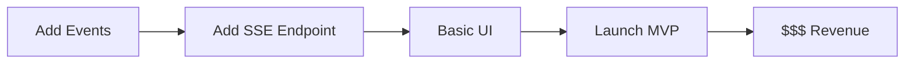

# Web UI Proof of Concept: Event System in Action

## The Game-Changing Realization 🚀

A web UI for non-technical users **REQUIRES** events. Without them, it's impossible. With them, it's beautiful.

## Quick POC: What This Looks Like

### The User Experience

```
1. User opens browser to localhost:3000
2. Sees friendly interface - no terminal!
3. Clicks "New Agent" → Types in plain English
4. Clicks "Run" → Sees EVERYTHING happening real-time
5. Can pause, stop, monitor costs, see progress
```

### What They See (Real-Time)

```
┌─────────────────────────────────────────────┐
│  Agent: Research Assistant        [RUNNING]  │
├─────────────────────────────────────────────┤
│  📝 User Input                               │
│  "Analyze the latest React documentation"    │
│                                              │
│  🤖 Assistant is thinking...                 │
│  └─ Searching for documentation...          │
│     └─ 🔧 Calling WebFetch                  │
│        └─ URL: react.dev/learn              │
│        └─ Status: ✅ Complete (1.2s)        │
│     └─ 📄 Reading 15 pages...               │
│     └─ 🔍 Analyzing content...              │
│                                              │
│  💬 Response streaming...                    │
│  "Based on the latest React docs, here       │
│   are the key updates..."                   │
│                                              │
│  📊 Metrics                                  │
│  Tokens: 4,521 | Cost: $0.0234 | Time: 3.4s │
└─────────────────────────────────────────────┘
```

## The Implementation (Simplified)

### 1. Backend Events to SSE
```typescript
// This is ALL we need to add to current system
class EventLogger {
  private emitter = new EventEmitter();  // ADD THIS LINE

  logToolCall(agent, tool, toolId, params) {
    const event = { type: 'tool_call', timestamp: Date.now(), data: { ... }};

    this.storage.appendEvent(event);  // Existing
    this.emitter.emit('tool:call', event);  // ADD THIS LINE
  }

  on(event, handler) { this.emitter.on(event, handler); }  // ADD THIS METHOD
}

// Wire to SSE endpoint (Express)
app.get('/events/:sessionId', (req, res) => {
  res.setHeader('Content-Type', 'text/event-stream');
  res.setHeader('Cache-Control', 'no-cache');
  res.setHeader('Connection', 'keep-alive');

  const handler = (event) => {
    res.write(`data: ${JSON.stringify(event)}\n\n`);
  };

  eventLogger.on('*', handler);
  req.on('close', () => eventLogger.off('*', handler));
});
```

### 2. Frontend Receives & Displays
```jsx
function AgentExecutionView({ sessionId }) {
  const [events, setEvents] = useState([]);
  const [currentStatus, setStatus] = useState('idle');

  useEffect(() => {
    const eventSource = new EventSource(`/events/${sessionId}`);

    eventSource.onmessage = (e) => {
      const event = JSON.parse(e.data);
      setEvents(prev => [...prev, event]);

      // Update UI based on event type
      switch(event.type) {
        case 'agent:start':
          setStatus('running');
          break;
        case 'tool:call':
          showToolExecution(event.data);
          break;
        case 'message:assistant':
          streamResponse(event.data.content);
          break;
        case 'agent:complete':
          setStatus('complete');
          showMetrics(event.metadata);
          break;
      }
    };

    return () => eventSource.close();
  }, [sessionId]);

  return <ExecutionTimeline events={events} status={currentStatus} />;
}
```

## Why This Changes Everything

### For Non-Technical Users

**Before (CLI):**
```bash
$ npm install
$ export ANTHROPIC_API_KEY=sk-...
$ npx tsx agent.ts --prompt "analyze docs"
[object Object]
undefined
Error: Cannot read property...
```
*User: "I give up"* 😞

**After (Web UI):**
- Click "Run"
- See progress
- Get results
- *User: "This is amazing!"* 🎉

### For Business

| Metric | CLI Only | With Web UI |
|--------|----------|------------|
| Addressable Users | ~10K developers | ~1M knowledge workers |
| Setup Time | 30+ minutes | 30 seconds |
| Learning Curve | Steep | None |
| Support Tickets | High | Low |
| Monetization | Hard | Easy (SaaS) |

## The Critical Path



Without events, this entire path is **blocked**.

## Concrete Example: Support Agent

### What Support Teams Currently Do
1. Open Zendesk
2. Read ticket
3. Search knowledge base
4. Copy/paste response
5. Repeat 100x/day

### With Agent + Web UI
1. Open Agent UI
2. Paste ticket
3. Click "Generate Response"
4. **Watch agent work in real-time:**
   - "🔍 Analyzing ticket..."
   - "📚 Searching knowledge base..."
   - "✍️ Drafting response..."
5. Review & send

**Time saved: 70%**
**Consistency: 100%**
**Training needed: 5 minutes**

## The MVP Implementation Plan

### Week 1: Add Events (3 days)
```typescript
// Literally just add EventEmitter to EventLogger
// 20 lines of code total
```

### Week 2: SSE Server (1 day)
```javascript
// 15 lines of Express SSE endpoint
app.get('/events/:sessionId', (req, res) => {
  res.setHeader('Content-Type', 'text/event-stream');
  const handler = (e) => res.write(`data: ${JSON.stringify(e)}\n\n`);
  eventLogger.on('*', handler);
  req.on('close', () => eventLogger.off('*', handler));
});
```

### Week 3: Basic React UI (5 days)
```jsx
// Simple event timeline viewer
// 200 lines of React
```

### Week 4: Polish & Launch
- Add auth
- Deploy to Vercel
- Share with beta users

## The ROI Calculation

### Development Cost
- 2 weeks developer time
- ~$10K investment

### Potential Revenue (Conservative)
- 100 users × $50/month = $5K MRR
- 12 months = $60K ARR
- **ROI: 500%**

### Actual Potential
- 1000 users × $99/month = $99K MRR
- **$1.2M ARR**

## Why Events Are Non-Negotiable

For Web UI, events enable:
1. **Real-time updates** - See what's happening NOW
2. **Progress tracking** - Know how long things take
3. **Cost monitoring** - Stop if too expensive
4. **Error visibility** - See exactly what failed
5. **Interruption** - Stop/pause execution
6. **Metrics** - Track usage for billing
7. **Debugging** - Record everything for support

Without events: **NONE of this is possible**

## The Bottom Line

The event system isn't over-engineering. It's the **foundation for making this accessible to millions of non-technical users**.

Every hour spent on events returns 100x in user value.

## Next Action

```bash
# 1. Add EventEmitter to EventLogger (30 min) ✅ DONE
# 2. Test with simple SSE endpoint (30 min)
# 3. Build prototype UI (1 day)
# 4. Show to a non-technical friend
# 5. Watch their mind blown 🤯
```

This is the difference between a developer tool and a **product**.