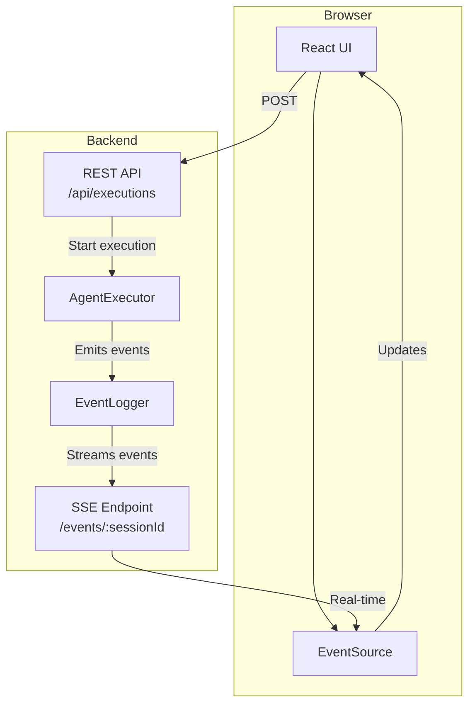

# Web UI Guide

Complete guide to the agent system web interface - from business value to technical integration.

## Table of Contents

**Part 1: Overview & Business Value**
- [Why a Web UI?](#why-a-web-ui)
- [What Users See](#what-users-see)
- [Key Features](#key-features)
- [Target Users & Value](#target-users--value)
- [Implementation Status](#implementation-status)

**Part 2: Technical Architecture**
- [Architecture Overview](#architecture-overview)
- [Backend: Express + SSE](#backend-express--sse)
- [Frontend: React + EventSource](#frontend-react--eventsource)
- [Session Continuity](#session-continuity)

**Part 3: Integration & Development**
- [REST API Reference](#rest-api-reference)
- [SSE Event Streaming](#sse-event-streaming)
- [Development Workflow](#development-workflow)
- [Event Types](#event-types)
- [Custom Integrations](#custom-integrations)

**Part 4: Production & Testing**
- [Testing with Playwright](#testing-with-playwright)
- [Production Considerations](#production-considerations)
- [Next Steps](#next-steps)

---

# Part 1: Overview & Business Value

## Why a Web UI?

A web interface for non-technical users requires real-time updates. Without events, a web UI is impossible. With events, it becomes elegant and powerful.

### The Problem: CLI-Only Limits Adoption

**Before (CLI):**
```bash
$ npm install
$ export ANTHROPIC_API_KEY=sk-...
$ npx tsx agent.ts --prompt "analyze docs"
[object Object]
Error: Cannot read property...
```
*User: "I give up"* 😞

**After (Web UI):**
- Click "Run"
- See progress in real-time
- Get results
- *User: "This is amazing!"* 🎉

### Growth Impact

| Metric | CLI Only | With Web UI |
|--------|----------|-------------|
| Addressable Users | ~10K developers | ~1M knowledge workers |
| Setup Time | 30+ minutes | 30 seconds |
| Learning Curve | Steep | None |
| Support Tickets | High | Low |
| Monetization | Hard | Easy (SaaS) |

## What Users See

```
┌─────────────────────────────────────────────┐
│  Agent: Research Assistant        [RUNNING]  │
├─────────────────────────────────────────────┤
│  📝 User Input                               │
│  "Analyze the latest React documentation"    │
│                                              │
│  🤖 Assistant is thinking...                 │
│  └─ Searching for documentation...          │
│     └─ 🔧 Calling WebFetch                  │
│        └─ URL: react.dev/learn              │
│        └─ Status: ✅ Complete (1.2s)        │
│     └─ 📄 Reading 15 pages...               │
│     └─ 🔍 Analyzing content...              │
│                                              │
│  💬 Response streaming...                    │
│  "Based on the latest React docs, here       │
│   are the key updates..."                   │
│                                              │
│  📊 Metrics                                  │
│  Tokens: 4,521 | Cost: $0.0234 | Time: 3.4s │
└─────────────────────────────────────────────┘
```

## Key Features

### 1. Real-Time Execution Visualization
Users see every step as it happens:
- Agent starts
- Tools are called
- Responses stream in
- Costs accumulate
- Completion status

### 2. Progress Tracking
Visual indicators show:
- Current activity
- Time elapsed
- Resources consumed
- Estimated completion

### 3. Cost Monitoring
Live tracking enables:
- Per-request costs
- Cumulative totals
- Budget limits
- Auto-stop on threshold

### 4. Interactive Controls
Users can:
- Pause execution
- Stop execution
- Resume paused sessions
- Start new sessions

### 5. Multi-Session Support
- Preserve conversation history
- Continue from previous sessions
- View session timeline
- Cache hits save 90% on costs

### 6. Collaborative Viewing
Multiple users can:
- Watch same execution
- Share session links
- Debug together
- Learn from others

## Target Users & Value

### Target Users (Non-Technical)
- **Product Managers** - Run analysis agents
- **Content Writers** - Generate content
- **QA Teams** - Automate testing
- **Business Analysts** - Process data
- **Customer Support** - Automate responses

### Example Use Case: Support Agent

#### Current Process (Manual)
1. Open Zendesk
2. Read ticket
3. Search knowledge base (5-10 min)
4. Draft response (10-15 min)
5. Review and send
6. Repeat 100x/day

**Time per ticket**: 20-30 minutes

#### With Agent + Web UI
1. Open Agent UI
2. Paste ticket
3. Click "Generate Response"
4. **Watch agent work in real-time:**
   - 🔍 Analyzing ticket...
   - 📚 Searching knowledge base...
   - ✍️ Drafting response...
5. Review & send (2 min)

**Time per ticket**: 5 minutes

**Results:**
- **Time saved**: 70%
- **Consistency**: 100%
- **Training needed**: 5 minutes
- **ROI**: Immediate

## Implementation Status

✅ **Completed:**
- EventLogger with EventEmitter
- Event emission for all agent activities
- SSE endpoint for real-time streaming
- React UI with EventSource client
- Session continuity
- Basic event timeline visualization

🚧 **In Progress:**
- Interactive execution controls (pause/stop/resume)
- Agent marketplace/directory

📋 **Planned:**
- Authentication/authorization
- Cost limits and alerts
- Advanced metrics dashboard
- Collaborative features
- Mobile-responsive UI

---

# Part 2: Technical Architecture

## Architecture Overview



### Why SSE Instead of WebSockets?

**SSE Advantages:**
- Simpler protocol (one-way server → client)
- Built into HTTP (no special infrastructure)
- Automatic reconnection in browser
- Works with standard load balancers
- Lower overhead for read-heavy use case

**WebSocket Would Be Better If:**
- We needed bidirectional messaging
- We needed binary data streaming
- We had thousands of events per second

For agent execution streaming, SSE is the perfect fit.

### Multi-Consumer Design

One event stream, many consumers:
- Console logger
- Storage persistence
- Web UI visualization
- Metrics collection
- Custom integrations

### Decoupled Components
- EventLogger doesn't know about consumers
- Consumers can't break execution
- Add/remove subscribers dynamically
- Each subscriber is independent

## Backend: Express + SSE

### Starting the Web Server

**Production Mode (CLI):**
```bash
# Start production web server with CLI
agent serve

# Custom port and host
agent serve --port 8080 --host 0.0.0.0

# Set working directory (agents, logs, file operations)
agent serve --working-dir ~/my-project

# Auto-open browser
agent serve --open

# Combine options
agent serve --working-dir ~/project --port 3001 --open
```

**Development Mode:**
```bash
# From workspace root
npm run dev:web

# Server starts on:
# - Client: http://localhost:3000 (Vite dev server)
# - Server: http://localhost:3001 (Express API + SSE)
```

### Environment Variables

Required in workspace root `.env`:

```bash
ANTHROPIC_API_KEY=sk-ant-...
# or
OPENROUTER_API_KEY=sk-or-...
```

The server loads `.env` from workspace root:

```typescript
import dotenv from 'dotenv';
import { resolve } from 'path';

// Load .env from workspace root (2 levels up from packages/web)
dotenv.config({ path: resolve(process.cwd(), '../../.env') });
```

## Frontend: React + EventSource

### Connecting to SSE

```typescript
// packages/web/client/src/App.tsx
const [events, setEvents] = useState<Event[]>([]);
const [isConnected, setIsConnected] = useState(false);
const eventSourceRef = useRef<EventSource | null>(null);

const handleStart = async () => {
  // 1. Start execution via REST API
  const response = await fetch('/api/executions', {
    method: 'POST',
    headers: { 'Content-Type': 'application/json' },
    body: JSON.stringify({ agentPath, prompt, sessionId })
  });

  const data = await response.json();
  setSessionId(data.sessionId);

  // 2. Connect to SSE stream
  const eventSource = new EventSource(`/events/${data.sessionId}`);
  eventSourceRef.current = eventSource;

  eventSource.onopen = () => {
    console.log('SSE connection opened');
    setIsConnected(true);
  };

  eventSource.onmessage = (e) => {
    const event = JSON.parse(e.data);
    setEvents(prev => [...prev, event]);

    // Handle completion
    if (event.type === 'agent_complete' || event.type === 'agent_error') {
      setIsRunning(false);
    }
  };

  eventSource.onerror = (error) => {
    console.error('SSE error:', error);
    setIsConnected(false);
    setIsRunning(false);
    eventSource.close();
  };
};
```

### Cleanup

```typescript
useEffect(() => {
  return () => {
    if (eventSourceRef.current) {
      eventSourceRef.current.close();
    }
  };
}, []);
```

### Event Timeline Display

```tsx
<div className="event-timeline">
  <h2>Event Timeline ({events.length})</h2>
  <div className="events">
    {events.map((event, i) => (
      <div key={i} className="event">
        <div className="event-header">
          <span className="event-type">{event.type}</span>
          <span className="event-timestamp">
            {new Date(event.timestamp).toLocaleTimeString()}
          </span>
        </div>
        {event.data && (
          <pre className="event-data">
            {JSON.stringify(event.data, null, 2)}
          </pre>
        )}
      </div>
    ))}
  </div>
</div>
```

## Session Continuity

The web UI supports session continuity - you can send multiple prompts to the same session:

```typescript
const handleStart = async () => {
  // Only clear events if starting a new session
  if (!sessionId) {
    setEvents([]);
  }

  const response = await fetch('/api/executions', {
    method: 'POST',
    headers: { 'Content-Type': 'application/json' },
    body: JSON.stringify({
      agentPath,
      prompt,
      sessionId: sessionId || undefined  // Reuse existing session
    })
  });

  // ...
};
```

Benefits:
- Conversation history preserved
- Anthropic prompt caching (90% cost savings on subsequent calls)
- Event timeline shows full session history

---

# Part 3: Integration & Development

## REST API Reference

### Start Execution

```http
POST /api/executions
Content-Type: application/json

{
  "agentPath": "agents/orchestrator.md",
  "prompt": "Analyze the latest React docs",
  "sessionId": "optional-session-id"
}
```

Response:
```json
{
  "sessionId": "session-1234567890",
  "status": "started",
  "message": "Execution started. Connect to /events/:sessionId for real-time updates."
}
```

### Get Execution Status

```http
GET /api/executions/:sessionId
```

Response:
```json
{
  "sessionId": "session-1234567890",
  "status": "active"
}
```

### Control Execution (Placeholder)

```http
POST /api/executions/:sessionId/control
Content-Type: application/json

{
  "action": "pause" | "stop" | "resume"
}
```

Note: Control actions are not yet implemented.

### List Available Agents

```http
GET /api/agents
```

Response:
```json
{
  "agents": [
    { "id": "orchestrator", "path": "agents/orchestrator.md" },
    { "id": "analyzer", "path": "agents/analyzer.md" }
  ]
}
```

## SSE Event Streaming

### Endpoint

```http
GET /events/:sessionId
Accept: text/event-stream
```

### Server Implementation

```typescript
// packages/web/server/src/index.ts
app.get('/events/:sessionId', (req: Request, res: Response) => {
  const { sessionId } = req.params;

  // Set SSE headers
  res.setHeader('Content-Type', 'text/event-stream');
  res.setHeader('Cache-Control', 'no-cache');
  res.setHeader('Connection', 'keep-alive');
  res.setHeader('X-Accel-Buffering', 'no'); // Disable nginx buffering

  // Send initial connection event
  res.write(`data: ${JSON.stringify({
    type: 'connected',
    sessionId,
    timestamp: Date.now()
  })}\n\n`);

  // Get event logger for this session
  const eventLogger = activeSessions.get(sessionId);

  if (!eventLogger) {
    res.write(`data: ${JSON.stringify({
      type: 'error',
      message: 'Session not found. Start an execution first.'
    })}\n\n`);
    return;
  }

  // Subscribe to all events
  const handler = (event: unknown) => {
    try {
      res.write(`data: ${JSON.stringify(event)}\n\n`);
    } catch (error) {
      console.error('Error sending event:', error);
    }
  };

  eventLogger.on('*', handler);

  // Clean up when client disconnects
  req.on('close', () => {
    eventLogger.off('*', handler);
    console.log(`Client disconnected from session ${sessionId}`);
  });
});
```

### Session Management

```typescript
// Store active event loggers by sessionId
const activeSessions = new Map<string, EventLogger>();

// When starting execution:
app.post('/api/executions', async (req, res) => {
  const system = await AgentSystemBuilder.default()
    .withSessionId(sessionId)
    .build();

  // Store event logger for SSE streaming
  activeSessions.set(sessionId, system.eventLogger);

  // Start execution in background (non-blocking)
  system.executor.execute(agentName, prompt)
    .then((result) => console.log('Completed:', result))
    .catch((error) => console.error('Failed:', error));

  // Return immediately
  res.json({ sessionId, status: 'started' });
});
```

## Development Workflow

### Local Development

```bash
# Terminal 1: Start web server (Express + Vite)
npm run dev:web

# Browser: Open http://localhost:3000
# - Client UI served by Vite on :3000
# - API requests proxied to Express on :3001
```

### Quick Start

```bash
# From workspace root
npm run dev:web

# Open browser
http://localhost:3000
```

Try an example:
1. Enter agent path: `agents/orchestrator.md`
2. Enter prompt: `What is 2 + 2?`
3. Click "Start"
4. Watch events stream in real-time

## Event Types

All events from the core event system are streamed to the browser:

### Initial Connection
```json
{
  "type": "connected",
  "sessionId": "session-123",
  "timestamp": 1234567890
}
```

### Agent Start
```json
{
  "type": "agent_start",
  "timestamp": 1234567890,
  "data": {
    "agent": "orchestrator",
    "task": "Analyze React docs"
  }
}
```

### Tool Calls
```json
{
  "type": "tool_call",
  "timestamp": 1234567891,
  "data": {
    "id": "call_abc123",
    "tool": "WebFetch",
    "params": { "url": "https://react.dev" },
    "agent": "orchestrator"
  }
}
```

### Assistant Messages
```json
{
  "type": "assistant",
  "timestamp": 1234567892,
  "data": {
    "role": "assistant",
    "content": "Based on the React docs...",
    "agent": "orchestrator"
  },
  "metadata": {
    "tokens": 1234,
    "cost": 0.0234,
    "model": "claude-3-5-haiku-20241022"
  }
}
```

### Completion
```json
{
  "type": "agent_complete",
  "timestamp": 1234567893,
  "data": {
    "agent": "orchestrator",
    "result": "Analysis complete..."
  }
}
```

## Custom Integrations

### Metrics Dashboard

```typescript
const eventSource = new EventSource(`/events/${sessionId}`);

let totalTokens = 0;
let totalCost = 0;

eventSource.onmessage = (e) => {
  const event = JSON.parse(e.data);

  if (event.metadata?.tokens) {
    totalTokens += event.metadata.tokens;
  }
  if (event.metadata?.cost) {
    totalCost += event.metadata.cost;
  }

  updateDashboard({ totalTokens, totalCost });
};
```

### Progress Tracking

```typescript
const statusMap = {
  'agent_start': 'Starting...',
  'tool_call': 'Executing tools...',
  'assistant': 'Thinking...',
  'agent_complete': 'Complete!'
};

eventSource.onmessage = (e) => {
  const event = JSON.parse(e.data);
  updateProgress(statusMap[event.type] || 'Running...');
};
```

---

# Part 4: Production & Testing

## Testing with Playwright

The web UI can be tested with Playwright (MCP):

```typescript
// Navigate to web UI
await playwright.navigate('http://localhost:3000');

// Fill form
await playwright.type('input[id="agent"]', 'agents/orchestrator.md');
await playwright.type('textarea[id="prompt"]', 'What is 2 + 2?');

// Start execution
await playwright.click('button.start-button');

// Wait for completion
await playwright.waitFor({ text: 'agent_complete' });

// Verify results displayed
const snapshot = await playwright.snapshot();
// Check snapshot contains expected events
```

## Production Considerations

### Scaling SSE

For production deployments:

1. **Use Redis Pub/Sub** for multi-server deployments
2. **Set connection limits** to prevent resource exhaustion
3. **Add authentication** to secure event streams
4. **Implement reconnection** logic in client
5. **Add heartbeat** to detect stale connections

### Error Handling

```typescript
// Client-side reconnection
let reconnectAttempts = 0;
const maxReconnects = 5;

eventSource.onerror = () => {
  if (reconnectAttempts < maxReconnects) {
    setTimeout(() => {
      reconnectAttempts++;
      // Recreate EventSource
      createEventSource(sessionId);
    }, 1000 * reconnectAttempts); // Exponential backoff
  }
};
```

### Production Checklist

- [ ] Add authentication/authorization
- [ ] Set up CORS properly
- [ ] Configure rate limiting
- [ ] Implement connection limits
- [ ] Add monitoring and alerts
- [ ] Set up Redis for multi-server
- [ ] Configure load balancer for SSE
- [ ] Add cost limits per user
- [ ] Implement session timeout
- [ ] Add audit logging

## Next Steps

### Short Term
- Add authentication/authorization
- Implement execution controls (pause/stop/resume)
- Add cost limits and monitoring
- Build agent marketplace

### Medium Term
- Advanced metrics dashboard
- Team collaboration features
- Mobile-responsive UI
- Session history browser

### Long Term
- Multi-tenant hosting
- Enterprise features
- Advanced analytics
- AI-powered insights

## Related Documentation

- [Event System Architecture](./event-system.md) - How events work internally
- [Session Persistence](./session-persistence.md) - Session storage and recovery
- [Architecture Overview](./ARCHITECTURE.md) - Overall system design

---

## Conclusion

The web UI transforms a developer tool into a product that non-technical users can actually use. By leveraging Server-Sent Events for real-time streaming, we enable:

- **10K developers → 1M+ potential users**
- **CLI complexity → Click and run simplicity**
- **Developer tool → Production SaaS**
- **Single user → Team collaboration**

Events aren't over-engineering—they're the foundation for accessibility and real-time user experience.
