# Werewolf Game Flow

Based on the official game script from Werewolf-Script.txt

## State Diagram

```mermaid
stateDiagram-v2
    [*] --> GameStart: Deal cards & explain rules
    
    GameStart --> FirstNight: Only once
    
    state FirstNight {
        [*] --> Cupid
        Cupid --> TapLovers: Select two lovers
        TapLovers --> LoversRecognize: Lovers see each other
        LoversRecognize --> [*]
    }
    
    FirstNight --> NightPhase
    
    state NightPhase {
        [*] --> Defender
        Defender --> DefenderChoose: Choose villager to defend
        DefenderChoose --> Werewolves: (Can't defend same person twice)
        
        Werewolves --> WerewolvesRecognize: Open eyes
        WerewolvesRecognize --> WerewolvesKill: Pick victim
        WerewolvesKill --> CheckNurse
        
        CheckNurse --> NurseDecision: Nurse alive & hasn't used power?
        CheckNurse --> SkipNurse: Nurse dead or used power
        NurseDecision --> ShowVictimToNurse: Show who was killed
        ShowVictimToNurse --> NurseSave: Save? (once per game)
        NurseSave --> CheckWitch
        SkipNurse --> CheckWitch
        
        CheckWitch --> WitchDecision: Witch alive & has potions?
        CheckWitch --> SkipWitch: Witch dead or no potions
        WitchDecision --> ShowVictimToWitch: Show who was killed
        ShowVictimToWitch --> WitchLifePotion: Use life potion? (once per game)
        WitchLifePotion --> WitchDeathPotion: Use death potion? (once per game)
        WitchDeathPotion --> CheckSeer
        SkipWitch --> CheckSeer
        
        CheckSeer --> SeerInvestigate: Seer alive?
        CheckSeer --> SkipSeer: Seer dead
        SeerInvestigate --> SeerResult: Choose player to investigate
        SeerResult --> [*]: Show thumbs up/down
        SkipSeer --> [*]
    }
    
    NightPhase --> ResolveDeaths: Calculate who died
    
    state ResolveDeaths {
        [*] --> CheckDefended
        CheckDefended --> Saved: Victim was defended
        CheckDefended --> CheckNurseSave: Not defended
        CheckNurseSave --> Saved: Nurse saved victim
        CheckNurseSave --> CheckWitchSave: Nurse didn't save
        CheckWitchSave --> Saved: Witch used life potion
        CheckWitchSave --> Dead: No one saved victim
        
        Saved --> CheckWitchKill
        Dead --> CheckWitchKill
        
        CheckWitchKill --> AddWitchVictim: Witch used death potion
        CheckWitchKill --> CheckLovers: No death potion used
        AddWitchVictim --> CheckLovers
        
        CheckLovers --> BothLoversDie: One lover died?
        CheckLovers --> [*]: No lovers died
        BothLoversDie --> [*]: Both lovers die together
    }
    
    ResolveDeaths --> DayPhase: Morning arrives
    
    state DayPhase {
        [*] --> AnnounceDeath
        AnnounceDeath --> VillageDebate: "Everyone wakes up except..."
        
        VillageDebate --> CountdownVote: Debate who to lynch
        VillageDebate --> ScapegoatDies: Day takes too long
        
        CountdownVote --> Lynch: "3, 2, 1, point!"
        Lynch --> CheckLynchedLovers: Most fingers = lynched
        ScapegoatDies --> CheckLynchedLovers: Scapegoat killed by GM
        
        CheckLynchedLovers --> BothLoversDieLynch: Lynched a lover?
        CheckLynchedLovers --> [*]: Normal lynch
        BothLoversDieLynch --> [*]: Both lovers die
    }
    
    DayPhase --> CheckWinCondition
    
    CheckWinCondition --> WerewolvesWin: Werewolves >= Villagers
    CheckWinCondition --> VillagersWin: All werewolves dead
    CheckWinCondition --> LoversWin: Only lovers remain
    CheckWinCondition --> NightPhase: Game continues
    
    WerewolvesWin --> [*]: "Werewolves win!"
    VillagersWin --> [*]: "Villagers win!"
    LoversWin --> [*]: "Love conquers all!"
```

## Night Order (Per Official Script)

1. **Cupid** (First night only) - Selects two lovers
2. **Defender** - Chooses someone to protect (can't protect same person twice in a row)
3. **Werewolves** - Choose victim to kill
4. **Nurse** - Shown victim, can save (once per game)
5. **Witch** - Shown victim, can use life potion OR death potion (each once per game)
6. **Seer** - Investigates one player (thumbs up = villager, thumbs down = werewolf)

## Key Rules from Script

### Death Resolution
- If Defender protected the victim → Victim survives
- If Nurse saves the victim → Victim survives (Nurse can only do this once)
- If Witch uses life potion → Victim survives (once per game)
- If Witch uses death potion → Additional person dies (once per game)
- If a Lover dies → Both lovers die together

### Day Phase
- GM announces who died (with narrative flair)
- Villagers debate and discuss
- On count of 3, everyone points at who to lynch
- Most fingers pointed = lynched
- If day takes too long, Scapegoat dies (GM decision)

### Win Conditions
- **Werewolves win**: When werewolves equal or outnumber villagers
- **Villagers win**: When all werewolves are eliminated
- **Lovers win**: If both lovers are the last survivors (rare)

## Important Notes

1. **Dead players never act**: Once killed, they cannot use abilities, vote, or speak
2. **Information management**: Players must be careful not to give away their role through sounds/movement
3. **Thumbs communication**: Thumbs up = villager/good, Thumbs down = werewolf/bad
4. **One-time abilities**: Nurse save, Witch's potions are single-use per game
5. **Defender restriction**: Cannot defend the same person two nights in a row