# Werewolf Game - Complete Guide & Multi-Agent Example

## Game Introduction

"You're in this village in which some people are Werewolves. Every 'night' you guys close your eyes. The people who are Werewolves open their eyes and secretly pick someone to bite. Everyone opens their eyes and I tell you who died.

"What happens then is that the Villagers have to figure out who amongst them is actually a Werewolf. You guys debate for a while, then on the count of three everyone points at who they think should be Lynched.

"Whoever has the most fingers pointed at them gets Lynched. Of course, the Villagers can end up lynching innocents instead of Werewolves. Whatever happens, you close your eyes again and the Werewolves pick another victim. The Werewolves want to kill all the Villagers before the Villagers can lynch them.

"Don't worry too much if you don't understand what your card says: I'll explain what each card does as we go along. Because of that, though, the first night takes a long time, so I'll try to let you guys take a break and open your eyes as often as I can.

"BE CAREFUL about accidentally giving away who you are. Even though people have their eyes closed, they're listening for signs that you're squirming around - or even suddenly silent - when I call you"

## What This Demonstrates

1. **Multi-Agent Coordination**: Different agents playing different roles
2. **Role-Based Behavior**: Each agent acts according to their role's goals
3. **No Tools Required**: Pure agent decision-making and reasoning
4. **Game State Management**: Tracking players, phases, and special abilities
5. **Strategic Thinking**: Agents make decisions based on game theory
6. **Information Asymmetry**: Different agents have different information
7. **Strategic Communication**: Agents must balance sharing info vs. staying hidden
8. **Dynamic Gameplay**: Each agent's response affects the game state

## The Agents & Roles

### Game Master (`game-master.md`)
- Coordinates game flow
- Narrates deaths dramatically  
- Manages night/day phases
- Determines win conditions

### Werewolf (`werewolf.md`)
- Secretly eliminates villagers at night
- Pretends to be innocent during the day
- Deflects suspicion onto others
- Coordinates with other werewolves

### Villager (`villager.md`)
- Analyzes behavior patterns
- Votes to eliminate suspected werewolves
- Builds alliances with trusted players
- Uses deduction and logic

### Seer (`seer.md`)
- Investigates one player each night
- Learns if they are werewolf or innocent
- Must share knowledge carefully to avoid becoming a target
- Guides village discussion with subtle hints

### Witch (`witch.md`)
- Has one-time life potion to save victims
- Has one-time death potion to eliminate suspects
- Must use powers strategically

### Additional Roles (for extended games)

#### Cupid
- Selects two lovers on the first night only
- Lovers die together if one is killed

#### Defender
- Protects one villager each night
- Cannot protect the same person two nights in a row

#### Nurse
- Can save the werewolf victim once per game
- Must decide immediately when shown the victim

## Game Flow & State Machine

```mermaid
stateDiagram-v2
    [*] --> GameStart: Deal cards & explain rules
    
    GameStart --> FirstNight: Only once
    
    state FirstNight {
        [*] --> Cupid
        Cupid --> TapLovers: Select two lovers
        TapLovers --> LoversRecognize: Lovers see each other
        LoversRecognize --> [*]
    }
    
    FirstNight --> NightPhase
    
    state NightPhase {
        [*] --> Defender
        Defender --> DefenderChoose: Choose villager to defend
        DefenderChoose --> Werewolves: (Can't defend same person twice)
        
        Werewolves --> WerewolvesRecognize: Open eyes
        WerewolvesRecognize --> WerewolvesKill: Pick victim
        WerewolvesKill --> CheckNurse
        
        CheckNurse --> NurseDecision: Nurse alive & hasn't used power?
        CheckNurse --> SkipNurse: Nurse dead or used power
        NurseDecision --> ShowVictimToNurse: Show who was killed
        ShowVictimToNurse --> NurseSave: Save? (once per game)
        NurseSave --> CheckWitch
        SkipNurse --> CheckWitch
        
        CheckWitch --> WitchDecision: Witch alive & has potions?
        CheckWitch --> SkipWitch: Witch dead or no potions
        WitchDecision --> ShowVictimToWitch: Show who was killed
        ShowVictimToWitch --> WitchLifePotion: Use life potion? (once per game)
        WitchLifePotion --> WitchDeathPotion: Use death potion? (once per game)
        WitchDeathPotion --> CheckSeer
        SkipWitch --> CheckSeer
        
        CheckSeer --> SeerInvestigate: Seer alive?
        CheckSeer --> SkipSeer: Seer dead
        SeerInvestigate --> SeerResult: Choose player to investigate
        SeerResult --> [*]: Show thumbs up/down
        SkipSeer --> [*]
    }
    
    NightPhase --> ResolveDeaths: Calculate who died
    
    state ResolveDeaths {
        [*] --> CheckDefended
        CheckDefended --> Saved: Victim was defended
        CheckDefended --> CheckNurseSave: Not defended
        CheckNurseSave --> Saved: Nurse saved victim
        CheckNurseSave --> CheckWitchSave: Nurse didn't save
        CheckWitchSave --> Saved: Witch used life potion
        CheckWitchSave --> Dead: No one saved victim
        
        Saved --> CheckWitchKill
        Dead --> CheckWitchKill
        
        CheckWitchKill --> AddWitchVictim: Witch used death potion
        CheckWitchKill --> CheckLovers: No death potion used
        AddWitchVictim --> CheckLovers
        
        CheckLovers --> BothLoversDie: One lover died?
        CheckLovers --> [*]: No lovers died
        BothLoversDie --> [*]: Both lovers die together
    }
    
    ResolveDeaths --> DayPhase: Morning arrives
    
    state DayPhase {
        [*] --> AnnounceDeath
        AnnounceDeath --> VillageDebate: "Everyone wakes up except..."
        
        VillageDebate --> CountdownVote: Debate who to lynch
        VillageDebate --> ScapegoatDies: Day takes too long
        
        CountdownVote --> Lynch: "3, 2, 1, point!"
        Lynch --> CheckLynchedLovers: Most fingers = lynched
        ScapegoatDies --> CheckLynchedLovers: Scapegoat killed by GM
        
        CheckLynchedLovers --> BothLoversDieLynch: Lynched a lover?
        CheckLynchedLovers --> [*]: Normal lynch
        BothLoversDieLynch --> [*]: Both lovers die
    }
    
    DayPhase --> CheckWinCondition
    
    CheckWinCondition --> WerewolvesWin: Werewolves >= Villagers
    CheckWinCondition --> VillagersWin: All werewolves dead
    CheckWinCondition --> LoversWin: Only lovers remain
    CheckWinCondition --> NightPhase: Game continues
    
    WerewolvesWin --> [*]: "Werewolves win!"
    VillagersWin --> [*]: "Villagers win!"
    LoversWin --> [*]: "Love conquers all!"
```



## Night Order & Game Master Script

### Setup Phase
"Ok, so if - and ONLY if - you have the 'BLAH BLAH' card, open your eyes."
"If your hand was grabbed, open your eyes and recognise who the other BLAH BLAHs are".

### First Night Only
"Night is falling in the village. Everyone is going to sleep. Shut your eyes and don't peek"
*Make sure everyone has their eyes shut.*

"Cupid open your eyes and select two people you want to be lovers."
"Cupid, close your eyes"
"Now I will go around and tap the lovers. Both will open their eyes and show each other their identity: thumbs up = villager, thumbs down = werewolf".

### Every Night (In Order)

1. **Defender**
   - "Defender, open your eyes"
   - "Defender choose one villager to defend tonight. Remember, you can't defend the same person you defended last night."
   - *The defender chooses who to defend from werewolves.*
   - "Defender, close your eyes"

2. **Werewolves**
   - "Werewolves, open your eyes"
   - "Werewolves, make sure you know who the other werewolves are"
   - "Werewolves, pick someone to be tonight's victim"
   - *Make sure you know who the victim is, by pointing and getting confirmation.*
   - "Werewolves, close your eyes"

3. **Nurse**
   - "Nurse, open your eyes"
   - "Nurse, I will show you who was killed tonight."
   - "Remember you can do this only once throughout the game."
   - "Do you want to save the victim?"
   - *Make sure you know who they are indicating, then either nod and give a thumbs up, or shake your head and give a thumbs down.*
   - "Nurse, close your eyes"

4. **Witch**
   - "Witch, open your eyes"
   - "Remember you can use each of your potions only once in a game."
   - "Witch, I will show you who was killed tonight."
   - "Do you want to save the victim with your life potion?"
   - "Witch, who do you want to kill with your death potion?"
   - *Make sure you know who they are indicating, then either nod and give a thumbs up, or shake your head and give a thumbs down.*
   - "Witch, close your eyes"

5. **Seer**
   - "Seer, open your eyes"
   - "Seer, who would you like to know about"
   - *Make sure you know who they are indicating, then either nod and give a thumbs up (villager), or shake your head and give a thumbs down (werewolf).*
   - "Seer, close your eyes"

### Day Phase Script

"OK, Morning arrives, and everyone wakes up. Everyone, except ..."
*(Feel free to embellish the narrative with a weather report & maybe a description of the body)*

"Villagers, it is your job to discover who has murdered poor ... and take revenge. You have until nightfall to choose someone to lynch"

If the day takes too long & the Villagers can't decide:
"Okay! This day is over. I'm killing the Scapegoat!"

## Key Game Rules

### Death Resolution
- If Defender protected the victim → Victim survives
- If Nurse saves the victim → Victim survives (Nurse can only do this once)
- If Witch uses life potion → Victim survives (once per game)
- If Witch uses death potion → Additional person dies (once per game)
- If a Lover dies → Both lovers die together

### Day Phase Voting
- GM announces who died (with narrative flair)
- Villagers debate and discuss
- On count of 3, everyone points at who to lynch
- Most fingers pointed = lynched
- If day takes too long, Scapegoat dies (GM decision)

### Win Conditions
- **Werewolves win**: When werewolves equal or outnumber villagers
- **Villagers win**: When all werewolves are eliminated
- **Lovers win**: If both lovers are the last survivors (rare)

### Important Rules
1. **Dead players never act**: Once killed, they cannot use abilities, vote, or speak
2. **Information management**: Players must be careful not to give away their role through sounds/movement
3. **Thumbs communication**: Thumbs up = villager/good, Thumbs down = werewolf/bad
4. **One-time abilities**: Nurse save, Witch's potions are single-use per game
5. **Defender restriction**: Cannot defend the same person two nights in a row

## Running the Multi-Agent Example

This example simulates one round of the game with agents playing each role.

### Quick Start
```bash
npm run example:werewolf
```

Or directly:
```bash
npx tsx examples/06-werewolf-game.ts
```

### How the Example Works

The example simulates one game round:

1. **Night Phase**:
   - Werewolves choose a victim
   - Seer investigates a player
   - Other roles would act (simplified in demo)

2. **Day Phase**:
   - Game Master announces the death
   - Players discuss and share suspicions
   - Village votes to lynch someone
   - Check win conditions

## Architecture Benefits

This example showcases how the agent orchestration system can handle:
- Complex multi-agent scenarios without external tools
- Role-based behavior patterns
- Stateful game management
- Strategic decision-making
- Natural language interaction

The middleware pipeline ensures each agent interaction is safe and controlled, while the pull architecture allows agents to act independently within their roles.

## Extending the Example

To create a full game implementation, you could:

1. Add more roles (Hunter, Cupid as agents, etc.)
2. Implement full game loops until win condition
3. Add more sophisticated voting mechanics
4. Track and use player history for decisions
5. Implement private communication channels
6. Add tournament mode with multiple games
7. Create a visual interface for the game state
8. Add player profiles with strategy preferences
9. Implement difficulty levels for agent intelligence
10. Create variations like "One Night Ultimate Werewolf"