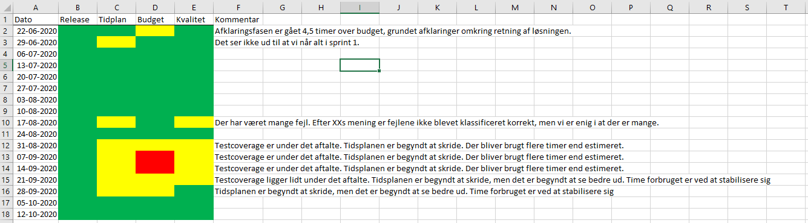
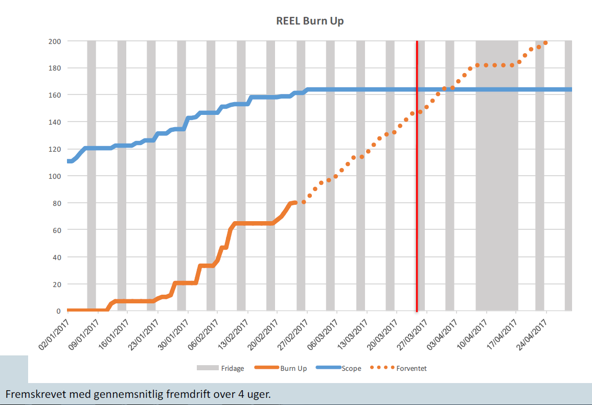

# Delaftale 1 (Vedligehold og videreudvikling)

Bilag 5 Krav til rapportering

## Indhold

[1	Indledning	4](.)

[1.1	Målgruppe	4](.)

[2	Timerapportering	4](.)

[2.1	Frekvens	4](.)

[2.2	Form	4](.)

[2.3	Indhold	4](.)

[2.3.1	Statusoverblik	4](.)

[2.3.2	Burn up for hele projektet/nyudvikling i produktenheden	5](.)

[2.3.3	Forbrugte timer	5](.)

[2.3.4	Antal fakturerede timer pr. måned	5](.)

[2.3.5	Forbrugte timer pr. konsulent pr. uge	5](.)

[2.3.6	Forbrugte timer pr. aktivitet pr. uge	6](.)

[2.3.7	Forbrugte timer pr. konsulent	6](.)

[2.4	Registrering af tidsforbrug	7](.)

[3	Sprintrapport	7](.)

[3.1	Frekvens	7](.)

[3.2	Form	7](.)

[3.3	Indhold	8](.)

[3.3.1	Periodeangivelse for Sprintets varighed	8](.)

[3.3.2	Status for Sprintet	8](.)

[3.3.3	Leverandørtimer i Sprintet	8](.)

[3.3.4	Burn down graf	8](.)

[3.3.5	Oversigt over uafsluttede User Stories i Sprintet	8](.)

[3.3.6	Oversigt over samtlige Sprints i tabelform	8](.)

[4	Release notes	9](.)

[4.1	Frekvens	9](.)

[4.2	Form	9](.)

[4.3	Indhold	9](.)

[4.3.1	Versionsnummer og dato for softwarepakker	9](.)

[4.3.2	Oversigt over release notens indhold	9](.)

[5	Testrapport	9](.)

[5.1	Frekvens	9](.)

[5.2	Form	9](.)

[6	Rapportering til styregruppen	9](.)

[6.1	Frekvens	9](.)

[6.2	Form	10](.)

[6.3	Indhold	10](.)

## 1 Indledning

Nærværende bilag angiver de gældende krav for rapportering til Kunden. Krav til rapportering er en aftale mellem Kunden og Leverandøren vedr. den rapportering på tidsforbrug og fremdrift, som er aftalt i projektet. Nærværende bilag dækker udviklingsydelser. For så vidt angår vedligeholdelsesydelser anvendes Bilag 6 Service Level Agreement (SLA).

### 1.1 Målgruppe

Målgruppen for dette dokument er fortrinsvist projektets projektledere fra såvel Kundens som Leverandørens organisation.

## 2 Timerapportering

Der skal rapporteres til Kundens projektleder om forbrugt tid og estimeret ”time to completion” for opgaven/projektet. Rapporten skal indeholde det af Kunden oplyste specifikke ydelsesnummer og underopdeles som beskrevet nedenfor.

### 2.1 Frekvens

Fremsendes hver mandag til Kundens projektleder.

### 2.2 Form

Timerapporteringen skal sendes som et regneark indeholdende flere faner med indhold, som det er beskrevet nedenfor.

### 2.3 Indhold

Regnearket skal indeholde flere faner med følgende indhold:

#### 2.3.1 Statusoverblik

En rød, gul, grøn indikation for nedenstående områder. Følgende gælder for farvenotationen: Grøn: Følger planen, Gul: Små afvigelser og Rød: Ændring krævet.

- Release
- Tidsplan
- Budget
- Kvalitet

Et eksempel på fanen, Statusoverblik, i det fremsendte regneark kan ses herunder.

#### 2.3.2 Burn up for hele projektet/nyudvikling i produktenheden

En oversigt der viser scope, forbrug og forventet slutresultat ud fra fremskrivning af story points og Sprints i forhold til deadline i tidsplanen.

#### 2.3.3 Forbrugte timer

En fane med forbrugte timer i forhold til estimerede timer og restestimat (estimated time to completion) samt procent af forbrug.

Hvis den indgående aftale er en time/materiel, skal rapporteringen indeholde en fane med forbrugte timer i forhold til estimerede timer og antal tilbageværende timer i timeboksen samt procent af forbrug.

#### 2.3.4 Antal fakturerede timer pr. måned

En fane med angivelse af hvor mange timer, der faktureres pr. måned, tilhørende fakturanummer.

| Måned   | Antal Timer   |   Fakturanummer |
|---------|---------------|-----------------|
| jan-17  | 745,25        |            5887 |

#### 2.3.5 Forbrugte timer pr. konsulent pr. uge

En fane med angivelse af hvor mange timer, hver enkelt konsulent har arbejdet pr. uge og en total for alle uger. Alle data forbliver i regnearket, så der er historik på erlagte timer pr. uge pr. konsulent.

| Sum of Timer   |                         |                         |            |
|----------------|-------------------------|-------------------------|------------|
| Rækkenavne     | 17/04/2017 - 23/04/2017 | 24/04/2017 - 30/04/2017 | Hovedtotal |
| Konsulent A    | 24,50                   | 10,00                   | 34,50      |
| Konsulent B    | 13,00                   | 17,00                   | 30,00      |
| Konsulent C    | 21,00                   | 16,00                   | 37,00      |
| Konsulent D    |                         | 0,50                    | 0,50       |
| Konsulent E    | 28,25                   | 11,75                   | 40,00      |
| Konsulent F    |                         | 3,50                    | 3,50       |
| Hovedtotal     | 86,75                   | 58,75                   | 145,50     |
|                |                         |                         |            |

#### 2.3.6 Forbrugte timer pr. aktivitet pr. uge

En fane med angivelse af hvor mange timer, der er erlagt på de forskellige arbejdsopgaver fordelt pr. uge og en total for alle uger.

Der konteres på de aktiviteter, der er aftalt med Kundens projektleder – se under Registrering af tidsforbrug.

| Sum of Timer       |                         |                         |             |     |     |     |     |     |     |
|--------------------|-------------------------|-------------------------|-------------|-----|-----|-----|-----|-----|-----|
| Row Labels         | 17/04/2017 - 23/04/2017 | 24/04/2017 - 30/04/2017 | Grand Total |     |     |     |     |     |     |
| Projektledelse     | 2,00                    | 0,50                    | 2,50        |     |     |     |     |     |     |
| Sprint planning    | 2,50                    |                         | 2,50        |     |     |     |     |     |     |
| Udvikling og Test  | 70,75                   | 14,25                   | 85,00       |     |     |     |     |     |     |
| Sprint Review      |                         | 10,00                   | 10,00       |     |     |     |     |     |     |
| Backlog Refinement | 1,50                    | 5,00                    | 6,50        |     |     |     |     |     |     |
| Retrospective      |                         | 10,00                   | 10,00       |     |     |     |     |     |     |
| Fejlrettelser      | 1,75                    | 8,25                    | 10,00       |     |     |     |     |     |     |
| Automatiseret test | 4,00                    | 1                       | 5,00        |     |     |     |     |     |     |
| Prøveforløb        |                         | 7,50                    | 7,50        |     |     |     |     |     |     |
| Hovedtotal         | 82,50                   | 56,50                   | 139,00      |     |     |     |     |     |     |

#### 2.3.7 Forbrugte timer pr. konsulent

En fane med timer pr. konsulent pr. dag. I regnearket skal forbrugte timer pr. konsulent indeholde samtlige registreringer for hele opgavens eller projektets levetid. Det skal ikke kun være for den foregående uge.

| Opgave            | Konsulent   | Dato       | Timer   |
|-------------------|-------------|------------|---------|
| Sprint planning   | X           | 01.01.2017 | 0,5     |
| Udvikling         | X           | 02.01.2017 | 1,5     |
| Udvikling         | Y           | 02.01.2017 | 2,5     |
| Sprint planning   | Y           | 02.01.2017 | 4       |
| Udvikling         | Z           | 02.01.2017 | 4       |
| Sprint planning   | A           | 02.01.2017 | 4       |
| Sprint planning   | B           | 02.01.2017 | 4       |
| Udvikling         | B           | 02.01.2017 | 4       |
| Sprint planning   | Z           | 02.01.2017 | 4,5     |
| Projektledelse    | C           | 02.01.2017 | 6,5     |
| Sprint Review     | D           | 03.01.2017 | 0,25    |
| Test              | E           | 03.01.2017 | 0,25    |
| Udvikling og Test | A           | 03.01.2017 | 0,5     |

### 2.4 Registrering af tidsforbrug

Der skal konteres som minimum på nedenstående aktiviteter, som alle er obligatoriske:

- Projektledelse
- Udvikling inkl. Daily scrum
- Code review + tilrettelser efter review + Dokumentation
- Udarbejdelse af testecases, manuel test, testdata og gentest efter fejlrettelser
- Automatiseret test, udarbejdelse og udførelse
- Sprint planning
- Backlog refinement
- Sprint review
- Retrospective
- Fejlrettelser
- Fabriksprøve
- Overtagelsesprøve

Herudover kan der i projektet eller produktenheden aftales, at der konteres på yderligere aktiviteter alt efter opgavens art og indhold. Kunden kan løbende bede om yderligere kontering f.eks. ved ændringer. Nedenstående viser eksempler på yderligere aktiviteter:

- Migrering
- Brugervenlighedstest
- Afklaringsfase: Kick off
- Afklaringsfase: Arkitekturafklaring
- Afklaringsfase: Procesafklaring
- Afklaringsfase: POC
- Afklaringsfase: Forretningsafklaring
- Afklaringsfase: UX
- Afklaringsfase: Test
- Drift: Support
- Ændring 01

## 3 Sprintrapport

Senest 3 dage efter afslutning af et Sprint rapporteres på indholdet af Sprintet i form af en sprintrapport.

### 3.1 Frekvens

Fremsendes senest 3 dage efter afslutning af et Sprint til Kundens projektleder.

### 3.2 Form

Rapporten arkiveres på projektsitet i Confluence under hvert Sprint i fil-form for at sikre, at historikken på User Stories er statisk i rapporten. Kundens projektleder og testansvarlig adviseres om dette.

### 3.3 Indhold

#### 3.3.1 Periodeangivelse for Sprintets varighed

Sprintnavn eller sprintnummer, start og slutdato for Sprintet angives.

#### 3.3.2 Status for Sprintet

Prosa omhandlende beskrivelse af sprintets forløb med eventuelle udfordringer, fravær på teamet, angivelse af hvor mange story points, der blev taget ind i Sprintet, afsluttet eller overført samt beregning af fremdrift i Sprintet i story points.

#### 3.3.3 Leverandørtimer i Sprintet

Oversigt over brugte timer i Sprintet i tabelform inkl. en total for forbrugte timer i Sprintet fordelt på de aktiviteter, der er aftalt i produktenheden eller projektet, jf. 2.4 Registrering af tidsforbrug.

Eksempel:

| Aktivitet                                |   Antal timer |
|------------------------------------------|---------------|
| Projektledelse                           |            25 |
| Udvikling inkl. daily scrum              |           410 |
| Code review og tilrettelser efter review |            30 |
| Total                                    |           465 |

#### 3.3.4 Burn down graf

Burn down graf for Sprintet. Der skal dermed dagligt foretages restestimering på User Storien og registrering af dette i Kundens samarbejdsværktøjer.

#### 3.3.5 Oversigt over uafsluttede User Stories i Sprintet

Der vises en oversigt over uafsluttede User Stories med link til Kundens samarbejdsværktøj, Jira, og følgende oplysninger:
Jiranummer, Overskrift, prioritet, status, resolution, resolved dato og story points.

#### 3.3.6 Oversigt over samtlige Sprints i tabelform

Med følgende oplysninger:

|                                    | Sprint 1                                        | Sprint 2                                        | Sprint N…                                       |
|------------------------------------|-------------------------------------------------|-------------------------------------------------|-------------------------------------------------|
| Samlet scope i story points        | <antal samlede story points for Leverancen>     | <antal samlede story points for Leverancen>     | <antal samlede story points for Leverancen>     |
| Story points i Ssprintet           | <antal story pointes>                           | <antal story pointes>                           | <antal story pointes>                           |
| Story points realiseret i Sprintet | <antal samlede story points leveret i Sprintet> | <antal samlede story points leveret i Sprintet> | <antal samlede story points leveret i Sprintet> |
| I alt done                         | <akkumuleret sum af realiserede User Stories>   | <akkumuleret sum af realiserede User Stories>   | <akkumuleret sum af realiserede User Stories>   |

## 4 Release notes

Senest 3 dage efter afslutning af et Sprint udarbejdes en release, der dokumenteres med release notes.

### 4.1 Frekvens

Senest 3 dage efter afslutning af et Sprint.

### 4.2 Form

Rapporten arkiveres på projektsitet i Confluence under hvert Sprint, og Kundens projektleder og testansvarlig adviseres om dette.

### 4.3 Indhold

#### 4.3.1 Versionsnummer og dato for softwarepakker

Det angives hvilken version af koden, der er udarbejdet i de forskellige pakker.

#### 4.3.2 Oversigt over release notens indhold

For hver release inkluderes en oversigt over de opgaver (User Stories, improvements, Fejl mv.), som er med i releasen med følgende informationer i klikbar form:

- Jiranummer
- Tekst
- Type
- Prioritet
- Status

## 5 Testrapport

Efter afslutning af et Sprint laves en testrapport.

### 5.1 Frekvens

Senest 3 dage efter afslutning af et Sprint.

### 5.2 Form

Rapporten arkiveres på projektsitet i Confluence under hvert Sprint, og Kundens projektleder og testansvarlig adviseres om dette. Link til testrapporten indsættes i sprintrapporten.

## 6 Rapportering til styregruppen

Til brug for styregruppemøderne med Leverandøren skal der udarbejdes statusmateriale fra Leverandørens side.

### 6.1 Frekvens

Fremsendes mindst 3 dage før styregruppemødet til Kundens projektleder og gennemgås på et projektledermøde forud for styregruppemødet. Styregruppen skal have materialet mindst 2 dage før styregruppemødet.

### 6.2 Form

PowerPoint slides med nedenstående indhold.

### 6.3 Indhold

For hvert af nedenstående punkter (2-9) angives rød, gul, grøn indikation for status med følgende samt en samlet opsummering af farvemarkeringerne på sidste slide. Farvemarkering angiver:

- Grøn: Kræver ikke handling fra styregruppen
- Gul: Kræver opmærksomhed og diskussion i styregruppen og efterfølgende bevågenhed
- Rød: Kræver handling fra styregruppen

**Agenda**

1. Godkendelse af referat fra forrige møde

2. Generel Status fra Leverandør og fra Kunden

Her forventes en kort status i prosaform fra projektleder, hvor der bliver lagt vægt på:

- Hvordan er det gået indtil nu?

- Væsentlige udfordringer?

- Andet?

3. Fremdrift herunder burn up

Det kan være:

- Samme tabel som v. punkt 5.3.6 (Oversigt over samtlige Sprints i tabelform) ovenfor.

- Fremdrift på klargøring til kommende Sprints.

- Overordnet tidsplan herunder opnåede milepæle.

- faktisk fremdrift sammenholdt med planlagt.

4. Økonomi

Fremdrift økonomi f.eks. forbrugte timer i alt vs. estimeret timer sammenholdt med fremdrift på tid.

5. Ressourcer / Organisation / Samarbejde

-Information om relevante ressource-udfordringer, ændringer og det daglige samarbejde.

6. Ændringer

-Oversigt over de fem eller ti seneste godkendte ændringer.

-Ændringer i pipeline herunder status.

-Aktuelle ændringer til styregruppens godkendelse.

7. Risici

Præsentation af de fem eller ti højest scorende risici ud fra sandsynlighed og konsekvens.

8. Kvalitet

-Antal af åbne Fejl samt grænser for antal Fejl. Med angivelse af grøn, eller rød alt efter om grænserne overholdes eller ej.

-Kodekvaliteten

-Line-/branch coverage

9. Andet