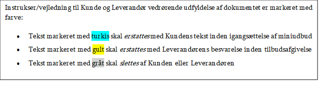

Persondataunderretning

PLEJ/PPRAM og TUFF

## Indhold

[1	Indledning	3](.)

[2	Erklæring om underretning om behandling af personoplysninger i forbindelse med udbud	3](.)

[3	Information til tilbudsgiveren	3](.)

[4	Underretning om behandling af personoplysninger i forbindelse med udbud	4](.)

[4.1	Dine rettigheder	4](.)

[4.2	Klage	5](.)

[4.3	Love og regler	5](.)

## 1 

## 2 Indledning

Dette bilag indeholder en erklæring om underretning om behandling af personoplysninger i forbindelse med miniudbud under Erhvervsstyrelsens It-rammeaftale 2024-2028.

Der skal kun udfyldes én erklæring pr. miniudbud.

## 3 Erklæring om underretning om behandling af personoplysninger i forbindelse med udbud

Navn på tilbudsgiver: [angiv navn på tilbudsgiver]

Ved min underskrift erklærer jeg, at jeg på ordregivers vegne har meddelt *samtlige* personer, hvis personoplysninger indgår i tilbudsmaterialet, oplysningerne i punkt 4 Underretning om behandling af personoplysninger i forbindelse med miniudbud.

\_\_\_\_\_\_\_\_\_\_\_\_\_\_\_\_\_\_\_\_\_\_\_\_\_\_\_\_\_\_\_\_\_\_  \_\_\_\_\_\_\_\_\_\_\_\_\_\_\_\_\_\_\_\_\_\_\_\_\_\_\_\_\_\_\_\_\_\_\_\_\_\_\_\_

Dato	  		Land og by

\_\_\_\_\_\_\_\_\_\_\_\_\_\_\_\_\_\_\_\_\_\_\_\_\_\_\_\_\_\_\_\_\_\_	 \_\_\_\_\_\_\_\_\_\_\_\_\_\_\_\_\_\_\_\_\_\_\_\_\_\_\_\_\_\_\_\_\_\_\_\_\_\_\_\_

Navn på underskriver (med blokbogstaver) Underskrift

## 4 Information til tilbudsgiveren

Som et led i erhvervelsen af tilbudsmateriale forventer Erhvervsstyrelsen at modtage personoplysninger fra tilbudsgiverne. Dette skyldes navnlig, at tilbudsgiverne som et led i tilbudsafgivelsen skal indsende CV’er på de medarbejdere som indgår i opgaveløsningen.

Dette dokument har til formål at sikre, at personer, om hvem Erhvervsstyrelsen behandler oplysninger, modtager underretning herom. En sådan underretningsforpligtelse følger af databeskyttelsesforordningens regler. For at sikre opfyldelse af denne forpligtelse skal tilbudsgiveren gøre følgende:

1. Meddele samtlige personer, hvis personoplysninger indgår i tilbudsmaterialet, oplysningerne i punkt 4.
2. Udfylde alle felter, der er markeret med gult.
3. Underskrive erklæringen i punkt 2.
4. Vedlægge det udfyldte og underskrevne dokument til tilbudsmaterialet.

Hele punkt 4 er tiltænkt udleveret i sin helhed til de personer, om hvem Erhvervsstyrelsen modtager personoplysninger.

## 5 Underretning om behandling af personoplysninger i forbindelse med udbud

I forbindelse med [navn på tilbudsgiver]s (herefter tilbudsgiver) afgivelse af tilbud på miniudbud under Erhvervsstyrelsens It- rammeaftale 2024-2028 (herefter ordregiver) er der indsamlet en række oplysninger om dig. Det drejer sig om almindelige, ikkefølsomme personoplysninger om dine tidligere og nuværende arbejdsforhold, kompetencer samt øvrige forhold beskrevet i dit CV.

Ordregiver er dataansvarlig i forbindelse med vores behandling af dine oplysninger efter databeskyttelsesforordningen.

Formålet med behandlingen af oplysninger om dig er, at ordregiver skal vurdere kvalifikationer og kompetencer i relation til de delkriterier der er fastsat ved miniudbuddet.

Ordregiver behandler alene oplysninger om dig, som tilbudsgiver har indsendt i forbindelse med afgivelsen af tilbuddet.

Behandling af dine oplysninger sker med hjemmel i udbudsloven samt databeskyttelsesforordningens artikel 6, stk. 1, litra c og e, om henholdsvis behandling, der er nødvendig for at overholde en retlig forpligtelse, som påhviler den dataansvarlige, samt behandling, der er nødvendig af hensyn til udførelse af en opgave i samfundets interesse, eller som henhører under offentlig myndighedsudøvelse, som den dataansvarlige er pålagt.

Ordregiver kan overføre dine oplysninger til ordregivers rådgivere, fx i forbindelse med juridisk bistand og/eller bistand til tilbudsevalueringen, eller til databehandlere, ligesom ordregiver kan videregive dine oplysninger til klagemyndigheder.

Ordregiver behandler dine oplysninger, indtil de arkiveres eller kasseres efter reglerne i arkivloven, dog som minimum så længe oplysningerne er nødvendige for anskaffelsesprocessen, herunder indtil processen er afsluttet, og fristen for indgivelse af klage til klagemyndighederne er overskredet.

### 5.1 Dine rettigheder

Du har efter databeskyttelsesforordningens artikel 15 som udgangspunkt ret til indsigt i vores behandling af dine oplysninger. Det betyder, at du kan anmode os om informationer om vores behandling af dine oplysninger.

Du har ret til at få berigtiget personoplysninger, der viser sig urigtige, vildledende eller på lignende måde ufuldstændige, jf. databeskyttelsesforordningens artikel 16. Derudover har du i visse tilfælde ret til at få slettet oplysninger eller begrænset behandling af oplysninger, herunder hvis oplysningerne viser sig urigtige eller på lignende måde er behandlet i strid med lov. Dette fremgår af databeskyttelsesforordningens artikel 17 og 18.

Du har efter databeskyttelsesforordningens artikel 21 endvidere ret til at gøre indsigelse mod vores behandling af dine oplysninger. Ordregiver vil i givet fald træffe afgørelse om, hvorvidt din indsigelse er berettiget. Hvis dette er tilfældet, må ordregiver ikke længere behandle de pågældende oplysninger.

Hvis du ønsker at gøre brug af dine rettigheder efter databeskyttelsesforordningen, skal du rette henvendelse til Erhvervsstyrelsen, Langelinie Allé 17, 2100 København Ø, tlf. +45 3529 1000, [erst@erst.dk](mailto:erst@erst.dk) , CVR 10150817.

I medfør af databeskyttelsesforordningen er offentlige myndigheder forpligtet til at have en databeskyttelsesrådgiver, som du også kan rette henvendelse til, hvis du har spørgsmål til vores behandling af dine personoplysninger. Databeskyttelsesrådgiveren [kan](mailto:kan) kontaktes på [dpo@em.dk](mailto:dpo@em.dk) eller på tlf. 33 92 33 50.

Du kan læse mere om ordregiverens anvendelse af personoplysninger i ordregivers privatlivspolitik på [www.erst.dk](http:/www.erst.dk) .

### 5.2 Klage

Du kan klage over vores behandling af dine oplysninger til Datatilsynet. Du kan kontakte Datatilsynet fra din digitale postkasse på [www.borger.dk](file:/C:/NRPortbl/Active/NRY/www.borger.dk) , ved almindelig e-mail eller med almindelig post til Datatilsynet, Borgergade 28, 5., 1300 København K.

### 5.3 Love og regler

Du kan finde reglerne om behandling af personoplysninger i Europa-Parlamentets og Rådets forordning (EU) 2016/679 om beskyttelse af fysiske personer i forbindelse med behandling af personoplysninger og om fri udveksling af sådanne oplysninger og om ophævelse af direktiv 95/46/EF (generel forordning om databeskyttelse). Du kan finde de danske supplerende bestemmelser til databeskyttelsesforordningen i lov nr. 502 af 23. maj 2018 om supplerende bestemmelser til forordning om beskyttelse af fysiske personer i forbindelse med behandling af personoplysninger og om fri udveksling af sådanne oplysninger (databeskyttelsesloven).