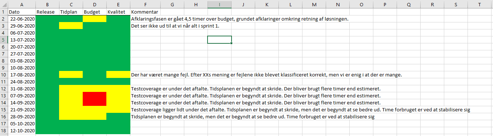
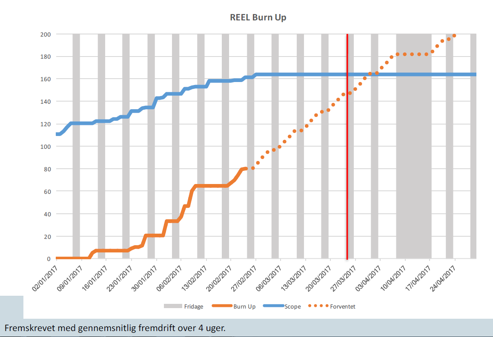

# COMBINED TENDER DOCUMENTATION

**Generated**: 2025-09-19 00:51:18
**Total Documents**: 19

## NOTICE
This file contains ALL tender documents for comprehensive analysis.
Each document is marked with clear separators.

---

## TABLE OF CONTENTS

1. DA 1 - Bilag 1 Behovsopgørelse - PPT.md
2. DA 1 - Bilag 1.1 Løsningsbeskrivelse - PPT.md
3. DA 1 - Bilag 1.2 Kravmatrix PPT.md
4. DA 1 - Bilag 1A Systembeskrivelse - PPT.md
5. DA 1 - Bilag 1B Identificerede videreudviklingsopgaver - PPT.md
6. DA 1 - Bilag 2 Tidsplan - PPT.md
7. DA 1 - Bilag 2.1 Leverandørens tidsplan - PPT.md
8. DA 1 - Bilag 2.2 Grafisk fremstilling af tidsplanen - PPT.md
9. DA 1 - Bilag 3 Organisation - PPT.md
10. DA 1 - Bilag 3.1 Leverandørens organisation - PPT.md
11. DA 1 - Bilag 3.2- n CV'er -PPT.md
12. DA 1 - Bilag 3.3 Samarbejdsmatrix - PPT.md
13. DA 1 - Bilag 4 Priser - PPT.md
14. DA 1 - Bilag 5 Krav til rapportering - PPT.md
15. DA 1 - Bilag 6 Service Level Agreement (SLA) - PPT.md
16. DA 1 - Bilag 7 Databehandleraftale - PPT.md
17. DA 1 - Leverancekontrakt Udvikling og vedligehold - PPT.md
18. DA 1 Miniudbudsbetingelser Vedligehold og videreudvikling- PPT.md
19. Persondataunderretning 24-28 - PPT.md

---

===============================================================================
## DOCUMENT 1: DA 1 - Bilag 1 Behovsopgørelse - PPT.md
===============================================================================
**Start**: [START-DOC-1]

Delaftale 1 (Vedligehold og videreudvikling)

Bilag 1 Behovsopgørelse

Instrukser/vejledning til Kunde og Leverandør vedrørende udfyldelse af dokumentet er markeret med farve:

- Tekst markeret med turkis skal *erstattes* med Kundens tekst inden igangsættelse af miniudbud
- Tekst markeret med gult skal *erstattes* med Leverandørens besvarelse inden tilbudsafgivelse
- Tekst markeret med gråt skal *slettes* af Kunden eller Leverandøren

## Indhold

[1	Indledning	3](.)

[1.1	Formål	3](.)

[1.1.1	PLEJ/PPRAM	3](.)

[1.1.2	TUFF (Tilsyn med udlejning til ferie og fritidsformål) - Sommerhusloven	4](.)

[1.2	Budgetloft	4](.)

[2	Behovsopgørelse	4](.)

[2.1	Udvikling - UDGÅR	4](.)

[2.2	Overtagelsesopgaven	4](.)

[2.2.1	Systembeskrivelse	5](.)

[2.3	Vedligeholdelsesopgaven	5](.)

[2.3.1	Krav til vedligeholdelsen	5](.)

[2.3.2	Arkitekturkrav	7](.)

[2.3.3	Samarbejde med Kundens øvrige Leverandører	7](.)

[2.3.4	Support på anmodning fra Kunden	8](.)

[2.3.5	Assistance i forbindelse med ophør	8](.)

[3	Videreudvikling	9](.)

[4	Cases	9](.)

[4.1	Case 1: Plantypen Landzonetilladelser skal udvides	9](.)

[4.1.1	Case-spørgsmål	9](.)

[4.2	Case 2: Udvidet rollestyring	10](.)

[4.2.1	Case-spørgsmål	11](.)

## 1 Indledning

Dette bilag indeholder Kundens behov i forhold til overtagelse, vedligeholdelse og videreudvikling som præciseret i Leverancekontrakten.

Til dette bilag knytter sig følgende underbilag:

- Bilag 1.0.1 Antal incidents og fejl
- Bilag 1.1 Løsningsbeskrivelse (Leverandørens besvarelse af behov)
- Bilag 1.2 Kravmatrix
- Bilag 1A Systembeskrivelse
- Bilag 1B Identificerede videreudviklingsopgaver

Leverancebeskrivelsen udgøres af dette bilag, Bilag 1.1, Bilag 1.2, Bilag 1A og Bilag 1B.

Kundens behov er opgjort nedenfor i punkt 2.

### 1.1 Formål

Udbuddets og opgavens indhold dækker over vedligehold og videreudvikling af IT-systemerne PLEJ/PPRAM og TUFF.

#### 1.1.1 PLEJ/PPRAM

Plandata.dk er Danmarks digitale register for planer efter planloven (jf. planlovens § 54 b og plandatabekendtgørelsen), og en række planer og tilladelser skal offentliggøres igennem og udstilles i systemet. Foruden PLEJ/PPRAM, indeholder Plandata.dk flere applikationer, herunder PDK, som er selve registeret for planoplysninger, samt [kort.plandata.dk](http:/kort.plandata.dk) , [visplaner.plandata.dk](http:/visplaner.plandata.dk) og [kommuneplaner.plandata.dk/](https:/kommuneplaner.plandata.dk) , som alle er offentlige udstillinger af plandokumenter, -oplysninger og -geometrier.

PLEJ/PPRAM er kernekomponenter i Danmarks digitale planregister, Plandata.dk, hvori planer efter planloven offentliggøres og udstilles. Således udgør PLEJ/PPRAM-brugergrænsefladen for kommuners indberetning til Plandata.dk samt en kompleks beregningskerne, der nedbryder indberettede plandata til (del)jordstykkeniveau og leverer dataene til Skatteministeriet (SKM) til brug for ejendomsvurderingerne.

PLEJ/PPRAM tjener en række formål. De primære er:

- Indberetning af kommunale planer (kommuneplaner, lokalplaner mfl.) til Plandata.dk.
- Udsendelse af høringsmeddelelser om offentliggørelse af nye planforslag, -vedtagelser og -aflysninger.
- Nedbrydning og beregning af plangrundlag til (del)jordstykkeniveau.
- Levering af udtræksdata for (del)jordstykker og planoplysninger til Vurderingsmyndigheden til brug for Skatteministeriets ejendomsvurderinger.

Siden Plandata.dk kom i drift i 2018, er det samlede system, og i særlig grad PLEJ/PPRAM, løbende blevet udvidet. Indenfor det sidste år har Plandata.dk udskiftet snitfladen der bruges af tredjeparter til et REST API samt gjort det muligt at indberette og udstille fuldt digitale kommuneplaner. Derudover er systemet generelt blevet udvidet både med flere muligheder for at indberette nye oplysninger og med nemmere indberetning af eksisterende funktionaliteter. Der er stor bevågenhed omkring Plandata.dk, særligt hos kommunerne og SKM, men også fra virksomheder og borgere. Offentliggørelsen af planer er en afgørende for om planen er juridisk bindende og det er derfor et system, der kun tåler kortvarig nedetid eller fejlende funktioner.

#### 1.1.2 TUFF (Tilsyn med udlejning til ferie og fritidsformål) - Sommerhusloven

TUFF er et system, der er udviklet for at lette sagsbehandlingen i Plan- og Landdistriktstyrelsens tilsyn med udlejning af ferieboliger, fleksboliger og værelser m.v. til ferie- og fritidsformål. Tilsynet udføres af Teamet for Ferieboliger og tilsyn efter Sommerhusloven. TUFF-værktøjet muliggør, at tilsynsmedarbejderne nemt og effektivt kan indhente oplysninger, der er relevante for oplysningen af tilsynssager, og det giver samtidig mulighed for automatisk generering af dokumenter og breve.

### 1.2 Budgetloft

Den forventede værdi for hele kontraktperioden inkl. optioner er i alt 37,5 mio. kr. eksklusive moms, hvilket også er den godkendt budgetramme.

Den maksimale værdi for kontraktperioden inkl. optioner er 45 mio. kr. eksklusive moms. Overskridelse af den forventede kontraktværdi på 37,5 mio. kr. eksklusive moms kræver, at der foreligger en skriftlig godkendelse heraf fra såvel Kunden som Plan- og Landdistriktsstyrelsens direktion.

## 2 Behovsopgørelse

Dette punkt indeholder Kundens Behovsopgørelse, hvori kravene til Leverancens nærmere indhold fastlægges. Punktet har til formål at specificere Kundens behov, uanset om der er tale om en Leverancekontrakt om (1) udvikling, (2) udvikling, vedligeholdelse og videreudvikling eller (3) overtagelse, vedligeholdelse og videreudvikling.

Behovsopgørelsen består af:

- Krav til udviklingsprojektet, jf. punkt 2.1 - UDGÅR
- Krav til overtagelsesopgaven, jf. punkt 2.2
- Krav til vedligeholdelsesopgaven, jf. Punkt 2.3

### 2.1 Udvikling - UDGÅR

UDGÅR

### 2.2 Overtagelsesopgaven

Leverandøren skal overtage de systemer/komponenter, der er beskrevet i punkt 2.2.1 Systembeskrivelse, eventuelt med tilhørende underbilag eller en reference til det sted, hvor beskrivelsen findes.

I Bilag 2.1 Leverandørens tidsplan beskriver Leverandøren, hvordan overtagelsesopgaven forventes løst.

Leverandøren bedes i sin besvarelse af overtagelsesopgaven svare ud fra det vidensgrundlag vedkommende har og skal angive de oplysninger, der efterspørges, uanset om Leverandøren er eksisterende eller ny leverandør.

Såfremt der vurderes at være elementer ved overtagelsen, der (fordi man er eksisterende leverandør) kræver væsentlig mindre indsats eller færre timer, skal dette eksplicit anføres med en begrundelse herfor.

#### 2.2.1 Systembeskrivelse

De systemer eller de komponenter , Leverandøren skal overtage til vedligeholdelse, jf. afsnit 2.3 og i henhold til Leverancekontrakten, omfatter de systemer/komponenter og den funktionalitet, er beskrevet i Bilag 1A Systembeskrivelse.

### 2.3 Vedligeholdelsesopgaven

Leverandøren skal vedligeholde de systemer/komponenter, der er beskrevet i punkt 2.2.1 Systembeskrivelse, eventuelt med tilhørende underbilag eller en reference til det sted, hvor beskrivelsen findes.

#### 2.3.1 Krav til vedligeholdelsen

Leverandøren skal proaktivt udføre forebyggende og afhjælpende vedligeholdelse af de omfattede systemer/komponenter jf. punkt 2.2.1, samt sørge for god og driftssikker stand i samarbejde med Kundens driftsleverandør.

Leverandøren skal foretage vedligeholdelse i henhold til de af Kunden fastsatte krav. For hver vedligeholdelsesopgave vil Kunden fastsætte specifikke krav i tillæg til, eller som erstatning for, de krav der er anført nedenfor.

**Krav markeret med  skal opfyldes som en del af det faste månedlige vederlag. Opgaver forbundet med opfyldelse af alle andre krav afregnes efter medgået tid.**

| ID     | Beskrivelse                                                                                                                                                           |
|--------|-----------------------------------------------------------------------------------------------------------------------------------------------------------------------|
| KRAV 1 | Samarbejdsværktøj Leverandøren skal benytte Kundens samarbejdsværktøjer, således at der understøttes en samlet proces vedrørende henvendelser fra Kunden om systemet. |

| ID  ID    | Beskrivelse                                                                                                                                                     |
|-----------|-----------------------------------------------------------------------------------------------------------------------------------------------------------------|
| KRAV 2    | Standard for estimering af opgaver Leverandøren skal benytte den til hver tid af Kunden ønsket standard for opgave estimering (f.eks. storypoints eller timer). |

| ID     | Beskrivelse                                                                                                                                                                                    |
|--------|------------------------------------------------------------------------------------------------------------------------------------------------------------------------------------------------|
| KRAV 3 | Standard for tidsregistrering Leverandøren skal benytte tidsregistreringsløsningen fra Kundens samarbejdsværktøjer og opdatere i denne mindst en gang dagligt for igangsatte tildelte opgaver. |

| ID       | Beskrivelse                                                                                                                                                                                                                                                                                                                                                                         |
|----------|-------------------------------------------------------------------------------------------------------------------------------------------------------------------------------------------------------------------------------------------------------------------------------------------------------------------------------------------------------------------------------------|
| [KRAV 4] | Standard for månedsrapportering Leverandøren skal foretage rapportering månedsvis. Rapporten er SLA belagt, jf. Bilag 6 Service Level Agreement (SLA).  Leverandøren skal benytte den til enhver tid af Kunden anviste standard for månedsrapportering.  Leverandøren skal på kundens opfordring månedsvis give møde med relevante personale således at statusmøde kan gennemføres. |

| ID     | Beskrivelse                                                                                                                                                                                                                                                                                                                                                                                                                                                                                                                                                                                                                                                                                                 |
|--------|-------------------------------------------------------------------------------------------------------------------------------------------------------------------------------------------------------------------------------------------------------------------------------------------------------------------------------------------------------------------------------------------------------------------------------------------------------------------------------------------------------------------------------------------------------------------------------------------------------------------------------------------------------------------------------------------------------------|
| KRAV 5 | Standard for change og release Leverandøren skal rådgive og være Kunden behjælpelig i forbindelse med udfyldelse af request for changes (RFC).  Leverandøren skal orientere Kunden, hvis der er er risiko for datatab og behov for backup, inden ændringer deployes i drift.   Leverandøren skal på Kundens opfordring udarbejde releasenote ved planlagte releases af systemet, indeholdende: Releasebetegnelse og/eller versionsnummer. Liste over issues, der er inkluderet i versionen (medført kodeændringer). Testrapport udarbejdet af Leverandørens egen testansvarlig, iht. Kundens specifikation.     Leverandøren skal til en hver tid følge og anvende den af Kunden udmeldte change procedure. |

| ID     | Beskrivelse                                                                                                                                                                                            |
|--------|--------------------------------------------------------------------------------------------------------------------------------------------------------------------------------------------------------|
| KRAV 6 | Svartider må ikke forringes uden Kundens samtykke Systemet skal vedligeholdes på en sådan måde, at svartider så vidt muligt ikke forringes, og i modsat fald skal Kunden orienteres og godkende dette. |

| ID     | Beskrivelse                                                                                                                                                                                                                                                                                    |
|--------|------------------------------------------------------------------------------------------------------------------------------------------------------------------------------------------------------------------------------------------------------------------------------------------------|
| KRAV 7 | Opdatering af Dokumentation til driftsleverandør Det er Leverandørens ansvar at notificere Kunden, såfremt der er ændringer til de elementer, der udgør den applikationsspecifikke driftsvejledning eller anden Dokumentation for en given applikation, således at denne kan holdes opdateret. |

#### 2.3.2 Arkitekturkrav

Det er vigtigt for Kunden, at styrelsens systemer er opbygget efter samme model. Grundprincippet i udviklingen i forbindelse med vedligeholdelsesopgaverne er, at den eksisterende it-arkitektur og de anvendte udviklingsprincipper skal videreføres, jf. Bilag E Rammearkitektur og Bilag F.1 Agil metode.

#### 2.3.3 Samarbejde med Kundens øvrige Leverandører

Leverandøren skal samarbejde med Kundens driftsleverandører og øvrige Leverandører for at sikre effektiviteten i hver parts arbejde med systemet, og for at medvirke til, at der bliver taget hånd om alle relevante processer. Al kommunikation mellem Kundens leverandører vil som udgangspunkt altid gå via Kunden. Alternativt vil indledende kommunikation gå via Kunden, der så sikrer, at de rette kontaktpersoner hos Leverandørerne sættes i kontakt med hinanden. Ved opståede Fejl uden for Kundens arbejdstid kan kommunikation foregå direkte mellem Leverandørerne, såfremt kommunikationen dokumenteres og tidsregistreres på en konkret sag i Kundens samarbejdsværktøjer.

| ID     | Beskrivelse                                                                                                                                                                                                                                                               |
|--------|---------------------------------------------------------------------------------------------------------------------------------------------------------------------------------------------------------------------------------------------------------------------------|
| KRAV 8 | Leverandøren skal stå til rådighed I forbindelse med driftsleverandørens eller øvrige af Kundens Leverandørers ændringer af systemets platform, basiskomponenter og andet skal Leverandøren stå til rådighed med rådgivning og om nødvendigt gennemføre test af systemet. |

| ID     | Beskrivelse                                                                                                                                                                                                                                                                                                                            |
|--------|----------------------------------------------------------------------------------------------------------------------------------------------------------------------------------------------------------------------------------------------------------------------------------------------------------------------------------------|
| KRAV 9 | Registrering af kommunikation med 3. part Alt relevant kommunikation med 3. part (f.eks. driftsleverandører og Leverandørens egne underleverandører) skal registreres i Kundens samarbejdsværktøjer, jf. krav 1.  Leverandøren skal ligeledes tidsregistrere denne opgave på en konkret sag i Kundens samarbejdsværktøjer, jf. krav 3. |

#### 2.3.4 Support på anmodning fra Kunden

Leverandøren skal yde support på anmodning fra Kunden.

| ID      | Beskrivelse                                                                                                                                                                                                                            |
|---------|----------------------------------------------------------------------------------------------------------------------------------------------------------------------------------------------------------------------------------------|
| KRAV 10 | Leverandøren skal levere medarbejdere til support on site hos Kunden Leverandøren skal på anmodning fra Kunden med 2 Arbejdsdages varsel levere medarbejdere til support on site hos Kunden, medmindre der er indgået aftale om andet. |

#### 2.3.5 Assistance i forbindelse med ophør

Leverandøren skal assistere Kunden med overdragelse af vedligeholdelsesopgaven, sådan at en så smidig overdragelse som muligt gennemføres.

| ID      | Beskrivelse                                                                                                                                                                                                                                                                                                                                                                                                                                                                                                                                                                                                                                  |
|---------|----------------------------------------------------------------------------------------------------------------------------------------------------------------------------------------------------------------------------------------------------------------------------------------------------------------------------------------------------------------------------------------------------------------------------------------------------------------------------------------------------------------------------------------------------------------------------------------------------------------------------------------------|
| KRAV 11 | Leverandørens assistance ved ophør På anmodning fra Kunden skal Leverandøren assistere Kunden i forbindelse med overdragelse af vedligeholdelsesopgaven jf. Leverancekontraktens punkt 20.  Aktiviteterne for Leverandøren er (men ikke begrænset til): Udpege en beslutningsdygtig projektleder, der er kontaktpunkt for Kunden. Stille med en person, som har stort kendskab til systemet (-erne) omfattet af vedligeholdsopgaven. Med et varsel på 5 Arbejdsdage skal Leverandøren: Deltage aktivt i gennemførsel af transitionsplanen. Gennemføre præsentationer og svare på spørgsmål. Samarbejde med ny leverandør i transitionsfasen. |

## 3 Videreudvikling

Kunden har ved Leverancekontraktens indgåelse identificeret en række videreudviklingsopgaver i de systemer/komponenter, der vedligeholdes, der kan blive igangsat efter Kundens valg i løbet af Leverancekontraktens løbetid. Videreudviklingsopgaverne fremgår af Bilag 1B, Identificerede videreudviklingsopgaver.

## 4 Cases

Leverandøren skal som en del af tilbudsafgivelsen i Bilag 1.1 Løsningsbeskrivelse afgive en bevarelse på nedenstående cases.

Se kravene for besvarelse i Bilag 1.1 Løsningsbeskrivelse.

### 4.1 Case 1: Plantypen Landzonetilladelser skal udvides

- **Den nuværende situation**

I Plandata kan der i dag kun angives ganske få oplysninger om ”plantypen” [landzonetilladelser](https:/confluence.erst.dk/x/KweqAQ) .

Landzonetilladelser er en afgørelse kommunen kan træffe og som består af et retligt gældende pdf-dokument, der beskriver hvad der er givet tilladelse til og som skal indberettes til Plandata. I indberetning kan man angive tre forskellige anvendelser som tilladelsen behandler samt en mulighed for at angive ”andet”. Landzonetilladelser omhandler dog en lang række emner som der ikke kan vælges og der efterspørges ofte fra SKM og fra Plandatas egen styrelse og departement at flere oplysninger om landzonetilladelser kan indberettes.

- **Vores ønsker til fremtiden**
    - Plandata ønsker at:
        - At flere at de mest almindelige anvendelser kan angives på en nem måde i brugerfladen
        - At landzonetilladelser kan indberettes via Plandatas REST API.
        - At oplysningerne skal kunne komme med i udtræk til SKM

#### 4.1.1 Case-spørgsmål

Med udgangspunkt i Plandata’s nuværende system, beskriv hvordan I ville håndtere den ovenstående opgave med følgende elementer:

- Et forslag til design af en ny indberetning hvor disse oplysninger kan indberettes i PPRAMs brugerflade.
- Et forslag til hvordan landzonetilladelser skal kunne indberettes via REST API med udgangspunkt i Plandatas nuværende setup og jeres forslåede design
- Et forslag til hvordan oplysningerne skal medsendes i udtræk til SKM baseret på den nuværende snitfladebeskrivelse

### 4.2 Case 2: Udvidet rollestyring

- **Den nuværende situation**

Plandata API bruger i dag en basic auth løsning til bruger certificering af tredjeparter. Erhvervsstyrelsens ønsker dog at udfase brugen af basic auth autentificering af sikkerhedshensyn. Plandata.dk har i den forbindelse behov for at skifte autentificeringen af tredjeparter til virksomhedscertifikat når dette bliver muligt i sector9 (ERST brugerhåndteringssystem). I den forbindelse vil rettighedsstrukturen skulle gennemgås så Plandata bedst muligt kan styre hvilke brugere der har adgang til at lave hvilke handlinger i Plandata.dk.

- **Vores ønsker til fremtiden**

Nedenfor ses en række brugere som skal kunne tilgå de nævnte funktioner samt dem for de mindre restriktive niveauer (dvs. en konsulent der kan rette i kladder skal ikke kunne rette vedtagne planer, men skal kunne hente kladder for den specifikke kommune og hente offentlige planer). Der findes i dag offentlig adgang til planer, adgang som kommunal medarbejder og adgang som plandata medarbejder. Men det er ikke på nuværende tidspunkt muligt at give rettigheder til at hente kladder og redigere kladder som separate roller.

Vi ønsker at gøre dette muligt, så de brugere der har behov for at kunne tilgå f.eks. kladder kan få adgang til dette uden få adgang til følsomme funktioner som rettelse af vedtagne planer og statusskifte.

#### 4.2.1 Case-spørgsmål

Med udgangspunkt i Plandata’s nuværende system, beskriv hvordan I ville håndtere den ovenstående opgave med følgende elementer:

- En redegørelse af hvilke rettelser til rollestyringen, PPRAMs indberetningsflade og til REST API’et der skal laves for at gøre det muligt at servicere alle de nævnte samt eksisterende brugere.
- En nedbrydning af opgaven i stories som kan løses af det foreslåede team inden for en planning periode (ca. 6 sprints af 2 uger).
- En beskrivelse af hvilke dele af PLEJ/PPRAM der ville blive berørt af denne løsning.
**End**: [END-DOC-1]
===============================================================================

===============================================================================
## DOCUMENT 2: DA 1 - Bilag 1.1 Løsningsbeskrivelse - PPT.md
===============================================================================
**Start**: [START-DOC-2]

Delaftale 1 (Vedligehold og videreudvikling)

Bilag 1.1 Løsningsbeskrivelse

Instrukser/vejledning til Kunde og Leverandør vedrørende udfyldelse af dokumentet er markeret med farve:

- Tekst markeret med turkis skal *erstattes* med Kundens tekst inden igangsættelse af miniudbud
- Tekst markeret med gult skal *erstattes* med Leverandørens besvarelse inden tilbudsafgivelse
- Tekst markeret med gråt skal *slettes* af Kunden eller Leverandøren

## Indhold

[1	Indledning	3](.)

[2	Krav til Løsningsbeskrivelse	3](.)

[2.1	Cases	3](.)

[2.2	Kravmatrice	3](.)

[3	Løsningsbeskrivelse	3](.)

[3.1	Case 1	3](.)

[3.2	Case 2	4](.)

## 1 Indledning

Dette bilag indeholder Leverandørens besvarelse (Løsningsbeskrivelse) af Kundens Behovsopgørelse, jf. Bilag 1, og skal udfærdiges i overensstemmelse med kravene i punkt 2.

## 2 Krav til Løsningsbeskrivelse

Leverandøren besvarer Bilag 1 Behovsopgørelse ved at vedlægge nærværende Bilag 1.1 Løsningsbeskrivelse som besvarelse.

### 2.1 Cases

Leverandøren skal besvare de 2 cases, som fremgår af Bilag 1 Behovsopgørelse, afsnit 4 Cases:

- Case 1 i Bilag 1, afsnit 4.1
- Case 2 i Bilag 1, afsnit 4.2

For hver case bedes Leverandøren udarbejde den besvarelse, der efterspørges i Bilag 1 Behovsopgørelsen, afsnit 4.1 til 4.2. 

2.1.1 Krav til besvarelse af cases

Der er følgende krav/forventninger til besvarelse af cases:

- Hver casebesvarelse må maksimalt fylde ti A4-sider (inklusive illustrationer/diagrammer)
- Besvarelserne forventes i prosa, og der forventes således ikke kode, som en del af besvarelserne
- Det forventes at der tages stilling til spørgsmålene under hver case i Bilag 1 Behovsopgørelsen, afsnit 4.1 til 4.2.

### 2.2 Kravmatrice

I bilag 1 Behovsopgørelsens afsnit 2.3 findes en oversigt med 11 specifikke krav. Leverandøren bedes i Bilag 1.2 Kravmatrix angive om kravene er hhv. opfyldt, delvist opfyldt, ikke opfyldt samt angivelse af årsag, hvis behovet ikke er opfyldt.

Hvis Leverandøren i Kravmatricen har angivet, at et krav er opfyldt, anses det pågældende for omfattet af den pris Leverandøren har tilbudt.

## 3 Løsningsbeskrivelse

Under dette punkt indsætter Leverandøren sin Løsningsbeskrivelse i overensstemmelse med kravene i punkt 2 Krav til Løsningsbeskrivelse. Leverandøren bedes inddele sin Løsningsbeskrivelse i overskrifter, der matcher Kundens krav til Løsningsbeskrivelsen, jf. punkt 2.

### 3.1 Case 1

Tilbudsgiver indsætter sin besvarelse.

### 3.2 Case 2

Tilbudsgiver indsætter sin besvarelse.

## 4 
**End**: [END-DOC-2]
===============================================================================

===============================================================================
## DOCUMENT 3: DA 1 - Bilag 1.2 Kravmatrix PPT.md
===============================================================================
**Start**: [START-DOC-3]

| DA 1 - Bilag 1.2 Kravmatrix                                                                                             |
|-------------------------------------------------------------------------------------------------------------------------|
| NB: Det bemærkes, at forbehold, der ikke kan kapitaliseres, medfører at tilbuddet betragtes som ikke-konditionsmæssigt. |
| Kravnummer                                                                                                              |
| Krav  1                                                                                                                 |
| Krav  2                                                                                                                 |
| Krav  3                                                                                                                 |
| Krav  4                                                                                                                 |
| Krav  5                                                                                                                 |
| Krav  6                                                                                                                 |
| Krav  7                                                                                                                 |
| Krav  8                                                                                                                 |
| Krav  9                                                                                                                 |
| Krav  10                                                                                                                |
| Krav  11                                                                                                                |

| Titel                                                                | Opfyldelsesgrad (helt opfyldt, delvist opfyldt, ikke opfyldt)   | Årsag til delvis opfyldt eller ikke opfyldt   |
|----------------------------------------------------------------------|-----------------------------------------------------------------|-----------------------------------------------|
| Samarbejdsværktøj                                                    | None                                                            | None                                          |
| Standard for estimering af opgaver                                   | None                                                            | None                                          |
| Standard for tidsregistrering                                        | None                                                            | None                                          |
| Standard for månedsrapportering                                      | None                                                            | None                                          |
| Standard for change og release                                       | None                                                            | None                                          |
| Svartider må ikke forringes uden Kundens samtykke                    | None                                                            | None                                          |
| Opdatering af Dokumentation til driftsleverandør                     | None                                                            | None                                          |
| Leverandøren skal stå til rådighed                                   | None                                                            | None                                          |
| Registrering af kommunikation med 3. part                            | None                                                            | None                                          |
| Leverandøren skal levere medarbejdere til support on site hos Kunden | None                                                            | None                                          |
| Leverandørens assistance ved ophør                                   | None                                                            | None                                          |
**End**: [END-DOC-3]
===============================================================================

===============================================================================
## DOCUMENT 4: DA 1 - Bilag 1A Systembeskrivelse - PPT.md
===============================================================================
**Start**: [START-DOC-4]

Delaftale 1 (Vedligehold og videreudvikling)

Bilag 1A Systembeskrivelse

Instrukser/vejledning til Kunde og Leverandør vedrørende udfyldelse af dokumentet er markeret med farve:

- Tekst markeret med turkis skal *erstattes* med Kundens tekst inden igangsættelse af miniudbud
- Tekst markeret med gult skal *erstattes* med Leverandørens besvarelse inden tilbudsafgivelse
- Tekst markeret med gråt skal *slettes* af Kunden eller Leverandøren

## 1 Indhold

[1	Systembeskrivelse	3](.)

[1.1	Plandata.dk – PLEJ/PPRAM	3](.)

[1.2	Sommerhusloven – TUFF	6](.)

[1.2.1.1	Teknologi	8](.)

## 2 Systembeskrivelse

Det system Leverandøren skal overtage til vedligeholdelse, omfatter de komponenter og den funktionalitet, som er beskrevet nedenfor.

### 2.1 Plandata.dk – PLEJ/PPRAM

**Indberetningsflade for kommuner**

Brugerfladen muliggør indberetning af oplysninger om en række kommunale plantyper. Oplysningerne er forskelligartede fra plantype til plantype, men involverer næsten altid en geografisk afgrænsning af planen. Indberetningsløsningen understøtter således, at kommuner kan uploade både plangeometrier og planoplysninger i forskellige filformater, aktuelt .shp, xml, GeoJSON og .tab, samt at de kan indberette direkte i brugerfladen bl.a vha. et tegneværktøj til at tegne planens geometrier. Det er desuden muligt at indberette planer til Plandata.dk igennem et REST API, som bruges af tredjeparter på vegne af kommuner.

Udsendelser af høringsmeddelelser er ligeledes en kritisk funktion ifm. at kunne understøtte offentliggørelsen af planer i Plandata.dk. Udsendelsesprocessen har kritiske afhængigheder til flere af ERST’s fælleskomponenter – se afsnit ’Overordnet arkitektur af systemet’ længere nede.

**Nedbrydning til Deljordstykker**

I nedbrydningen til (del)jordstykkeniveau tolkes det på enhver del af et jordstykke, som har fælles samlet plangrundlag, hvilke planbestemmelser der gælder. Ud fra den nedbrydning og oplysninger fra Matriklen og BBR beregnes vejledende anvendelses- og udnyttelsesmuligheder. Den samlede nedbrydning og beregning foretages løbende, samt for årlige, passerede terminsdatoer, og i særlige tilfælde udvælges (del)jordstykker systematisk til manuel kontrol i kommunen. Denne kontrol foregår ligeledes i PLEJ/PPRAM. Både (del)jordstykker og relaterede planoplysninger leveres til SKAT i udtræk flere gange om året.

**Overordnet arkitektur af PLEJ/PPRAM og dets relation til Plandata.dk**

**Figur 1 Overordnet system arkitektur (** [**https://confluence.erst.dk/display/PLP00/A-02+Overordnet+system+tegning**](https:/confluence.erst.dk/display/PLP00/A-02+Overordnet+system+tegning) **)**

Systemet PLEJ/PPRAM består af en række komponenter hvoraf de vigtigste er:

- PPRAM-komponenten sørger for at udstille et ensartet brugerinterface for de registerdata som findes i PLEJ og PDK. Komponenten håndterer processer for indberetning af planer, herunder igangsættelse af validering gennem Regelmotor der ligger i integrationslaget og videre til PDK for at gemme. PPRAM-komponenten udstiller også brugergrænseflade til visning og korrigering af de beregnede deljordstykker der er resultatet af de indberettede planer, samt brugergrænsefladen for både PDK og PLEJ med kortfuktionalitet
- PLEJ komponentens primære opgave er at udstille services med informationer om deljordstykker fra datalageret. Komponenten har ikke nogen brugerinterface og tilgås kun via services.
- PLEJ Beregning komponenten står for at nedbryde og beregne informationer fra planer til deljordstykker.
- Integrationslaget håndterer kommunikation for PLEJ, PPRAM, Plandata-API samt Regelmotor.
- Regelmotoren udstiller funktionalitet til validering af data.
- Plandata-API er udstillingsendepunkt til brug for tredjeparter der udbyder services til kommunerne.

[Man kan læse mere om arkitektur og komponenter her](https:/confluence.erst.dk/x/HSGfAQ)

Al kommunikation til og fra PLEJ/PPRAM-systemet går så vidt muligt igennem Integrationslaget. Der er integrationer med følgende systemer:

- Eksterne systemer:
    - **PDK** : PDK er selve registeret for Plandata.dk. Integrationslaget benytter PDK-REST services dedikeret til PLEJ/PPRAM’s behov ved hent og gem af planer. Udover data omkring planer hentes også kommunegrænser, zonegrænser og matrikeldata fra PDK. PDK er ikke eksternt for ERST, men samtidig ikke etableret som en fælleskomponent.
    - **SKM** : Systemet lægger dataudtræk på en SFTP-server, som Skatteministeriet (SKM) kan tilgå for at få data omkring (del)jordstykker.
    - **DAF** : Datafordeleren, bruges bl.a. til at hente bygningsenheder og ændringer fra **BBR** til brug for (del)jordstykkeberegninger.
    - Services fra **Dataforsyningen** bruges til at hente de baggrundskort (topografi og ortofoto), der bruges på alle kort i systemet.

[Snitfladerne til eksterne systemer er beskrevet her i dokumentationen](https:/confluence.erst.dk/x/ISGfAQ) .

- ERST fælleskomponenter:
    - **Beskedfordeler** (benyttes i forbindelse med udsendelse af meddelelser til høringsparter)
    - **TextManager** (benyttes til at administrere tekster i brugergrænsefladen og til emails, der sendes ud til høringsparter)
    - **Sector9** (Autentificering af bruger, rettigheds- og rollestyring, NemID)
    - **PogO** (opslag på aktører, kommuner, høringslister, Personer og Organisationer)
    - **SAG** (Sagslager og Sagsindex bruges til at gemme/hente sager for deljordstykker samt i forbindelse med journalisering af meddelelser til høringsparter)
    - **Dokumentlager** (benyttes i forbindelse med journalisering af udsendelser og andre sager i sagslager)
    - **TidTil** (benyttes til at igangsætte diverse jobs , f.eks. generering af SKM-udtræk)
    - **Monitorering** (benyttes for at udstille de forskellige komponenters driftsstatus)
    - **DIST** (benyttes til validering af cvrnr for forsyningsselskaber og berigelse af selskabsnavn)

[Integrationer til ERST fælleskomponenter er beskrevet her i dokumentationen](https:/confluence.erst.dk/x/ICGfAQ) .

For yderligere tegninger og forklaringer til at danne overblik over løsningens overordnede dele og integrationer, [se her i dokumentationen](https:/confluence.erst.dk/x/FCGfAQ) .

For en mere detaljeret beskrivelse af systemarkitekturen, [se her i dokumentationen](https:/confluence.erst.dk/x/HSGfAQ) .

**Øvrig dokumentation**

[For link til den samlede dokumentation af systemet](https:/confluence.erst.dk/x/lQBEAQ)

Det vurderes særlig relevant at orientere sig i afsnit S4 Systemdokumentation og S5 Kodedokumentation. Den samlede løsning vurderes grundlæggende at være grundigt dokumenteret, og det er en prioritet også fremadrettet at vedligeholde den løbende ifm. udvikling.

Da integrationen imellem PLEJ/PPRAM og PDK er særligt relevant for al vedligehold og udvikling af Plandata.dk, vurderes det relevant at orientere sig i PDK’s dokumentation. Også her vurderes afsnit S4 Systemdokumentation særlig relevant.

[Dokumentationen kan tilgås her](https:/confluence.erst.dk/x/7g9mAQ) .

### 2.2 Sommerhusloven – TUFF

TUFF henter oplysninger vedrørende ejendomme og lejeindtægter fra en række forskellige datakilder og systemer. Nogle af oplysningerne er offentligt tilgængelige, mens andre kræver særlige adgange for at tilgå. TUFF samler oplysningerne på baggrund af henholdsvis CPR, BFE og Kommune-Ejendomsnummer identifikationerne, der fungerer som systemets unikke nøgler.

TUFF kan alene hente oplysninger på private personer (ikke-juridiske personer). Det er således ikke muligt at slå virksomheder op i TUFF. Der kan desuden alene laves enkeltopslag, så det er ikke muligt at trække en liste af CPR-numre.

**Overordnet arkitektur af systemet**

TUFF er internt opdelt i to moduler: i) TUFF-web, der indeholder Dataforespørger og Datafremviser og ii) TUFF-core, som indhenter relevant data fra løsningens eksterne integrationer og samler dette til information til TUFF-web.

Adgang til systemet opnås gennem Sector9 med NemLogin.

Systemtegningen giver overblik over opbygning og integrationer. Integrationerne listes desuden her:

- Eksterne systemer/datakilder:
    - Datafordeler (DAF)
    - Matriklen (MAT)
    - Ejendomsbeliggenhedsregistret (EBR)
    - Bygnings- og Boligregistret (BBR)
    - Vurderingsregistret (VUR)
    - OIS tabel (LIfa A/S’ LOIS database)
    - DUPLA

- ERST fælleskomponenter:
    - AdresseService
    - Beskedfordeler
    - Monitoreringkomponent
    - PogO
    - Sector9
    - TextManager

**Øvrig dokumentation**

[For yderligere dokumentation af TUFF henvises til Confluence](https:/confluence.erst.dk/x/sg_oAw)

##### 1 Teknologi

De vigtigste teknologier som bruges i de forskellige komponenter findes på listen nedenfor.

| Komponent             | Ansvar                                                                                                                                     | Teknologi                                                                                                                                         | Beskrivelse                                                                                                                                                                                                                                         |
|-----------------------|--------------------------------------------------------------------------------------------------------------------------------------------|---------------------------------------------------------------------------------------------------------------------------------------------------|-----------------------------------------------------------------------------------------------------------------------------------------------------------------------------------------------------------------------------------------------------|
| PPRAM                 | Brugergrænseflade til PDK og PLEJ                                                                                                          | Java 11, Tomcat 9.0.54 Grails v. 6.2.3, Groovy v. 3.0.23, GORM v. 8.1.1 Open Layers v. 4.6.5 (kort funktionalitet) GeoTools v. 32.1 GDAL v. 3.4.3 | Open Layers er open source og bruges til den brugerdefinerede kort funktionalitet. GeoTools er open source og benyttes i forbindelse med upload af geometrier GDAL er open source software, som GeoTools benytter til konvertering af MapInfo-filer |
| PLEJ                  | Udstiller beregnet data og alt der ikke er beregning af vurderingsdata                                                                     | Java 11, Tomcat 9.0.54 Grails v. 6.2.3, Groovy v. 3.0.23, GORM v. 8.1 GeoTools v. 32.1                                                            |                                                                                                                                                                                                                                                     |
| PLEJBEREGNING         | Beregning af vurderingsdata på jordstykke niveau og spacial Er en del af PLEJ der bliver deployed som en separat komponent for performance | Java 11, Tomcat 9.0.54 Grails v. 6.2.3, Groovy v. 3.0.23, GORM v. 8.1.1 GeoTools v. 32.1                                                          |                                                                                                                                                                                                                                                     |
| INTEGRATION           | Enterprise service bus (ESB) mellem de 3 løst koblede komponenter PPRAM, PLEJ og Integrationslaget (Regelmotor)                            | Java 11, Tomcat 9.0.54 Grails v. 6.2.3, Groovy v. 3.0.23                                                                                          |                                                                                                                                                                                                                                                     |
| PLANDATA-API          | REST-API endepunkt til udstilling for 3. parter                                                                                            | Java 11, Tomcat 9.0.54 Grails v. 6.2.3, Groovy v. 3.0.23                                                                                          |                                                                                                                                                                                                                                                     |
| Regelmotor/validering | Validering af forretnings- og dataregler                                                                                                   | Java 11, Tomcat 9.0.54 Grails v. 6.2.3, Groovy v. 3.0.23 Drools v. 7.74.1                                                                         | Drools er en open source regelmotor baseret på Rete algorithm.                                                                                                                                                                                      |
| Databaser             | Persistering og spacial for PPRAM og PLEJ (2 databaser)                                                                                    | Oracle Database 19c - Enterprise Edition Release 19.0.0.0.0 - Production Version 19.26.0.0.0                                                      | ERST standard teknologi med Locator.                                                                                                                                                                                                                |
| TUFF                  | Tilsyn med udlejning til ferie- og fritidsformål                                                                                           | Java 1.8, Tomcat 9.0.52 Grails v. 5.0.13, Groovy v. 3.0.10                                                                                        |                                                                                                                                                                                                                                                     |

For mere information om teknologi: [PLEJ/PPRAM](https:/confluence.erst.dk/x/HiGfAQ) og [TUFF](https:/confluence.erst.dk/x/sg_oAw)
**End**: [END-DOC-4]
===============================================================================

===============================================================================
## DOCUMENT 5: DA 1 - Bilag 1B Identificerede videreudviklingsopgaver - PPT.md
===============================================================================
**Start**: [START-DOC-5]

# Delaftale 1 (Vedligehold og videreudvikling)

# Bilag 1B Identificerede videreudviklingsopgaver

Instrukser/vejledning til Kunde og Leverandør vedrørende udfyldelse af dokumentet er markeret med farve:

- Tekst markeret med turkis skal *erstattes* med Kundens tekst inden igangsættelse af miniudbud
- Tekst markeret med gult skal *erstattes* med Leverandørens besvarelse inden tilbudsafgivelse
- Tekst markeret med gråt skal *slettes* af Kunden eller Leverandøren

## 1 Indhold

[1	Identificerede videreudviklingsopgaver	3](.)

[1.1	Videreudviklingsopgaver i PLEJ/PPRAM	3](.)

[1.1.1	Vedligehold og incidenthåndtering på PLEJ/PPRAM	3](.)

[1.1.2	Udvidelser af oplysninger til skatteforvaltningen	4](.)

[1.1.3	Planlovsændringer og yderligere indberetning af planbestemmelser	4](.)

[1.1.4	Implementering af Virksomhedscertifikat	4](.)

[1.1.5	Integration mellem Plandata.dk og EA-hub	4](.)

[1.2	Videreudviklingsopgaver i TUFF	5](.)

[1.2.1	Vedligehold på TUFF	5](.)

[1.2.2	Implementering af STR forordningen	5](.)

## 2 Identificerede videreudviklingsopgaver

Kunden har ved Leverancekontraktens indgåelse identificeret en række videreudviklingsopgaver i de systemer/komponenter, der vedligeholdes, der kan blive igangsat efter Kundens valg i løbet af Leverancekontraktens løbetid. Videreudviklingsopgaverne fremgår af Bilag 1B, Identificerede videreudviklingsopgaver.

### 2.1 Videreudviklingsopgaver i PLEJ/PPRAM

I dette afsnit findes kendte videreudviklingsopgaver på systemet PLEJ/PPRAM. Dette omfatter både opgaver der laves på Plandatas vedligeholdelsesbudget og mulige projekter bundet op på samarbejdet med Skatteministeriet (SKM) og Planlovsændringer eller aftaler med andre organisationer. Udvikling i PLEJ/PPRAM kræver i høj grad koordinering med Plandata.dk’s register PDK (Se ovenfor)

#### 2.1.1 Vedligehold og incidenthåndtering på PLEJ/PPRAM

Opgaven på PLEJ/PPRAM består blandt andet i at bistå Kunden i incidenthåndtering. Incidenthåndteringen skal ses i sammenhæng med systemets kritiske funktioner, navnlig kommunernes mulighed for at offentliggøre planer og systemets videregivelse af plan-oplysninger til vurderingsmyndighederne i SKM. Disse kritiske funktionaliteter styres via henholdsvis en udsendelses- og en beregningskø, hvor elementer står i kø indtil de bliver behandlet af et job. Fra tid til anden forekommer elementer i udsendelses- og beregningskøen, der ikke kan behandles af de respektive job. For beregningskøelementer kan det blokere for øvrige beregninger, og for udsendelser er det særlig kritisk, fordi udsendelser kan definere offentliggørelsestidspunktet for planforslag eller vedtagne planer; hvisPlandata.dk forsinker offentliggørelsen, så forsinkes de facto den kommunale planlægning. Grundet den kritiske funktionalitet af jobbene, vil der være behov for incidenthåndtering af disse elementer, fx ved "manuel" udsættelse af behandlingstidspunkt for beregningskøelementer og ved nulstilling og genstart af udsendelsesprocesser.

Plandata laver løbende forbedringer af PLEJ/PPRAM for at forbedre brugeroplevelsen af systemet. Ud over rettelser af fejl og håndtering af incidents er vedligeholdsopgaverne i systemet brede.

I Plandata API og indberetningsfladen i PPRAM handler forbedringerne om at forbedre oplevelsen for Plandatas brugere: Kommunerne og de tredjeparter der servicerer dem. I Plandata API er der derfor et ønske om at skabe bedre muligheder for at tilgå systemets valideringsregler og give muligheder for at indberette en række oplysninger som der stadig mangler muligheder for at indberette. I brugerfladen er der mange muligheder for at forbedre brugeroplevelsen, som f.eks. forbedringer til søge- og markeringsmuligheder i tabeller der knytter sig til rammer og retningslinjer, samt udvidelse af PPRAMs adminmodul så visse funktioner kan startes gennem brugerfladen af forretningsrepræsentanter.

Deljordstykkeberegningen i Plandata.dk er meget kompleks. Det forekommer, at SKM spørger til forståelse af specifikke deljordstykkedata, ligesom både SKM, Plandata.dk’s forretning og de kommunale brugere af systemet bemærker fejlbehæftede deljordstykker. I alle tilfælde forventes det, at Leverandøren kan være udførende på at undersøge og forklare de relevante deljordstykkeoplysninger samt at prioritere eventuelle fejlrettelser højt. Eksempler på forbedringer i deljordstykkeberegningen kan være at gøre udtræk mere selvkørende og robuste så de er nemmere at lave, samt at skifte integrationen til BBR ud med den kommende hændelsesservice i datafordeleren for at fjerne en kendt fejlkilde i den nuværende integration.

På et mere generelt plan er der et arkitektonisk udviklingsønske om at lave integrationskomponenten om til et plugin for at spare kald mellem komponenter i systemet.

#### 2.1.2 Udvidelser af oplysninger til skatteforvaltningen

En stor del af udviklingsarbejdet i PLEJ/PPRAM er knyttet til at levere oplysninger om planlægningen til SKM’s ejendomsvurderinger. En typisk ændringsanmodning fra SKM berør ofte alle dele af PLEJ/PPRAM, fordi der skal gives mulighed for at en ny oplysning skal kunne indberettes som kræver ændringer til brugerfladen i PPRAM (inklusive upload/download-modulet) og Plandata API’et og derefter kræver ændringer til nedbrydning, beregning og udtræk. Opgaverne kan ofte vise sig store fordi de kræver grundlæggende indgreb og justeringer til Plandata.dk’s beregningskerne. På overskriftniveau erfølgende opgaver i tiltagende omfang blevet drøftet på forretningsniveau over det seneste halve år:

- Heraf-bestemmelser, hvor det ville blive muligt at indberette bestemmelser som er under-/overordnede hinanden.
- En større opdatering af de specifikke anvendelseskoder i Plandata, som er et vigtigt element i både planlægning og ejendomsvurderinger.
- Versionering af beregningskernen for at kunne lave ændringer til fremtidige terminer uden at lave ændringer til beregningslogikken på tidligere terminer.

#### 2.1.3 Planlovsændringer og yderligere indberetning af planbestemmelser

I de senere år er Plandata.dk udbygget kraftigt. Ud over samarbejdet med SKM kommer tilføjelserne har typisk sammenhæng med politiske initiativer mens det andre gange er båret frem af en digitaliseringsagenda

Det er i den forbindelse forventet at der vil komme ændringer til planloven i slutningen af 2025 som bl.a. vil medføre en standardiseringen af datagrundlaget for nogle af de retningslinjer som kommunerne skal indberette til Plandata om klimatilpasning. I den forbindelse vil det være forventeligt der skal udarbejdes yderligere værktøjer til kommunerne samt validering af planerne for at gøre dette muligt igennem Plandata.dk.

#### 2.1.4 Implementering af Virksomhedscertifikat

Plandata API bruger i dag en basic auth løsning til bruger certificering af tredjeparter. Erhvervsstyrelsens ønsker dog at udfase brugen af basic auth autentificering af sikkerhedshensyn. Plandata.dk har i den forbindelse behov for at skifte autentificeringen af tredjeparter til virksomhedscertifikat når dette bliver muligt i sector9. I den forbindelse vil rettighedsstrukturen skulle gennemgås så Plandata bedst muligt kan styre hvilke brugere der har adgang til at lave hvilke handlinger i Plandata.dk.

#### 2.1.5 Integration mellem Plandata.dk og EA-hub

EA-hub samler miljøvurderinger og konsekvensrapporter for planer og projekter i Danmark. Det har tidligere været muligt at indberette VVM i Plandata, da der er mange af disse miljøvurderinger der bliver lavet i direkte tilknytning til mange plantyper i Plandata.dk. Det vil i dent forbindelse være naturligt at man som bruger af begge systemer kan angive et id på en plan eller miljøvurdering og dermed kan relatere de to på tværs. For miljøvurderinger som er tæt tilknyttet til en eller flere planer kan det være praktisk at kunne indberette hele miljøvurderingen gennem plandata.

### 2.2 Videreudviklingsopgaver i TUFF

I dette afsnit gennemgås kendte videreudviklingsopgaver i TUFF

#### 2.2.1 Vedligehold på TUFF

Opgaven på TUFF består af incidenthåndtering og rettelser af fejl der opdages eller opstår løbende. TUFF understøtter sagsbehandling i sommerhus-teamet som laver afgørelser i sager. Det er derfor vigtigt at oplysninger i TUFF er korrekte og tilgængelige. Løbende forbedringer i TUFF inkluderer forbedring af integrationer til andre systemer, visning af oplysninger i brugerfladen.

#### 2.2.2 Implementering af STR forordningen

EU har vedtaget en forordning om dataindsamling og –udveksling i forbindelse med kortidsudlejning af indkvartering. Det kan med udgangspunkt i de nye regler blive nødvendigt at opdatere TUFF så det kan leve op til kravene i forordningen. Der er ikke på nuværende tidspunkt afsat midler til opgaven.

[Læs mere om forordningen her.](https:/eur-lex.europa.eu/legal-content/EN/LSU/?uri=CELEX:32024R1028)
**End**: [END-DOC-5]
===============================================================================

===============================================================================
## DOCUMENT 6: DA 1 - Bilag 2 Tidsplan - PPT.md
===============================================================================
**Start**: [START-DOC-6]

Delaftale 1 (Vedligehold og videreudvikling)

Bilag 2 Tidsplan

Instrukser/vejledning til Kunde og Leverandør vedrørende udfyldelse af dokumentet er markeret med farve:

- Tekst markeret med turkis skal *erstattes* med Kundens tekst inden igangsættelse af miniudbud
- Tekst markeret med gult skal *erstattes* med Leverandørens besvarelse inden tilbudsafgivelse
- Tekst markeret med gråt skal *slettes* af Kunden eller Leverandøren

## Indhold

[1	Indledning	3](.)

[2	Tidsplan for Leverancen	3](.)

[3	Krav til Leverandørens tidsplan	3](.)

[3.1	Krav til den overordnede tidsplan	3](.)

[4	Leverandørens tidsplan	4](.)

## 1 Indledning

Til dette bilag knytter sig følgende underbilag:

- Bilag 2.1 Leverandørens tidsplan
- Bilag 2.2 Grafisk fremstilling af tidsplanen

## 2 Tidsplan for Leverancen

Leverancekontrakten dækker 24 måneder med mulighed for en tidsmæssig forlængelse på 2 x 12 måneder og skal omfatte en kort overtagelsesperiode, efterfulgt af en vedligeholdsperiode frem til kontraktens afslutning.

Overtagelsesperioden har til formål, at Leverandøren bliver i stand til selvstændigt og fuldt ud at varetage vedligeholdet af PLEJ/PPRAM og TUFF, jf. Bilag 1 Behovsopgørelse, afsnit 2.3.

Overtagelsesperioden skal igangsættes 17. november 2025 og skal afsluttes senest efter 30 kalenderdage. Fase I Afklaring må maksimalt udgøre 50 % af overtagelsesperioden.

## 3 Krav til Leverandørens tidsplan

### 3.1 Krav til den overordnede tidsplan

Leverandøren skal levere en detaljeret tidsplan for overtagelsesperioden, også kaldt overtagelsesplanen.

Leverandørens tidsplan for overtagelsesperioden skal tage udgangspunkt i Leverancekontraktens faseinddeling og:

1. Omfatte hele overtagelsesperioden og skal afspejle de væsentlige aktiviteter og milepæle i forløbet, som er nødvendige for, at Leverandøren efterfølgende selvstændigt kan varetage vedligeholds- og videreudviklingsopgaven.

Tidsplanen skal eksplicit angive:

1. Aktiviteter i Fase I Afklaring
2. Aktiviteter i Fase II Udvikling
1. Vise afhængigheder mellem aktiviteterne.
2. Indeholde en detaljeret beskrivelse af aktiviteterne i overtagelsesperioden.
3. Indeholde Leverandørens forventninger til Kundens medvirken i overtagelsesforløbet i form af opstilling og estimering af aktiviteter, som Kunden er ansvarlig for eller deltager i.
4. Beskrive de to-tre væsentligste risici og hertil hørende mitigerende foranstaltninger.
5. Indeholde et afsluttende overtagelsesmøde, hvor Leverandøren sammen med Kunden gennemgår, hvorledes alle aktiviteter i planen er gennemført og bekræfter, at Leverandøren kan varetage vedligeholds- og videreudviklingsopgaven.

Hvis Leverandøren allerede har erfaring med PLEJ/PPRAM og TUFF, bedes Leverandøren i sin besvarelse af ovenstående spørgsmål forholde sig til udfordringer, forbedringsmuligheder, risici og sikring af tilstrækkeligt kendskab til systemerne.

## 4 Leverandørens tidsplan

Leverandøren vedlægger en tidsplan for Leverancen som Bilag 2.1 Leverandørens tidsplan og Bilag 2.2 Grafisk fremstilling af tidsplanen.
**End**: [END-DOC-6]
===============================================================================

===============================================================================
## DOCUMENT 7: DA 1 - Bilag 2.1 Leverandørens tidsplan - PPT.md
===============================================================================
**Start**: [START-DOC-7]

Delaftale 1 (Vedligehold og videreudvikling)

Bilag 2.1 Leverandørens tidsplan

Instrukser/vejledning til Kunde og Leverandør vedrørende udfyldelse af dokumentet er markeret med farve:

- Tekst markeret med turkis skal *erstattes* med Kundens tekst inden igangsættelse af miniudbud
- Tekst markeret med gult skal *erstattes* med Leverandørens besvarelse inden tilbudsafgivelse
- Tekst markeret med gråt skal *slettes* af Kunden eller Leverandøren

## Indhold

[1	Indledning	3](.)

[2	Leverandørens tidsplan	3](.)

## 1 Indledning

Dette bilag indeholder Leverandørens besvarelse af Kundens krav til tidsplan, jf. Bilag 2 Tidsplan. Leverandørens tidsplan skal udfærdiges i overensstemmelse med kravene i Bilag 2 Tidsplan.

## 2 Leverandørens tidsplan

Under dette punkt indsætter Leverandøren sin tidsplan, jf. punkt 1.
**End**: [END-DOC-7]
===============================================================================

===============================================================================
## DOCUMENT 8: DA 1 - Bilag 2.2 Grafisk fremstilling af tidsplanen - PPT.md
===============================================================================
**Start**: [START-DOC-8]

# Delaftale 1 (Vedligehold og videreudvikling)

# Bilag 2.2 Grafisk fremstilling af tidsplanen

Instrukser/vejledning til Kunde og Leverandør vedrørende udfyldelse af dokumentet er markeret med farve:

- Tekst markeret med turkis skal *erstattes* med Kundens tekst inden igangsættelse af miniudbud
- Tekst markeret med gult skal *erstattes* med Leverandørens besvarelse inden tilbudsafgivelse
- Tekst markeret med gråt skal *slettes* af Kunden eller Leverandøren

## Indhold

[1	Indledning	3](.)

[2	Leverandørens grafiske fremstilling af tidsplanen	3](.)

## 1 Indledning

Dette bilag indeholder Leverandørens grafiske fremstilling af tidsplanen, jf. Bilag 2 Tidsplan.

## 2 Leverandørens grafiske fremstilling af tidsplanen

Under dette punkt indsætter Leverandøren sin grafiske fremstilling af tidsplanen, jf. punkt 1.
**End**: [END-DOC-8]
===============================================================================

===============================================================================
## DOCUMENT 9: DA 1 - Bilag 3 Organisation - PPT.md
===============================================================================
**Start**: [START-DOC-9]

Delaftale 1 (Vedligehold og videreudvikling)

Bilag 3 Organisation

Instrukser/vejledning til Kunde og Leverandør vedrørende udfyldelse af dokumentet er markeret med farve:

- Tekst markeret med turkis skal *erstattes* med Kundens tekst inden igangsættelse af miniudbud
- Tekst markeret med gult skal *erstattes* med Leverandørens besvarelse inden tilbudsafgivelse
- Tekst markeret med gråt skal *slettes* af Kunden eller Leverandøren

## Indhold

[1	Indledning	3](.)

[2	Kundens organisering	3](.)

[3	Leverandørens organisering	4](.)

[3.1	CV-skabelon	4](.)

[3.1.1	Tjekliste for CV-skabelon	4](.)

[*3.2.1	Team og Projektorganisering	5*](.)

[3.2.2	Krav til opgørelse af Kundens medvirken	7](.)

[3.3	Samarbejdsmatrix	7](.)

[3.4	Allokeringsmatrix	7](.)

[4	Krav til rapportering	7](.)

## 1 Indledning

I dette bilag beskriver Kunden samarbejdsorganisationen for Leverancen, herunder krav til Leverandørens bemanding. Rammerne for indholdet i dette bilag er fastsat i Bilag F.1 Agil metode, herunder Kundens generelle krav til samarbejde.

Til dette bilag knytter sig følgende underbilag:

- Bilag 3.1 Leverandørens organisation
- Bilag 3.2 *-n* CV’er
- Bilag 3.3 Samarbejdsmatrix

## 2 Kundens organisering

Kundens forventede organisering ses i Tabel 1.

Kunden forbeholder sig ret til at foretage ændringer undervejs i projektet.

For nærmere beskrivelse af Kundens projektstyring mv. henvises til punkt 2 i Bilag F Agil metode.

Tabel 1.

| Kundens organisering                                      | Kundens organisering      |
|-----------------------------------------------------------|---------------------------|
| Titel                                                     | Navn                      |
| Produktenhedsejer og Forretningsejer                      | Frederik Tom-Petersen     |
| Styregruppemedlem 1                                       | Jesper Høj                |
| Styregruppemedlem 2                                       | Ole Pagh-Schlegel         |
|                                                           |                           |
| Projektleder                                              | Ole Pagh-Schlegel         |
|                                                           |                           |
| Testansvarlig                                             | Bruno Lourenco Riisgaard  |
| Testansvarlig                                             | Karin Helene Camilla Moe  |
| Product Owner                                             | Ole Pagh-Schlegel         |
| Forretningsanalytiker                                     | Tobias Hagedorn-Rasmussen |
| Projektleder Digital Kommuneplan og Product Owner på TUFF | Siv Louise Steffensen     |
| UX/UI                                                     | Jospehine Kinch-Jensen    |
| Application Manager                                       | Henrik Fastrup            |
| Arkitekt                                                  | Lars Nyberg               |

Ressortansvaret for planloven og sommerhusloven samt Plandata.dk og TUFF ligger i dag hos Plan- og Landdistriktsstyrelsen under Kirkeministeriet. Plandata.dk og TUFF vedligeholdes fortsat ved Erhvervsstyrelsen, men Plan- og Landdistriktsstyrelsen har det forretningsmæssige, økonomiske og juridiske ansvar for systemet. Erhvervsstyrelsen og Plan- og Landdistriktsstyrelsen har tæt og løbende dialog om systemernes drift, vedligeholdelse, udvikling m.v. i de nedsatte teknikergrupper, hvor også systemernes leverandør deltager.

## 3 Leverandørens organisering

Nedenstående bilag skal udfyldes af Leverandøren og vedlægges tilbuddet.

- Bilag 3.1 Leverandørens organisation
- Bilag 3.2 *-n* CV’er
- Bilag 3.3 Samarbejdsmatrix

### 3.1 CV-skabelon

For hver tilbudt ressource skal Leverandøren udfylde en CV-skabelon (Bilag MUB1 CV-skabelon).

I hvert udfyldt CV angives endvidere konsulentkategorien for den tilbudte ressource, jf. Bilag A Beskrivelse af Rammeaftalen. Den angivne konsulentkategori i det enkelte CV skal svare til oplysningerne i Bilag 3.1 Leverandørens organisation, Tabel 1 CV-oversigt i punkt 2 CV-oversigt.

Hvert CV vedlægges med bilagsnummer Bilag 3.2-n, hvor n er det CV-ID-nr., som er angivet i CV’et.

#### 3.1.1 Tjekliste for CV-skabelon

Leverandøren bedes:

- Tydeligt angive tidsperiode for hvert projekt/reference (måned og år).
- Tydeligt angive hvilke(n) rolle(r) den pågældende konsulent har haft for de enkelte projekter.
- Tydeligt angive allokeringsprocent for de enkelte projekter.
- Angive for hvert projekt, hvordan Kundens måleparametrene opfyldes, jf. Miniudbudsbetingelserne, punkt 10.2.
- Være særligt opmærksom på, at hvis konsulenten skal besidde flere roller, skal den ønskede konsulentkategori opfyldes for alle roller.

1. **Leverandørens organisation og teamsammensætning**

Leverandøren bedes i Bilag 3.1 Leverandørens organisation, punkt 2:

- Udfylde Tabel 1 med leveranceansvarlig og daglig kontaktperson for Leverancen
- Udfylde Tabel 2 med en oversigt over de tilbudte CV’er
- Udfylde Tabel 3 med angivelse af evt. allokering på andre projekter

Leverandøren beskriver i Bilag 3.1 Leverandørens organisation, punkt 3 Leverandørens teamsammensætning, det tilbudte teams sammensætning og fælles kvalifikationer, herunder begrundelsen for udvælgelsen af de enkelte ressourcer i teamet.

Leverandøren bedes:

- Beskrive teamstørrelse og teamsammensætning, jf. Bilag 3.1 Leverandørens organisation, punkt 3.
- Angive, hvilke roller, der er Nøgleroller i tabel 2 CV-oversigt. Roller der af Kunden anses for at være Nøglepersoner, jf. Rammeaftalens punkt 27.4 er markeret med * i Rolleoversigten, jf. Tabel 2.
- Såfremt det er relevant, begrunde angivelsen for en anden sammensætning end det af Kunden ønskede, jf. Bilag 3 Organisation, Tabel 2.
- Såfremt det er relevant, redegøre for brugen af konsulenter i en lavere / højere konsulentkategori end angivet i Bilag 3 Organisation Tabel 2 med hensyn til teamets effektivitet og samarbejdsevne eller begrundet i forretningsforståelse mv. I så fald vil fravigelsen ikke vægte negativt i forbindelse med evalueringen, hvis Kunden accepterer begrundelse.
- Såfremt det er relevant, begrunde hvorfor de(n) tilbudte konsulenter ikke er konsulentlisten, jf. Rammeaftalens punkt 27.2.

Hvis det fremgår af Leverancekontraktens punkt 1, at der ikke kan anvendes decentrale ressourcer, medfører det, at Leverandøren skal byde ind med konsulenter, der hovedsageligt arbejder fra Kundens lokation, jf. nærmere herom i Rammeaftalens punkt 28.

#### 3.1.2 Team og Projektorganisering

Det tilbudte team skal **i alt bestå af seks fuldtidsressourcer** , hvoraf én i teamet er dedikeret tester, én i teamet er dedikeret tech lead og de resterende fire personer i teamet er udviklere. Det er et mindstekrav, at alle seks ressourcer er allokeret 100 %.

Tester forventes at have erfaring med test af beregningstung, backend-udvikling, have erfaring med automatiseret test, regressionstest og browsertest, skal kunne teste frontend og backend.

Tech lead forventes at have all-round erfaring med både frontend og backend udvikling samt erfaring som tech lead.

Derudover skal en af teamets udviklere, udvikler 1, have erfaring med beregningstung back-end udvikling for at fungere som teamets “beregningsekspert”

Det forventes at teamets udviklere tilsammen kan dække opgaver med frontend- og backend-udvikling der passer til de udbudte systemer. Kunden har behov for, at de tilbudte ressourcer har erfaring med følgende områder:

- Digitaliseringsopgaver, arkitektur og datamodellering.
- Front-end udvikling.
- Beregning og backend-udvikling.
- Geodatabehandling.

Et af teamets medarbejdere skal agere som scrum master

Det skal fremgå tydeligt af Bilag 3.1, hvilke konsulenter der varetager hvilke roller og bidrage med hvilke af de nævnte kompetencer. Teamet skal fungere som et samlet scrum team med den rette sammensætning af kompetencer til at varetage vedligehold og videreudvikling af IT-systemerne.

Bemærk, at de tilbudte konsulenter også skal dække løbende opgaver såsom personaleledelse, fakturering, rapportering, udarbejdelse af styregruppemateriale og deltagelse i styregruppe etc.

Bemærk at Tabel 2 angiver hvilke typer af roller, som Leverandøren skal tilbyde, som en del af det

samlede Scrum team. Tabel 2 angiver ikke antallet af konsulenter.

Såfremt en konsulent bydes ind med en delt rolle, bedes Leverandøren angive allokeringsprocent for de enkelte roller.

Såfremt den tilbudte konsulent ikke fremgår af konsulentlisten, skal der her anføres en saglig begrundelse for konsulentvalget, jf. rammeaftalens afsnit 27.2 ”Ændringer i Konsulentlisten”.

Ved denne Leverance anser Kunden tech lead og tester som Nøglemedarbejdere (markeret med * i tabel 2). I den udstrækning Leverandøren tilbyder de anførte roller, vil disse være at anse for Nøglemedarbejdere, medmindre andet eksplicit anføres i tilbuddet. Såfremt Leverandøren tilbyder flere ressourcer til samme rolle uden at præcisere, hvem der er Nøgleperson, kan Kunden frit vælge, hvem af disse, der skal være Nøgleperson i forbindelse med Leverancen.

Medmindre andet aftales, skal en Scrum Master være en del af det tilbudte team og være uddannet Scrum Master.

Tabel 2.

| Rolleoversigt                | Rolleoversigt       | Rolleoversigt       | Rolleoversigt       | Rolleoversigt       | Rolleoversigt                                                                                                                                                                                                                                                                                                                                                |
|------------------------------|---------------------|---------------------|---------------------|---------------------|--------------------------------------------------------------------------------------------------------------------------------------------------------------------------------------------------------------------------------------------------------------------------------------------------------------------------------------------------------------|
| Rolle                        | Konsulentkategori 1 | Konsulentkategori 2 | Konsulentkategori 3 | Konsulentkategori 4 | Bemærkninger                                                                                                                                                                                                                                                                                                                                                 |
| Tech lead*                   |                     | X                   |                     |                     | Det forventes, at tech lead har erfaring med både frontend- og backend-udvikling.                                                                                                                                                                                                                                                                            |
| Tester*                      |                     | X                   |                     |                     | Konsulenten forventes at have erfaring med test af beregningstung, backend-udvikling have erfaring med automatiseret test, regressionstest og browsertest, skal kunne teste frontend og backend, samt deploye til et testmiljø.                                                                                                                              |
| Udvikler 1, beregningsexpert |                     | X                   |                     |                     | Det forventes at udvikler 1 har erfaring med beregningstung back-endudvikling.                                                                                                                                                                                                                                                                               |
| Udvikler 2-4                 | X                   | X                   |                     |                     | Det forventes at teamets udviklere tilsammen kan dække opgaver med frontend- og backend-udvikling i de udbudte systemer (inklusive tech lead og udvikler 1). Kunden vil lægge vægt på følgende erfaring med følgende opgaver: Digitaliseringsopgaver, arkitektur og datamodellering.  Front-end udvikling Beregning og backend-udvikling. Geodatabehandling. |

#### 3.1.3 

#### 3.1.4 Krav til opgørelse af Kundens medvirken

Leverandøren skal i Bilag 3.1 Leverandørens organisation under punkt 5, angive en oversigt over Kundens medvirken indeholdende en udtømmende liste over eventuelle kunderelaterede aktiviteter, som Leverandøren vil have behov for i forbindelse med levering af Leverancen, inklusive brugervenlighedstests og eventuelt andre aktiviteter.  For så vidt angår afklaring og klargøring af User Stories kan disse aktiviteter angives samlet pr. iteration, fordelt på de respektive faggrupper: Forretning, UX og test.

Listen over kunderelaterede aktiviteter skal for hver aktivitet indeholde en fyldestgørende beskrivelse af Leverandørens forventninger til aktivitetens indhold, estimat over Kundens ressourceforbrug samt eventuelle krav til udførelse.

Oversigten over Kundens medvirken skal indeholde en detaljeret liste over eventuelle ressourcer hos Kunden, som Leverandøren vil have behov for i forbindelse med levering af Leverancen. Omfanget af de ressourcer, Kunden forventes at stille til rådighed, skal fremgå af tidsplanen i Bilag 2.

Kunden stiller krav om, at der tilslutningen af dele af Leverancen til eksterne systemer kan deltage personer fra Kunden, som har kendskab til de pågældende eksterne systemer.

### 3.2 Samarbejdsmatrix

Leverandøren angiver i Bilag 3.3 Samarbejdsmatrix, i hvilken grad den tilbudte bemanding tidligere har arbejdet sammen.

Leverandøren udfylder matricen med det antal måneder, de enkelte teammedlemmer har arbejdet sammen på relevante opgaver.

### 3.3 Allokeringsmatrix

Udgår.

## 4 Krav til rapportering

Krav til rapportering under Leverancens gennemførelse fremgår af Bilag 5 Krav til rapportering og i overensstemmelse med Bilag F.1 Agil metode.
**End**: [END-DOC-9]
===============================================================================

===============================================================================
## DOCUMENT 10: DA 1 - Bilag 3.1 Leverandørens organisation - PPT.md
===============================================================================
**Start**: [START-DOC-10]

Delaftale 1 (Vedligehold og videreudvikling)

Bilag 3.1 Leverandørens organisation

Instrukser/vejledning til Kunde og Leverandør vedrørende udfyldelse af dokumentet er markeret med farve:

- Tekst markeret med turkis skal *erstattes* med Kundens tekst inden igangsættelse af miniudbud
- Tekst markeret med gult skal *erstattes* med Leverandørens besvarelse inden tilbudsafgivelse
- Tekst markeret med gråt skal *slettes* af Kunden eller Leverandøren

## Indhold

[1	Indledning	3](.)

[2	CV-oversigt	3](.)

[3	Leverandørens teamsammensætning	4](.)

[4	Leverandørens organisering	5](.)

[5	Kundens medvirken	5](.)

[6	Angivelse af underleverandører	6](.)

## 1 Indledning

I dette bilag beskriver Leverandøren sin organisering i relation til den tilbudte Leverance.

## 2 CV-oversigt

Leverandøren udfylder nedenstående Tabel 1 CV-oversigt, jf.  Bilag 3 Organisation, punkt 3.1 CV-skabelon.

Det skal fremgå tydeligt hvilke konsulenter der varetager hvilke roller, herunder om:

- én konsulent varetager én rolle i et eller flere teams
- én konsulent varetager flere roller i et eller flere teams
- én rolle fordeles på flere konsulenter i et eller flere teams

**Tabel 1 – CV-oversigt**

| CV-oversigt   | CV-oversigt   | CV-oversigt              | CV-oversigt     | CV-oversigt                                                                             |
|---------------|---------------|--------------------------|-----------------|-----------------------------------------------------------------------------------------|
| CV-ID-nr.     | Navn          | Konsulent-kategori (1-4) | Rolle(r)        | Allokering (%)                                                                          |
| 01            | Indsæt navn   | Indsæt kategori          | Indsæt rolle(r) | Indsæt %, Hvis konsulenten besidder flere roller, skal der anføres en %-sats pr. rolle. |
| 02            | Indsæt navn   | Indsæt kategori          | Indsæt rolle(r) | Indsæt %, Hvis konsulenten besidder flere roller, skal der anføres en %-sats pr. rolle. |
| 03            | Indsæt navn   | Indsæt kategori          | Indsæt rolle(r) | Indsæt %, Hvis konsulenten besidder flere roller, skal der anføres en %-sats pr. rolle. |
| 04            | Indsæt navn   | Indsæt kategori          | Indsæt rolle(r) | Indsæt %, Hvis konsulenten besidder flere roller, skal der anføres en %-sats pr. rolle. |
| 05            | Indsæt navn   | Indsæt kategori          | Indsæt rolle(r) | Indsæt %, Hvis konsulenten besidder flere roller, skal der anføres en %-sats pr. rolle. |
| 06            | Indsæt navn   | Indsæt kategori          | Indsæt rolle(r) | Indsæt %, Hvis konsulenten besidder flere roller, skal der anføres en %-sats pr. rolle. |

Hvis konsulenten er allokeret til et projekt i forbindelse med opstart af nærværende leverancekontrakt, skal Leverandøren angive det pågældende projekt inkl. allokeringsprocent i nedenstående tabel 2.

I den udstrækning konsulentens allokering samlet overstiger 100 % ved Leverancekontraktens opstart, bedes Leverandøren angive hvilke projekter den pågældende konsulent afslutter, jf. Rammeaftalens punkt 27.3.

Bemærk derudover, at konsulenterne skal være allokeret 100 % til Leverancekontrakten, jf. Bilag 3, pkt. 3.2.1.

**Tabel 2 – Allokering på andre projekter**

| Allokering på andre projekter   | Allokering på andre projekter       | Allokering på andre projekter         |
|---------------------------------|-------------------------------------|---------------------------------------|
| CV-ID-nr.                       | Nuværende allokering på projekt(er) | Afsluttes såfremt miniudbuddet vindes |
| 01                              | Indsæt projekt(er) og allokering    | Indsæt besvarelse                     |
| 02                              | Indsæt projekt(er) og allokering    | Indsæt besvarelse                     |
| 03                              | Indsæt projekt(er) og allokering    | Indsæt besvarelse                     |
| 04                              | Indsæt projekt(er) og allokering    | Indsæt besvarelse                     |
| 05                              | Indsæt projekt(er) og allokering    | Indsæt besvarelse                     |
| Indsæt evt. flere rækker        |                                     |                                       |

## 3 Leverandørens teamsammensætning

Her indsætter Leverandøren sin beskrivelse af det tilbudte teams sammensætning og fælles kvalifikationer, herunder begrundelsen for udvælgelsen af de enkelte ressourcer i teamet. Kundens evalueringskriterier i forhold til teamets kompetencer fremgår af miniudbudsbetingelserne.

Bemærk: I denne Leverancekontrakt kan der ikke anvendes decentrale ressourcer, jf. Leverancekontraktens pkt. 1.

Op og nedmanding jf. bilag 3.

## 4 Leverandørens organisering

Leverandøren udfylder Tabel 3 Leverandørens organisering, jf. Bilag 3 Organisation, punkt 3.2. Leverandøren kan tilpasse tabellen i den udstrækning, det er relevant for den konkrete Leverance.

Tabel 3.

| Leverandørens organisering   | Leverandørens organisering   | Leverandørens organisering   | Leverandørens organisering   |
|------------------------------|------------------------------|------------------------------|------------------------------|
| Titel                        | Navn                         | Tlf.nr.                      | Mail                         |
| Evt. Styregruppe- medlem 1   | Indsæt navn                  | Indsæt nr.                   | Indsæt adresse               |
| Evt. Styregruppe- medlem 2   | Indsæt navn                  | Indsæt nr.                   | Indsæt adresse               |
|                              |                              |                              |                              |
| Leveranceansvarlig           | Indsæt navn                  | Indsæt nr.                   | Indsæt adresse               |
| Daglig kontaktperson         | Indsæt navn                  | Indsæt nr.                   | Indsæt adresse               |
|                              |                              |                              |                              |
| Projektleder                 | Indsæt navn                  | Indsæt nr.                   | Indsæt adresse               |
|                              |                              |                              |                              |
| Testansvarlig                | Indsæt navn                  | Indsæt nr.                   | Indsæt adresse               |
| Scrum Master                 | Indsæt navn                  | Indsæt nr.                   | Indsæt adresse               |
| Udvikler(e)                  | Indsæt navn                  | Indsæt nr.                   | Indsæt adresse               |
| Arkitekt                     | Indsæt navn                  | Indsæt nr.                   | Indsæt adresse               |
| UX/UI                        | Indsæt navn                  | Indsæt nr.                   | Indsæt adresse               |

## 5 Kundens medvirken

Leverandøren indsætter her sin opgørelse over Kundens medvirken, jf. punkt 3.2.3 i Bilag 3 Organisation.

## 6 Angivelse af underleverandører

Under dette punkt angives Leverandørens eventuelle underleverandører.

| Navn   | CVR. Nr.   | Adresse   | Rolle i Leverancen    |
|--------|------------|-----------|-----------------------|
|        |            |           |                       |
|        |            |           |                       |

Hvis der ikke anvendes underleverandører, angives dette i nærværende punkt.
**End**: [END-DOC-10]
===============================================================================

===============================================================================
## DOCUMENT 11: DA 1 - Bilag 3.2- n CV'er -PPT.md
===============================================================================
**Start**: [START-DOC-11]

Delaftale 1 (Videreudvikling og vedligehold)

A - Bilag 2.1 CV-X

Instrukser/vejledning til Kunde og Leverandør vedrørende udfyldelse af dokumentet er markeret med farve:

- Tekst markeret med turkis skal *erstattes* med Kundens tekst inden igangsættelse af miniudbud
- Tekst markeret med gult skal *erstattes* med Leverandørens besvarelse inden tilbudsafgivelse
- Tekst markeret med gråt skal *slettes* af Kunden eller Leverandøren

Vejledning:

1. De enkelte CV’er skal kort og præcist give et billede af den enkelte konsulent, set i perspektiv af det ERST efterspørger i udbuddet.
2. Resumeet skal kort redegøre konsulentens baggrund og hvorfor netop denne konsulent er valgt - hvad skal/kan konsulenten bidrage med i den kontekst udbuddet omhandler (Rolle, erfaring, teknologier, værktøjer/metoder mm.).
3. Projektoversigten skal være tilpasset det ERST efterspørger - oplistede projekter og erfaringer skal være relevante for det konkrete udbud.
4. Redegørelsen for Leverandørens samlede tilbudte team og de tilbudte konsulenters samlede evne skal ikke fremgå af CV’et, men af det relevante bilag. Således skal en sådan redegørelse for miniudbud under Delaftale 1 beskrives i Bilag 3.1 Leverandørens organisation og bilag 3.3 Samarbejdsmatrix. For miniudbud under Delaftale 2 skal beskrivelsen af et evt. samlet team fremgå af Bilag 2 Leverandørens besvarelse, afsnit 3 Leverandørens bemanding og organisering samt evt. Bilag 2.2 Samarbejdsmatrix, hvis en sådan efterspørges. For konkurrenceudsættelser under Delaftale 3-6 skal beskrivelsen af et evt. samlet team alene fremgå af Bilag 2 Leverandørens besvarelse, afsnit 3 Leverandørens bemanding og organisering.

## Curriculum vitae

| CV-ID nr.   | xx          |
|-------------|-------------|
| Navn:       | Xxx Yyy     |
| Telefon:    | xx xx xx xx |
| Mail:       | Xxxxxx      |

### Kort resumé

Her skrives et kort resumé om, hvem personen er, herunder personens kompetencer.

### Relevant erhvervserfaring samt projektoversigt

| m/åååå -        | Projekt: a Rolle(r): x Allokeringsprocent: x Resumé: Her skrives et kort resumé omkring konsulents rolle og ansvarsområder. Anvendte kompetencer: x y z   | Kunde   |
|-----------------|-----------------------------------------------------------------------------------------------------------------------------------------------------------|---------|
| m/åååå – m/åååå | Projekt: b Rolle(r): x Allokeringsprocent: x Resumé: Her skrives et kort resumé omkring konsulents rolle og ansvarsområder.Anvendte kompetencer: x y      | Kunde   |
| m/åååå – m/åååå | Projekt: c  Rolle(r): x Allokeringsprocent: x Resumé: Her skrives et kort resumé omkring konsulents rolle og ansvarsområder. Anvendte kompetencer: x y z  | Kunde   |
| m/åååå – m/åååå | Projekt: d Rolle(r): x Allokeringsprocent: x Resumé: Her skrives et kort resumé omkring konsulents rolle og ansvarsområder. Anvendte kompetencer: x y z   | Kunde   |
| m/åååå – m/åååå | Projekt: e Rolle(r): x Allokeringsprocent: x Resumé: Her skrives et kort resumé omkring konsulents rolle og ansvarsområder. Anvendte kompetencer: x y z   | Kunde   |

### Relevant uddannelse, certificeringer og kurser

| Årstal   | Navn på uddannelse/certificering/kursus   | Kursussted   |
|----------|-------------------------------------------|--------------|
| ÅÅÅÅ     | xxxxx                                     | yyyy         |
| ÅÅÅÅ     | xxxxx                                     | yyyy         |
| ÅÅÅÅ     | xxxxx                                     | yyyy         |

### Sprog

Modersmål: Xxx

Sekundære sprog: Xxxx

### Andet

Anden relevant information
**End**: [END-DOC-11]
===============================================================================

===============================================================================
## DOCUMENT 12: DA 1 - Bilag 3.3 Samarbejdsmatrix - PPT.md
===============================================================================
**Start**: [START-DOC-12]

| Delaftale 1 Bilag 3.3 Samarbejdsmatrix                                                                                                                                                                                                                                                                                                                                                                                                                                                                                                                                                                                                                                                                                                  | Delaftale 1 Bilag 3.3 Samarbejdsmatrix                                                                                                                                                                                                                                                                                                                                                                                                                                                                                                                                                                                                                                                                                                  | Delaftale 1 Bilag 3.3 Samarbejdsmatrix                                                                                                                                                                                                                                                                                                                                                                                                                                                                                                                                                                                                                                                                                                  | Delaftale 1 Bilag 3.3 Samarbejdsmatrix                                                                                                                                                                                                                                                                                                                                                                                                                                                                                                                                                                                                                                                                                                  | Delaftale 1 Bilag 3.3 Samarbejdsmatrix                                                                                                                                                                                                                                                                                                                                                                                                                                                                                                                                                                                                                                                                                                  | Delaftale 1 Bilag 3.3 Samarbejdsmatrix                                                                                                                                                                                                                                                                                                                                                                                                                                                                                                                                                                                                                                                                                                  |
|-----------------------------------------------------------------------------------------------------------------------------------------------------------------------------------------------------------------------------------------------------------------------------------------------------------------------------------------------------------------------------------------------------------------------------------------------------------------------------------------------------------------------------------------------------------------------------------------------------------------------------------------------------------------------------------------------------------------------------------------|-----------------------------------------------------------------------------------------------------------------------------------------------------------------------------------------------------------------------------------------------------------------------------------------------------------------------------------------------------------------------------------------------------------------------------------------------------------------------------------------------------------------------------------------------------------------------------------------------------------------------------------------------------------------------------------------------------------------------------------------|-----------------------------------------------------------------------------------------------------------------------------------------------------------------------------------------------------------------------------------------------------------------------------------------------------------------------------------------------------------------------------------------------------------------------------------------------------------------------------------------------------------------------------------------------------------------------------------------------------------------------------------------------------------------------------------------------------------------------------------------|-----------------------------------------------------------------------------------------------------------------------------------------------------------------------------------------------------------------------------------------------------------------------------------------------------------------------------------------------------------------------------------------------------------------------------------------------------------------------------------------------------------------------------------------------------------------------------------------------------------------------------------------------------------------------------------------------------------------------------------------|-----------------------------------------------------------------------------------------------------------------------------------------------------------------------------------------------------------------------------------------------------------------------------------------------------------------------------------------------------------------------------------------------------------------------------------------------------------------------------------------------------------------------------------------------------------------------------------------------------------------------------------------------------------------------------------------------------------------------------------------|-----------------------------------------------------------------------------------------------------------------------------------------------------------------------------------------------------------------------------------------------------------------------------------------------------------------------------------------------------------------------------------------------------------------------------------------------------------------------------------------------------------------------------------------------------------------------------------------------------------------------------------------------------------------------------------------------------------------------------------------|
| Tilbudsgiver skal i hvert af de hvide felter i nedenstående matrix angive følgende:  Det antal måneder, den enkelte tilbudte konsulent (kolonnen længst til venstre i matricen) har arbejdet sammen med hver af de øvrige tilbudte konsulenter (øverste række i matricen) på samme opgave på samme tid for Tilbudsgiver. For de enkelte konsulenter angives oplysningerne ved brug af deres CV-ID-nr. Tabellen udvides om nødvendigt med yderligere rækker og kolonner.  NB! Ovenstående indebærer bl.a., at det er faktisk samarbejde og ikke blot fælles ansættelsestid i Tilbudsgivers virksomhed, der skal angives, ligesom konsulenternes evt. samarbejde under ansættelse hos andre leverandører ikke må tælles med i opgørelsen. | Tilbudsgiver skal i hvert af de hvide felter i nedenstående matrix angive følgende:  Det antal måneder, den enkelte tilbudte konsulent (kolonnen længst til venstre i matricen) har arbejdet sammen med hver af de øvrige tilbudte konsulenter (øverste række i matricen) på samme opgave på samme tid for Tilbudsgiver. For de enkelte konsulenter angives oplysningerne ved brug af deres CV-ID-nr. Tabellen udvides om nødvendigt med yderligere rækker og kolonner.  NB! Ovenstående indebærer bl.a., at det er faktisk samarbejde og ikke blot fælles ansættelsestid i Tilbudsgivers virksomhed, der skal angives, ligesom konsulenternes evt. samarbejde under ansættelse hos andre leverandører ikke må tælles med i opgørelsen. | Tilbudsgiver skal i hvert af de hvide felter i nedenstående matrix angive følgende:  Det antal måneder, den enkelte tilbudte konsulent (kolonnen længst til venstre i matricen) har arbejdet sammen med hver af de øvrige tilbudte konsulenter (øverste række i matricen) på samme opgave på samme tid for Tilbudsgiver. For de enkelte konsulenter angives oplysningerne ved brug af deres CV-ID-nr. Tabellen udvides om nødvendigt med yderligere rækker og kolonner.  NB! Ovenstående indebærer bl.a., at det er faktisk samarbejde og ikke blot fælles ansættelsestid i Tilbudsgivers virksomhed, der skal angives, ligesom konsulenternes evt. samarbejde under ansættelse hos andre leverandører ikke må tælles med i opgørelsen. | Tilbudsgiver skal i hvert af de hvide felter i nedenstående matrix angive følgende:  Det antal måneder, den enkelte tilbudte konsulent (kolonnen længst til venstre i matricen) har arbejdet sammen med hver af de øvrige tilbudte konsulenter (øverste række i matricen) på samme opgave på samme tid for Tilbudsgiver. For de enkelte konsulenter angives oplysningerne ved brug af deres CV-ID-nr. Tabellen udvides om nødvendigt med yderligere rækker og kolonner.  NB! Ovenstående indebærer bl.a., at det er faktisk samarbejde og ikke blot fælles ansættelsestid i Tilbudsgivers virksomhed, der skal angives, ligesom konsulenternes evt. samarbejde under ansættelse hos andre leverandører ikke må tælles med i opgørelsen. | Tilbudsgiver skal i hvert af de hvide felter i nedenstående matrix angive følgende:  Det antal måneder, den enkelte tilbudte konsulent (kolonnen længst til venstre i matricen) har arbejdet sammen med hver af de øvrige tilbudte konsulenter (øverste række i matricen) på samme opgave på samme tid for Tilbudsgiver. For de enkelte konsulenter angives oplysningerne ved brug af deres CV-ID-nr. Tabellen udvides om nødvendigt med yderligere rækker og kolonner.  NB! Ovenstående indebærer bl.a., at det er faktisk samarbejde og ikke blot fælles ansættelsestid i Tilbudsgivers virksomhed, der skal angives, ligesom konsulenternes evt. samarbejde under ansættelse hos andre leverandører ikke må tælles med i opgørelsen. | Tilbudsgiver skal i hvert af de hvide felter i nedenstående matrix angive følgende:  Det antal måneder, den enkelte tilbudte konsulent (kolonnen længst til venstre i matricen) har arbejdet sammen med hver af de øvrige tilbudte konsulenter (øverste række i matricen) på samme opgave på samme tid for Tilbudsgiver. For de enkelte konsulenter angives oplysningerne ved brug af deres CV-ID-nr. Tabellen udvides om nødvendigt med yderligere rækker og kolonner.  NB! Ovenstående indebærer bl.a., at det er faktisk samarbejde og ikke blot fælles ansættelsestid i Tilbudsgivers virksomhed, der skal angives, ligesom konsulenternes evt. samarbejde under ansættelse hos andre leverandører ikke må tælles med i opgørelsen. |
| Medarbejdere                                                                                                                                                                                                                                                                                                                                                                                                                                                                                                                                                                                                                                                                                                                            | CV-ID-nr. 1                                                                                                                                                                                                                                                                                                                                                                                                                                                                                                                                                                                                                                                                                                                             | CV-ID-nr. 2                                                                                                                                                                                                                                                                                                                                                                                                                                                                                                                                                                                                                                                                                                                             | CV-ID-nr. 3                                                                                                                                                                                                                                                                                                                                                                                                                                                                                                                                                                                                                                                                                                                             | CV-ID-nr. 4                                                                                                                                                                                                                                                                                                                                                                                                                                                                                                                                                                                                                                                                                                                             | CV-ID-nr. 5                                                                                                                                                                                                                                                                                                                                                                                                                                                                                                                                                                                                                                                                                                                             |
| CV-ID-nr. 1                                                                                                                                                                                                                                                                                                                                                                                                                                                                                                                                                                                                                                                                                                                             | None                                                                                                                                                                                                                                                                                                                                                                                                                                                                                                                                                                                                                                                                                                                                    | None                                                                                                                                                                                                                                                                                                                                                                                                                                                                                                                                                                                                                                                                                                                                    | None                                                                                                                                                                                                                                                                                                                                                                                                                                                                                                                                                                                                                                                                                                                                    | None                                                                                                                                                                                                                                                                                                                                                                                                                                                                                                                                                                                                                                                                                                                                    | None                                                                                                                                                                                                                                                                                                                                                                                                                                                                                                                                                                                                                                                                                                                                    |
| CV-ID-nr. 2                                                                                                                                                                                                                                                                                                                                                                                                                                                                                                                                                                                                                                                                                                                             | [Antal måneder]                                                                                                                                                                                                                                                                                                                                                                                                                                                                                                                                                                                                                                                                                                                         | None                                                                                                                                                                                                                                                                                                                                                                                                                                                                                                                                                                                                                                                                                                                                    | None                                                                                                                                                                                                                                                                                                                                                                                                                                                                                                                                                                                                                                                                                                                                    | None                                                                                                                                                                                                                                                                                                                                                                                                                                                                                                                                                                                                                                                                                                                                    | None                                                                                                                                                                                                                                                                                                                                                                                                                                                                                                                                                                                                                                                                                                                                    |
| CV-ID-nr. 3                                                                                                                                                                                                                                                                                                                                                                                                                                                                                                                                                                                                                                                                                                                             | [Antal måneder]                                                                                                                                                                                                                                                                                                                                                                                                                                                                                                                                                                                                                                                                                                                         | [Antal måneder]                                                                                                                                                                                                                                                                                                                                                                                                                                                                                                                                                                                                                                                                                                                         | None                                                                                                                                                                                                                                                                                                                                                                                                                                                                                                                                                                                                                                                                                                                                    | None                                                                                                                                                                                                                                                                                                                                                                                                                                                                                                                                                                                                                                                                                                                                    | None                                                                                                                                                                                                                                                                                                                                                                                                                                                                                                                                                                                                                                                                                                                                    |
| CV-ID-nr. 4                                                                                                                                                                                                                                                                                                                                                                                                                                                                                                                                                                                                                                                                                                                             | [Antal måneder]                                                                                                                                                                                                                                                                                                                                                                                                                                                                                                                                                                                                                                                                                                                         | [Antal måneder]                                                                                                                                                                                                                                                                                                                                                                                                                                                                                                                                                                                                                                                                                                                         | [Antal måneder]                                                                                                                                                                                                                                                                                                                                                                                                                                                                                                                                                                                                                                                                                                                         | None                                                                                                                                                                                                                                                                                                                                                                                                                                                                                                                                                                                                                                                                                                                                    | None                                                                                                                                                                                                                                                                                                                                                                                                                                                                                                                                                                                                                                                                                                                                    |
| CV-ID-nr. 5                                                                                                                                                                                                                                                                                                                                                                                                                                                                                                                                                                                                                                                                                                                             | [Antal måneder]                                                                                                                                                                                                                                                                                                                                                                                                                                                                                                                                                                                                                                                                                                                         | [Antal måneder]                                                                                                                                                                                                                                                                                                                                                                                                                                                                                                                                                                                                                                                                                                                         | [Antal måneder]                                                                                                                                                                                                                                                                                                                                                                                                                                                                                                                                                                                                                                                                                                                         | [Antal måneder]                                                                                                                                                                                                                                                                                                                                                                                                                                                                                                                                                                                                                                                                                                                         | None                                                                                                                                                                                                                                                                                                                                                                                                                                                                                                                                                                                                                                                                                                                                    |
**End**: [END-DOC-12]
===============================================================================

===============================================================================
## DOCUMENT 13: DA 1 - Bilag 4 Priser - PPT.md
===============================================================================
**Start**: [START-DOC-13]

# Delaftale 1 (Vedligehold og videreudvikling)

# Bilag 4 Priser

Instrukser/vejledning til Kunde og Leverandør vedrørende udfyldelse af dokumentet er markeret med farve:

- Tekst markeret med turkis skal *erstattes* med Kundens tekst inden igangsættelse af miniudbud
- Tekst markeret med gult skal *erstattes* med Leverandørens besvarelse inden tilbudsafgivelse
- Tekst markeret med gråt skal *slettes* af Kunden eller Leverandøren

## Indhold

[1	Indledning	3](.)

[2	Priser	3](.)

## 1 Indledning

I dette bilag indsætter Leverandøren sine priser for den aktuelle Leverance.

Alle priser skal angives i danske kroner (DKK) og ekskl. moms, jf. Rammeaftalens punkt 29 Generelt om vederlag.

## 2 Priser

Grundvederlaget for den aftalte ydelse fastsættes i overensstemmelse med det afgivne tilbud til:

| Agil prismodel                                                                             | Agil prismodel   |
|--------------------------------------------------------------------------------------------|------------------|
| Ydelser                                                                                    | Beløb (DKK)      |
| Konkret tilbudt enhedstimepris                                                             | indsæt beløb     |
| Overtagelsesvederlag Overtagelsesvederlaget skal også indeholde prisen for afklaringsfasen | indsæt beløb     |
| Månedligt vederlag                                                                         | indsæt beløb     |

Det følger af Miniudbudsbetingelser punkt 10.4, at de konkret tilbudte beløb ikke må overstige de i det anførte punkt angivne maksimalbeløb.

Leverandøren skal af hensyn til gennemsigtigheden i tilbudsvurderingen kun angive én timepris, der dækker enhver medarbejderressource, Leverandøren byder ind med til løsning af opgaver under Rammeaftalen.

Ligeledes af hensyn til gennemsigtigheden kan der ikke oplyses en rabatstruktur i dette bilag.

Det bemærkes, at Leverandøren aldrig kan tilbyde en konkret timepris, der er højere end den ved rammeaftaleudbuddets gennemførelse tilbudte timepris, der således udgør en maksimaltimepris for hele rammeaftaleperioden. Leverandøren kan ligeledes ikke tilbyde et timeantal uden beregning.

Leverandøren kan i forbindelse med afgivelse af tilbud på konkrete ydelser, der udbydes under denne Delaftale, og som afregnes efter timeforbrug, vælge at tilbyde en konkret timepris, der er lavere end ovennævnte maksimaltimepris.
**End**: [END-DOC-13]
===============================================================================

===============================================================================
## DOCUMENT 14: DA 1 - Bilag 5 Krav til rapportering - PPT.md
===============================================================================
**Start**: [START-DOC-14]

# Delaftale 1 (Vedligehold og videreudvikling)

Bilag 5 Krav til rapportering

## Indhold

[1	Indledning	4](.)

[1.1	Målgruppe	4](.)

[2	Timerapportering	4](.)

[2.1	Frekvens	4](.)

[2.2	Form	4](.)

[2.3	Indhold	4](.)

[2.3.1	Statusoverblik	4](.)

[2.3.2	Burn up for hele projektet/nyudvikling i produktenheden	5](.)

[2.3.3	Forbrugte timer	5](.)

[2.3.4	Antal fakturerede timer pr. måned	5](.)

[2.3.5	Forbrugte timer pr. konsulent pr. uge	5](.)

[2.3.6	Forbrugte timer pr. aktivitet pr. uge	6](.)

[2.3.7	Forbrugte timer pr. konsulent	6](.)

[2.4	Registrering af tidsforbrug	7](.)

[3	Sprintrapport	7](.)

[3.1	Frekvens	7](.)

[3.2	Form	7](.)

[3.3	Indhold	8](.)

[3.3.1	Periodeangivelse for Sprintets varighed	8](.)

[3.3.2	Status for Sprintet	8](.)

[3.3.3	Leverandørtimer i Sprintet	8](.)

[3.3.4	Burn down graf	8](.)

[3.3.5	Oversigt over uafsluttede User Stories i Sprintet	8](.)

[3.3.6	Oversigt over samtlige Sprints i tabelform	8](.)

[4	Release notes	9](.)

[4.1	Frekvens	9](.)

[4.2	Form	9](.)

[4.3	Indhold	9](.)

[4.3.1	Versionsnummer og dato for softwarepakker	9](.)

[4.3.2	Oversigt over release notens indhold	9](.)

[5	Testrapport	9](.)

[5.1	Frekvens	9](.)

[5.2	Form	9](.)

[6	Rapportering til styregruppen	9](.)

[6.1	Frekvens	9](.)

[6.2	Form	10](.)

[6.3	Indhold	10](.)

## 1 Indledning

Nærværende bilag angiver de gældende krav for rapportering til Kunden. Krav til rapportering er en aftale mellem Kunden og Leverandøren vedr. den rapportering på tidsforbrug og fremdrift, som er aftalt i projektet. Nærværende bilag dækker udviklingsydelser. For så vidt angår vedligeholdelsesydelser anvendes Bilag 6 Service Level Agreement (SLA).

### 1.1 Målgruppe

Målgruppen for dette dokument er fortrinsvist projektets projektledere fra såvel Kundens som Leverandørens organisation.

## 2 Timerapportering

Der skal rapporteres til Kundens projektleder om forbrugt tid og estimeret ”time to completion” for opgaven/projektet. Rapporten skal indeholde det af Kunden oplyste specifikke ydelsesnummer og underopdeles som beskrevet nedenfor.

### 2.1 Frekvens

Fremsendes hver mandag til Kundens projektleder.

### 2.2 Form

Timerapporteringen skal sendes som et regneark indeholdende flere faner med indhold, som det er beskrevet nedenfor.

### 2.3 Indhold

Regnearket skal indeholde flere faner med følgende indhold:

#### 2.3.1 Statusoverblik

En rød, gul, grøn indikation for nedenstående områder. Følgende gælder for farvenotationen: Grøn: Følger planen, Gul: Små afvigelser og Rød: Ændring krævet.

- Release
- Tidsplan
- Budget
- Kvalitet

Et eksempel på fanen, Statusoverblik, i det fremsendte regneark kan ses herunder.

#### 2.3.2 Burn up for hele projektet/nyudvikling i produktenheden

En oversigt der viser scope, forbrug og forventet slutresultat ud fra fremskrivning af story points og Sprints i forhold til deadline i tidsplanen.

#### 2.3.3 Forbrugte timer

En fane med forbrugte timer i forhold til estimerede timer og restestimat (estimated time to completion) samt procent af forbrug.

Hvis den indgående aftale er en time/materiel, skal rapporteringen indeholde en fane med forbrugte timer i forhold til estimerede timer og antal tilbageværende timer i timeboksen samt procent af forbrug.

#### 2.3.4 Antal fakturerede timer pr. måned

En fane med angivelse af hvor mange timer, der faktureres pr. måned, tilhørende fakturanummer.

| Måned   | Antal Timer   |   Fakturanummer |
|---------|---------------|-----------------|
| jan-17  | 745,25        |            5887 |

#### 2.3.5 Forbrugte timer pr. konsulent pr. uge

En fane med angivelse af hvor mange timer, hver enkelt konsulent har arbejdet pr. uge og en total for alle uger. Alle data forbliver i regnearket, så der er historik på erlagte timer pr. uge pr. konsulent.

| Sum of Timer   |                         |                         |            |
|----------------|-------------------------|-------------------------|------------|
| Rækkenavne     | 17/04/2017 - 23/04/2017 | 24/04/2017 - 30/04/2017 | Hovedtotal |
| Konsulent A    | 24,50                   | 10,00                   | 34,50      |
| Konsulent B    | 13,00                   | 17,00                   | 30,00      |
| Konsulent C    | 21,00                   | 16,00                   | 37,00      |
| Konsulent D    |                         | 0,50                    | 0,50       |
| Konsulent E    | 28,25                   | 11,75                   | 40,00      |
| Konsulent F    |                         | 3,50                    | 3,50       |
| Hovedtotal     | 86,75                   | 58,75                   | 145,50     |
|                |                         |                         |            |

#### 2.3.6 Forbrugte timer pr. aktivitet pr. uge

En fane med angivelse af hvor mange timer, der er erlagt på de forskellige arbejdsopgaver fordelt pr. uge og en total for alle uger.

Der konteres på de aktiviteter, der er aftalt med Kundens projektleder – se under Registrering af tidsforbrug.

| Sum of Timer       |                         |                         |             |     |     |     |     |     |     |
|--------------------|-------------------------|-------------------------|-------------|-----|-----|-----|-----|-----|-----|
| Row Labels         | 17/04/2017 - 23/04/2017 | 24/04/2017 - 30/04/2017 | Grand Total |     |     |     |     |     |     |
| Projektledelse     | 2,00                    | 0,50                    | 2,50        |     |     |     |     |     |     |
| Sprint planning    | 2,50                    |                         | 2,50        |     |     |     |     |     |     |
| Udvikling og Test  | 70,75                   | 14,25                   | 85,00       |     |     |     |     |     |     |
| Sprint Review      |                         | 10,00                   | 10,00       |     |     |     |     |     |     |
| Backlog Refinement | 1,50                    | 5,00                    | 6,50        |     |     |     |     |     |     |
| Retrospective      |                         | 10,00                   | 10,00       |     |     |     |     |     |     |
| Fejlrettelser      | 1,75                    | 8,25                    | 10,00       |     |     |     |     |     |     |
| Automatiseret test | 4,00                    | 1                       | 5,00        |     |     |     |     |     |     |
| Prøveforløb        |                         | 7,50                    | 7,50        |     |     |     |     |     |     |
| Hovedtotal         | 82,50                   | 56,50                   | 139,00      |     |     |     |     |     |     |

#### 2.3.7 Forbrugte timer pr. konsulent

En fane med timer pr. konsulent pr. dag. I regnearket skal forbrugte timer pr. konsulent indeholde samtlige registreringer for hele opgavens eller projektets levetid. Det skal ikke kun være for den foregående uge.

| Opgave            | Konsulent   | Dato       | Timer   |
|-------------------|-------------|------------|---------|
| Sprint planning   | X           | 01.01.2017 | 0,5     |
| Udvikling         | X           | 02.01.2017 | 1,5     |
| Udvikling         | Y           | 02.01.2017 | 2,5     |
| Sprint planning   | Y           | 02.01.2017 | 4       |
| Udvikling         | Z           | 02.01.2017 | 4       |
| Sprint planning   | A           | 02.01.2017 | 4       |
| Sprint planning   | B           | 02.01.2017 | 4       |
| Udvikling         | B           | 02.01.2017 | 4       |
| Sprint planning   | Z           | 02.01.2017 | 4,5     |
| Projektledelse    | C           | 02.01.2017 | 6,5     |
| Sprint Review     | D           | 03.01.2017 | 0,25    |
| Test              | E           | 03.01.2017 | 0,25    |
| Udvikling og Test | A           | 03.01.2017 | 0,5     |

### 2.4 Registrering af tidsforbrug

Der skal konteres som minimum på nedenstående aktiviteter, som alle er obligatoriske:

- Projektledelse
- Udvikling inkl. Daily scrum
- Code review + tilrettelser efter review + Dokumentation
- Udarbejdelse af testecases, manuel test, testdata og gentest efter fejlrettelser
- Automatiseret test, udarbejdelse og udførelse
- Sprint planning
- Backlog refinement
- Sprint review
- Retrospective
- Fejlrettelser
- Fabriksprøve
- Overtagelsesprøve

Herudover kan der i projektet eller produktenheden aftales, at der konteres på yderligere aktiviteter alt efter opgavens art og indhold. Kunden kan løbende bede om yderligere kontering f.eks. ved ændringer. Nedenstående viser eksempler på yderligere aktiviteter:

- Migrering
- Brugervenlighedstest
- Afklaringsfase: Kick off
- Afklaringsfase: Arkitekturafklaring
- Afklaringsfase: Procesafklaring
- Afklaringsfase: POC
- Afklaringsfase: Forretningsafklaring
- Afklaringsfase: UX
- Afklaringsfase: Test
- Drift: Support
- Ændring 01

## 3 Sprintrapport

Senest 3 dage efter afslutning af et Sprint rapporteres på indholdet af Sprintet i form af en sprintrapport.

### 3.1 Frekvens

Fremsendes senest 3 dage efter afslutning af et Sprint til Kundens projektleder.

### 3.2 Form

Rapporten arkiveres på projektsitet i Confluence under hvert Sprint i fil-form for at sikre, at historikken på User Stories er statisk i rapporten. Kundens projektleder og testansvarlig adviseres om dette.

### 3.3 Indhold

#### 3.3.1 Periodeangivelse for Sprintets varighed

Sprintnavn eller sprintnummer, start og slutdato for Sprintet angives.

#### 3.3.2 Status for Sprintet

Prosa omhandlende beskrivelse af sprintets forløb med eventuelle udfordringer, fravær på teamet, angivelse af hvor mange story points, der blev taget ind i Sprintet, afsluttet eller overført samt beregning af fremdrift i Sprintet i story points.

#### 3.3.3 Leverandørtimer i Sprintet

Oversigt over brugte timer i Sprintet i tabelform inkl. en total for forbrugte timer i Sprintet fordelt på de aktiviteter, der er aftalt i produktenheden eller projektet, jf. 2.4 Registrering af tidsforbrug.

Eksempel:

| Aktivitet                                |   Antal timer |
|------------------------------------------|---------------|
| Projektledelse                           |            25 |
| Udvikling inkl. daily scrum              |           410 |
| Code review og tilrettelser efter review |            30 |
| Total                                    |           465 |

#### 3.3.4 Burn down graf

Burn down graf for Sprintet. Der skal dermed dagligt foretages restestimering på User Storien og registrering af dette i Kundens samarbejdsværktøjer.

#### 3.3.5 Oversigt over uafsluttede User Stories i Sprintet

Der vises en oversigt over uafsluttede User Stories med link til Kundens samarbejdsværktøj, Jira, og følgende oplysninger:
Jiranummer, Overskrift, prioritet, status, resolution, resolved dato og story points.

#### 3.3.6 Oversigt over samtlige Sprints i tabelform

Med følgende oplysninger:

|                                    | Sprint 1                                        | Sprint 2                                        | Sprint N…                                       |
|------------------------------------|-------------------------------------------------|-------------------------------------------------|-------------------------------------------------|
| Samlet scope i story points        | <antal samlede story points for Leverancen>     | <antal samlede story points for Leverancen>     | <antal samlede story points for Leverancen>     |
| Story points i Ssprintet           | <antal story pointes>                           | <antal story pointes>                           | <antal story pointes>                           |
| Story points realiseret i Sprintet | <antal samlede story points leveret i Sprintet> | <antal samlede story points leveret i Sprintet> | <antal samlede story points leveret i Sprintet> |
| I alt done                         | <akkumuleret sum af realiserede User Stories>   | <akkumuleret sum af realiserede User Stories>   | <akkumuleret sum af realiserede User Stories>   |

## 4 Release notes

Senest 3 dage efter afslutning af et Sprint udarbejdes en release, der dokumenteres med release notes.

### 4.1 Frekvens

Senest 3 dage efter afslutning af et Sprint.

### 4.2 Form

Rapporten arkiveres på projektsitet i Confluence under hvert Sprint, og Kundens projektleder og testansvarlig adviseres om dette.

### 4.3 Indhold

#### 4.3.1 Versionsnummer og dato for softwarepakker

Det angives hvilken version af koden, der er udarbejdet i de forskellige pakker.

#### 4.3.2 Oversigt over release notens indhold

For hver release inkluderes en oversigt over de opgaver (User Stories, improvements, Fejl mv.), som er med i releasen med følgende informationer i klikbar form:

- Jiranummer
- Tekst
- Type
- Prioritet
- Status

## 5 Testrapport

Efter afslutning af et Sprint laves en testrapport.

### 5.1 Frekvens

Senest 3 dage efter afslutning af et Sprint.

### 5.2 Form

Rapporten arkiveres på projektsitet i Confluence under hvert Sprint, og Kundens projektleder og testansvarlig adviseres om dette. Link til testrapporten indsættes i sprintrapporten.

## 6 Rapportering til styregruppen

Til brug for styregruppemøderne med Leverandøren skal der udarbejdes statusmateriale fra Leverandørens side.

### 6.1 Frekvens

Fremsendes mindst 3 dage før styregruppemødet til Kundens projektleder og gennemgås på et projektledermøde forud for styregruppemødet. Styregruppen skal have materialet mindst 2 dage før styregruppemødet.

### 6.2 Form

PowerPoint slides med nedenstående indhold.

### 6.3 Indhold

For hvert af nedenstående punkter (2-9) angives rød, gul, grøn indikation for status med følgende samt en samlet opsummering af farvemarkeringerne på sidste slide. Farvemarkering angiver:

- Grøn: Kræver ikke handling fra styregruppen
- Gul: Kræver opmærksomhed og diskussion i styregruppen og efterfølgende bevågenhed
- Rød: Kræver handling fra styregruppen

**Agenda**

1. Godkendelse af referat fra forrige møde

2. Generel Status fra Leverandør og fra Kunden

Her forventes en kort status i prosaform fra projektleder, hvor der bliver lagt vægt på:

- Hvordan er det gået indtil nu?

- Væsentlige udfordringer?

- Andet?

3. Fremdrift herunder burn up

Det kan være:

- Samme tabel som v. punkt 5.3.6 (Oversigt over samtlige Sprints i tabelform) ovenfor.

- Fremdrift på klargøring til kommende Sprints.

- Overordnet tidsplan herunder opnåede milepæle.

- faktisk fremdrift sammenholdt med planlagt.

4. Økonomi

Fremdrift økonomi f.eks. forbrugte timer i alt vs. estimeret timer sammenholdt med fremdrift på tid.

5. Ressourcer / Organisation / Samarbejde

-Information om relevante ressource-udfordringer, ændringer og det daglige samarbejde.

6. Ændringer

-Oversigt over de fem eller ti seneste godkendte ændringer.

-Ændringer i pipeline herunder status.

-Aktuelle ændringer til styregruppens godkendelse.

7. Risici

Præsentation af de fem eller ti højest scorende risici ud fra sandsynlighed og konsekvens.

8. Kvalitet

-Antal af åbne Fejl samt grænser for antal Fejl. Med angivelse af grøn, eller rød alt efter om grænserne overholdes eller ej.

-Kodekvaliteten

-Line-/branch coverage

9. Andet
**End**: [END-DOC-14]
===============================================================================

===============================================================================
## DOCUMENT 15: DA 1 - Bilag 6 Service Level Agreement (SLA) - PPT.md
===============================================================================
**Start**: [START-DOC-15]

# 

# 

# Delaftale 1 (Vedligehold og videreudvikling)

Bilag 6 Service Level Agreement (SLA)

## 

## 

## Indhold

[1	Indledning	3](.)

[2	Systemer og værktøjer	3](.)

[3	KPI og SLA-opbygning	3](.)

[3.1	SLA-opbygning	3](.)

[3.2	Servicemål	3](.)

[3.3	Bodspoint	3](.)

[3.3.1	Opgørelse af bod	4](.)

[3.4	Service Desk	4](.)

[3.4.1	Support fra Leverandørens Service Desk	4](.)

[3.4.2	Incident Management	4](.)

[3.4.3	Fejlkategorier	5](.)

[3.4.4	KPI og servicemål for tilgængelighed af Leverandørens Service Desk	6](.)

[3.4.5	KPI og servicemål for løsningstid for incidents	7](.)

[3.5	Root cause analysis	9](.)

[3.5.1	Beskrivelse	9](.)

[3.5.2	KPI og servicemål for løsningstid for Root Cause Analysis	9](.)

[3.6	Rapportering	9](.)

[3.6.1	KPI og servicemål for rapportering	10](.)

## 1 Indledning

Dette bilag beskriver målepunkter (KPI’er) samt tilhørende servicemål og bod, der er opstillet for Leverandøren i forbindelse med Leverance af vedligeholdelsesopgaven. Systemet omfattet af vedligeholdelsesopgaven er specificeret i Bilag 1, punkt 3.3.

Opstilling af servicemålene har til formål at sikre, at brugerne af systemet som minimum oplever den grad af service og kvalitet, som servicemålene er udtryk for. Kunden stiller en række krav til Leverandøren om Service Levels for systemet, som modsvarer systemets vigtighed for Kunden. Brugerne af systemet må ikke opleve unødig ventetid, forstyrres af Fejl eller af længerevarende nedbrud.

Leverandøren er ansvarlig for, at servicemålene måles og rapporteres til Kunden. Hvis de opstillede servicemål ikke overholdes, kan Leverandøren ifalde bod.

Hvert servicemål er efterfølgende beskrevet med nr., emne, servicebeskrivelse, mål og målemetode/konditioner. For servicemål, der er bodsbelagt, er bodsberegning beskrevet.

Måleperiode for alle servicemål er en kalendermåned.

## 2 Systemer og værktøjer

Leverandør skal benytte de af Kunden anviste samarbejdsværktøjer som Service Desk.

## 3 KPI og SLA-opbygning

### 3.1 SLA-opbygning

SLA-opbygningen er baseret på en bodsmodel, hvor der tildeles point efter regler, der forklares nærmere i det følgende. Point tildeles for en række Key Performance Indikators (KPI), der er de konkrete målepunkter under hvert serviceområde.

For hvert serviceområde beskrives én til flere KPI’er. En KPI kan eksempelvis være ”antallet af henvendelser til Service Desk”. En KPI er med andre ord blot en entydig angivelse af, hvad der måles på, og er relateret til et servicemål.

### 3.2 Servicemål

Til hvert KPI hører et eller flere servicemål, som angiver på hvilket niveau, man forventer service i forhold til det konkrete målepunkt (KPI). Et SLA-krav for eksempelvis månedsrapportering kunne være: “Rapporten skal fremsendes til Kunden senest 10 Arbejdsdage efter månedens afslutning”.

### 3.3 Bodspoint

For hvert KPI og servicemål er der defineret et sæt bodspointregler. Bodspoint er udgangspunktet for at kunne udregne en evt. bod for hele perioden.

Bodspoint udregnes i relation til KPI’er og servicemål.

Eksempelvis:

”3 bodspoints for manglende rapport + 1 bodspoint pr. Arbejdsdags forsinkelse.”

Bodspoint opgøres og rapporteres månedsvis.

Samme bagvedliggende årsag kan udløse bodspoint flere gange, såfremt servicemålene for flere KPI’er overskrides. Et eksempel på overskridelse af servicemål for flere KPI’er kan være: “Overskredet reaktionstid i Service Desken, overskredet løsningstid og manglende/forsinket rapportering forekommer inden for samme periode”.

#### 3.3.1 Opgørelse af bod

Bod opgøres som 1 % pr. bodspoint af det samlede vederlag betalbart af Kunden under Leverancekontrakten for samme periode, som bodspoint er optjent. Bod opgøres månedsvis i forbindelse med den samlede månedlige rapportering til Kunden. Bod afregnes som udgangspunkt via modregning i kommende fakturering, i henhold til Bilag. 4 Priser.

I forbindelse med opgørelse og afregning af bod gælder følgende:

- Beregningsgrundlaget for alle ovennævnte tilfælde af bod er det beløb, som Leverandøren faktisk har faktureret eller er berettiget til at fakturere Kunden for de ydelser under Leverancekontrakten, som er omfattet af bodsperioden (herunder opgaver faktureret til timepris og andre ydelser der kan faktureres kunden).
- Boden for en opgørelsesperiode (månedlig) kan ikke overstige 50 % af det samlede vederlag for samme periode.

### 3.4 Service Desk

Kunden varetager den direkte support til brugere og myndigheder og kan ”visitere” og videresende incidents til Leverandøren.

#### 3.4.1 Support fra Leverandørens Service Desk

Leverandøren skal løse incidents gennem en Service Desk (som værktøj skal Kundens samarbejdsværktøjer anvendes) på hverdage i tidsrummet:

- Mandag–Torsdag: 8.00 – 16.00
- Fredag 8.00-15.30

#### 3.4.2 Incident Management

Incident Management er ansvarlig for at håndtere og afslutte alle typer af incidents. Dette gælder for alle typer incidents, som har, eller potentielt kan have, negativ indflydelse på tilgængeligheden eller funktionaliteten af systemet.

Alle hændelseskridt skal registreres. Incident skal løses hurtigst muligt og med mindst muligt driftstab eller forstyrrelser af systemet. Når hændelser identificeres som regulære Fejl i systemet eller, at sådanne hændelser ikke kan afsluttes af Service Desk, skal de eskaleres til Problem Management.

Leverandøren forpligter sig til at føre en fejl-log og sikre, at hændelsesskridt er registreret i Service Desk værktøjet, således, at status er tilgængelig for Kunden.

#### 3.4.3 Fejlkategorier

Leverandøren skal visitere Kundens henvendelser efter følgende kategorier:

| Fejlkategori   | Beskrivelse og konsekvens                                                                                                                                                                                                                                                                                                                                                                                                                                                                                                                                    |
|----------------|--------------------------------------------------------------------------------------------------------------------------------------------------------------------------------------------------------------------------------------------------------------------------------------------------------------------------------------------------------------------------------------------------------------------------------------------------------------------------------------------------------------------------------------------------------------|
| Kategori 1     | Alvorlig fejl Systemet og/eller væsentlige funktioner er helt utilgængeligt for alle eller mange brugere  eller Fejlen medfører sikkerheds issues eller sikkerhedssårbarheder eller Fejlen medfører forvanskning eller ødelæggelse af større eller væsentlige mængder data eller Fejl på systemet medfører, at der er usædvanligt lange svartider eller Flere samtidige kategori 2 og 3 fejl kan i særlige tilfælde udgøre en kategori 1 mangel, forudsat at Manglerne i væsentligt omfang, udgør en hindring for brugernes optimale anvendelse af systemet. |
| Kategori 2     | Betydelig fejl Systemet og/eller væsentlige funktioner er helt utilgængeligt for få brugere eller Væsentlige fejl i systemet for mange brugere eller Mindre fejl i systemet for alle brugere Flere samtidige kategori 3 og 4 fejl kan i særlige tilfælde udgøre en kategori 2 mangel, forudsat at Manglerne i væsentligt omfang udgør en hindring for brugernes optimale anvendelse af systemet.                                                                                                                                                             |
| Kategori 3     | Normal fejl Væsentlige fejl i systemet for få brugere eller Mindre fejl i systemet for mange brugere.                                                                                                                                                                                                                                                                                                                                                                                                                                                        |
| Kategori 4     | Mindre betydelig fejl Mindre fejl i systemet for få brugere.                                                                                                                                                                                                                                                                                                                                                                                                                                                                                                 |

Kunden kan medsende en kategorisering af henvendelsen, der så anvendes af Leverandøren. Kunden kan til enhver tid ændre Leverandørens kategorisering af en henvendelse med en saglig begrundelse, hvorefter henvendelsen skal behandles efter Kundens kategorisering.

KPI og SLA knyttet til Leverandørens Service Desk tager udgangspunkt i ovenstående kategorisering af henvendelserne og Service Deskens åbningstider.

#### 3.4.4 KPI og servicemål for tilgængelighed af Leverandørens Service Desk

| ID                                                                        | Beskrivelse                                                                                                                                                                                                                                                                                                                                                                                                                                                                                                                                                             | Beskrivelse                                                                                                                                                                                                                                                                                                                                                                                                                                                                                                                                                             |
|---------------------------------------------------------------------------|-------------------------------------------------------------------------------------------------------------------------------------------------------------------------------------------------------------------------------------------------------------------------------------------------------------------------------------------------------------------------------------------------------------------------------------------------------------------------------------------------------------------------------------------------------------------------|-------------------------------------------------------------------------------------------------------------------------------------------------------------------------------------------------------------------------------------------------------------------------------------------------------------------------------------------------------------------------------------------------------------------------------------------------------------------------------------------------------------------------------------------------------------------------|
| KPI: 1                                                                    | Tilgængelighed af Leverandørens Service Desk Tilgængelighed af Leverandørens Service Desk skal forstås som den procentvise andel af henvendelser til Service Desk, hvor reaktionstiden er under den i SLA-kravet fastsatte grænse.  Reaktionstid opgøres som tiden fra modtagelse af en henvendelse, til den aktivt er kategoriseret og er tildelt til en person, der har ansvaret for den videre behandling af sagen. Reaktionstiden regnes fra modtagelsen af henvendelsen – dog tidligst fra Service Deskens åbning, såfremt henvendelse sker uden for åbningstiden. | Tilgængelighed af Leverandørens Service Desk Tilgængelighed af Leverandørens Service Desk skal forstås som den procentvise andel af henvendelser til Service Desk, hvor reaktionstiden er under den i SLA-kravet fastsatte grænse.  Reaktionstid opgøres som tiden fra modtagelse af en henvendelse, til den aktivt er kategoriseret og er tildelt til en person, der har ansvaret for den videre behandling af sagen. Reaktionstiden regnes fra modtagelsen af henvendelsen – dog tidligst fra Service Deskens åbning, såfremt henvendelse sker uden for åbningstiden. |
| Serviceniveau (SLA)                                                       | Serviceniveau (SLA)                                                                                                                                                                                                                                                                                                                                                                                                                                                                                                                                                     | Serviceniveau (SLA)                                                                                                                                                                                                                                                                                                                                                                                                                                                                                                                                                     |
| SLA krav                                                                  | 90 % af alle incidents kategorier 1 og 2 til Leverandørens Service Desk har en reaktionstid på under 15 minutter. 90 % af alle incidents kategorier 3 og 4 til Leverandørens Service Desk har en reaktionstid på under 30 minutter.                                                                                                                                                                                                                                                                                                                                     | 90 % af alle incidents kategorier 1 og 2 til Leverandørens Service Desk har en reaktionstid på under 15 minutter. 90 % af alle incidents kategorier 3 og 4 til Leverandørens Service Desk har en reaktionstid på under 30 minutter.                                                                                                                                                                                                                                                                                                                                     |
| Bod                                                                       | 1,0 bodspoint per påbegyndt 1 % -point manglende opfyldelse af reaktionstid i måleperioden (dog maximalt 50 % af periodens vederlag).                                                                                                                                                                                                                                                                                                                                                                                                                                   | 1,0 bodspoint per påbegyndt 1 % -point manglende opfyldelse af reaktionstid i måleperioden (dog maximalt 50 % af periodens vederlag).                                                                                                                                                                                                                                                                                                                                                                                                                                   |
| Målemetoder og forudsætninger                                             | Målemetoder og forudsætninger                                                                                                                                                                                                                                                                                                                                                                                                                                                                                                                                           |                                                                                                                                                                                                                                                                                                                                                                                                                                                                                                                                                                         |
| Måling                                                                    | Måling                                                                                                                                                                                                                                                                                                                                                                                                                                                                                                                                                                  |                                                                                                                                                                                                                                                                                                                                                                                                                                                                                                                                                                         |
| Måling udføres med:                                                       | Måling udføres med:                                                                                                                                                                                                                                                                                                                                                                                                                                                                                                                                                     | Kundens samarbejdsværktøjer                                                                                                                                                                                                                                                                                                                                                                                                                                                                                                                                             |
| Måling udføres ved:                                                       | Måling udføres ved:                                                                                                                                                                                                                                                                                                                                                                                                                                                                                                                                                     | Leverandørens Service Desk medarbejdere                                                                                                                                                                                                                                                                                                                                                                                                                                                                                                                                 |
| Målingen udføres i en periode på:                                         | Målingen udføres i en periode på:                                                                                                                                                                                                                                                                                                                                                                                                                                                                                                                                       | Pr. måned                                                                                                                                                                                                                                                                                                                                                                                                                                                                                                                                                               |
| Målingen skal udføres inden for:                                          | Målingen skal udføres inden for:                                                                                                                                                                                                                                                                                                                                                                                                                                                                                                                                        | Fra modtagelse (inden for Service Deskens åbningstid) og indtil tildeling til medarbejder                                                                                                                                                                                                                                                                                                                                                                                                                                                                               |
| Rapportering af måling:                                                   | Rapportering af måling:                                                                                                                                                                                                                                                                                                                                                                                                                                                                                                                                                 | I den månedlige rapportering                                                                                                                                                                                                                                                                                                                                                                                                                                                                                                                                            |
| Komplet rapportering for måling skal gøres tilgængelig for Kunden senest: | Komplet rapportering for måling skal gøres tilgængelig for Kunden senest:                                                                                                                                                                                                                                                                                                                                                                                                                                                                                               | Ved den månedlige rapportering                                                                                                                                                                                                                                                                                                                                                                                                                                                                                                                                          |
| Forudsætning for måling                                                   | Forudsætning for måling                                                                                                                                                                                                                                                                                                                                                                                                                                                                                                                                                 |                                                                                                                                                                                                                                                                                                                                                                                                                                                                                                                                                                         |
| Forudsætning for målingen:                                                | Forudsætning for målingen:                                                                                                                                                                                                                                                                                                                                                                                                                                                                                                                                              | Måleresultater kan udtrækkes fra Kundens samarbejdsværktøjer manuelt                                                                                                                                                                                                                                                                                                                                                                                                                                                                                                    |
| Forsinket eller manglende måling                                          | Forsinket eller manglende måling                                                                                                                                                                                                                                                                                                                                                                                                                                                                                                                                        |                                                                                                                                                                                                                                                                                                                                                                                                                                                                                                                                                                         |
| Såfremt målingen ikke udføres grundet tvist eller Leverandørs forhold     | Såfremt målingen ikke udføres grundet tvist eller Leverandørs forhold                                                                                                                                                                                                                                                                                                                                                                                                                                                                                                   | Leverandør tildeles 1,0 bodspoint pr. henvendelse, der ikke er registreret                                                                                                                                                                                                                                                                                                                                                                                                                                                                                              |

Følgende eksempler tager udgangspunkt i, at Service Desken har åbent fra kl. 8:00-16:00, og at reaktionstiden er under 2 timer.

Eksempel 1: Modtagelse inden for åbningstid:

”En henvendelse sendes til Service Desken mandag kl. 13:06. Henvendelsen skal være tildelt en medarbejder hos Leverandøren inden kl. 15:06 samme dag, for at opfylde servicemålet”.

Eksempel 2: Modtagelse uden for åbningstid:

”En henvendelse sendes til Service Desken tirsdag kl. 18:15. Henvendelsen skal være tildelt en medarbejder hos Leverandøren inden onsdag kl.: 10:00 for at opfylde servicemålet”.

##### 3.4.4.1 Opgørelse af bodspoint

Følgende opgørelse beskriver kort et eksempel, hvor KPI’en for Service Desken opgøres over en måned:

Total antal henvendelser: 22

Antal henvendelser indenfor reaktionstid: 18

Antal henvendelser ud over reaktionstid: 4

Service Desk tilgængelighed i procent: 18/22 = 81,8%

Overtrædelse af SLA (90%): 90,0%-81,8% = 8,2% ~ 8%

Bod for overtrædelse: 1,0 x 8 = 8 bodspoint

#### 3.4.5 KPI og servicemål for løsningstid for incidents

| ID                                                                        | Beskrivelse                                                                                                                                                                                                                                                  | Beskrivelse                                                                                                                                                                                                                                                  |
|---------------------------------------------------------------------------|--------------------------------------------------------------------------------------------------------------------------------------------------------------------------------------------------------------------------------------------------------------|--------------------------------------------------------------------------------------------------------------------------------------------------------------------------------------------------------------------------------------------------------------|
| KPI: 2                                                                    | Løsningtid for incidents Løsningstiden måles, fra incident registreres hos Leverandør, til incident er løst. Der måles dog tidligst fra Service Deskens åbning, såfremt henvendelse sker uden for åbningstiden.                                              | Løsningtid for incidents Løsningstiden måles, fra incident registreres hos Leverandør, til incident er løst. Der måles dog tidligst fra Service Deskens åbning, såfremt henvendelse sker uden for åbningstiden.                                              |
| Serviceniveau (SLA)                                                       | Serviceniveau (SLA)                                                                                                                                                                                                                                          | Serviceniveau (SLA)                                                                                                                                                                                                                                          |
| SLA krav                                                                  | Kategori 1: Alvorlig Fejl – 8 timer Kategori 2: Betydelig Fejl – 16 timer Kategori 3: Normal Fejl – 5 Arbejdsdage Kategori 4: Mindre betydelig Fejl – 10 Arbejdsdage                                                                                         | Kategori 1: Alvorlig Fejl – 8 timer Kategori 2: Betydelig Fejl – 16 timer Kategori 3: Normal Fejl – 5 Arbejdsdage Kategori 4: Mindre betydelig Fejl – 10 Arbejdsdage                                                                                         |
| Bod                                                                       | Alvorlig fejl – 2,0 bodspoints pr. påbegyndt yderligere time Betydelig fejl – 1,0 bodspoints pr. påbegyndt yderligere time Normale og Mindre betydelige Fejl – 1,0 bodspoints pr. påbegyndt yderligere Arbejdsdag. (dog maximalt 50 % af periodens vederlag) | Alvorlig fejl – 2,0 bodspoints pr. påbegyndt yderligere time Betydelig fejl – 1,0 bodspoints pr. påbegyndt yderligere time Normale og Mindre betydelige Fejl – 1,0 bodspoints pr. påbegyndt yderligere Arbejdsdag. (dog maximalt 50 % af periodens vederlag) |
| Målemetoder og forudsætninger                                             | Målemetoder og forudsætninger                                                                                                                                                                                                                                |                                                                                                                                                                                                                                                              |
| Måling                                                                    | Måling                                                                                                                                                                                                                                                       |                                                                                                                                                                                                                                                              |
| Måling udføres med:                                                       | Måling udføres med:                                                                                                                                                                                                                                          | Kundens samarbejdsværktøjer                                                                                                                                                                                                                                  |
| Måling udføres ved:                                                       | Måling udføres ved:                                                                                                                                                                                                                                          | Leverandørens Service Desk medarbejdere                                                                                                                                                                                                                      |
| Målingen udføres i en periode på:                                         | Målingen udføres i en periode på:                                                                                                                                                                                                                            | Pr. måned                                                                                                                                                                                                                                                    |
| Målingen skal udføres inden for:                                          | Målingen skal udføres inden for:                                                                                                                                                                                                                             | Fra incident registreres hos Leverandør (inden for Service Deskens åbningstid) til incident er løst                                                                                                                                                          |
| Rapportering af måling:                                                   | Rapportering af måling:                                                                                                                                                                                                                                      | I den månedlige rapportering                                                                                                                                                                                                                                 |
| Komplet rapportering for måling skal gøres tilgængelig for Kunden senest: | Komplet rapportering for måling skal gøres tilgængelig for Kunden senest:                                                                                                                                                                                    | Ved den månedlige rapportering                                                                                                                                                                                                                               |
| Forudsætning for måling                                                   | Forudsætning for måling                                                                                                                                                                                                                                      |                                                                                                                                                                                                                                                              |
| Forudsætning for målingen:                                                | Forudsætning for målingen:                                                                                                                                                                                                                                   | Måleresultater kan udtrækkes fra Kundens samarbejdsværktøjer manuelt                                                                                                                                                                                         |
| Forsinket eller manglende måling                                          | Forsinket eller manglende måling                                                                                                                                                                                                                             |                                                                                                                                                                                                                                                              |
| Såfremt målingen ikke udføres grundet tvist eller Leverandørs forhold     | Såfremt målingen ikke udføres grundet tvist eller Leverandørs forhold                                                                                                                                                                                        | Leverandør tildeles 1,0 bodspoint pr. henvendelse, der ikke er registreret                                                                                                                                                                                   |

Følgende eksempler tager udgangspunkt i, at Service Desken har åbent fra kl. 8:00-16:00.

Eksempel 1: Henvendelser inden for åbningstiden:

Kunden indrapporterer en incident tirsdag kl. 15:00, og der kategoriseres som ”alvorlig Fejl”. Løsning skal have fundet sted senest 23:00 samme dag.

Eksempel 2: Henvendelse uden for åbningstiden:

Kunden indrapporterer en incident onsdag kl. 17:30, og der kategoriseres som ”alvorlig Fejl”. Løsning skal have fundet sted senest torsdag 16:00 (da 8 timers frist tæller fra Service Desk åbningstid den kommende Arbejdsdag).

##### 3.4.5.1 Opgørelse af bodspoint

Følgende beskrives et eksempel, på hvorledes bod opgøres for en måned på baggrund af løsningstider. Det forudsættes at løsningtider er opgjort under hensyntagen til Service Desks åbningstider, som beskrevet og vist i eksempler ovenfor.

| Opgørelse af Incident Management   | Eksempel på løsningstid   |
|------------------------------------|---------------------------|
| Måned 1: Alvorlig Fejl             |                           |
| Fejl 1                             | 2:26                      |
| Fejl 2                             | 9:42                      |
| Måned 1: Betydelig Fejl            |                           |
| Fejl 3                             | 20:20                     |
| Fejl 4                             | 7:30                      |

Overskridelse af SLA:

Fejl 2: 2 timer (der tælles påbegyndte timer. Der afrundes ikke matematisk).

Fejl 3: 5 timer

Bod opgørelse til 2,0 x 2 timer + 1,0 x 5 timer = 9 bodspoint

### 3.5 Root cause analysis

#### 3.5.1 Beskrivelse

For alvorlige og betydelige Fejl iht. Kategoriseringen i afsnit 3.4.3 kan Kunden anmode om udarbejdelse af en Root Cause Analysis.

Root Cause Analysis er en analyseproces, der identificerer de grundlæggende årsager til, at en utilsigtet hændelse kunne ske. Målet med analysen er at eliminere eller begrænse de grundlæggende (kerne) årsager, der medførte hændelsen, for herved at kunne forebygge, at en lignende hændelse vil ske igen.

#### 3.5.2 KPI og servicemål for løsningstid for Root Cause Analysis

| ID                  | Beskrivelse                                                                                                                                                           |
|---------------------|-----------------------------------------------------------------------------------------------------------------------------------------------------------------------|
| KPI: 3              | Løsningstid for Root Cause Analysis Root Cause Analysis skal være tilsendt Kunden senest 10 Arbejdsdage, efter Kunden har anmodet om denne. Der måles pr. Arbejdsdag. |
| Serviceniveau (SLA) | Serviceniveau (SLA)                                                                                                                                                   |
| SLA-krav            | 10 Arbejdsdage                                                                                                                                                        |
| Bod                 | 2,0 bodspoints pr. Arbejdsdag                                                                                                                                         |

### 3.6 Rapportering

Leverandøren skal foretage rapportering månedsvis, hvor der følges op på nærværende SLA og de bodsbelagte KPI’er, under hensyntagen til Leverandørens besvarelse af Bilag 1.

Leverandøren skal benytte den til enhver tid af Kunden anviste standard for månedsrapportering.

#### 3.6.1 KPI og servicemål for rapportering

| ID                                                                     | Beskrivelse                                                                                                                                                      | Beskrivelse                                                                                                                                                                                         |
|------------------------------------------------------------------------|------------------------------------------------------------------------------------------------------------------------------------------------------------------|-----------------------------------------------------------------------------------------------------------------------------------------------------------------------------------------------------|
| KPI: 4                                                                 | Månedlig statusrapport Leverandøren skal benytte den af Kunden til enhver tid anviste standard for månedsrapportering, førend rapporten kan godkendes af Kunden. | Månedlig statusrapport Leverandøren skal benytte den af Kunden til enhver tid anviste standard for månedsrapportering, førend rapporten kan godkendes af Kunden.                                    |
| Serviceniveau (SLA)                                                    | Serviceniveau (SLA)                                                                                                                                              | Serviceniveau (SLA)                                                                                                                                                                                 |
| SLA-krav                                                               | Rapporten skal fremsendes til Kunden senest 10 Arbejdsdage efter måneds afslutning.                                                                              | Rapporten skal fremsendes til Kunden senest 10 Arbejdsdage efter måneds afslutning.                                                                                                                 |
| Bod                                                                    | 3 bodspoints for manglende rapport + 1 bodspoint pr. Arbejdsdags forsinkelse.                                                                                    | 3 bodspoints for manglende rapport + 1 bodspoint pr. Arbejdsdags forsinkelse.                                                                                                                       |
| Målemetoder og forudsætninger                                          | Målemetoder og forudsætninger                                                                                                                                    |                                                                                                                                                                                                     |
| Måling                                                                 | Måling                                                                                                                                                           |                                                                                                                                                                                                     |
| Måling udføres med:                                                    | Måling udføres med:                                                                                                                                              | Kundens samarbejdsværktøjer                                                                                                                                                                         |
| Måling udføres ved:                                                    | Måling udføres ved:                                                                                                                                              | Kunden                                                                                                                                                                                              |
| Målingen skal udføres inden for:                                       | Målingen skal udføres inden for:                                                                                                                                 | Pr. måned                                                                                                                                                                                           |
| Rapportering af måling:                                                | Rapportering af måling:                                                                                                                                          | Skriftlig og ved fremmøde ved statusmøde og i den månedlige rapportering.                                                                                                                           |
| Forudsætning for måling                                                | Forudsætning for måling                                                                                                                                          |                                                                                                                                                                                                     |
| Forudsætning for målingen:                                             | Forudsætning for målingen:                                                                                                                                       | Måleresultater kan udtrækkes fra Kundens samarbejdsværktøjer manuelt.                                                                                                                               |
| Forudsætning for måling verificeres ved:                               | Forudsætning for måling verificeres ved:                                                                                                                         | At Leverandøren har oprettet en opgave på Månedlig statusrapport i Kundens samarbejdsværktøjer og at Kunden har modtaget den månedlige statusrapport senest 10 Arbejdsdage efter måneds afslutning. |
| Forsinket eller manglende måling                                       | Forsinket eller manglende måling                                                                                                                                 |                                                                                                                                                                                                     |
| Såfremt målingen ikke udføres grundet tvist eller Leverandørs forhold: | Såfremt målingen ikke udføres grundet tvist eller Leverandørs forhold:                                                                                           | Leverandør tildeles 1,0 bodspoint pr. opgave vedrørende månedlig statusrapport, der ikke er registreret.                                                                                            |
**End**: [END-DOC-15]
===============================================================================

===============================================================================
## DOCUMENT 16: DA 1 - Bilag 7 Databehandleraftale - PPT.md
===============================================================================
**Start**: [START-DOC-16]

It-rammeaftale 2024-2028

Bilag 7

Databehandleraftale

**Vejledning til udfyldelse af databehandleraftaleskabelonen**

I nedenstående skabelon til databehandleraftale anvendes gule og lilla overstregninger med eksempler på tekst, der kan anvendes.

De gule overstregninger stammer fra Datatilsynets skabelon og beskriver bl.a., hvad du skal gøre.

De lilla overstregninger er Erhvervsstyrelsens forslag til tekst. Det bemærkes, at der er tale om forslag/eksempler, der som alt overvejende hovedregel skal anvendes . Hvis du efter en konkret vurdering mener, at forslagene ikke passer til netop den databehandleraftale, du skal indgå, skal du indsætte en kommentarboks herom med en kort begrundelse.

**Tekst uden farve er standardtekst/-bestemmelser fra Datatilsynet og må** **ikke** **slettes eller revideres.**

Hvis du er i tvivl, om hvordan skabelonen skal udfyldes, kontakt Team Jura på

[erstjura\_nysag@erst.dk](mailto:erstjura_nysag@erst.dk) .

Det er Erhvervsstyrelsens enkelte fagkontorer, der har ansvaret for og kompetence til at indgå kontrakter og tilhørende databehandleraftaler. Dog skal alle udkast til databehandleraftaler til gennemsyn i Team Jura inden underskrift. Databehandleraftalen kan vedlægges kontrakten/hovedaftalen, når denne sendes til gennemsyn i Team Jura.

**HUSK** at indsætte et sagsnr. til F2, hvor Databehandleraftalen er journaliseret, når I lægger kontrakten/hovedaftalen ind i kontraktoverblikket.

Ønsker I at sende skabelonen til eksterne skal I bruge Datatilsynets skabelon, som ligger på [Datatilsynets hjemmeside](https:/www.datatilsynet.dk/hvad-siger-reglerne/vejledning/vejledninger-i-pdf-format) . Denne skabelon er alene til *internt* brug.

Standardkontraktsbestemmelser

i henhold til artikel 28, stk. 3, i forordning 2016/679 (databeskyttelsesforordningen) med henblik på databehandlerens behandling af personoplysninger

mellem

Erhvervsstyrelsen

CVR-nummer 10150817

Langelinie Allé 17

2100 København Ø

Danmark

herefter ”den dataansvarlige”

og

CVR

herefter ”databehandleren”

der hver især er en ”part” og sammen udgør ”parterne”

HAR AFTALT følgende standardkontraktsbestemmelser (Bestemmelserne) med henblik på at overholde databeskyttelsesforordningen og sikre beskyttelse af privatlivets fred og fysiske personers grundlæggende rettigheder og frihedsrettigheder

## Indhold

[2. Præambel	4](.)

[3. Den dataansvarliges rettigheder og forpligtelser	4](.)

[4. Databehandleren handler efter instruks	5](.)

[5. Fortrolighed	5](.)

[6. Behandlingssikkerhed	5](.)

[7. Anvendelse af underdatabehandlere	6](.)

[8. Overførsel til tredjelande eller internationale organisationer	7](.)

[9. Bistand til den dataansvarlige	8](.)

[10. Underretning om brud på persondatasikkerheden	9](.)

[11. Sletning og returnering af oplysninger	10](.)

[12. Revision, herunder inspektion	10](.)

[13. Parternes aftale om andre forhold	10](.)

[14. Ikrafttræden og ophør	10](.)

[15. Kontaktpersoner hos den dataansvarlige og databehandleren	11](.)

[Bilag A	Oplysninger om behandlingen	12](.)

[Bilag B	Underdatabehandlere	13](.)

[Bilag C 	Instruks vedrørende behandling af personoplysninger	14](.)

[Bilag D	Parternes regulering af andre forhold	19](.)

## 1 Præambel

1. Disse Bestemmelser fastsætter databehandlerens rettigheder og forpligtelser, når denne foretager behandling af personoplysninger på vegne af den dataansvarlige.

1. Disse bestemmelser er udformet med henblik på parternes efterlevelse af artikel 28, stk. 3, i Europa-Parlamentets og Rådets forordning (EU) 2016/679 af 27. april 2016 om beskyttelse af fysiske personer i forbindelse med behandling af personoplysninger og om fri udveksling af sådanne oplysninger og om ophævelse af direktiv 95/46/EF (databeskyttelsesforordningen).

1. I forbindelse med leveringen af PLEJ/PPRAM og TUFF behandler databehandleren personoplysninger på vegne af den dataansvarlige i overensstemmelse med disse Bestemmelser.

1. Bestemmelserne har forrang i forhold til eventuelle tilsvarende bestemmelser i andre aftaler mellem parterne.

1. Der hører fire bilag til disse Bestemmelser, og bilagene udgør en integreret del af Bestemmelserne.

1. Bilag A indeholder nærmere oplysninger om behandlingen af personoplysninger, herunder om behandlingens formål og karakter, typen af personoplysninger, kategorierne af registrerede og varighed af behandlingen.

1. Bilag B indeholder den dataansvarliges betingelser for databehandlerens brug af underdatabehandlere og en liste af underdatabehandlere, som den dataansvarlige har godkendt brugen af.

1. Bilag C indeholder den dataansvarliges instruks for så vidt angår databehandlerens behandling af personoplysninger, en beskrivelse af de sikkerhedsforanstaltninger, som databehandleren som minimum skal gennemføre, og hvordan der føres tilsyn med databehandleren og eventuelle underdatabehandlere.

1. Bilag D indeholder bestemmelser vedrørende andre aktiviteter, som ikke af omfattet af Bestemmelserne.

1. Bestemmelserne med tilhørende bilag skal opbevares skriftligt, herunder elektronisk, af begge parter.

1. Disse Bestemmelser frigør ikke databehandleren fra forpligtelser, som databehandleren er pålagt efter databeskyttelsesforordningen eller enhver anden lovgivning.

## 2 Den dataansvarliges rettigheder og forpligtelser

1. Den dataansvarlige er ansvarlig for at sikre, at behandlingen af personoplysninger sker i overensstemmelse med databeskyttelsesforordningen (se forordningens artikel 24), databeskyttelsesbestemmelser i anden EU-ret eller medlemsstaternes nationale ret og disse Bestemmelser.

1. Den dataansvarlige har ret og pligt til at træffe beslutninger om, til hvilke(t) formål og med hvilke hjælpemidler, der må ske behandling af personoplysninger.

1. Den dataansvarlige er ansvarlig for, blandt andet, at sikre, at der er et behandlingsgrundlag for behandlingen af personoplysninger, som databehandleren instrueres i at foretage.

## 3 Databehandleren handler efter instruks

1. Databehandleren må kun behandle personoplysninger efter dokumenteret instruks fra den dataansvarlige, medmindre det kræves i henhold til EU-ret eller medlemsstaternes nationale ret, som databehandleren er underlagt. Denne instruks skal være specificeret i bilag A og C. Efterfølgende instruks kan også gives af den dataansvarlige, mens der sker behandling af personoplysninger, men instruksen skal altid være dokumenteret og opbevares skriftligt, herunder elektronisk, sammen med disse Bestemmelser.

1. Databehandleren underretter omgående den dataansvarlige, hvis en instruks efter vedkommendes mening er i strid med denne forordning eller databeskyttelsesbestemmelser i anden EU-ret eller medlemsstaternes nationale ret.

1. Er den dataansvarliges instruks i strid med denne forordning eller databeskyttelsesbestemmelser i anden EU-ret eller medlemsstaternes nationale ret, jf. Bestemmelse 9.2, foretager den dataansvarlige en vurdering af risikoen for den registrerede forbundet med den ulovlige instruks. Er der som følge af den ulovlige instruks sket et sikkerhedsbrud hos databehandleren, jf. databeskyttelsesforordningens art. 33, bistår den dataansvarlige databehandleren med anmeldelse til Datatilsynet på samme måde, som det fremgår af Bestemmelse 10.3 og 10.4 for databehandleren.

## 4 Fortrolighed

1. Databehandleren må kun give adgang til personoplysninger, som behandles på den dataansvarliges vegne, til personer, som er underlagt databehandlerens instruktionsbeføjelser, som har forpligtet sig til fortrolighed eller er underlagt en passende lovbestemt tavshedspligt, og kun i det nødvendige omfang. Listen af personer, som har fået tildelt adgang, skal løbende gennemgås. På baggrund af denne gennemgang kan adgangen til personoplysninger lukkes, hvis adgangen ikke længere er nødvendig, og personoplysningerne skal herefter ikke længere være tilgængelige for disse personer.

1. Databehandleren skal efter anmodning fra den dataansvarlige kunne påvise, at de pågældende personer, som er underlagt databehandlerens instruktionsbeføjelser, er underlagt ovennævnte tavshedspligt.

## 5 Behandlingssikkerhed

1. Databeskyttelsesforordningens artikel 32 fastslår, at den dataansvarlige og databehandleren, under hensyntagen til det aktuelle tekniske niveau, implementeringsomkostningerne og den pågældende behandlings karakter, omfang, sammenhæng og formål samt risiciene af varierende sandsynlighed og alvor for fysiske personers rettigheder og frihedsrettigheder, gennemfører passende tekniske og organisatoriske foranstaltninger for at sikre et beskyttelsesniveau, der passer til disse risici.

Den dataansvarlige skal vurdere risiciene for fysiske personers rettigheder og frihedsrettigheder som behandlingen udgør og gennemføre foranstaltninger for at imødegå disse risici. Afhængig af deres relevans kan det omfatte:

1. Pseudonymisering og kryptering af personoplysninger

1. evne til at sikre vedvarende fortrolighed, integritet, tilgængelighed og robusthed af behandlingssystemer og -tjenester

1. evne til rettidigt at genoprette tilgængeligheden af og adgangen til personoplysninger i tilfælde af en fysisk eller teknisk hændelse

1. en procedure for regelmæssig afprøvning, vurdering og evaluering af effektiviteten af de tekniske og organisatoriske foranstaltninger til sikring af behandlingssikkerhed.

1. Efter forordningens artikel 32 skal databehandleren – uafhængigt af den dataansvarlige – også vurdere risiciene for fysiske personers rettigheder som behandlingen udgør og gennemføre foranstaltninger for at imødegå disse risici. Med henblik på denne vurdering skal den dataansvarlige stille den nødvendige information til rådighed for databehandleren som gør vedkommende i stand til at identificere og vurdere sådanne risici.

1. Derudover skal databehandleren bistå den dataansvarlige med vedkommendes overholdelse af den dataansvarliges forpligtelse efter forordningens artikel 32, ved bl.a. at stille den nødvendige information til rådighed for den dataansvarlige vedrørende de tekniske og organisatoriske sikkerhedsforanstaltninger, som databehandleren allerede har gennemført i henhold til forordningens artikel 32, og al anden information, der er nødvendig for den dataansvarliges overholdelse af sin forpligtelse efter forordningens artikel 32.

Hvis imødegåelse af de identificerede risici – efter den dataansvarliges vurdering – kræver gennemførelse af yderligere foranstaltninger end de foranstaltninger, som databehandleren allerede har gennemført, skal den dataansvarlige angive de yderligere foranstaltninger, der skal gennemføres, i bilag C.

## 6 Anvendelse af underdatabehandlere

1. Databehandleren skal opfylde de betingelser, der er omhandlet i databeskyttelsesforordningens artikel 28, stk. 2, og stk. 4, for at gøre brug af en anden databehandler (en underdatabehandler).

1. Databehandleren må således ikke gøre brug af en underdatabehandler til opfyldelse af disse Bestemmelser uden forudgående specifik skriftlig godkendelse fra den dataansvarlige

1. [VALG 1 FORUDGÅENDE SPECIFIK GODKENDELSE] Databehandleren må kun gøre brug af underdatabehandlere med den dataansvarliges forudgående specifikke skriftlige godkendelse. Databehandleren skal indgive anmodningen om en specifik godkendelse mindst 3 måneder inden anvendelsen af den pågældende underdatabehandler. Listen over underdatabehandlere, som den dataansvarlige allerede har godkendt, fremgår af bilag B.

1. Når databehandleren gør brug af en underdatabehandler i forbindelse med udførelse af specifikke behandlingsaktiviteter på vegne af den dataansvarlige, skal databehandleren, gennem en kontrakt eller andet retligt dokument i henhold til EU-retten eller medlemsstaternes nationale ret, pålægge underdatabehandleren de samme databeskyttelsesforpligtelser som dem, der fremgår af disse Bestemmelser, hvorved der navnlig stilles de fornødne garantier for, at underdatabehandleren vil gennemføre de tekniske og organisatoriske foranstaltninger på en sådan måde, at behandlingen overholder kravene i disse Bestemmelser og databeskyttelsesforordningen.

Databehandleren er derfor ansvarlig for at kræve, at underdatabehandleren som minimum overholder databehandlerens forpligtelser efter disse Bestemmelser og databeskyttelsesforordningen.

1. Underdatabehandleraftale(r) og eventuelle senere ændringer hertil sendes – efter den dataansvarliges anmodning herom – i kopi til den dataansvarlige, som herigennem har mulighed for at sikre sig, at tilsvarende databeskyttelsesforpligtelser som følger af disse Bestemmelser er pålagt underdatabehandleren. Bestemmelser om kommercielle vilkår, som ikke påvirker det databeskyttelsesretlige indhold af underdatabehandleraftalen, skal ikke sendes til den dataansvarlige.

1. Databehandleren skal i sin aftale med underdatabehandleren indføje den dataansvarlige som begunstiget tredjemand, således at den dataansvarlige i tilfælde af at databehandleren faktisk eller retligt set er ophørt med at eksistere eller i tilfælde af databehandlerens konkurs, har ret til at opsige underdatabehandleraftalen og instruere underdatabehandleren i at slette eller tilbagelevere personoplysningerne.

1. Hvis underdatabehandleren ikke opfylder sine databeskyttelsesforpligtelser, forbliver databehandleren fuldt ansvarlig over for den dataansvarlige for opfyldelsen af underdatabehandlerens forpligtelser. Dette påvirker ikke de registreredes rettigheder, der følger af databeskyttelsesforordningen, herunder særligt forordningens artikel 79 og 82, over for den dataansvarlige og databehandleren, herunder underdatabehandleren.

## 7 Overførsel til tredjelande eller internationale organisationer

1. Enhver overførsel af personoplysninger til tredjelande eller internationale organisationer må kun foretages af databehandleren på baggrund af dokumenteret instruks herom fra den dataansvarlige og skal altid ske i overensstemmelse med databeskyttelsesforordningens kapitel V.

1. Hvis overførsel af personoplysninger til tredjelande eller internationale organisationer, som databehandleren ikke er blevet instrueret i at foretage af den dataansvarlige, kræves i henhold til EU-ret eller medlemsstaternes nationale ret, som databehandleren er underlagt, skal databehandleren underrette den dataansvarlige om dette retlige krav inden behandling, medmindre den pågældende ret forbyder en sådan underretning af hensyn til vigtige samfundsmæssige interesser.

1. Uden dokumenteret instruks fra den dataansvarlige kan databehandleren således ikke inden for rammerne af disse Bestemmelser:

1. overføre personoplysninger til en dataansvarlig eller databehandler i et tredjeland eller en international organisation
2. overlade behandling af personoplysninger til en underdatabehandler i et tredjeland
3. behandle personoplysningerne i et tredjeland

1. Den dataansvarliges instruks vedrørende overførsel af personoplysninger til et tredjeland, herunder det eventuelle overførselsgrundlag i databeskyttelsesforordningens kapitel V, som overførslen er baseret på, skal angives i bilag C.6.

1. Disse Bestemmelser skal ikke forveksles med standardkontraktsbestemmelser som omhandlet i databeskyttelsesforordningens artikel 46, stk. 2, litra c og d, og disse Bestemmelser kan ikke udgøre et grundlag for overførsel af personoplysninger som omhandlet i databeskyttelsesforordningens kapitel V.

## 8 Bistand til den dataansvarlige

1. Databehandleren bistår, under hensyntagen til behandlingens karakter, så vidt muligt den dataansvarlige ved hjælp af passende tekniske og organisatoriske foranstaltninger med opfyldelse af den dataansvarliges forpligtelse til at besvare anmodninger om udøvelsen af de registreredes rettigheder som fastlagt i databeskyttelsesforordningens kapitel III.

Dette indebærer, at databehandleren så vidt muligt skal bistå den dataansvarlige i forbindelse med, at den dataansvarlige skal sikre overholdelsen af:

1. oplysningspligten ved indsamling af personoplysninger hos den registrerede
2. oplysningspligten, hvis personoplysninger ikke er indsamlet hos den registrerede
3. indsigtsretten
4. retten til berigtigelse
5. retten til sletning (”retten til at blive glemt”)
6. retten til begrænsning af behandling
7. underretningspligten i forbindelse med berigtigelse eller sletning af personoplysninger eller begrænsning af behandling
8. retten til dataportabilitet
9. retten til indsigelse
10. retten til ikke at være genstand for en afgørelse, der alene er baseret på automatisk behandling, herunder profilering

1. I tillæg til databehandlerens forpligtelse til at bistå den dataansvarlige i henhold til Bestemmelse 6.3., bistår databehandleren endvidere, under hensyntagen til behandlingens karakter og de oplysninger, der er tilgængelige for databehandleren, den dataansvarlige med:

1. den dataansvarliges forpligtelse til uden unødig forsinkelse og om muligt senest 72 timer, efter at denne er blevet bekendt med det, at anmelde brud på persondatasikkerheden til den kompetente tilsynsmyndighed, Datatilsynet, medmindre at det er usandsynligt, at bruddet på persondatasikkerheden indebærer en risiko for fysiske personers rettigheder eller frihedsrettigheder

1. den dataansvarliges forpligtelse til uden unødig forsinkelse at underrette den registrerede om brud på persondatasikkerheden, når bruddet sandsynligvis vil medføre en høj risiko for fysiske personers rettigheder og frihedsrettigheder

1. den dataansvarliges forpligtelse til forud for behandlingen at foretage en analyse af de påtænkte behandlingsaktiviteters konsekvenser for beskyttelse af personoplysninger (en konsekvensanalyse)

1. den dataansvarliges forpligtelse til at høre den kompetente tilsynsmyndighed, Datatilsynet, inden behandling, såfremt en konsekvensanalyse vedrørende databeskyttelse viser, at behandlingen vil føre til høj risiko i mangel af foranstaltninger truffet af den dataansvarlige for at begrænse risikoen.

1. Parterne skal i bilag C angive de fornødne tekniske og organisatoriske foranstaltninger, hvormed databehandleren skal bistå den dataansvarlige samt i hvilket omfang og udstrækning. Det gælder for de forpligtelser, der følger af Bestemmelse 9.1. og 9.2.

## 9 Underretning om brud på persondatasikkerheden

1. Databehandleren underretter uden unødig forsinkelse den dataansvarlige efter at være blevet opmærksom på, at der er sket et brud på persondatasikkerheden.

1. Databehandlerens underretning til den dataansvarlige skal om muligt ske senest 24 timer efter, at denne er blevet bekendt med bruddet, sådan at den dataansvarlige kan overholde sin forpligtelse til at anmelde bruddet på persondatasikkerheden til den kompetente tilsynsmyndighed, jf. databeskyttelsesforordningens artikel 33.

1. I overensstemmelse med Bestemmelse 9.2.a skal databehandleren bistå den dataansvarlige med at foretage anmeldelse af bruddet til den kompetente tilsynsmyndighed. Det betyder, at databehandleren skal bistå med at tilvejebringe nedenstående information, som ifølge artikel 33, stk. 3, skal fremgå af den dataansvarliges anmeldelse af bruddet til den kompetente tilsynsmyndighed:

1. karakteren af bruddet på persondatasikkerheden, herunder, hvis det er muligt, kategorierne og det omtrentlige antal berørte registrerede samt kategorierne og det omtrentlige antal berørte registreringer af personoplysninger

1. de sandsynlige konsekvenser af bruddet på persondatasikkerheden

1. de foranstaltninger, som den dataansvarlige har truffet eller foreslår truffet for at håndtere bruddet på persondatasikkerheden, herunder, hvis det er relevant, foranstaltninger for at begrænse dets mulige skadevirkninger.

1. Parterne skal i bilag C angive den information, som databehandleren skal tilvejebringe i forbindelse med sin bistand til den dataansvarlige i dennes forpligtelse til at anmelde brud på persondatasikkerheden til den kompetente tilsynsmyndighed.

## 10 Sletning og returnering af oplysninger

1. Ved ophør af tjenesterne vedrørende behandling af personoplysninger, er databehandleren forpligtet til at slette alle personoplysninger, der er blevet behandlet på vegne af den dataansvarlige og bekræfte over for den dataansvarlig, at oplysningerne er slettet medmindre EU-retten eller medlemsstaternes nationale ret foreskriver opbevaring af personoplysningerne.

## 11 Revision, herunder inspektion

1. Databehandleren stiller alle oplysninger, der er nødvendige for at påvise overholdelsen af databeskyttelsesforordningens artikel 28 og disse Bestemmelser, til rådighed for den dataansvarlige og giver mulighed for og bidrager til revisioner, herunder inspektioner, der foretages af den dataansvarlige eller en anden revisor, som er bemyndiget af den dataansvarlige.

1. Procedurerne for den dataansvarliges revisioner, herunder inspektioner, med databehandleren og underdatabehandlere er nærmere angivet i Bilag C.7. og C.8.

1. Databehandleren er forpligtet til at give tilsynsmyndigheder, som efter gældende lovgivningen har adgang til den dataansvarliges eller databehandlerens faciliteter, eller repræsentanter, der optræder på tilsynsmyndighedens vegne, adgang til databehandlerens fysiske faciliteter mod behørig legitimation.

## 12 Parternes aftale om andre forhold

1. Parterne kan aftale andre bestemmelser vedrørende tjenesten vedrørende behandling af personoplysninger om f.eks. erstatningsansvar, så længe disse andre bestemmelser ikke direkte eller indirekte strider imod Bestemmelserne eller forringer den registreredes grundlæggende rettigheder og frihedsrettigheder, som følger af databeskyttelsesforordningen.

## 13 Ikrafttræden og ophør

1. Bestemmelserne træder i kraft på datoen for begge parters underskrift heraf.

1. Begge parter kan kræve Bestemmelserne genforhandlet, hvis lovændringer eller uhensigtsmæssigheder i Bestemmelserne giver anledning hertil.

1. Bestemmelserne er gældende, så længe tjenesten vedrørende behandling af personoplysninger varer. I denne periode kan Bestemmelserne ikke opsiges, medmindre andre bestemmelser, der regulerer levering af tjenesten vedrørende behandling af personoplysninger, aftales mellem parterne.

1. Hvis levering af tjenesterne vedrørende behandling af personoplysninger ophører, og personoplysningerne er slettet eller returneret til den dataansvarlige i overensstemmelse med Bestemmelse 11.1 og Bilag C.4, kan Bestemmelserne opsiges med skriftlig varsel af begge parter.

1. Underskrift

På vegne af den dataansvarlige

Navn

Stilling

Telefonnummer

E-mail

Underskrift

På vegne af databehandleren

Navn

Stilling

Telefonnummer

E-mail

Underskrift

## 14 Kontaktpersoner hos den dataansvarlige og databehandleren

1. Parterne kan kontakte hinanden via nedenstående kontaktpersoner.

1. Parterne er forpligtet til løbende at orientere hinanden om ændringer vedrørende kontaktpersoner.

Navn

Stilling

Telefonnummer

E-mail

Navn

Stilling

Telefonnummer

E-mail

## 15 Bilag A	Oplysninger om behandlingen

**A.1. Formålet med databehandlerens behandling af personoplysninger på vegne af den dataansvarlige**

Vedr. Plandata.dk (PLEJ/PPRAM)

- Behandlingen af personoplysninger for Plandata.dk er nødvendigt, idet Plandata.dk er offentliggørelsessystem for planer efter planloven og i kraft af dette skal kunne advisere høringsparter i forbindelse med offentliggørelse af planer, afgørelser og beslutninger m.v. efter planloven.
- Det er muligt at abonnere på driftsmeddelelser samt nyheder om planlov, planlægning, høringer og konferencer.

Vedr. TUFF

- For at varetage tilsynet med udlejning af sommerhuse m.v. til ferie- og fritidsformål. (Hverken medarbejdere i ERST eller NetCompany har adgang til systemets produktionsmiljø, hvor cpr-numre kan slås op.)
- For at sikre, at opslag på baggrund af cpr-numre ikke misbruges.
- For at sikre, at det kun er relevante brugere, der har adgang til systemet

**A.2. Databehandlerens behandling af personoplysninger på vegne af den dataansvarlige drejer sig primært om (karakteren af behandlingen)**

Databehandlerens behandling af personoplysninger på vegne af den dataansvarlige drejer sig primært om:

Vedr. Plandata.dk (PLEJ/PPRAM)

- Registrering og anvendelse af kontaktoplysninger for høringsparter, der skal adviseres i forbindelse med offentliggørelse af planer, afgørelser og beslutninger m.v. efter planloven.

Vedr. TUFF

- Ved indtastning af cpr-nummer og sagsnummer indhenter systemet oplysninger om ejendomme tilhørende en person og dennes lejeindtægtsrelaterede oplysninger.
- Der gemmes (6 måneder) en audit-log for opslag i TUFF
- Der ajourføres en liste over brugere, der har rollen ’TUFF\_OPSLAG\_ADGANG’.

**A.3. Behandlingen omfatter følgende typer af personoplysninger om de registrerede**

Vedr. Plandata.dk (PLEJ/PPRAM)

- For høringsparter i forbindelse med offentliggørelse af planer, afgørelser og beslutninger m.v. efter planloven: Der behandles navn, e-mailadresse og evt. organisation.

Vedr. TUFF

- Navn, adresse, cpr-nummer, lejeindtægtsrelaterede oplysninger.
- Sector 9-ID (Loginprofil-ID på brugeren), krypteret cpr-nummer på person, der slås op
- Navn og e-mail på brugeren

**A.4. Behandlingen omfatter følgende kategorier af registrerede**

Vedr. Plandata.dk (PLEJ/PPRAM)

- For høringsparter i forbindelse med offentliggørelse af planer, afgørelser og beslutninger m.v. efter planloven: Primært interessenter med professionel interesse i den kommunale planlægning, men i princippet kan alle e-mailadresser og navne tilføjes.

Vedr. TUFF

- Borgere, der udlejer sommerhuse m.v.
- Brugere af systemet – medarbejdere ansat i Bolig- og Planstyrelsen

**A.5. Databehandlerens behandling af personoplysninger på vegne af den dataansvarlige kan påbegyndes efter disse Bestemmelsers ikrafttræden. Behandlingen har følgende varighed**

Eksempel på tekst: Behandlingen er ikke tidsbegrænset og varer indtil hovedaftalen ophører.

## 16 Bilag B	Underdatabehandlere

**B.1. Godkendte underdatabehandlere**

Ved Bestemmelsernes ikrafttræden har den dataansvarlige godkendt brugen af følgende underdatabehandlere

| NAVN   | CVR   | ADRESSE   | BESKRIVELSE AF BEHANDLING   |
|--------|-------|-----------|-----------------------------|
|        |       |           |                             |
|        |       |           |                             |
|        |       |           |                             |
|        |       |           |                             |

Ved Bestemmelsernes ikrafttræden har den dataansvarlige godkendt brugen af ovennævnte underdatabehandlere for den beskrevne behandlingsaktivitet. Databehandleren må ikke – uden den dataansvarliges skriftlige godkendelse – gøre brug af en underdatabehandler til en anden behandlingsaktivitet end den beskrevne og aftalte eller gøre brug af en anden underdatabehandler til denne behandlingsaktivitet.

Ved Bestemmelsernes ikrafttræden har den dataansvarlige godkendt underdatabehandlerens brug af følgende underdatabehandlere:

| NAVN   | CVR   | ADRESSE   | BESKRIVELSE AF BEHANDLING   |
|--------|-------|-----------|-----------------------------|
|        |       |           |                             |
|        |       |           |                             |
|        |       |           |                             |
|        |       |           |                             |

**B.2. Varsel for godkendelse af underdatabehandlere**

Databehandleren må kun tilføje eller erstatte underdatabehandlere på ovenstående liste med den dataansvarliges forudgående specifikke skriftlige godkendelse. Databehandleren skal indgive anmodningen om en specifik godkendelse mindst 3 måneder inden anvendelsen af den pågældende underdatabehandler.

Såfremt den dataansvarlige har indsigelser mod ændringerne, skal den dataansvarlige give meddelelse herom til databehandleren inden 14 dage efter modtagelsen af underretningen. Den dataansvarlige kan alene gøre indsigelse, såfremt den dataansvarlige har rimelige, konkrete årsager hertil.]

## 17 Bilag C 	Instruks vedrørende behandling af personoplysninger

**C.1. Behandlingens genstand/instruks**

Databehandlerens behandling af personoplysninger på vegne af den dataansvarlige sker ved, at databehandleren udfører følgende:

Databehandlerens behandling af personoplysninger på vegne af den dataansvarlige sker ved, at databehandleren udfører følgende:

Vedr. Plandata.dk (PLEJ/PPRAM)

- Registrering af kontaktoplysninger for høringsparter, der skal adviseres i forbindelse med offentliggørelse af planer, afgørelser og beslutninger m.v. efter planloven: Der udsendes e-mails til de pågældende høringsparter.

Vedr. TUFF

- Ajourfører liste over medarbejdere som har adgang til systemet
- Logning af hvilke tilsynssagsbehandlere, der slår hvilke cpr-numre op i systemet. Der logges loginprofil-ID, krypteret cpr-nummer, sagsnummer, tidspunkt. Audit-loggen gemmes i 6 måneder.

**C.2. Behandlingssikkerhed**

Sikkerhedsniveauet skal afspejle:

Behandlingen omfatter en større mængde personoplysninger af ikke-fortrolig eller følsom karakter, jf. databeskyttelsesforordningens art. 6, samt en mindre mængde oplysninger af følsom karakter, f. databeskyttelsesforordningens art. 9.

Databehandleren er herefter berettiget og forpligtet til at træffe beslutninger om, hvilke tekniske og organisatoriske sikkerhedsforanstaltninger, der skal gennemføres for at etableret det nødvendige (og aftalte) sikkerhedsniveau.

Databehandleren skal dog – under alle omstændigheder og som minimum – gennemføre følgende foranstaltninger, som er aftalt med den dataansvarlige:

Databehandleren skal sikre vedvarende fortrolighed, integritet, tilgængelighed og robusthed af behandlingssystemer og –tjenester.

Databehandleren skal efterleve ISO27001-standarden eller tilsvarende standard og efterleve relevante kontroller.

Den dataansvarlige stiller krav om, at databehandleren har et passende beredskab i tilfælde af en utilsigtet fysisk eller teknisk hændelse. Databehandleren skal derved rettidigt kunne genoprette tilgængeligheden af og adgangen til personoplysninger i tilfælde af en utilsigtet fysisk eller teknisk hændelse.

Den dataansvarlige stiller krav om, at oplysningerne er beskyttede under transmission og opbevaring ud fra en betragtning af ovenstående hensyn vedr. sikkerhedsniveauet.

Den dataansvarlige stiller krav om, at databehandleren har foretaget passende sikring af de lokaliteter, hvor oplysningerne behandles, fx ved hjælp af tyverialarmer og videoovervågning.

Databehandleren skal sikre, at hændelseslogning til registrering af brugeraktivitet, undtagelser, fejl og informationssikkerhedshændelser opbevares og gennemgås. Databehandleren skal beskytte logningsfaciliteter og logoplysninger mod manipulation og uautoriseret adgang.

Databehandleren skal sikre, at der foretages maskinel registrering (logning) af alle anvendelser af personoplysninger. Registreringen skal mindst indeholde oplysning om tidspunkt, bruger, type af anvendelse og angivelse af den person, de anvendte oplysninger vedrørte, eller det anvendte søgekriterium. Loggen skal opbevares i 6 måneder, hvorefter den skal slettes.

Databehandleren skal sikre, at aktiviteter udført af systemadministratorer og systemoperatører logges, og databehandleren skal benytte disse logs og gennemgå disse regelmæssigt. Denne log skal ligeledes opbevares i 6 måneder, hvorefter den skal slettes.

Den dataansvarlige forestår konstruktionen af testdata og herunder anonymisering eller pseudonymisering af disse. Databehandleren implementerer de af den dataansvarlige til rådighed stillede testdata i de relevante systemer og løsninger.

Den dataansvarlige stiller krav om, at anvendelse af hjemme-/fjernarbejdspladser foregår via sikrede forbindelser.

Databehandleren skal have en procedure for regelmæssig afprøvning, vurdering og evaluering af effektiviteten af de tekniske og organisatoriske foranstaltninger til sikring af behandlingssik-kerhed.

Såfremt databehandleren bliver opmærksom på, herunder som led i sin løbende risikovurdering, at de af den dataansvarlige krævede foranstaltninger ikke er tilstrækkelige eller passende, skal databehandleren straks efter databehandlerens kendskab hertil skriftligt underrette den dataansvarlige herom samt bistå den dataansvarlige ved hjælp af passende tekniske og organisatoriske foranstaltninger. Databehandleren er derfor forpligtiget til løbende at vurdere, hvor vidt sikkerhedsniveauet er passende og om nødvendigt justere behandlingen derefter. Bistand i relation hertil afregnes efter medgået tid, jf. Bilag D, under forudsætning af, at der er indgået skriftlig aftale om den konkrete bistands indhold og omfang.

Databehandleren skal på den dataansvarliges anmodning give denne tilstrækkelige informationer til, at denne kan påse og dokumentere, at databehandleren har truffet de nødvendige tekniske og organisatoriske sikkerhedsforanstaltninger, jf. Bilag C.7 om tilsyn.

**C.3 Bistand til den dataansvarlige**

Databehandleren skal så vidt muligt – inden for det nedenstående omfang og udstrækning – bistå den dataansvarlige i overensstemmelse med Bestemmelse 9.1 og 9.2 ved at gennemføre følgende tekniske og organisatoriske foranstaltninger:

Databehandleren skal uden ugrundet ophold videresende anmodninger mv. vedrørende de registreredes rettigheder fra de registrerede til den dataansvarlige, hvis disse er sendt til databehandleren. Videresendelsen skal ske til den i Bestemmelse 15 anførte kontaktperson.

Underretninger om sikkerhedsbrud og bistand i den forbindelse, jf. Bestemmelse 9.2 og 10, stiles til styrelsens IT-sikkerhedskoordinator via erst@erst.dk, att.: IT-sikkerhedskoordinatoren.

**C.4 Opbevaringsperiode/sletterutine**

Personoplysningerne opbevares indtil hovedaftalen ophører.

Anmodning om sletning af oplysninger er underlagt Service Level Agreement for hovedaftalen.

Ved anmodning om sletning af oplysninger skal databehandleren bekræfte og om muligt dokumentere, at sletningen er udført.

Ved ophør af tjenesten vedrørende behandling af personoplysninger, skal databehandleren enten slette eller tilbagelevere personoplysningerne i overensstemmelse med bestemmelse 11.1, medmindre den dataansvarlige – efter underskriften af disse bestemmelser – har ændret den dataansvarlige oprindelige valg. Sådanne ændringer skal være dokumenteret og opbevares skriftligt, herunder elektronisk, i tilknytning til bestemmelserne.”

**C.5 Lokalitet for behandling**

Behandling af de af Bestemmelserne omfattede personoplysninger kan ikke uden den dataansvarliges forudgående skriftlige godkendelse ske på andre lokaliteter end følgende:

Erhvervsstyrelsen, Langelinie Allé 17, 2100 København Ø.

Brug af den dataansvarliges netværk gennem en af den dataansvarlige til rådighed stillet stærkt krypteret VPN-adgang anses for at ske fra nærværende lokation uanset brugerens faktiske geografiske placering.

**C.6 Instruks vedrørende overførsel af personoplysninger til tredjelande**

Der vil ikke ske overførsel af personoplysninger til tredjelande, og databehandleren har ikke tilladelse til at overføre personoplysninger hertil, som led i denne aftale. Overfører databehandleren personoplysninger til et tredjeland mod den dataansvarliges instruks, vil databehandleren have handlet i strid med databehandleraftalen.

Hvis den dataansvarlige ikke i disse Bestemmelser eller efterfølgende giver en dokumenteret instruks vedrørende overførsels af personoplysninger til et tredjeland, er databehandleren ikke berettiget til inden for rammerne af disse Bestemmelser at foretage sådanne overførsler.

**C.7 Procedurer for den dataansvarliges revisioner, herunder inspektioner, med behandlingen af personoplysninger, som er overladt til databehandleren**

”Databehandleren skal en gang årligt for egen regning indhente en revisorerklæring fra en uafhængig tredjepart vedrørende databehandlerens overholdelse af databeskyttelsesforordningen, databeskyttelsesbestemmelser i anden EU-ret eller medlemsstaternes nationale ret og disse Bestemmelser.

Der er enighed mellem parterne om, at følgende typer af revisorerklæringer kan anvendes i overensstemmelse med disse Bestemmelser: ISAE 3000 og ISAE 3402

Revisorerklæringen fremsendes uden unødig forsinkelse til den dataansvarlige til orientering. Den dataansvarlige kan anfægte rammerne for og/eller metoden i erklæringen og kan i sådanne tilfælde anmode om en ny revisorerklæring under andre rammer og/eller under anvendelse af anden metode.

Baseret på resultaterne af erklæringen, er den dataansvarlige berettiget til at anmode om gennemførelse af yderligere foranstaltninger med henblik på at sikre overholdelsen af databeskyttelsesforordningen, databeskyttelsesbestemmelser i anden EU-ret eller medlemsstaternes nationale ret og disse Bestemmelser.

Den dataansvarlige eller en repræsentant for den dataansvarlige har herudover adgang til at foretage inspektioner, herunder fysiske inspektioner, med lokaliteterne hvorfra databehandleren foretager behandling af personoplysninger, herunder fysiske lokaliteter og systemer, der benyttes til eller i forbindelse med behandlingen. Sådanne inspektioner kan gennemføres, når den dataansvarlige finder det nødvendigt.”

**C.8 Procedurer for revisioner, herunder inspektioner, med behandling af personoplysninger, som er overladt til underdatabehandlere**

”Databehandleren skal en gang årligt for egen regning indhente en revisorerklæring fra en uafhængig tredjepart vedrørende underdatabehandlerens overholdelse af databeskyttelsesforordningen, databeskyttelsesbestemmelser i anden EU-ret eller medlemsstaternes nationale ret og disse Bestemmelser.

Der er enighed mellem parterne om, at følgende typer af revisorerklæringer kan anvendes i overensstemmelse med disse bestemmelser: ISAE 3000 og ISAE 3402

Revisionserklæringen fremsendes uden unødig forsinkelse til den dataansvarlige til orientering. Den dataansvarlige kan anfægte rammerne for og/eller metoden i erklæringen og kan i sådanne tilfælde anmode om en ny revisionserklæring under andre rammer og/eller under anvendelse af anden metode.

Baseret på resultaterne af erklæringen, er den dataansvarlige berettiget til at anmode om gennemførelse af yderligere foranstaltninger med henblik på at sikre overholdelsen af databeskyttelsesforordningen, databeskyttelsesbestemmelser i anden EU-ret eller medlemsstaternes nationale ret og disse Bestemmelser.

Databehandleren eller en repræsentant for databehandleren har herudover adgang til at foretage inspektioner, herunder fysiske inspektioner, med lokaliteterne hvorfra underdatabehandleren foretager behandling af personoplysninger, herunder fysiske lokaliteter og systemer, der benyttes til eller i forbindelse med behandlingen. Sådanne inspektioner kan gennemføres, når databehandleren (eller den dataansvarlige) finder det nødvendigt.

Dokumentation for sådanne inspektioner fremsendes uden unødig forsinkelse til den dataansvarlige til orientering. Den dataansvarlige kan anfægte rammerne for og/eller metoden af inspektionen og kan i sådanne tilfælde anmode om gennemførelsen af en ny inspektion under andre rammer og/eller under anvendelse af anden metode.”

## 18 Bilag D	Parternes regulering af andre forhold

**Vederlag for særskilt bistand**

I den udstrækning databehandleren bistår den dataansvarlige med sidstnævntes overholdelse af databeskyttelsesforordningen, jf. databehandleraftalens punkt 9, eller med vurdering af den dataansvarliges behandlingssikkerhed, jf. databehandleraftalens Bilag C.2, afregnes der efter medgået tid med den følgende timesats: xxx kr.

Såfremt der fremgår en anden timepris af parternes ”hovedaftale”, jf. databehandleraftalens punkt 2.3, har denne forrang.
**End**: [END-DOC-16]
===============================================================================

===============================================================================
## DOCUMENT 17: DA 1 - Leverancekontrakt Udvikling og vedligehold - PPT.md
===============================================================================
**Start**: [START-DOC-17]

Leverancekontrakt

Delaftale 1 Udvikling og vedligehold

## 1 Underskriftsblad

**Kontraktens parter**

Mellem

Erhvervsstyrelsen,

Langelinie Allé 17

2100 København Ø

CVR-nr. 10150817

(Kunden)

Og

Leverandørens navn &amp; selskabsform

Adresse

Postnummer By

CVR-nummer

(Leverandøren)

Vedrørende

overtagelse, vedligeholdelse og videreudvikling i henhold til Delaftale 1

(Leverancekontrakten)

PLEJ/PPRAM + TUFF

Kontrakten underskrives i to originale eksemplarer, hvoraf Parterne hver modtager et eksemplar.

| For Kunden:                   | For Leverandøren:             |
|-------------------------------|-------------------------------|
| Sted: København               | Sted:                         |
| Dato (DDMMYYYY): ___/___/2025 | Dato (DDMMYYYY): ___/___/2025 |
|                               |                               |
| [Titel] [Navn]                | [Titel] [Navn]                |

[Underskriftsblad	2](.)

[Leverancekontraktens rammer	6](.)

[1	Baggrund	6](.)

[1.1	Budgetloft	6](.)

[1.2	Behandling af personoplysninger	6](.)

[2	Bilag	7](.)

[Leverancens udførelse	8](.)

[3	Leverancen udføres i Faser	8](.)

[3.1	Fase I - Afklaring	8](.)

[3.1.1	Gennemgang af plan for Fase II - Udvikling	8](.)

[3.1.2	Revideret Leverancebeskrivelse	9](.)

[3.1.3	Præcisering og operationalisering af samarbejde og metode	9](.)

[3.1.4	Godkendelse og afslutning af Fase I - Afklaring	9](.)

[3.1.5	Fastholdelse	10](.)

[3.2	Fase II – Udvikling	10](.)

[3.2.1	Agil udvikling	10](.)

[3.2.2	Opdeling i Delleverancer	10](.)

[3.2.3	Godkendelse og afslutning af Fase II – Udvikling	11](.)

[3.3	Fase III – Vedligeholdelse	11](.)

[3.3.1	Vedligeholdelse	11](.)

[3.3.2	Videreudvikling	11](.)

[3.3.3	Afslutning af Fase III – Vedligeholdelse	11](.)

[Leverancens udførelse og Parternes ansvar	12](.)

[4	Leverancens genstand	12](.)

[5	Udførelsen af Leverancen	12](.)

[6	Leveringstid	12](.)

[7	Dokumentation	12](.)

[8	Leverandørens ansvar	13](.)

[8.1	Leveranceansvar	13](.)

[8.2	Leverancer	13](.)

[8.3	Rådgivning	13](.)

[8.4	Prioritering og omprioritering	13](.)

[8.5	Styring af ressourceforbrug	14](.)

[8.6	Styring af og opfølgning på økonomi	14](.)

[8.7	Kundens interesser	14](.)

[8.8	Underretningspligt	14](.)

[9	Kundens ansvar	14](.)

[9.1	Kundens deltagelse	14](.)

[9.2	Kundens ret til at øge sin medvirken	14](.)

[9.3	Deltagelse i test og afprøvning	15](.)

[9.4	Øvrige krav til Kundens deltagelse	15](.)

[Test og prøver og Leverancens godkendelse	16](.)

[10	Test og prøver	16](.)

[10.1	Generelt	16](.)

[10.2	Prøver	16](.)

[10.2.1	Fabriksprøve	16](.)

[10.2.2	Installationsprøve	16](.)

[10.2.3	Overtagelsesprøve	16](.)

[10.2.4	Driftsprøve	16](.)

[10.3	Krav til prøvernes gennemførelse og dokumentation	17](.)

[10.4	Inddragelse af tredjepart	17](.)

[10.5	Prøveplaner	17](.)

[10.6	Rapportering og godkendelse	17](.)

[Samarbejde, rapportering og betaling	20](.)

[11	Samarbejdsorganisation	20](.)

[12	Udskiftning af medarbejdere	20](.)

[13	Rapportering	20](.)

[13.1	Løbende rapportering	20](.)

[13.2	Periodisk rapportering	20](.)

[14	Betaling	20](.)

[14.1	Generelt	20](.)

[14.2	Estimat	21](.)

[14.3	Overtagelsesvederlag	21](.)

[14.4	Månedligt vedligeholdelsesvederlag	21](.)

[Øvrige forpligtelser og forhold	22](.)

[15	Ændringshåndtering	22](.)

[16	Rettigheder	22](.)

[16.1	Kundens rettigheder	22](.)

[16.2	Leverandørens rettigheder	22](.)

[16.3	Kundens rettigheder til Leverandørens services og materiale	22](.)

[17	Fortrolighed	23](.)

[Ikrafttræden og varighed	24](.)

[18	Ikrafttræden og varighed	24](.)

[19	Opsigelse	24](.)

[19.1	Kundens udtrædelsesadgang	24](.)

[19.1.1	Udtrædelse i forbindelse med Fase I - Afklaring	24](.)

[19.1.2	Udtrædelse i forbindelse med Fase II - Udvikling	24](.)

[19.1.3	Udtrædelse i Fase III - Vedligeholdelse	25](.)

[20	Leverandørens forpligtelser ved ophør	26](.)

## Indhold

## 2 Leverancekontraktens rammer

## 3 Baggrund

Nærværende Leverancekontrakt er indgået i henhold til It-rammeaftale 2024-2028, Delaftale 1. Tildelingen til Leverandøren er sket på baggrund af et Miniudbud afholdt af Kunden.

Denne Leverancekontrakt kan omfatte følgende typer (1) udvikling, (2) udvikling, vedligeholdelse og videreudvikling eller (3) overtagelse, vedligeholdelse og videreudvikling, jf. nedenfor og i henhold til Kundens specifikationer anført i Bilag 1 Behovsopgørelse.

Denne Leverancekontrakt indeholder type (3) overtagelse, vedligeholdelse og videreudvikling.

Opgavens omfang og Leverandørens ydelser er specificeret i Bilag 1 Behovsopgørelse og omhandler i hovedtræk:

Leverancekontrakten løber 24 måneder og indeholder optioner på to gange 12 måneders forlængelse.

Opgavens omfang og Leverandørens ydelser er specificeret i Bilag 1 Behovsopgørelse og omhandler i hovedtræk at sikre fortsat vedligehold og videreudvikling af systemerne PLEJ/PPRAM og TUFF.

Følgende forhold i Leverancekontrakten skal fremhæves:

- Der kan anvendes decentrale ressourcer, jf. Rammeaftalens punkt 28: NEJ.

Rammeaftalens bestemmelser gælder for denne Leverancekontrakt, medmindre andet er specifikt anført i denne Leverancekontrakt.

### 3.1 Budgetloft

Det forventede forbrug og det maksimale budgetloft for denne Leverancekontrakt fremgår af Bilag 1 Behovsopgørelse, punkt 1.2.

### 3.2 Behandling af personoplysninger

Denne Leverancekontrakt indeholder i behandling af personoplysninger i følgende overordnede form:

Vedr. Plandata.dk (PLEJ/PPRAM)

- For høringsparter i forbindelse med offentliggørelse af planer, afgørelser og beslutninger m.v. efter planloven: Der behandles navn, e-mailadresse og evt. organisation.

Vedr. TUFF

- Navn, adresse, cpr-nummer, lejeindtægtsrelaterede oplysninger.
- Sector 9-ID (Loginprofil-ID på brugeren), krypteret cpr-nummer på person, der slås op
- Navn og e-mail på brugeren

Behandlingen af personoplysningerne sker i overensstemmelse med Bilag D Sikkerhed og Databehandling samt Bilag D.4 Skabelon for databehandleraftale.

## 4 Bilag

Denne Leverancekontrakt består foruden nærværende dokument af følgende bilag:

Bilag 1 Behovsopgørelse

Bilag 1.0.1 Antal Incidents og Fejl på IT-systemerne

Bilag 1.1 Løsningsbeskrivelse

Bilag 1.2 Kravmatrix

Bilag1A Systembeskrivelse

Bilag 1B Identificerede videreudviklingsopgaver

Bilag 2 Tidsplan

Bilag 2.1 Leverandørens tidsplan

Bilag 2.2 Grafisk fremstilling af tidsplanen

Bilag 3 Organisation

Bilag 3.1 Leverandørens organisation

Bilag 3.2 CV’er

Bilag 3.3 Samarbejdsmatrix

Bilag 3.4 Allokeringsmatrix (udgår)

Bilag 4 Priser

Bilag 5 Krav til rapportering

Bilag 6 Service Level Agreement

Bilag 7 Databehandleraftale

## 5 Leverancens udførelse

## 6 Leverancen udføres i Faser

Udførelsen af Leverancen er baseret på den metode, der er beskrevet i Bilag F Metode og udviklingsprincipper med tilhørende underbilag.

Leverancen afvikles i følgende Faser:

Fase I - Afklaring

Fase II - Udvikling

Fase III - Vedligeholdelse

Hvis Leverancekontrakten indeholder en type (1) udvikling, finder Fase III - Vedligeholdelse ikke anvendelse.

Der henvises i øvrigt til Bilag 2 Tidsplan, hvor fasernes sammenhæng og indhold er nærmere beskrevet.

### 6.1 Fase I - Afklaring

Fase I – Afklaring igangsættes umiddelbart efter underskrift af Leverancekontrakten.

Fase I - Afklaring har til formål, at Leverandøren opnår nærmere indsigt i Kundens behov, forretningsgange og it-miljø, og at Kunden opnår nærmere indsigt i Leverandørens Løsningsbeskrivelse med henblik på at kunne foretage en yderligere konkretisering af særligt Leverancens indhold og formål. Herudover gennemgås og opdateres den overordnede tidsplan i nødvendigt omfang. Hvis Leverancen angår overtagelse af et eksisterende system, gennemgås Parternes forudsætninger for overtagelsesopgaven. Endvidere klargør Parterne i relevant omfang User Stories m.v. til det første Sprint i Fase II – Udvikling (se Bilag F.1 Agil metode for detaljer).

#### 6.1.1 Gennemgang af plan for Fase II - Udvikling

Kunden har i Bilag 1 – Behovsopgørelse til den konkrete Leverance analyseret og specificeret forretningsmæssige mål og behov, samt identificeret krav og behov, som skal dækkes af Leverancen. Leverandøren har tilsvarende inden kontraktindgåelsen udarbejdet en overordnet Løsningsbeskrivelse baseret på Behovsopgørelsen, og disse dokumenter (Behovsopgørelse og Løsningsbeskrivelse sammen med Bilag 1.2 Kravmatrix) udgør ved Leverancekontraktens indgåelse tilsammen Leverancebeskrivelsen. Under Fase I – Afklaring gennemgår og tilretter Parterne i fællesskab Leverancebeskrivelsen, jf. nedenfor.

Når Leverancekontrakten angår overtagelse, vedligeholdelse og videreudvikling som anført under (3) ovenfor i pkt. 1 skal Fase II – Udvikling omhandle overtagelsesopgaven, og tilsvarende skal overtagelsesopgaven gennemgås jf. nærværende afsnit i Fase I – Afklaring.

Parterne gennemgår Leverancebeskrivelsen med henblik på at vurdere det nærmere indhold af Kundens behov, og hvorledes behovet opfyldes samt forudsætninger knyttet hertil, herunder også mere overordnede forhold, såsom: Kundens deltagelse, teststrategi, Dokumentation, evaluering og audit, persondata og privacy by design, lovgivning, særlige risici osv.

Endvidere foretages en vurdering af, om der ved en ændring i Leverancebeskrivelsen kan opnås en mere hensigtsmæssig Leverance under hensyntagen til Kundens behov og Leverandørens muligheder, herunder vurderes eventuel fordeling mellem Delleverancer.

I Fase I – Afklaring skal hver af Parterne yde en betydelig indsats, herunder deltage i analyser, workshops og demonstrationer m.v. Parterne er gensidigt forpligtet til nærmere at redegøre for indholdet af og forudsætningerne for de af Parten angivne krav/løsninger og aktivt at forholde sig til de af den anden Part angivne krav/løsninger.

På forhånd kendte videreudviklingsopgaver, jf. Bilag 1 Behovsopgørelse, punkt 4, drøftes tillige af Parterne.

#### 6.1.2 Revideret Leverancebeskrivelse

På grundlag af de ovenfor beskrevne aktiviteter skal Leverandøren fremkomme med forslag til ændring af Leverancebeskrivelsen, hvorved Leverancen nærmere beskrives.

Herudover skal Leverandøren angive, hvorledes ændringsmulighederne i Leverancebeskrivelsen vil blive tilgodeset. Leverandøren skal samtidig med forslag til revideret Leverancebeskrivelse fremlægge forslag til ændringer i Leverancekontraktens øvrige bilag, som forløbet af Fase I – Afklaring måtte give anledning til.

Forslag til revideret Leverancebeskrivelse og eventuelle øvrige ændringer til Leverancekontrakten skal godkendes af Kunden senest 10 Arbejdsdage efter modtagelsen af endeligt udkast hertil, forudsat at der heri nærmere er angivet, hvorledes krav og beskrivelser i Leverancekontrakten vil blive opfyldt, og forudsat at Kunden kan acceptere eventuelle konsekvenser for tidsplan, vederlag og andre vilkår i Leverancekontrakt.

Såfremt Kunden ikke kan godkende forslaget til revideret Leverancebeskrivelse, er denne berettiget til at udtræde af Leverancekontrakten, jf. punkt 19.1.

En substantiel fravigelse af Kundens Behovsopgørelse, herunder helt eller delvist bortfald af behov eller krav, forudsætter altid en ændringsanmodning godkendt af styregruppen.

Ændringer i den reviderede Leverancebeskrivelse af bagatelagtig karakter kan indarbejdes uden styregruppens godkendelse.

#### 6.1.3 Præcisering og operationalisering af samarbejde og metode

Dette afsnit refererer til bestemmelserne i Bilag F.1 Agil metode og Bilag 3 Organisation. Metoden og samarbejdet, herunder projektorganisation, projektstyring og -ledelse samt udviklingsprocessen, skal præciseres og operationaliseres til det konkrete projekt. Dette skal ske med udgangspunkt i Kundens og Leverandørens erfaringer, og med det formål at gøre processen så og effektiv som mulig.

#### 6.1.4 Godkendelse og afslutning af Fase I - Afklaring

Når Parterne er enige om, at aktiviteterne i Fase I – Afklaring er behørigt gennemført, indkalder Kunden til et afsluttende møde, hvor Leverandøren gennemgår de væsentligste aktiviteter og justeringer aftalt i Fase I – Afklaring. På mødet redegør Leverandøren også for Parternes væsentligste møder og aktiviteter de første 20 Arbejdsdage i Fase II - Udvikling.

Fase I – Afklaring kan formelt ikke afsluttes førend følgende er godkendt af Kunden:

1) Revideret Leverancebeskrivelse, herunder revideret opdeling i Delleverancer, med angivelse af fordeling af backlog

2) Revideret overordnet tidsplan, herunder revideret opdeling i Delleverancer, med angivelse af fordeling af backlog og de estimerede timetal ud på disse

3) Revideret detaljeret tidsplan for de to første Sprints i første Delleverance eller de første 20 Arbejdsdage af Delleverancen

4) Operationaliseret beskrivelse af samarbejde og metode

5) Revideret bilag om Kundens deltagelse jf. Bilag 3 Organisation, hvis relevant

6) Revideret vederlag for Leverancen, herunder revideret opgørelse over vederlaget, herunder fordeling af bonusbetaling

De første opgaver i Fase II - Udvikling, herunder Sprints, kan ikke formelt påbegyndes før Fase I – Afklaring er afsluttet.

#### 6.1.5 Fastholdelse

I det omfang, der ikke opnås enighed om at præcisere eller supplere det i punkt 3.1 Fase I - Afklaring nævnte, og Kunden ikke ønsker at benytte udtrædelsesadgangen, jf. punkt 19.1.1 Udtrædelse i forbindelse med Fase I - Afklaring, gælder Leverancebeskrivelsen og de øvrige dele af Kontrakten uændret.

### 6.2 Fase II – Udvikling

Fase II – Udvikling begyndes når Fase I – Afklaring er afsluttet.

Fase II – Udvikling angår i hovedtræk analyse, design, udvikling og implementering, og såfremt der er tale om en overtagelsesopgave, de tilsvarende aktiviteter fokuseret på en succesfuld overtagelse af det af Leverancen omfattet system(er), Dokumentation, mv. som defineret i Bilag 1 Behovsopgørelse.

#### 6.2.1 Agil udvikling

Parterne skal under denne Fase detailspecificere, udvikle, dokumentere og teste Leverancen i en række Sprints i henhold til den Agile Metode beskrevet i Bilag F.1 Agil metode. I forbindelse hermed skal Leverancebeskrivelsen og om nødvendigt også tidsplanen (Bilag 2 Tidsplan), risikoregisteret og emneregisteret løbende opdateres, hvilket påhviler Leverandøren. Endvidere skal Leverandøren udarbejde og løbende opdatere en detailplan for den igangværende samt de næste to Sprints, jf. Bilag 2 Tidsplan. Såfremt Leverandøren ikke mener at være i stand til at levere en sådan tidsplan på grund af Kundens forhold, skal Leverandøren oplyse dette til Kunden uden ugrundet ophold.

#### 6.2.2 Opdeling i Delleverancer

Fase II – Udvikling kan være inddelt i en eller flere Delleverancer, der igen er inddelt i Sprints. Hver Delleverance skal afsluttes med en Delleveranceprøve, jf. Bilag G Test og prøver og punkt 10, samt eventuelt efterfølgende ibrugtagning.

De enkelte Delleverancer er projektmæssigt beskrevet i Bilag 2 Tidsplan og beskrivelsen af indholdet af de enkelte Delleverancer fremgår af Bilag 1 Behovsopgørelse.

Hver Delleverance afsluttes med:

1) En Delleveranceprøve, jf. punkt 10.

2) En revideret plan for omfang, indhold og tidsplan for næste Delleverance, herunder estimeret timeantal og fordeling af resterende bonusbetalinger.

#### 6.2.3 Godkendelse og afslutning af Fase II – Udvikling

Udviklingen afsluttes ved samlet Overtagelsesprøve, jf. punkt 10.2.3, og en efterfølgende Driftsprøve, jf. punkt 10.2.4.

Hvis Leverancen angår overtagelse af et eksisterende system afsluttes Fase II – Udvikling ved et overtagelsesmøde, hvor Kunden godkender de af Leverandøren udførte aktiviteter som beskrevet i tidsplan for overtagelsesplanen, jf. Bilag 2 Tidsplan og Bilag 2.1 Leverandørens tidsplan.

### 6.3 Fase III – Vedligeholdelse

Fase III – Vedligeholdelse begyndes når Fase II – Udvikling er afsluttet.

Delvis overgang til vedligeholdelse kan alene ske, såfremt det er forudsat i Bilag 1 Behovsopgørelse, eller efter specifik skriftlig aftale mellem Parterne.

#### 6.3.1 Vedligeholdelse

Når Leverandøren har gennemført Fase II – Udvikling, herunder eventuelt i form af en overtagelsesopgave og Kunden har accepteret afslutningen af Fase II - Udvikling, har Leverandøren overtaget ansvaret for vedligeholdelsesopgaven for systemet og de øvrige ydelser beskrevet i Leverancen, og skal herefter vedligeholde Leverancen i henhold til det i Leverancebeskrivelsen fastsatte.

Leverandøren iagttager i hele Fase III - Vedligeholdelse den aftalte SLA som angivet i Bilag 6.

#### 6.3.2 Videreudvikling

Leverandøren har tillige ansvaret for at gennemføre videreudviklingen af Leverancen i henhold til ændringsanmodninger fremsat af Kunden, jf. Bilag I Skabelon for ændringsanmodning.

#### 6.3.3 Afslutning af Fase III – Vedligeholdelse

Parternes forpligtelser i henhold til Leverancekontrakten løber indtil Kunden, uanset årsag, har meddelt Leverandøren at Leverancekontrakten er ophørt. Ophørstidspunktet er dog under alle omstændigheder senest det i punkt 18 angivne tidspunkt.

## 7 Leverancens udførelse og Parternes ansvar

## 8 Leverancens genstand

Leverancens genstand er udførligt beskrevet i Leverancebeskrivelsen, hvor det også fremgår om det udviklede Programmel er Kundespecifikt Programmel eller Standardprogrammel og eventuelt Open Source Programmel.

Eventuelle licensbetingelser er udtømmende angivet i Bilag 1.1 Løsningsbeskrivelse under punkt 4.

## 9 Udførelsen af Leverancen

Begge Parter sikrer at egne ressourcer (personer, ledelse, tid, teknik osv.) er til rådighed i rette tid, sted og omfang i henhold til projektets plan, som denne kommer til udtryk i Leverancebeskrivelsen sammen med Bilag 2 Tidsplan.

Parterne har pligt til straks at underrette hinanden, hvis der under Leverancernes udførelse opstår tvivl om Leverancekontraktens forudsætninger, formål eller gennemførelse.

Medmindre andet er anført specifikt i Bilag 1 Behovsopgørelse, er arbejdssproget dansk, og Leverancen udføres af Leverandøren i Kundens lokaler i Dahlerups Pakhus, idet Kunden dog kan tillade at Leverancen delvist udføres eksternt.

Kunden kan, uden dette berettiger til justering af vederlaget, anvise et alternativt leveringssted i Storkøbenhavn.

## 10 Leveringstid

Leverandøren skal udføre opgaven, og sikre at Leverancekontrakten opfyldes i rette tid og sted i henhold til den aftalte tidsplan, Bilag 2 Tidsplan.

## 11 Dokumentation

Leverandøren skal levere den Dokumentation, der er nødvendig for, at Kunden kan anvende Leverancen under Leverancekontrakten, som angivet i Bilag E.3 Dokumentation under Rammeaftalen.

Leverandøren er forpligtet til løbende at levere og vedligeholde den Dokumentation der er fastsat i Bilag E.3 Dokumentation.

Dokumentationen skal udleveres af Leverandøren i almindeligt læsbart format på forlangende, og inden fem Arbejdsdage.

Senest fem Arbejdsdage efter Leverancekontraktens ophør, uanset årsag, skal Leverandøren levere endelig Dokumentation.

## 12 Leverandørens ansvar

### 12.1 Leveranceansvar

Leverandøren skal levere det i Leverancebeskrivelsen anførte til aftalt pris, sted, kvalitet og tid.

Det overordnede leveranceansvar og styringsansvar påhviler Leverandøren, idet Kunden dog har et medansvar for projektets gennemførelse. Kunden er således forpligtet til at deltage aktivt i projektet som beskrevet i Leverancekontrakten, jf. punkt 9.

### 12.2 Leverancer

Leverandøren skal levere ydelser, der besidder de egenskaber og opfylder de krav, der fremgår af Leverancekontrakten, herunder navnlig Bilag 1 – Behovsopgørelse, optioner samt de ændringer der aftales undervejs. Ydelserne skal være egnet til at understøtte Kundens forretningsmæssige mål og behov som de er beskrevet i Bilag 1 – Behovsopgørelse.

### 12.3 Rådgivning

Leverandøren skal som en del af sine ydelser løbende rådgive Kunden om, hvorledes Leverancens egnethed i forhold til Kundens forretningsmæssige mål behov bedst sikres, jf. Bilag 1 – Behovsopgørelse. Leverandørens rådgivning skal således sikre, at projektet løbende udmønter sig i leverancer med forretningsmæssig værdi for Kunden. Leverandøren skal herunder rådgive Kunden om ny teknologi, forhold om persondatasikkerhed eller nye løsninger, fællesoffentlige it-initiativer, arkitektur, integrationer osv. som har betydning for Leverandørens ydelser, herunder hvorledes Leverandøren kan løse Kundens behov.

Rådgivningen skal leveres proaktivt og i en form så det bedst muligt sikres, at Kunden er eller burde være opmærksom på konsekvenser og risici ved Kundens valg og fravalg, herunder dels i relation til, hvorledes Leverancebeskrivelsen kan opfyldes i efterfølgende Sprint, dels i relation til Kundens eventuelle licensaftaler.

Selvstændigt betalbar opgaver afledt af Leverandørens rådgivning aftales konkret, og bestilles af Kunden som Ændringer.

### 12.4 Prioritering og omprioritering

Leverandøren skal i sin projektledelse fokusere på de aktiviteter og etablering af den funktionalitet, der understøtter en realisering af Kundens Behovsopgørelse og Kundens eventuelle minimumskrav.

Leverandøren skal imødekomme Kundens ønsker til prioritering eller omprioritering af aktiviteter i forbindelse med opfyldelsen af Leverancekontrakten. Såfremt sådanne ønsker må forventes at medføre en væsentlig forøgelse eller reduktion af Leverandørens opgaver i udførelsen af Leverancen, skal sådanne ønsker varsles med 10 Arbejdsdage. I sådanne tilfælde skal Parterne på Leverandørens initiativ indgå en ændringsaftale, der fastlægger konsekvenserne af en sådan ændret prioritering i forhold til tidsplanen og vederlag samt andre vilkår, som sagligt kan begrundes i Kundens ændrede prioritering. Ændringshåndtering sker i henhold til punkt 15 og Bilag I Skabelon for ændringsanmodning.

### 12.5 Styring af ressourceforbrug

Leverandøren er forpligtet til at indrette projektet således, at Leverancen kan gennemføres i overensstemmelse med det i tidsplanen angivne og inden for det estimerede timeantal. Leverandøren skal i relation hertil gøre Kunden tydeligt opmærksom på forventningerne til Kundens ydelser under Leverancen. Kan Leverandøren forudse risiko for, at dette ikke kan overholde, skal Leverandøren så vidt muligt anbefale en ændret prioritering af opgaver, så det sikres, at der kan etableres en løsning inden for det estimerede timeantal og med overholdelse af de fastsatte minimumskrav til Leverancen.

Styringen af ressourceforbrug skal af Leverandøren varetages således, at (i) de aftalte milepæle, jf. Bilag 2 Tidsplan, kan overholdes, (ii) der etableres en sammenhængende Leverance, som overholder de i Leverancekontrakten beskrevne mindstekrav, og (iii) de i Leverancekontrakten anførte ressourcer er tilstrækkelige til etablering af Leverancen.

Konstaterer Leverandøren risiko for, at en aftalt milepæl ikke kan overholdes, eller eventuelt kun vil kunne overholdes ved tilføjelse af yderligere ressourcer, skal Leverandøren straks gøre Kunden opmærksom herpå og foreslå korrigerende tiltag. Korrigerende tiltag kan fx være en ændret prioritering af krav og opgaver.

### 12.6 Styring af og opfølgning på økonomi

Regler vedrørende den løbende rapportering og opfølgning på Leverancens økonomi er angivet i Bilag F Agil metode.

### 12.7 Kundens interesser

Leverandøren skal tilrettelægge udførelsen af Leverancen samt brugen af Kundens ressourcer med behørig hensyntagen til Kundens interesser, herunder Kundens behov for at kunne gennemføre sine forretningsmæssige aktiviteter uden afbrydelse.

### 12.8 Underretningspligt

Hvis Leverandøren mener, at der er risiko for forsinkelse eller for, at Leverancekontrakten i øvrigt ikke bliver behørigt opfyldt, skal Leverandøren straks give en begrundet Meddelelse til Kunden herom.

## 13 Kundens ansvar

### 13.1 Kundens deltagelse

Kunden deltager i projektets gennemførelse som forudsat i Leverancebeskrivelsen og Bilag 3 Organisation.

Herudover deltager Kunden som beskrevet i Bilag F Agil metode.

### 13.2 Kundens ret til at øge sin medvirken

Kunden er når som helst berettiget til at øge sin egen medvirken i forbindelse med Leverancekontraktens opfyldelse med et forudgående skriftligt varsel på 10 Arbejdsdage, idet Leverandørens indsats herved, i fald der er tale om Kundens overtagelse af opgaver, som Leverandøren er ansvarlig for, tilsvarende reduceres. I sådanne tilfælde skal Parterne på Leverandørens initiativ indgå en ændringsaftale, der fastlægger konsekvenserne af Kundens øgede medvirken, herunder i relation til tidsplanen, Leverandørens estimat for den resterende del af Leverancen, og de tilhørende estimerede priser, Leverandørens leveranceansvar, opfyldelse af svartider, og andre vilkår, som sagligt kan begrundes i Kundens øgede medvirken.

Kunden kan vælge at øge sin medvirken gennem tredjemand.

### 13.3 Deltagelse i test og afprøvning

Kunden skal deltage i den løbende planlægning og udførelse af test og prøver, jf. punkt 10 og navnlig Bilag G Test og prøver.

Omfanget af Kundens samt eventuel tredjemands deltagelse ved afvikling af test og prøver, herunder i hvilket omfang Kunden er forpligtet til at stille relevante data til rådighed til brug for afprøvning, er nærmere beskrevet i Bilag G Test og prøver

### 13.4 Øvrige krav til Kundens deltagelse

I Leverancebeskrivelsen er det angivet, i hvilket omfang Kunden herudover er forpligtet til at deltage i opfyldelsen af Leverancekontrakten, herunder ved at stille oplysninger, Dokumentation, lokaler, udstyr, systemer, udviklings- og testmiljø mv. til rådighed.

Leverandøren kan rådgive og anmode Kunden om at deltage i opfyldelsen af Leverancekontrakten ved at stille Standardprogrammel til rådighed for Leverancen. Leverandørens anvendelse af sådant Standardprogrammel er at sidestille med Leverandørens anvendelse af underleverandører, jf. Rammeaftalens bestemmelser om hæftelse for underleverandører.

## 14 Test og prøver og Leverancens godkendelse

## 15 Test og prøver

### 15.1 Generelt

Afprøvning i henhold til denne Leverancekontrakten, er en forudsætning for Kundens kontraktuelle godkendelse af Leverancen samt efterfølgende ændringer.

Foruden det i dette afsnit angivne, afvikles alle test og prøver i henhold Bilag G Test og prøver.

Leverandøren deltager heri i det i Bilag 1 – Behovsopgørelse fastsatte omfang.

De beskrevne prøver skal gennemføres for hver enkelt Leverance eller Delleverance, medmindre andet specifikt er aftalt.

### 15.2 Prøver

Afprøvning af en Leverance eller dele heraf sker ved en fabriksprøve, en installationsprøve, en Overtagelsesprøve og en Driftsprøve, hvilket samlet betegnes som en leveranceprøve eller en Delleveranceprøve. Først når Overtagelsesprøven for Leverancen er skriftligt godkendt af Kunden, anses Leverancen for overtaget. Tilsvarende vil en del af Leverancen først være overtaget, når der er sket en skriftlig godkendelse af Overtagelsesprøven for den pågældende del af Leverancen.

Leverandøren skal dokumentere, at fabriksprøven, installationsprøven, Overtagelsesprøven og Driftsprøven er gennemført og bestået i form af prøverapporter.

#### 15.2.1 Fabriksprøve

Leverandørens ansvar. Leverandøren skal kvalitetssikre en given leverance forud for test i Kundens it-miljø.

#### 15.2.2 Installationsprøve

Leverandørens ansvar. Formålet med installationsprøven er at konstatere, om en given leverance kan installeres, og er af en sådan kvalitet, at Overtagelses-/Driftsprøven kan igangsættes.

#### 15.2.3 Overtagelsesprøve

Leverandørens ansvar. Overtagelsesprøven består af funktionsprøve, svartids-/ og simpel sikkerhedsprøve. Formålet med Overtagelsesprøven er at konstatere om det af Leverandørens programmel er i overensstemmelse med behovsopgørelsen (funktionsprøve) om systemet kan sættes i produktion med forventning om stabil drift (svartidsprøve).

#### 15.2.4 Driftsprøve

Kundens ansvar. Formålet med Driftsprøven er at efterprøve, om systemet er stabilt i produktionsmiljøet og overholder de givne servicemål i behovsopgørelsen. Driftsprøven kan først sættes i gang når systemet er taget i brug som tiltænkt (dvs. efter en evt. lukket produktion eller produktion med en begrænset mængde brugere).

### 15.3 Krav til prøvernes gennemførelse og dokumentation

Indhold, omfang, godkendelseskriterier samt krav til dokumentation fremgår af Bilag G Test og prøver.

Alle prøver skal bestås på samme version i de angivne miljøer.

Leverandøren har ansvaret for gennemførelse af prøver i de enkelte miljøer, herunder det koordinerende ansvar, samt at sørge for at udfærdige relevante leverancer af såvel software, dokumentation, kravmatrice indeholdende sporbarhed fra behovsopgørelse, testprocedurespecifikationer/-afviklingsplaner, testcases mv.

Kunden bidrager med ressourcer til fremskaffelse af testdata, deltagelse i prøveforløb mv.

Præcisering af Kundens indsats til prøveforløb fastlægges i de enkelte Delleverancer i Fase I – Afklaring, jf. punkt 3.1.

Det er Kundens ansvar at godkende relevante leverancer, herunder Leverandørens udfærdigelse af prøveplan, prøverapporter, testprocedurespecifikationer/-afviklingsplaner m.m.

### 15.4 Inddragelse af tredjepart

I forbindelse med de enkelte prøver kan Kunden beslutte at inddrage tredjepart til at deltage i prøveforløbet. Det kunne eksempelvis være tredjepart med ansvar for systemer, der integreres med. Kunden skal forud for prøveforløbet koordinere med Leverandøren.

### 15.5 Prøveplaner

Leverandøren skal udarbejde prøveplaner for de forskellige prøver. Prøveplanen skal tage udgangspunkt i Bilag G.1 Teststrategi.

Prøveplanen skal leveres til Kundens godkendelse senest 10 Arbejdsdage før prøvens start.

Kunden skal senest fem Arbejdsdage før prøvens igangsættelse skriftligt meddele, om prøveplanen kan godkendes. Kunden har ret til at og ændre i de foreslåede testcases, såfremt de efter Kundens opfattelse ikke dækker Behovsopgørelsens fremsatte krav eller såfremt Kunden ud fra forretningsmæssig viden ønsker udbygning af testomfang. Kunden skal give besked om dette senest 5 Arbejdsdage efter modtagelsen af materiale fra Leverandøren.

Kunden skal godkende prøveplanen før igangsættelse af prøven. Godkendes en prøveplan ikke, skal Kunden skriftligt redegøre for årsagen hertil og så vidt muligt tydeligt angive, hvad der skal forbedres for at prøveplanen kan godkendes, eller evt. i rimeligt omfang selv supplere og ændre prøveplanen.

Såfremt en prøveplan ikke godkendes, skal Leverandøren snarest udarbejde en ny prøveplan, der fremsendes til Kundens godkendelse.

### 15.6 Rapportering og godkendelse

Forud for hver prøve, skal Leverandøren skriftligt redegøre for kendte Fejl, hvis der eksisterer sådanne.

Efter hver prøve skal Leverandøren udarbejde en prøverapport, der beskriver resultatet af den gennemførte prøve. Prøverapporten skal indeholde en beskrivelse af hvilke testprocedurespecifikationer/-afviklingsplaner og testcases, der er gennemført og hvilke Fejl, der måtte være fundet.

Leverandøren skal fyldestgørende dokumentere, at den gennemførte prøve er gennemført som aftalt og opfylder de for prøven opstillede formål.

Kunden er berettiget til, efter eget valg, at foretage enten stikprøvekontrol eller fuldstændig kontrol af leverandørens prøveresultater og dokumentation.

Prøverapporten skal fremsendes til Kunden senest 3 Arbejdsdage efter afslutning af prøven. For så vidt angår Driftsprøven, udarbejder Kunden prøverapporten når denne er bestået.

Det påhviler Leverandøren at rette Fejl, som Parterne var opmærksomme på, men som ikke har hindret godkendelse af prøven. Det påhviler Parterne at aftale en tidsplan herfor i forbindelse med godkendelse af prøven. Leverandøren skal over for Kunden dokumentere, at afhjælpning er sket.

Såfremt prøven ikke bestås, skal Leverandøren straks, og senest efter 5 Arbejdsdage, fremsende en tilrettet tidsplan til Kunden. Leverandøren er berettiget til at gentage denne prøve, indtil Kunden måtte hæve Leverancekontrakten helt eller delvist efter bestemmelserne herom, jf. Rammeaftalen. Gentagelse af prøven skal ske med et varsel på mindst 5 Arbejdsdage.

Leverandøren er når som helst i forløbet berettiget til at standse en prøve, såfremt godkendelseskriterierne for en prøve ikke er opfyldt, således at alle ressourcer kan anvendes på at rette Fejlen. Ved en sådan standsning betragtes prøven som ikke bestået, og Kunden har ret til at kræve hele prøven gentaget. Leverandøren skal godtgøre Kundens rimelige og sædvanlige eksterne meromkostninger ved prøvens gentagelse eller udskydelse.

Gennemgang, kommentering eller godkendelse fra Kundens side af en prøve kan ikke tages som udtryk for en ændring af de krav, der kan stilles efter Leverancekontrakten, medmindre der samtidig sker en ændring af Leverancebeskrivelsen og øvrige bilag som anført ovenfor.

Hvis Kunden godkender en Prøve med forbehold, skal Leverandøren uden unødigt ophold give meddelelse om forbeholdet kan godkendes. Såfremt forbeholdet ikke kan godkendes, skal Leverandøren redegøre for sine indvendinger.

Kunden skal påbegynde Driftsprøven senest 20 Arbejdsdage efter Overtagelsesprøven er godkendt. Sker dette ikke skal sagen eskaleres til styregruppen af Leverandøren, som træffer beslutning om Driftsprøvens afvikling.

Kunden skal med et varsel på mindst 5 Arbejdsdage give Leverandøren besked om tidspunktet for Driftsprøvens påbegyndelse.

Under Driftsprøven skal Leverandøren løbende optimere Leverancen i det omfang, det måtte være nødvendigt. Leverandøren skal være Kunden behjælpelig i forbindelse med besvarelse af Kundens spørgsmål vedrørende brug af Leverancen, herunder yde hotline service m.v., samt tage initiativ til at afhjælpe Fejl.

## 16 Samarbejde, rapportering og betaling

## 17 Samarbejdsorganisation

Parterne har aftalt den i Bilag 3 Organisation fastsatte samarbejdsorganisation inklusiv de allokerede medarbejdere som specificeret i Bilag 3.2 Leverandørens bemanding.

## 18 Udskiftning af medarbejdere

Parterne skal tilstræbe, at de medarbejdere, der er udset til at gennemføre Leverancen, ikke udskiftes unødigt og til skade for fremdrift, løsning og Leverancens planmæssige udførelse.

Ved enhver udskiftning af en medarbejder gælder Rammeaftalens bestemmelser herfor.

## 19 Rapportering

### 19.1 Løbende rapportering

Kunden skal løbende holdes orienteret om opgavens tilrettelæggelse og fremdrift. Kunden skal herunder orienteres om foreløbige resultater af større betydning.

Leverandøren har pligt til straks at underrette Kunden, såfremt der under opgavens udførelse opstår tvivl om Kontaktens forudsætninger, formål eller gennemførelse, der bringer Leverancens rettidige og korrekte udførelse i fare.

### 19.2 Periodisk rapportering

Foruden den løbende rapportering som nævnt i punkt 13.1, skal Leverandøren rapportere skriftligt hver 14. dag (eller med andet interval i henhold til aftale mellem Parterne) om alle forhold relevante for samarbejdet og Leverancens udførelse, herunder tidsforbrug specificeret på den enkelte medarbejder, aktiviteter, kvalitet, fremdrift, risici, økonomi osv.

Rapporteringen sker i henhold til den fastsatte samarbejdsmodel i Bilag 3 Organisation.

## 20 Betaling

### 20.1 Generelt

Priselementer for opgaver udført i medfør af denne Leverancekontrakten fremgår af Bilag 4 Vederlag.

I priselementerne er omfattet samtlige de med udførelse af Leverancen forbundne udgifter og omkostninger til løn, it-udstyr, licenser, kontorhold, transport, omkostninger til efteruddannelse m.v., der således ikke kan faktureres særskilt.

Ved afgivelse af tilbud på Leverancekontrakten og eventuelle senere ændringer afgiver Leverandøren et estimat på Leverancens udførelse baseret på priselementerne angivet i Bilag H Prismodeller.

Herudover kan Leverandøren alene kræve godtgørelse eller kompensation, såfremt dette udtrykkeligt er angivet i andre punkter i Leverancekontrakten eller efter konkret skriftlig aftale.

### 20.2 Estimat

Ved afgivelse af tilbud på Leverancekontrakten og eventuelle senere ændringer afgiver Leverandøren et estimat på Leverancens udførelse baseret på priselementerne angivet i Bilag 4 Vederlag.

Estimatet må ikke overskrides uden forudgående aftale med Kunden.

Estimatet skal være opdelt pr. opgave med angivelse af ressourceindsats for de allokerede medarbejdere for de pågældende måneder. Det er i enhver henseende Leverandørens ansvar, at estimatet er forsvarligt, dog under forudsætning af at Kunden har afgivet korrekte oplysninger.

Det påhviler Leverandøren løbende at foretage en revurdering af det afgivne estimat. Leverandøren skal senest den 5. i måneden fremsende en opfølgning for den forudgående måned og et revideret estimat for den resterende periode. Enhver afvigelse i op- eller nedadgående retning i forhold til det senest meddelte estimat skal begrundes.

Såfremt Kunden har bemærkninger til det reviderede estimat, skal dette uden ugrundet ophold meddeles skriftligt til Leverandøren.

Leverandøren kan ikke kræve et større Vederlag end estimeret, hvis dette skyldes omstændigheder, som Leverandøren burde have forudset ved afgivelsen af estimatet. Leverandøren har pligt til at give Kunden underretning, såfremt det må forudses, at et vederlagsestimat ikke kan forventes overholdt. Underretningen skal indeholde en nærmere redegørelse for årsagen til den forventede overskridelse og et specificeret vederlagsestimat for den resterende del af arbejdet.

### 20.3 Overtagelsesvederlag

Ved afgivelse af tilbud på Leverancekontrakten angiver Leverandøren en fast pris på overtagelsesvederlaget baseret på priselementerne angivet i Bilag 4 Vederlag.

### 20.4 Månedligt vedligeholdelsesvederlag

Ved afgivelse af tilbud på Leverancekontrakten angiver Leverandøren en fast pris på det månedlige vedligeholdelsesvederlag baseret på priselementerne angivet i Bilag 4 Vederlag.

## 21 Øvrige forpligtelser og forhold

## 22 Ændringshåndtering

Alle ændringer gennemføres på baggrund af ændringsanmodninger i henhold til processen beskrevet i Bilag I Skabelon for ændringsanmodning.

Løbende bagatelagtige justeringer i opgaverne, der ikke har konsekvenser for tidsplan, ressourcer og medarbejdere, økonomi osv. kræver ikke ændringsanmodninger, med mindre en af parterne kræver dette.

Ved større videreudviklingsopgaver, jf. Bilag H.3 punkt 4.1, i en Leverancekontrakt har Kunden ved brug af Bilag I Skabelon for ændringsanmodning ret til at indføre en fornyet Fase I – Afklaring. Afklaringsfasen skal, medmindre andet aftales, gennemføres på samme måde som det følger af punkt 3.1. Kunden har under Fase I – Afklaring adgang til at udtræde af udviklingsopgaven, som beskrevet i punkt 19.1.1 Udtrædelse i forbindelse med Fase I – Afklaring.

## 23 Rettigheder

### 23.1 Kundens rettigheder

Når Leverandøren arbejder som konsulent i Kundens systemer og til Kunden generelt, overgår samtlige rettigheder, herunder ejendomsret og ophavsret til materiale og ydelser relateret til Leverancen, til Kunden umiddelbart efter ydelserne eller materialet er præsteret. Specifikke undtagelser til dette punkt er anført i Bilag 1 – Behovsopgørelse.

Rettigheder til Programmel og er beskrevet i Rammeaftalen.

### 23.2 Leverandørens rettigheder

Leverandøren opnår en tidsbegrænset brugsret indtil opfyldelse eller ophør af Leverancekontrakten til de oplysninger og materialer m.v., som Kunden til brug for Leverancekontraktens opfyldelse måtte stille til Leverandørens rådighed. Sådanne oplysninger og materialer m.v. må, uanset om det foreligger i elektronisk eller i fysisk form, alene anvendes og kopieres i den udstrækning det er nødvendigt for opfyldelsen af Leverancekontrakten. Herudover erhverver Leverandøren ingen rettigheder hertil.

Alle oplysninger og alt materiale m.v. samt eventuelle kopier heraf skal tilbageleveres eller slettes, når Leverancekontrakten er opfyldt eller ophørt. Kunden kan kræve dokumentation for, at Leverandøren har efterlevet denne forpligtelse.

### 23.3 Kundens rettigheder til Leverandørens services og materiale

Kundens eksklusive rettigheder omfatter ikke Leverandørens data, værktøjer og koncepter (f.eks. templates, metoder, know how), som ikke er udviklet eller tilvejebragt som led i opfyldelsen af Leverancekontrakten.

Leverandøren er med respekt af sine forpligtelser bl.a. efter punkt 17 ikke afskåret fra i anden forbindelse at bruge den almindelige viden og erfaring, som Leverandøren opbygger ved løsning af opgaver under Leverancekontrakten.

Såfremt Leverandøren til udførelsen af Leverancekontrakten har anvendt data eller koncepter, som Leverandøren har rettigheder til eller har rådighed over i henhold til aftale med tredjemand, erhverver Kunden en tidsubegrænset ikke eksklusiv brugsret hertil, hvis disse data eller koncepter indgår i Leverancen. Leverandøren skal i så fald sikre Kunden den fornødne brugsret.

Såfremt Leverandøren til udførelsen af Leveringsaftalen har anvendt værktøjer, herunder it udviklingsværktøjer eller statistiske beregningsværktøjer, som Leverandøren har rettigheder til eller har rådighed over i henhold til aftale med tredjemand, erhverver Kunden en vederlagsfri tidsubegrænset ikke eksklusiv brugsret hertil, i den udstrækning Kundens udnyttelse af Leverancen ikke kan ske uden adgang til og brug af disse værktøjer. Leverandøren skal i så fald sikre Kunden den fornødne brugsret.

Kunden har også ret til at foretage ændringer i Leverandørens materiale, data, værktøjer og koncepter, som ikke er udviklet eller tilvejebragt som led i opfyldelsen af Leverancekontrakten, på enhver måde. En ændring kan fx ske ved afkortning, opdeling, tilføjelse, oversættelse eller omarbejdelse. Hvis Kunden foretager ændringer, skal det tydeligt fremgå og være med respekt for det oprindelige materiale. Leverandøren indestår ikke for ændringer foretaget af Kunden.

Kunden har ret til at lade tredjemand, der bistår Kunden, benytte Leverandørens data og koncepter på samme måde som Kunden. Tredjemand skal i givet fald iagttage en tavshedspligt svarende til Kundens.

## 24 Fortrolighed

Der gælder i Leverancekontrakten fuld fortrolighed.

Når Kunden stiller materiale, dokumenter og anden fortrolig viden til rådighed for Leverandøren, forudsættes det, at det alene er de medarbejdere der er tilknyttet Leverancekontrakten der får indsigt i Kundens fortrolige forhold. Som udgangspunkt er alt materiale som Kunden stiller til rådighed fortroligt medmindre andet udtrykkeligt bliver angivet.

## 25 Ikrafttræden og varighed

## 26 Ikrafttræden og varighed

Leverancekontrakten træder i kraft på tidspunktet for begge parters underskrift af Leverancekontrakten.

Såfremt Leverancekontrakten omfatter vedligeholdelse, løber Leverancekontrakten i 24 måneder regnet fra Fase III – Vedligeholdelse er igangsat, medmindre andet er fastsat i punkt 1. Leverancekontrakten kan forlænges med yderligere 2 gange 12 måneder med et varsel på 30 Arbejdsdage før kontraktudløb.

## 27 Opsigelse

Kunden kan opsige Leverancekontrakten i form af udtræden i henhold til punkt 19.1.

Leverancekontrakten er uopsigelig fra Leverandørens side.

### 27.1 Kundens udtrædelsesadgang

Under de nedenfor nærmere angivne vilkår har Kunden en udtrædelsesret i alle tre faser. Underretning om udtræden sker ved Meddelelse.

#### 27.1.1 Udtrædelse i forbindelse med Fase I - Afklaring

Indtil 20 Arbejdsdage efter Kundens skriftlige afvisning af Leverandørens forslag til revideret Leverancebeskrivelse, jf. punkt 3.1.2, dog senest på det i Bilag 2 Tidsplan angivne tidspunkt, har Kunden ret til at udtræde af Leverancekontrakten som helhed.

Ved sådan udtræden bortfalder begge Parters forpligtelser til videre opfyldelse af den del af Leverancekontrakten, udtrædelsen vedrører.

Materiale, såsom rapporter, skemaer og diagrammer, samt viden, der er frembragt i Fase I – Afklaring frem til ophørstidspunktet, kan Kunden efter betaling af vederlag for udtræden anvende til alternativ opfyldelse af Kundens behov. Retten omfatter tillige kodede prototyper, der er relateret til de produkter, der skulle leveres i henhold til Leverancekontrakten medmindre andet aftales.

Ved udtræden betaler Kunden et vederlag til Leverandøren. Vederlaget opgøres som;

a) Det timebaserede vederlag for anvendt tid i Fase I,

b) Dokumenterede direkte udlæg og direkte omkostninger i tilknytning til Fase I, som Leverandøren har pådraget sig, inden Leverandørens modtagelse af Kundens Meddelelse om at ville udtræde, og som ikke er dækket af Leverandørens krav på vederlag i henhold til punkt a). Udlæg kan alene refunderes såfremt omkostningen forud for udlægget er skriftligt godkendt af Kunden.

#### 27.1.2 Udtrædelse i forbindelse med Fase II - Udvikling

Indtil Kundens skriftlige godkendelse af en Delleveranceprøve for den pågældende Delleverance, kan Kunden vælge at udtræde af Leverancekontrakten for så vidt angår den konkrete Delleverance og/eller en eller flere fremtidige Delleverancer. Kundens beslutning om at udtræde skal varsles med mindst 10 Arbejdsdage.

Ved sådan udtræden bortfalder begge Parters forpligtelser til videre opfyldelse af Leverancekontrakten i relation til de(n) omfattede Delleverance(r), mens Leverandøren omvendt er forpligtet til at udføre efterfølgende og andre eventuelt aftalte ydelser, der knytter sig til allerede godkendte Delleverancer, medmindre Kunden beslutter andet. Udtræden kan også ske op til afslutning af Fasen.

Opsigelse af vedligeholdelse for sådanne Delleverancer skal ske i henhold til 19.1.3 nedenfor.

Ved udtræden betaler Kunden et vederlag til Leverandøren. Vederlaget opgøres som;

a) Det timebaserede vederlag, som Leverandøren har krav på for den del af Leverancen, som allerede er gennemført, men endnu ikke er faktureret

b) Dokumenterede direkte udlæg og direkte omkostninger i tilknytning til Leverancen, som Leverandøren har pådraget sig, inden Leverandørens modtagelse af Kundens Meddelelse om at ville udtræde, og som ikke er dækket af Leverandørens krav på vederlag i henhold til punkt a).

Leverandøren er i forbindelse med opgørelsen af punkt b) ovenfor forpligtet til at søge at begrænse udgifterne mest muligt.

Ved betaling af dette vederlag, får Kunden rettigheder til Leverancen som aftalt i Leverancekontrakten, således som Leverancen foreligger på ophørstidspunktet.

Kunden kan vælge at meddele Leverandøren, at alle forpligtelser vedrørende opgaver i opsigelsesperioden suspenderes. I så fald vil Leverandøren dog fortsat være berettiget til vederlag for det arbejde, der skulle have været udført i denne periode, dog med fradrag af eventuelle sparede omkostninger.

#### 27.1.3 Udtrædelse i Fase III - Vedligeholdelse

Kundens beslutning om at udtræde af Leverancekontraktens ydelser omfattet af Fase III – Vedligeholdelse skal varsles med mindst 40 Arbejdsdage.

Ved udtræden betaler Kunden et vederlag til Leverandøren. Vederlaget opgøres som;

a) Det timebaserede vederlag, som Leverandøren har krav på for de Ændringer, som allerede er gennemført, men endnu ikke er faktureret

b) Dokumenterede direkte udlæg og direkte omkostninger i tilknytning til Leverancen og Ændringer, som Leverandøren har pådraget sig, inden Leverandørens modtagelse af Kundens Meddelelse om at ville udtræde, og som ikke er dækket af Leverandørens krav på vederlag i henhold til punkt a).

Leverandøren er i forbindelse med opgørelsen af punkt b) ovenfor forpligtet til at søge at begrænse udgifterne mest muligt.

Ved betaling af dette vederlag, får Kunden rettigheder til Ændringer som aftalt i Leverancekontrakten, således som Ændringen foreligger på ophørstidspunktet.

Kunden kan vælge at meddele Leverandøren, at alle forpligtelser vedrørende opgaver i opsigelsesperioden suspenderes. I så fald vil Leverandøren dog fortsat være berettiget til vederlag for det arbejde, der skulle have været udført i denne periode, dog med fradrag af eventuelle sparede omkostninger.

## 28 Leverandørens forpligtelser ved ophør

Leverandøren skal i tilfælde af Leverancekontraktens hele eller delvise ophør, uanset årsagen hertil, fortsat helt eller delvist udføre Leverancen i overensstemmelse med Leverancebeskrivelsen indtil ophørstidspunktet, herunder ved loyalt at medvirke til at overdrage opgaverne omfattet af Leverancekontrakten til Kunden eller en af Kunden udpeget tredjemand.

På Kundens forlangende skal Leverandøren udarbejde og vedligeholde en ophørsplan, omfattende alle eller specifikke dele af Leverancen.

Leverandøren skal derudover levere ydelser omfattet af Leverancekontrakten indtil det tidspunkt, hvor Kundens behov kan opfyldes på anden vis, og Kunden har givet Meddelelse til Leverandøren om dette.

Leverandøren kan dog maksimalt forpligtes til at stå til rådighed i seks måneder fra ophørstidspunktet.

Leverandøren er berettiget til vederlag jf. punkt 14 for de ydelser, der fortsat leveres efter ophørstidspunktet.
**End**: [END-DOC-17]
===============================================================================

===============================================================================
## DOCUMENT 18: DA 1 Miniudbudsbetingelser Vedligehold og videreudvikling- PPT.md
===============================================================================
**Start**: [START-DOC-18]

Miniudbudsbetingelser

It-rammeaftale 2024-2028

Delaftale 1

PLEJ/PPRAM og TUFF

## Indhold

[Kapitel I Generelle oplysninger	4](.)

[1	Den ordregivende myndighed	4](.)

[2	Om miniudbuddet	4](.)

[2.1	Dækningsområde	4](.)

[2.2	Formål	4](.)

[2.2.1	PLEJ/PPRAM	4](.)

[2.2.2	TUFF (Tilsyn med udlejning til ferie og fritidsformål) - Sommerhusloven	5](.)

[2.3	Forventet og maksimal værdi	5](.)

[3	Det samlede miniudbudsmateriale	5](.)

[4	Tilgængelighed af materiale	6](.)

[5	Tidsplan for miniudbuddet	6](.)

[6	Tilbudsfrist	6](.)

[7	Informationsmøde	7](.)

[8	Spørgsmål til miniudbudsmaterialet	7](.)

[Kapitel II Evaluering af tilbuddet	9](.)

[9	Tildelingskriterium	9](.)

[10	Evalueringsmodel	9](.)

[10.1	Pointskala	9](.)

[10.2	Underkriterium ”Konsulenter”	10](.)

[10.3	Underkriterium ”Kvalitet i løsningen”	11](.)

[10.4	Ad. Underkriterium ”Pris”	12](.)

[10.4.1	Overtagelsesvederlag	12](.)

[10.4.2	Månedligt vedligeholdelsesvederlag	13](.)

[10.4.3	Konkret tilbudt timepris	13](.)

[10.5	Underkriterium ”Organisation”	15](.)

[Kapitel III Procedure	16](.)

[11	Vedståelsesfrist	16](.)

[12	Bonus	16](.)

[13	Optioner	16](.)

[14	Sprog	16](.)

[15	Brug af decentrale ressourcer	16](.)

[16	Formkrav til tilbudsafgivning	16](.)

[17	Udgifter til tilbudsmaterialets udarbejdelse mv.	16](.)

[18	Persondataunderretning	17](.)

[19	Forbehold	17](.)

[20	Alternative tilbud eller sideordnede tilbud	17](.)

[21	Aktindsigt	17](.)

[22	Underretning om resultatet	17](.)

[23	Kundens forbehold for annullation af miniudbudsforretningen	18](.)

[24	Indgåelse af kontrakt	18](.)

## 1 Generelle oplysninger

## 2 Den ordregivende myndighed

Den ordregivende myndighed (i det følgende benævnt ”kunden”), som er ansvarlig for gennemførelsen af denne miniudbudsforretning, er:

Erhvervsstyrelsen

Langelinie Allé 17

DK-2100 København Ø

[erst@erst.dk](mailto:erst@erst.dk)

CVR-nr.: 10150817

## 3 Om miniudbuddet

Nærværende miniudbudsbetingelser beskriver vilkårene for tilbudsafgivning ved miniudbuddet samt kundens evaluering af tilbud.

### 3.1 Dækningsområde

Alene de leverandører (herefter benævnt ”tilbudsgivere”), der er tildelt en rammeaftale på Delaftale 1 kan afgive tilbud på dette miniudbud.

Tilbud afgives i overensstemmelse med miniudbudsmaterialet og de deri fastlagte vilkår.

Miniudbuddet gennemføres på baggrund af Rammeaftalens Bilag B Tildeling af Leverancekontrakter under Rammeaftalen.

### 3.2 Formål

Udbuddets og opgavens indhold dækker over vedligehold og videreudvikling af IT-systemerne PLEJ/PPRAM og TUFF.

Leverancekontrakten løber i 24 måneder (2025-2027) med mulighed for en tidsmæssig forlængelse på 2 x 12 måneder, jf. punkt 13.

#### 3.2.1 PLEJ/PPRAM

Plandata.dk er Danmarks digitale register for planer efter planloven (jf. planlovens § 54 b og plandatabekendtgørelsen), og en række planer og tilladelser skal offentliggøres igennem og udstilles i systemet. Foruden PLEJ/PPRAM, indeholder Plandata.dk flere applikationer, herunder PDK, som er selve registeret for planoplysninger, samt [kort.plandata.dk](http:/kort.plandata.dk) , [visplaner.plandata.dk](http:/visplaner.plandata.dk) og [kommuneplaner.plandata.dk/](https:/kommuneplaner.plandata.dk) , som alle er offentlige udstillinger af plandokumenter, -oplysninger og -geometrier., som alle er offentlige udstillinger af plandokumenter, -oplysninger og -geometrier.

PLEJ/PPRAM er kernekomponenter i Danmarks digitale planregister, Plandata.dk, hvori planer efter planloven offentliggøres og udstilles. Således udgør PLEJ/PPRAM-brugergrænsefladen for kommuners indberetning til Plandata.dk samt en kompleks beregningskerne, der nedbryder indberettede plandata til (del)jordstykkeniveau og leverer dataene til Skatteministeriet (SKM) til brug for ejendomsvurderingerne.

PLEJ/PPRAM tjener en række formål. De primære er:

- Indberetning af kommunale planer til Plandata.dk.
- Udsendelse af høringsmeddelelser om offentliggørelse af nye planforslag, -vedtagelser og -aflysninger.
- Nedbrydning og beregning af plangrundlag til (del)jordstykkeniveau.
- Levering af udtræksdata for (del)jordstykker og planoplysninger til Vurderingsmyndigheden til brug for Skatteministeriets ejendomsvurderinger.

Siden Plandata.dk kom i drift i 2018, er det samlede system, og i særlig grad PLEJ/PPRAM, løbende blevet udvidet. Indenfor det sidste år har Plandata.dk udskiftet snitfladen der bruges af tredjeparter til et REST API samt gjort det muligt at indberette og udstille fuldt digitale kommuneplaner. Derudover er systemet generelt blevet udvidet både med flere muligheder for at indberette ny oplysninger og med nemmere indberetning af eksisterende funktionaliteter. Der er stor bevågenhed omkring Plandata.dk, særligt hos kommunerne og SKM, men også fra virksomheder og borgere, og det er derfor et system, der kun tåler kortvarig nedetid eller fejlende funktioner.

#### 3.2.2 TUFF (Tilsyn med udlejning til ferie og fritidsformål) - Sommerhusloven

TUFF er udviklet for at lette sagsbehandlingen i Planstyrelsen og Landdistriktsstyrelsens tilsyn med udlejning af ferieboliger, fleksboliger og værelser m.v. til ferie- og fritidsformål. Tilsynet udføres af Team Sommerhusloven. TUFF-værktøjet muliggør, at tilsynsmedarbejderne nemt og effektivt kan indhente oplysninger, der er relevante for oplysningen af tilsynssager, og det giver samtidig mulighed for automatisk generering af dokumenter og breve.

### 3.3 Forventet og maksimal værdi

Den forventede værdi for hele kontraktperioden inkl. optioner er i alt 37,5 mio. kr. eksklusive moms, hvilket også er den godkendt budgetramme.

Den maksimale værdi for kontraktperioden inkl. optioner er 45 mio. kr. eksklusive moms. Overskridelse af den forventede kontraktværdi på 37,5 mio. kr. eksklusive moms kræver, at der foreligger en skriftlig godkendelse heraf fra såvel Kunden som Plan- og Landdistriktsstyrelsens direktion.

## 4 Det samlede miniudbudsmateriale

Det samlede miniudbudsmateriale består af følgende dokumenter med bilag (dokumenter markeret med * er dokumenter som tilbudsgiver skal udarbejde/udfylde ved afgivelse af tilbud):

- Miniudbudsbetingelser
- Persondataunderretning*
- Leverancekontrakt DA 1
- Bilag 1 Behovsopgørelse
    - Bilag 1.0.1 Antal incidents- og fejl
    - Bilag 1.1 Løsningsbeskrivelse*
    - Bilag 1.2 Kravmatrix*
    - Bilag 1A Systembeskrivelse
    - Bilag 1B Identificerede videreudviklingsopgaver
- Bilag 2 Tidsplan
    - Bilag 2.1 Leverandørens tidsplan*
    - Bilag 2.2 Grafisk fremstilling af tidsplanen *
- Bilag 3 Organisation
    - Bilag 3.1 Leverandørens organisation *
    - Bilag 3.2 CV’er*
    - Bilag 3.3 Samarbejdsmatrix*
    - Bilag 3.4 Allokeringsmatrix **- UDGÅR**
- Bilag 4 Priser*
- Bilag 5 Krav til rapportering
- Bilag 6 Service Level Agreement
- Bilag 7 Databehandleraftale*

## 5 Tilgængelighed af materiale

Det samlede miniudbudsmateriale er tilgængeligt i kundens udbudssystem, Digitale udbud (herefter benævnt ”udbudssystemet”), [www.digitaleudbud.dk](http:/www.digitaleudbud.dk) , fra tidspunktet for miniudbuddets igangsættelse.

Al kommunikation mellem tilbudsgiver og kunden skal ske gennem udbudssystemet. Det er ligeledes obligatorisk at anvende udbudssystemet ved aflevering af tilbud. Kunden vil således se bort fra spørgsmål og tilbud, der modtages ad anden vej.

## 6 Tidsplan for miniudbuddet

Udbuddet forventes at blive gennemført i overensstemmelse med nedenstående tidsplan.

De nedenfor anførte frister regnes ved døgnets udgang, medmindre andet fremgår eksplicit.

| Aktivitet                                                                                      | Tidspunkt/frist        |
|------------------------------------------------------------------------------------------------|------------------------|
| Igangsættelse af miniudbud                                                                     | 17.09.2025             |
| Informationsmøde                                                                               | 06.10.2025             |
| Frist for indsendelse af spørgsmål til miniudbuddet                                            | 20.10.2025             |
| Absolut frist for besvarelse af spørgsmål og udsendelse evt. ændringer af miniudbudsmaterialet | 22.10.2025             |
| Tilbudsfrist                                                                                   | 29.10.2025 ; kl. 12.00 |

## 7 Tilbudsfrist

Tilbud skal være afleveret i udbudssystemet inden tilbudsfristens udløb jf. ovenstående tidspunkt anført i tidsplanen i punkt 5.

Tilbud modtaget efter ovennævnte tidspunkt vil ikke kunne tages i betragtning af kunden.

## 8 Informationsmøde

Der vil blive afholdt individuelle informationsmøder med de enkelte potentielle tilbudsgivere i forbindelse med miniudbuddet.

Informationsmøderne vil finde sted ved fysisk deltagelse mandag den 6. oktober 2025 hos Erhvervsstyrelsen på Langelinie Allé 17 2100 København Ø.

Informationsmøderne vil blive afholdt efter følgende tidsplan:

- Netcompany	kl. 09:00-09:45
- CGI   	kl. 10:15-11:00
- Nine  	kl. 12:00-12:45
- Deloitte	kl. 13:15-14:00

På informationsmøderne vil der være en kort præsentation af produktenheden samt nedslag i udbudsmaterialet. Derudover vil tilbudsgiver have mulighed for at stille spørgsmål.

Efter afholdelse af informationsmøderne vil der blive udsendt én samlet meddelelse til alle potentielle tilbudsgivere med de spørgsmål og svar, der måtte være blevet stillet. Der vil ikke blive udsendt referater af de enkelte informationsmøder.

Tilmelding

Tilkendegivelse om deltagelse skal foregå via udbudssystemets beskedmodul senest deltagelse onsdag den 1. oktober 2025, kl. 12:00 med angivelse af deltagernavne og e-mailadresser.

## 9 Spørgsmål til miniudbudsmaterialet

Det er meget vigtigt at tilbudsgiver ikke tager forbehold i sit tilbud, da det kan risikere at medføre, at tilbuddet bliver ukonditionsmæssigt. Tilbudsgiver opfordres derfor i stedet til at søge eventuelle uklarheder og usikkerheder afklaret ved at stille skriftlige spørgsmål til miniudbudsmaterialet.

Alle spørgsmål skal stilles i beskedmodulet i udbudssystemet.

Ved udformning af spørgsmål bør det tages i betragtning, at disse skal kunne offentliggøres af kunden over for alle potentielle tilbudsgivere. Tilbudsgiver opfordres derfor til at formulere spørgsmål, så spørgsmålet i anonymiseret form umiddelbart kan offentliggøres af kunden i udbudssystemet sammen med kundens svar.

Tilbudsgiver opfordres også til at inddele spørgsmålene i mindre dele, for dermed ikke at have flere spørgsmål i ét spørgsmål.

Kunden besvarer de indkomne spørgsmål ved løbende offentliggørelse af spørgsmål og svar i udbudssystemet.

Alle spørgsmål, der modtages inden den i punkt 5 anførte frist, kan påregnes besvaret.

Det er tilbudsgivers eget ansvar at holde sig ajour med miniudbudsmaterialet i udbudssystemet.

Tekniske spørgsmål omkring brugen af udbudssystemet skal stilles til supporten: [dksupport@eu-supply.com](mailto:dksupport@eu-supply.com) eller pr. telefon på +45 70 20 80 14.

## 10 Evaluering af tilbuddet

## 11 Tildelingskriterium

Kunden vil identificere det økonomisk mest fordelagtige tilbud på grundlag af tildelingskriteriet ”bedste forhold mellem pris og kvalitet”, idet der gøres brug af følgende underkriterier:

| Underkriterier       |   Vægt i % |
|----------------------|------------|
| Konsulenter          |         40 |
| Kvalitet i løsningen |         25 |
| Pris                 |         25 |
| Organisation         |         10 |

Underkriterierne og de forhold, der vil blive tillagt betydning ved evalueringen, er nærmere beskrevet nedenfor under punkt 10.

## 12 Evalueringsmodel

Kunden vil indgå kontrakt med den tilbudsgiver, der har afgivet tilbud med det bedste forhold mellem pris og kvalitet ud fra de fastlagte underkriterier og evalueringsmetoden som beskrevet nedenfor.

Alle konditionsmæssige tilbud vil blive evalueret i forhold til tildelingskriteriet på baggrund af nedenstående evalueringsmodel.

### 12.1 Pointskala

Underkriterierne vurderes på en absolut pointskala fra 0 til 100, hvor de tildelte point i den samlede evaluering bliver ganget med vægtningen af underkriteriet.

Underkriteriet ”Pris” evalueres efter den i punkt 10.4 anførte prismodel. Der afrundes til nærmeste hele tal i evalueringen af alle de vægtede delkriterier.

Delkriterierne til de kvalitative underkriterier ”Konsulenter”, ”Kvalitet i løsningen” og ”Organisation” evalueres efter nedenstående prosavurderinger, hvor 0 point tildeles (konditionsmæssige) tilbud uden opfyldelse af delkriteriet, og 100 point tildeles tilbud med fremragende opfyldelse af delkriteriet. De af pointskalaen angivne point afspejler alene pejlemærker på denne skala. Der kan således tildeles et hvilket som helst point i hele tal mellem 0 og 100.  Summen af de vægtede point afrundet til nærmeste hele tal for hvert delkriterium udgør herefter den samlede pointscore for underkriteriet.

De samlede point for underkriterierne ”Konsulenter”, ”Kvalitet i løsningen” og ”Organisation” indgår med deres respektive vægte afrundet til nærmeste hele tal til et samlet point for tilbuddet.

| Verbal begrundelse	                                                    |   Point |
|------------------------------------------------------------------------|---------|
| Fremragende opfyldelse af kriteriet                                    |     100 |
| Yderst tilfredsstillende opfyldelse af kriteriet                       |      90 |
| Meget tilfredsstillende opfyldelse af kriteriet                        |      80 |
| Tilfredsstillende opfyldelse af kriteriet, lidt over middel            |      70 |
| Tilfredsstillende opfyldelse af kriteriet                              |      60 |
| Ikke helt tilfredsstillende opfyldelse af kriteriet                    |      50 |
| Mindre tilfredsstillende opfyldelse af kriteriet                       |      40 |
| Mindre tilfredsstillende og ikke tilstrækkelig opfyldelse af kriteriet |      30 |
| Ikke tilfredsstillende opfyldelse af kriteriet                         |      20 |
| Helt utilfredsstillende opfyldelse af kriteriet                        |      10 |
| Ingen opfyldelse af kriteriet                                          |       0 |

### 12.2 Underkriterium ”Konsulenter”

Ved vurderingen af underkriteriet ”Konsulenter” vil kunden lægge vægt på følgende delkriterier:

| Konsulenter   | Konsulenter           | Konsulenter                                                                                                                                                                                                                                                                                                                                                                                                                                                                                                                                                                                                                                                                                                                                                                                                                                                                                                                                                                                                                                                                                                                                                                                                                                                                                                                                                                                                                                                                                                                                  | Konsulenter                                                |
|---------------|-----------------------|----------------------------------------------------------------------------------------------------------------------------------------------------------------------------------------------------------------------------------------------------------------------------------------------------------------------------------------------------------------------------------------------------------------------------------------------------------------------------------------------------------------------------------------------------------------------------------------------------------------------------------------------------------------------------------------------------------------------------------------------------------------------------------------------------------------------------------------------------------------------------------------------------------------------------------------------------------------------------------------------------------------------------------------------------------------------------------------------------------------------------------------------------------------------------------------------------------------------------------------------------------------------------------------------------------------------------------------------------------------------------------------------------------------------------------------------------------------------------------------------------------------------------------------------|------------------------------------------------------------|
| Vægtning      | Delkriterier          | Måleparametre                                                                                                                                                                                                                                                                                                                                                                                                                                                                                                                                                                                                                                                                                                                                                                                                                                                                                                                                                                                                                                                                                                                                                                                                                                                                                                                                                                                                                                                                                                                                | Bedømmelsesgrundlag                                        |
| 70%           | Individuel bedømmelse | De tilbudte konsulenters individuelle kompetencer og kvalifikationer i forhold til de roller, de tiltænkes at udfylde. Dette er en dybdebetragtning i forhold til de enkelte tilbudte konsulenter.  Såfremt der tilbydes konsulenter i anden kategori end efterspurgt, skal dette begrundes i bilag 3.1. Det vil ikke trække ned i bedømmelsen, såfremt tilbudsgiver kan begrunde afvigelsen tilfredsstillende.  Ved vurdering af hver enkelt tilbudt konsulent, vil der blive lagt vægt på:  At konsulenten har tekniske kompetencer fra tilsvarende projekter hos sammenlignelige kunder At konsulenten har erfaring med de anvendte teknologier (se Bilag 1 Behovsopgørelse). Særligt: Grails Oracle databaser At konsulenten har erfaring med agile udviklingsmetoder  Ved vurdering af rollen som tech lead vil der blive lagt særlig vægt på: At konsulenten har allround erfaring med frontend og backend udvikling. Dette kan f.eks. være hhv. erfaring med hjemmesider med brugerinteraktion og beregningsopgaver. At konsulenten har erfaring som tech lead.  Ved vurdering af rollen som Udvikler 1 (Beregningsekspert) vil der blive lagt særlig vægt på: At konsulenten har erfaring med beregningstung back-end udvikling  Ved vurdering af rollen som tester vil der blive lagt særlig vægt på: At konsulenten har erfaring med test af beregningstung backend-udvikling.  At konsulenten har erfaring med automatiseret test, regressionstest og browsertest. At konsulenten har erfaring med frontend- og backend-testning. | Delkriteriets bedømmelsesgrundlag er CV’er samt Bilag 3.1. |
| 30%           | Samlet bedømmelse     | De samlede kvalifikationer og kompetencer som de tilbudte konsulenter besidder i forhold til den udbudte opgave. Dette er en breddebetragtning i forhold til det tilbudte hold af konsulenter, herunder hvordan konsulenterne på en relevant og hensigtsmæssig måde supplerer og komplementerer hinanden.                                                                                                                                                                                                                                                                                                                                                                                                                                                                                                                                                                                                                                                                                                                                                                                                                                                                                                                                                                                                                                                                                                                                                                                                                                    | Delkriteriets bedømmelsesgrundlag er CVer samt Bilag 3.1.  |

### 12.3 Underkriterium ”Kvalitet i løsningen”

Ved vurderingen af underkriteriet ”Kvalitet i løsningen” vil kunden lægge vægt på følgende delkriterier:

| Kvalitet i løsningen   | Kvalitet i løsningen   | Kvalitet i løsningen                                                                                                                                                                                                                                                                                                                                            | Kvalitet i løsningen                                   |
|------------------------|------------------------|-----------------------------------------------------------------------------------------------------------------------------------------------------------------------------------------------------------------------------------------------------------------------------------------------------------------------------------------------------------------|--------------------------------------------------------|
| Vægtning               | Delkriterier           | Måleparametre                                                                                                                                                                                                                                                                                                                                                   | Bedømmelsesgrundlag                                    |
| 30 %                   | Overtagelse            | Der tillægges værdi, at tilbudsgiveren har sandsynliggjort en sikker overtagelse ved hjælp af en struktureret og velbegrundet overtagelsesplan af vedligeholdelsesansvaret for systemerne, jf. Bilag 2, punkt 3.1.                                                                                                                                              | Delkriteriets bedømmelsesgrundlag er Bilag 2.1 og 2.2. |
| 70 %                   | Casebesvarelser        | Der lægges særlig vægt på, at der gives et sammenhængende løsningsforslag, der demonstrerer god forståelse for kundens behov ved besvarelsen af de under case 1 og case 2 anførte specifikke spørgsmål: Ved besvarelsen af case 1 vægter de tre spørgsmål lige tungt. Ved besvarelsen af case 2 vægter de to første spørgsmål tungere end det sidste spørgsmål. | Delkriteriets bedømmelsesgrundlag er Bilag 1.1.        |

### 12.4 Ad. Underkriterium ”Pris”

| Pris     | Pris                                                                              | Pris           |
|----------|-----------------------------------------------------------------------------------|----------------|
| Vægtning | Delkriterier                                                                      | Måleparametre  |
| 5%       | Overtagelsesvederlag Overtagelsesvederlaget inkluderer prisen for afklaringsfasen | Bilag 4 Priser |
| 10%      | Månedligt vedligeholdelsesvederlag                                                | Bilag 4 Priser |
| 85%      | Konkret tilbudt timepris                                                          | Bilag 4 Priser |

Den samlede score for underkriteriet ”Pris” findes ved, at der udregnes en separat score på skalaen fra 0 til 100 med to decimaler for hver af delkriterierne ”Overtagelsesvederlag”, ”Månedligt vedligeholdelsesvederlag” og ”Konkret tilbudt timepris”, hvorefter disse ganges med ovenstående vægtning, afrundes til nærmeste hele tal og endeligt adderes til en samlet score i form af et helt tal på skalaen fra 0 til 100.

Evalueringsmodellen baseres alene på konditionsmæssige tilbud.

#### 12.4.1 Overtagelsesvederlag

##### 12.4.1.1 Primær evalueringsmodel

Som udgangspunkt vurderes tilbuddene på baggrund af følgende pointmodel:

- Et teoretisk tilbud med et overtagelsesvederlag på kr. 0 tildeles 100 point.
- Et teoretisk tilbud med et overtagelsesvederlag på kr. 100.000 tildeles 0 point.
- Tilbud tildeles point ved retlinjet interpolation mellem de to anførte teoretiske priser.

$$Tilbuddets point=Maksimumpoint-maksimumpoint \text{ \textbullet } \frac{tilbudt overtagelsesvederlag}{h \o jeste overtagelsesvederlag}$$

##### 12.4.1.2 Sekundær evalueringsmodel

Hvis et af de afgivne tilbud har et overtagelsesvederlag på mere end kr. 100.000, anvendes følgende sekundære evalueringsmodel:

- Et teoretisk tilbud med et overtagelsesvederlag på kr. 0 tildeles 100 point.
- Et teoretisk tilbud med et overtagelsesvederlag på kr. 150.000 tildeles 0 point.
- Tilbud tildeles point ved retlinjet interpolation mellem de to anførte teoretiske priser.

Såfremt et af de afgivne tilbud fortsat har et overtagelsesvederlag, der falder uden for det anførte teoretiske prisinterval, forhøjes dette med yderligere kr. 50.000. Dette gentages indtil alle tilbudte overtagelsesvederlag falder inden for det fastsatte teoretiske prisinterval, idet det højeste overtagelsesvederlag dog ikke kan overstige kr. 300.000.

Det bemærkes, at tilbud med et overtagelsesvederlag på mere end kr. 300.000 vil blive afvist som ukonditionsmæssige.

#### 12.4.2 Månedligt vedligeholdelsesvederlag

##### 12.4.2.1 Primær evalueringsmodel

Som udgangspunkt vurderes tilbuddene på baggrund af følgende pointmodel:

- Et teoretisk tilbud med et månedligt vedligeholdelsesvederlag på kr. 0 tildeles 100 point.
- Et teoretisk tilbud med et månedligt vedligeholdelsesvederlag på kr. 10.000 tildeles 0 point.
- Tilbud tildeles point ved retlinjet interpolation mellem de to anførte teoretiske priser.

$$Tilbuddets point=Maksimumpoint-maksimumpoint \text{ \textbullet } \frac{tilbudt m \r{a} nedligt vedl.vederlag}{h \o jeste m \r{a} nedlige vedl.vederlag}$$

##### 12.4.2.2 Sekundær evalueringsmodel

Hvis et af de afgivne tilbud har et månedligt vedligeholdelsesvederlag på mere end kr. 10.000, anvendes følgende sekundære evalueringsmodel:

- Et teoretisk tilbud med et månedligt vedligeholdelsesvederlag på kr. 0 tildeles 100 point.
- Et teoretisk tilbud med et månedligt vedligeholdelsesvederlag på kr. 12.000 tildeles 0 point.
- Tilbud tildeles point ved retlinjet interpolation mellem de to anførte teoretiske priser.

Såfremt et af de afgivne tilbud fortsat har et månedligt vedligeholdelsesvederlag, der falder uden for det anførte teoretiske prisinterval, forhøjes dette med yderligere kr. 2.000. Dette gentages indtil alle tilbudte månedlige vedligeholdelsesvederlag falder inden for det fastsatte teoretiske prisinterval, idet det højeste månedlige vedligeholdelsesvederlag dog ikke kan overstige kr. 20.000.

Det bemærkes, at tilbud med et månedligt vedligeholdelsesvederlag på mere end kr. 20.000 vil blive afvist som ukonditionsmæssige.

#### 12.4.3 Konkret tilbudt timepris

##### 12.4.3.1 Primær evalueringsmodel

Som udgangspunkt vurderes tilbuddene på baggrund af følgende relative pointmodel:

- Tilbuddet med den laveste konkret tilbudte timepris tildeles 100 point.
- En teoretisk konkret tilbudt timepris, der er 30 % højere end ovennævnte laveste konkret tilbudte timepris, sættes til 0 point.
- Øvrige tilbud tildeles point ved retlinjet interpolation mellem de to anførte timepriser.

| $Tilbuddets point=Maksimumpoint-maksimumpoint \text{ \textbullet } \frac{Z}{X }$                       | $Tilbuddets point=Maksimumpoint-maksimumpoint \text{ \textbullet } \frac{Z}{X }$   |
|--------------------------------------------------------------------------------------------------------|------------------------------------------------------------------------------------|
| $Z=\frac{ Tilbuddets konkret tilbudte timepris-laveste tilbudte timepris }{Laveste tilbudte timepris}$ | X = 30 %                                                                           |

##### 12.4.3.2 Sekundær evalueringsmodel

Hvis et af de afgivne tilbud har en konkret tilbudt timepris, der er mere end 30 % over den laveste konkret tilbudte timepris, anvendes følgende sekundære evalueringsmodel:

- Laveste konkret tilbudte timepris tildeles 100 point.
- En teoretisk tilbudt timepris, der er 40 % højere end laveste konkret tilbudte timepris, tildeles 0 point.
- Øvrige tilbud tildeles point ved retlinjet interpolation mellem de to anførte timepriser.

Såfremt et af de afgivne tilbud fortsat har en konkret tilbudt timepris, der er højere end den teoretisk tilbudte timepris, forhøjes denne med yderligere 10 %, således at den teoretisk tilbudte timepris er 50 % højere end den laveste konkret tilbudte timepris. Dette gentages indtil alle konkret tilbudte timepriser falder inden for det fastsatte teoretiske prisinterval.

Det bemærkes, at den konkret tilbudte timepris ikke må overstige den maksimaltimepris, som den enkelte tilbudsgiver har fastsat i forbindelse med afgivelse af tilbud til indgåelse af selve it-rammeaftalen.

### 12.5 Underkriterium ”Organisation”

Ved vurderingen af underkriteriet ”Organisation” vil kunden lægge vægt på følgende delkriterier:

| Organisation   | Organisation      | Organisation                                                                                                                                                                                                                                                                | Organisation                                                 |
|----------------|-------------------|-----------------------------------------------------------------------------------------------------------------------------------------------------------------------------------------------------------------------------------------------------------------------------|--------------------------------------------------------------|
| Vægtning       | Delkriterier      | Måleparametre                                                                                                                                                                                                                                                               |                                                              |
| 50%            | Samarbejde        | Der lægges ved vurderingen af dette delkriterium vægt på følgende måleparametre: i hvilken udstrækning tilbudsgivers projektgruppe har arbejdet sammen før, jf. Bilag 3.3 Samarbejdsmatrix, idet de tilbudte konsulenters tidligere samarbejde tillægges positiv betydning. | Delkriteriets bedømmelsesgrundlag er:  Bilag 3.2.n Bilag 3.3 |
| 50%            | Kundens medvirken | Der lægges ved vurderingen af dette delkriterium vægt på følgende måleparametre: At tilbudsgiveren tilfredsstillende har redegjort for deres forventning til kundens medvirken i projektet og hvordan disse forventninger spiller sammen med teamets kvalifikationer.       | Delkriteriets bedømmelsesgrundlag er: Bilag 3.1              |

## 13 Procedure

## 14 Vedståelsesfrist

Tilbud skal vedstås af tilbudsgiver i mindst tre måneder fra tilbudsfristens udløb.

Vedståelsen opretholdes uanset kundens fremsendelse af underretning om tildeling af kontrakten og ophører således ikke førend en endelig kontrakt er underskrevet.

## 15 Bonus

Der kan ikke opnås bonus i denne kontrakt.

## 16 Optioner

Der er mulighed for forlængelse af Leverancekontrakten med 2 x 12 måneder, med et varsel på minimum 30 Arbejdsdage før kontraktudløb.

## 17 Sprog

Tilbud skal afgives skriftligt og være affattet på dansk. Dog accepteres eventuelle bilag (CV’er, firmapræsentation etc.) på engelsk i det omfang de ikke findes på dansk.

Arbejdssproget er som udgangspunkt dansk i hele kontraktperioden.

## 18 Brug af decentrale ressourcer

I denne kontrakt kan der ikke anvendes decentrale ressourcer.

## 19 Formkrav til tilbudsafgivning

Det er obligatorisk, at tilbud afleveres i udbudssystemet. Tilbud, der ikke afleveres i udbudssystemet, vil blive betragtet som ikke-konditionsmæssige og vil ikke blive taget i betragtning.

Tilbudsgiver bærer ansvaret for, at det afleverede materiale er læsbart for kunden.

## 20 Udgifter til tilbudsmaterialets udarbejdelse mv.

Tilbudsgivers udgifter i forbindelse med udarbejdelse af tilbud er kunden uvedkommende. Kunden forbeholder sig ret til at beholde det indkomne materiale. De i tilbudsmaterialet indeholdte informationer er kundens ejendom.

## 21 Persondataunderretning

Som et led tilbudsafgivelsen skal tilbudsgiver indsende CV’er på den eller de medarbejder(e), som er allokeret til at løse den konkurrenceudsatte opgave.

Tilbudsgiver skal derfor udfylde dokumentet ”persondataunderretning” for at kunden kan sikre sig, at oplysningsforpligtelsen i henhold til databeskyttelseslovgivningen iagttages. Såfremt tilbudsgiver allerede har udfyldt og indsendt ”persondataunderretning” for de medarbejdere, der tilbydes til at løse opgaver under kontrakten, skal der ikke indsendes en ny udgave af persondataunderretningen.

## 22 Forbehold

Tilbudsgiverne opfordres til at afstå fra at tage forbehold, herunder standardforbehold og andre faglige forbehold.

Herudover understreger kunden, at forbehold for grundlæggende elementer medfører pligt for

kunden til at se bort fra tilbuddet.

## 23 Alternative tilbud eller sideordnede tilbud

Hver tilbudsgiver kan kun afgive ét tilbud. Der kan ikke afgives alternative tilbud eller sideordnede tilbud.

## 24 Aktindsigt

Tilbudsgiverens opmærksomhed henledes på, at dokumenterne, herunder indkomne tilbud, i nærværende miniudbud vil kunne være omfattet af reglerne om adgang til aktindsigt.

Anmodninger om aktindsigt fra andre virksomheder skal i henhold til praksis fra Klagenævnet for Udbud afhængig af omstændighederne imødekommes af den ordregivende myndighed, idet der dog typisk gennemføres en forudgående høring af den eller de virksomheder, oplysningerne vedrører.

Såfremt der er specifikke oplysninger i tilbuddet, som ud fra forretningsmæssige overvejelser ønskes undtaget fra en eventuel anmodning om aktindsigt, kan tilbudsgiver med fordel på forhånd angive dette i sit tilbud med præcisering og afgrænsning af hvilke oplysninger eller passager, der ønskes undtaget, bl.a. af hensyn til de krav til kort sagsbehandlingstid, der gælder for anmodninger om aktindsigt.

Kunden gør opmærksom på, at evalueringstekniske summer, uanset at disse måtte bestå af fx en enhedstimepris, efter kundens opfattelse ikke er at betragte som en fortrolig forretningsoplysning, og således må forventes videregivet i forbindelse med udsendelse af underretning om tildelingsbeslutning.

## 25 Underretning om resultatet

Efter gennemførelsen af evalueringen vil alle tilbudsgivere blive samtidigt og skriftligt underrettet om resultatet. Leverancekontrakten vil herefter blive indgået efter en 10 dages standstill-periode.

Kunden vil i den forbindelse sikre sig, at tilbudsgivers indsendte dokumentation for at tilbudsgiver ikke befinder sig i en udelukkelsesgrund fortsat er gyldig, eventuelt ved at bede om genfremsendelse eller fornyelse af dokumentation, eller når relevant en tro og love-erklæring på, at den allerede indsendte dokumentation fortsat er gyldig og retvisende.

Underretningen til den vindende tilbudsgiver om, at kunden har til hensigt at indgå kontrakt med denne, er ikke et juridisk bindende tilsagn om at ville indgå aftale med tilbudsgiveren.

Der er ingen juridisk bindende kontrakt eller tilsagn herom, før der foreligger en gensidigt underskrevet kontrakt mellem kunden og den vindende tilbudsgiver.

## 26 Kundens forbehold for annullation af miniudbudsforretningen

Indtil miniudbudsforretningen er afsluttet med indgåelse af en gensidigt underskrevet, endelig kontrakt, vil miniudbudsforretningen kunne annulleres af kunden, såfremt kunde finder, at der er saglig grund hertil, fx hvis der ikke indkommer kvalificerede tilbud.

## 27 Indgåelse af kontrakt

Kontrakten indgås på grundlag af miniudbudsmaterialets udkast til kontrakt inklusive bilag samt det afgivne tilbud.
**End**: [END-DOC-18]
===============================================================================

===============================================================================
## DOCUMENT 19: Persondataunderretning 24-28 - PPT.md
===============================================================================
**Start**: [START-DOC-19]

Persondataunderretning

PLEJ/PPRAM og TUFF

## Indhold

[1	Indledning	3](.)

[2	Erklæring om underretning om behandling af personoplysninger i forbindelse med udbud	3](.)

[3	Information til tilbudsgiveren	3](.)

[4	Underretning om behandling af personoplysninger i forbindelse med udbud	4](.)

[4.1	Dine rettigheder	4](.)

[4.2	Klage	5](.)

[4.3	Love og regler	5](.)

## 1 

## 2 Indledning

Dette bilag indeholder en erklæring om underretning om behandling af personoplysninger i forbindelse med miniudbud under Erhvervsstyrelsens It-rammeaftale 2024-2028.

Der skal kun udfyldes én erklæring pr. miniudbud.

## 3 Erklæring om underretning om behandling af personoplysninger i forbindelse med udbud

Navn på tilbudsgiver: [angiv navn på tilbudsgiver]

Ved min underskrift erklærer jeg, at jeg på ordregivers vegne har meddelt *samtlige* personer, hvis personoplysninger indgår i tilbudsmaterialet, oplysningerne i punkt 4 Underretning om behandling af personoplysninger i forbindelse med miniudbud.

\_\_\_\_\_\_\_\_\_\_\_\_\_\_\_\_\_\_\_\_\_\_\_\_\_\_\_\_\_\_\_\_\_\_  \_\_\_\_\_\_\_\_\_\_\_\_\_\_\_\_\_\_\_\_\_\_\_\_\_\_\_\_\_\_\_\_\_\_\_\_\_\_\_\_

Dato	  		Land og by

\_\_\_\_\_\_\_\_\_\_\_\_\_\_\_\_\_\_\_\_\_\_\_\_\_\_\_\_\_\_\_\_\_\_	 \_\_\_\_\_\_\_\_\_\_\_\_\_\_\_\_\_\_\_\_\_\_\_\_\_\_\_\_\_\_\_\_\_\_\_\_\_\_\_\_

Navn på underskriver (med blokbogstaver) Underskrift

## 4 Information til tilbudsgiveren

Som et led i erhvervelsen af tilbudsmateriale forventer Erhvervsstyrelsen at modtage personoplysninger fra tilbudsgiverne. Dette skyldes navnlig, at tilbudsgiverne som et led i tilbudsafgivelsen skal indsende CV’er på de medarbejdere som indgår i opgaveløsningen.

Dette dokument har til formål at sikre, at personer, om hvem Erhvervsstyrelsen behandler oplysninger, modtager underretning herom. En sådan underretningsforpligtelse følger af databeskyttelsesforordningens regler. For at sikre opfyldelse af denne forpligtelse skal tilbudsgiveren gøre følgende:

1. Meddele samtlige personer, hvis personoplysninger indgår i tilbudsmaterialet, oplysningerne i punkt 4.
2. Udfylde alle felter, der er markeret med gult.
3. Underskrive erklæringen i punkt 2.
4. Vedlægge det udfyldte og underskrevne dokument til tilbudsmaterialet.

Hele punkt 4 er tiltænkt udleveret i sin helhed til de personer, om hvem Erhvervsstyrelsen modtager personoplysninger.

## 5 Underretning om behandling af personoplysninger i forbindelse med udbud

I forbindelse med [navn på tilbudsgiver]s (herefter tilbudsgiver) afgivelse af tilbud på miniudbud under Erhvervsstyrelsens It- rammeaftale 2024-2028 (herefter ordregiver) er der indsamlet en række oplysninger om dig. Det drejer sig om almindelige, ikkefølsomme personoplysninger om dine tidligere og nuværende arbejdsforhold, kompetencer samt øvrige forhold beskrevet i dit CV.

Ordregiver er dataansvarlig i forbindelse med vores behandling af dine oplysninger efter databeskyttelsesforordningen.

Formålet med behandlingen af oplysninger om dig er, at ordregiver skal vurdere kvalifikationer og kompetencer i relation til de delkriterier der er fastsat ved miniudbuddet.

Ordregiver behandler alene oplysninger om dig, som tilbudsgiver har indsendt i forbindelse med afgivelsen af tilbuddet.

Behandling af dine oplysninger sker med hjemmel i udbudsloven samt databeskyttelsesforordningens artikel 6, stk. 1, litra c og e, om henholdsvis behandling, der er nødvendig for at overholde en retlig forpligtelse, som påhviler den dataansvarlige, samt behandling, der er nødvendig af hensyn til udførelse af en opgave i samfundets interesse, eller som henhører under offentlig myndighedsudøvelse, som den dataansvarlige er pålagt.

Ordregiver kan overføre dine oplysninger til ordregivers rådgivere, fx i forbindelse med juridisk bistand og/eller bistand til tilbudsevalueringen, eller til databehandlere, ligesom ordregiver kan videregive dine oplysninger til klagemyndigheder.

Ordregiver behandler dine oplysninger, indtil de arkiveres eller kasseres efter reglerne i arkivloven, dog som minimum så længe oplysningerne er nødvendige for anskaffelsesprocessen, herunder indtil processen er afsluttet, og fristen for indgivelse af klage til klagemyndighederne er overskredet.

### 5.1 Dine rettigheder

Du har efter databeskyttelsesforordningens artikel 15 som udgangspunkt ret til indsigt i vores behandling af dine oplysninger. Det betyder, at du kan anmode os om informationer om vores behandling af dine oplysninger.

Du har ret til at få berigtiget personoplysninger, der viser sig urigtige, vildledende eller på lignende måde ufuldstændige, jf. databeskyttelsesforordningens artikel 16. Derudover har du i visse tilfælde ret til at få slettet oplysninger eller begrænset behandling af oplysninger, herunder hvis oplysningerne viser sig urigtige eller på lignende måde er behandlet i strid med lov. Dette fremgår af databeskyttelsesforordningens artikel 17 og 18.

Du har efter databeskyttelsesforordningens artikel 21 endvidere ret til at gøre indsigelse mod vores behandling af dine oplysninger. Ordregiver vil i givet fald træffe afgørelse om, hvorvidt din indsigelse er berettiget. Hvis dette er tilfældet, må ordregiver ikke længere behandle de pågældende oplysninger.

Hvis du ønsker at gøre brug af dine rettigheder efter databeskyttelsesforordningen, skal du rette henvendelse til Erhvervsstyrelsen, Langelinie Allé 17, 2100 København Ø, tlf. +45 3529 1000, [erst@erst.dk](mailto:erst@erst.dk) , CVR 10150817.

I medfør af databeskyttelsesforordningen er offentlige myndigheder forpligtet til at have en databeskyttelsesrådgiver, som du også kan rette henvendelse til, hvis du har spørgsmål til vores behandling af dine personoplysninger. Databeskyttelsesrådgiveren [kan](mailto:kan) kontaktes på [dpo@em.dk](mailto:dpo@em.dk) eller på tlf. 33 92 33 50.

Du kan læse mere om ordregiverens anvendelse af personoplysninger i ordregivers privatlivspolitik på [www.erst.dk](http:/www.erst.dk) .

### 5.2 Klage

Du kan klage over vores behandling af dine oplysninger til Datatilsynet. Du kan kontakte Datatilsynet fra din digitale postkasse på [www.borger.dk](file:/C:/NRPortbl/Active/NRY/www.borger.dk) , ved almindelig e-mail eller med almindelig post til Datatilsynet, Borgergade 28, 5., 1300 København K.

### 5.3 Love og regler

Du kan finde reglerne om behandling af personoplysninger i Europa-Parlamentets og Rådets forordning (EU) 2016/679 om beskyttelse af fysiske personer i forbindelse med behandling af personoplysninger og om fri udveksling af sådanne oplysninger og om ophævelse af direktiv 95/46/EF (generel forordning om databeskyttelse). Du kan finde de danske supplerende bestemmelser til databeskyttelsesforordningen i lov nr. 502 af 23. maj 2018 om supplerende bestemmelser til forordning om beskyttelse af fysiske personer i forbindelse med behandling af personoplysninger og om fri udveksling af sådanne oplysninger (databeskyttelsesloven).
**End**: [END-DOC-19]
===============================================================================

