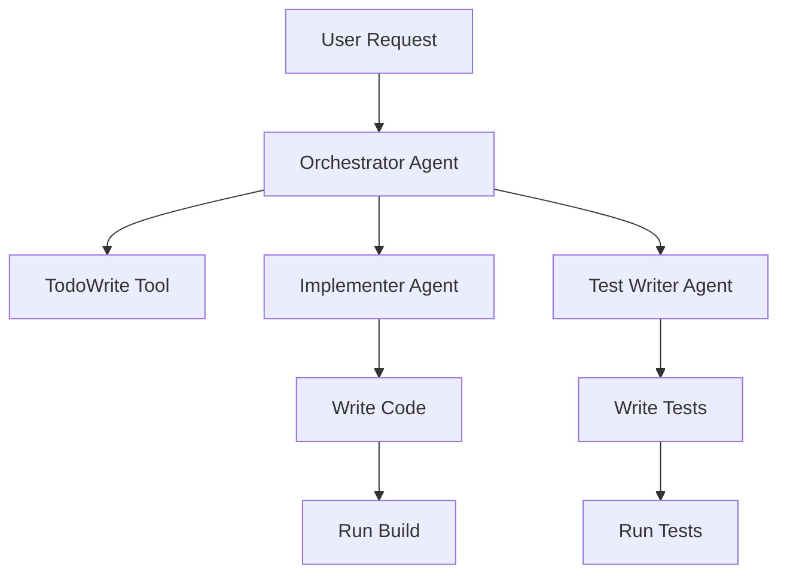

# Coding Team Example

## Overview

This example demonstrates how multiple specialized agents can collaborate to implement software features, similar to how a development team works together.

## Architecture



## Agents

### Orchestrator Agent
- **Role**: Project manager / Tech lead
- **Tools**: `read`, `list`, `task`, `todowrite`
- **Responsibilities**:
  - Break down feature requests into tasks
  - Track progress with TodoWrite
  - Delegate to specialists
  - Ensure quality standards are met

### Implementer Agent
- **Role**: Senior developer
- **Tools**: `read`, `write`, `grep`, `list`, `shell`
- **Responsibilities**:
  - Write production code
  - Follow existing patterns
  - Ensure code compiles
  - Fix compilation errors

### Test Writer Agent
- **Role**: QA engineer
- **Tools**: `read`, `write`, `grep`, `list`, `shell`
- **Responsibilities**:
  - Write comprehensive tests
  - Follow test conventions
  - Ensure tests pass
  - Cover edge cases

## Key Patterns Demonstrated

### 1. Pull Architecture
Each agent independently gathers the information they need:
- Implementer uses `grep` to find patterns, then `read` to understand code
- Test writer reads implementation to understand what to test
- No massive context passing between agents

### 2. Agentic Loop
Each agent iterates to refine their work:
```
Iteration 1: Search for patterns (grep)
Iteration 2: Read relevant files
Iteration 3: Plan approach
Iteration 4: Write code/tests
Iteration 5: Run validation (shell)
Iteration 6: Fix issues if needed
```

### 3. TodoWrite Integration
The orchestrator maintains a visible task list showing progress:
```
[ ] Analyze codebase structure
[ ] Implement factorial function
[ ] Add JSDoc documentation
[ ] Write unit tests
[ ] Run tests to verify
[ ] Validate implementation meets spec
```

### 4. Shell Tool Usage
Agents can run actual commands to validate their work:
- `npm test` - Run test suite
- `npx tsc --noEmit` - Type check without emitting
- `npm run build` - Build the project

## Running the Example

### Setup

1. Install dependencies for the sample project:
```bash
cd examples/coding-team/sample-project
npm install
cd ..
```

2. Run the example:
```bash
npx tsx coding-team.ts
```

### What Happens

1. **Orchestrator** receives the feature request (implement factorial function)
2. **Orchestrator** explores the codebase and creates a task plan
3. **Orchestrator** delegates implementation to **Implementer**
4. **Implementer** searches for patterns, reads existing code, writes factorial function
5. **Implementer** runs type checking to ensure no errors
6. **Orchestrator** delegates test creation to **Test Writer**
7. **Test Writer** reads the implementation, writes comprehensive tests
8. **Test Writer** runs tests to ensure they pass
9. **Orchestrator** validates everything meets requirements
10. **Orchestrator** marks all tasks as complete

## Expected Output

The agents will:
1. Add a `factorial` function to `src/math.ts`
2. Add tests for factorial to `tests/math.test.ts`
3. Ensure all tests pass
4. Provide a summary of work completed

## Customization

You can modify the feature request in `coding-team.ts` to implement different features:
- Add a fibonacci function
- Implement a prime number checker
- Create a GCD calculator
- Add array utility functions

## Limitations

- Shell commands are restricted to safe operations (no `rm -rf`, etc.)
- Working directory is confined to the sample project
- No access to external networks or package installation

## Benefits Demonstrated

1. **Efficiency**: Each agent only loads what they need (pull architecture)
2. **Quality**: Code follows existing patterns automatically
3. **Transparency**: TodoWrite shows progress in real-time
4. **Validation**: Actual tests run to prove correctness
5. **Collaboration**: Clean separation of concerns between agents

## Comparison with Other Systems

| Aspect | This System | GitHub Copilot | Cursor | Devin |
|--------|------------|---------------|--------|-------|
| Multi-agent | Yes | No | No | Yes |
| Pull architecture | Yes | No | No | No |
| Task tracking | Yes (TodoWrite) | No | No | Yes |
| Test execution | Yes | No | Limited | Yes |
| Token efficiency | High | N/A | Low | Very Low |

## Next Steps

This example could be extended to:
- Add a code reviewer agent for PR reviews
- Implement a bug fixer agent for failing tests
- Create a documentation writer agent
- Add a refactoring specialist agent
- Integrate with real Git operations