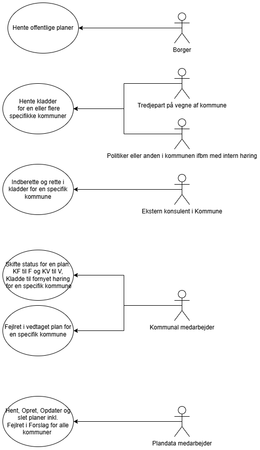

Delaftale 1 (Vedligehold og videreudvikling)

Bilag 1 Behovsopgørelse

Instrukser/vejledning til Kunde og Leverandør vedrørende udfyldelse af dokumentet er markeret med farve:

- Tekst markeret med turkis skal *erstattes* med Kundens tekst inden igangsættelse af miniudbud
- Tekst markeret med gult skal *erstattes* med Leverandørens besvarelse inden tilbudsafgivelse
- Tekst markeret med gråt skal *slettes* af Kunden eller Leverandøren

## Indhold

[1	Indledning	3](.)

[1.1	Formål	3](.)

[1.1.1	PLEJ/PPRAM	3](.)

[1.1.2	TUFF (Tilsyn med udlejning til ferie og fritidsformål) - Sommerhusloven	4](.)

[1.2	Budgetloft	4](.)

[2	Behovsopgørelse	4](.)

[2.1	Udvikling - UDGÅR	4](.)

[2.2	Overtagelsesopgaven	4](.)

[2.2.1	Systembeskrivelse	5](.)

[2.3	Vedligeholdelsesopgaven	5](.)

[2.3.1	Krav til vedligeholdelsen	5](.)

[2.3.2	Arkitekturkrav	7](.)

[2.3.3	Samarbejde med Kundens øvrige Leverandører	7](.)

[2.3.4	Support på anmodning fra Kunden	8](.)

[2.3.5	Assistance i forbindelse med ophør	8](.)

[3	Videreudvikling	9](.)

[4	Cases	9](.)

[4.1	Case 1: Plantypen Landzonetilladelser skal udvides	9](.)

[4.1.1	Case-spørgsmål	9](.)

[4.2	Case 2: Udvidet rollestyring	10](.)

[4.2.1	Case-spørgsmål	11](.)

## 1 Indledning

Dette bilag indeholder Kundens behov i forhold til overtagelse, vedligeholdelse og videreudvikling som præciseret i Leverancekontrakten.

Til dette bilag knytter sig følgende underbilag:

- Bilag 1.0.1 Antal incidents og fejl
- Bilag 1.1 Løsningsbeskrivelse (Leverandørens besvarelse af behov)
- Bilag 1.2 Kravmatrix
- Bilag 1A Systembeskrivelse
- Bilag 1B Identificerede videreudviklingsopgaver

Leverancebeskrivelsen udgøres af dette bilag, Bilag 1.1, Bilag 1.2, Bilag 1A og Bilag 1B.

Kundens behov er opgjort nedenfor i punkt 2.

### 1.1 Formål

Udbuddets og opgavens indhold dækker over vedligehold og videreudvikling af IT-systemerne PLEJ/PPRAM og TUFF.

#### 1.1.1 PLEJ/PPRAM

Plandata.dk er Danmarks digitale register for planer efter planloven (jf. planlovens § 54 b og plandatabekendtgørelsen), og en række planer og tilladelser skal offentliggøres igennem og udstilles i systemet. Foruden PLEJ/PPRAM, indeholder Plandata.dk flere applikationer, herunder PDK, som er selve registeret for planoplysninger, samt [kort.plandata.dk](http:/kort.plandata.dk) , [visplaner.plandata.dk](http:/visplaner.plandata.dk) og [kommuneplaner.plandata.dk/](https:/kommuneplaner.plandata.dk) , som alle er offentlige udstillinger af plandokumenter, -oplysninger og -geometrier.

PLEJ/PPRAM er kernekomponenter i Danmarks digitale planregister, Plandata.dk, hvori planer efter planloven offentliggøres og udstilles. Således udgør PLEJ/PPRAM-brugergrænsefladen for kommuners indberetning til Plandata.dk samt en kompleks beregningskerne, der nedbryder indberettede plandata til (del)jordstykkeniveau og leverer dataene til Skatteministeriet (SKM) til brug for ejendomsvurderingerne.

PLEJ/PPRAM tjener en række formål. De primære er:

- Indberetning af kommunale planer (kommuneplaner, lokalplaner mfl.) til Plandata.dk.
- Udsendelse af høringsmeddelelser om offentliggørelse af nye planforslag, -vedtagelser og -aflysninger.
- Nedbrydning og beregning af plangrundlag til (del)jordstykkeniveau.
- Levering af udtræksdata for (del)jordstykker og planoplysninger til Vurderingsmyndigheden til brug for Skatteministeriets ejendomsvurderinger.

Siden Plandata.dk kom i drift i 2018, er det samlede system, og i særlig grad PLEJ/PPRAM, løbende blevet udvidet. Indenfor det sidste år har Plandata.dk udskiftet snitfladen der bruges af tredjeparter til et REST API samt gjort det muligt at indberette og udstille fuldt digitale kommuneplaner. Derudover er systemet generelt blevet udvidet både med flere muligheder for at indberette nye oplysninger og med nemmere indberetning af eksisterende funktionaliteter. Der er stor bevågenhed omkring Plandata.dk, særligt hos kommunerne og SKM, men også fra virksomheder og borgere. Offentliggørelsen af planer er en afgørende for om planen er juridisk bindende og det er derfor et system, der kun tåler kortvarig nedetid eller fejlende funktioner.

#### 1.1.2 TUFF (Tilsyn med udlejning til ferie og fritidsformål) - Sommerhusloven

TUFF er et system, der er udviklet for at lette sagsbehandlingen i Plan- og Landdistriktstyrelsens tilsyn med udlejning af ferieboliger, fleksboliger og værelser m.v. til ferie- og fritidsformål. Tilsynet udføres af Teamet for Ferieboliger og tilsyn efter Sommerhusloven. TUFF-værktøjet muliggør, at tilsynsmedarbejderne nemt og effektivt kan indhente oplysninger, der er relevante for oplysningen af tilsynssager, og det giver samtidig mulighed for automatisk generering af dokumenter og breve.

### 1.2 Budgetloft

Den forventede værdi for hele kontraktperioden inkl. optioner er i alt 37,5 mio. kr. eksklusive moms, hvilket også er den godkendt budgetramme.

Den maksimale værdi for kontraktperioden inkl. optioner er 45 mio. kr. eksklusive moms. Overskridelse af den forventede kontraktværdi på 37,5 mio. kr. eksklusive moms kræver, at der foreligger en skriftlig godkendelse heraf fra såvel Kunden som Plan- og Landdistriktsstyrelsens direktion.

## 2 Behovsopgørelse

Dette punkt indeholder Kundens Behovsopgørelse, hvori kravene til Leverancens nærmere indhold fastlægges. Punktet har til formål at specificere Kundens behov, uanset om der er tale om en Leverancekontrakt om (1) udvikling, (2) udvikling, vedligeholdelse og videreudvikling eller (3) overtagelse, vedligeholdelse og videreudvikling.

Behovsopgørelsen består af:

- Krav til udviklingsprojektet, jf. punkt 2.1 - UDGÅR
- Krav til overtagelsesopgaven, jf. punkt 2.2
- Krav til vedligeholdelsesopgaven, jf. Punkt 2.3

### 2.1 Udvikling - UDGÅR

UDGÅR

### 2.2 Overtagelsesopgaven

Leverandøren skal overtage de systemer/komponenter, der er beskrevet i punkt 2.2.1 Systembeskrivelse, eventuelt med tilhørende underbilag eller en reference til det sted, hvor beskrivelsen findes.

I Bilag 2.1 Leverandørens tidsplan beskriver Leverandøren, hvordan overtagelsesopgaven forventes løst.

Leverandøren bedes i sin besvarelse af overtagelsesopgaven svare ud fra det vidensgrundlag vedkommende har og skal angive de oplysninger, der efterspørges, uanset om Leverandøren er eksisterende eller ny leverandør.

Såfremt der vurderes at være elementer ved overtagelsen, der (fordi man er eksisterende leverandør) kræver væsentlig mindre indsats eller færre timer, skal dette eksplicit anføres med en begrundelse herfor.

#### 2.2.1 Systembeskrivelse

De systemer eller de komponenter , Leverandøren skal overtage til vedligeholdelse, jf. afsnit 2.3 og i henhold til Leverancekontrakten, omfatter de systemer/komponenter og den funktionalitet, er beskrevet i Bilag 1A Systembeskrivelse.

### 2.3 Vedligeholdelsesopgaven

Leverandøren skal vedligeholde de systemer/komponenter, der er beskrevet i punkt 2.2.1 Systembeskrivelse, eventuelt med tilhørende underbilag eller en reference til det sted, hvor beskrivelsen findes.

#### 2.3.1 Krav til vedligeholdelsen

Leverandøren skal proaktivt udføre forebyggende og afhjælpende vedligeholdelse af de omfattede systemer/komponenter jf. punkt 2.2.1, samt sørge for god og driftssikker stand i samarbejde med Kundens driftsleverandør.

Leverandøren skal foretage vedligeholdelse i henhold til de af Kunden fastsatte krav. For hver vedligeholdelsesopgave vil Kunden fastsætte specifikke krav i tillæg til, eller som erstatning for, de krav der er anført nedenfor.

**Krav markeret med  skal opfyldes som en del af det faste månedlige vederlag. Opgaver forbundet med opfyldelse af alle andre krav afregnes efter medgået tid.**

| ID     | Beskrivelse                                                                                                                                                           |
|--------|-----------------------------------------------------------------------------------------------------------------------------------------------------------------------|
| KRAV 1 | Samarbejdsværktøj Leverandøren skal benytte Kundens samarbejdsværktøjer, således at der understøttes en samlet proces vedrørende henvendelser fra Kunden om systemet. |

| ID  ID    | Beskrivelse                                                                                                                                                     |
|-----------|-----------------------------------------------------------------------------------------------------------------------------------------------------------------|
| KRAV 2    | Standard for estimering af opgaver Leverandøren skal benytte den til hver tid af Kunden ønsket standard for opgave estimering (f.eks. storypoints eller timer). |

| ID     | Beskrivelse                                                                                                                                                                                    |
|--------|------------------------------------------------------------------------------------------------------------------------------------------------------------------------------------------------|
| KRAV 3 | Standard for tidsregistrering Leverandøren skal benytte tidsregistreringsløsningen fra Kundens samarbejdsværktøjer og opdatere i denne mindst en gang dagligt for igangsatte tildelte opgaver. |

| ID       | Beskrivelse                                                                                                                                                                                                                                                                                                                                                                         |
|----------|-------------------------------------------------------------------------------------------------------------------------------------------------------------------------------------------------------------------------------------------------------------------------------------------------------------------------------------------------------------------------------------|
| [KRAV 4] | Standard for månedsrapportering Leverandøren skal foretage rapportering månedsvis. Rapporten er SLA belagt, jf. Bilag 6 Service Level Agreement (SLA).  Leverandøren skal benytte den til enhver tid af Kunden anviste standard for månedsrapportering.  Leverandøren skal på kundens opfordring månedsvis give møde med relevante personale således at statusmøde kan gennemføres. |

| ID     | Beskrivelse                                                                                                                                                                                                                                                                                                                                                                                                                                                                                                                                                                                                                                                                                                 |
|--------|-------------------------------------------------------------------------------------------------------------------------------------------------------------------------------------------------------------------------------------------------------------------------------------------------------------------------------------------------------------------------------------------------------------------------------------------------------------------------------------------------------------------------------------------------------------------------------------------------------------------------------------------------------------------------------------------------------------|
| KRAV 5 | Standard for change og release Leverandøren skal rådgive og være Kunden behjælpelig i forbindelse med udfyldelse af request for changes (RFC).  Leverandøren skal orientere Kunden, hvis der er er risiko for datatab og behov for backup, inden ændringer deployes i drift.   Leverandøren skal på Kundens opfordring udarbejde releasenote ved planlagte releases af systemet, indeholdende: Releasebetegnelse og/eller versionsnummer. Liste over issues, der er inkluderet i versionen (medført kodeændringer). Testrapport udarbejdet af Leverandørens egen testansvarlig, iht. Kundens specifikation.     Leverandøren skal til en hver tid følge og anvende den af Kunden udmeldte change procedure. |

| ID     | Beskrivelse                                                                                                                                                                                            |
|--------|--------------------------------------------------------------------------------------------------------------------------------------------------------------------------------------------------------|
| KRAV 6 | Svartider må ikke forringes uden Kundens samtykke Systemet skal vedligeholdes på en sådan måde, at svartider så vidt muligt ikke forringes, og i modsat fald skal Kunden orienteres og godkende dette. |

| ID     | Beskrivelse                                                                                                                                                                                                                                                                                    |
|--------|------------------------------------------------------------------------------------------------------------------------------------------------------------------------------------------------------------------------------------------------------------------------------------------------|
| KRAV 7 | Opdatering af Dokumentation til driftsleverandør Det er Leverandørens ansvar at notificere Kunden, såfremt der er ændringer til de elementer, der udgør den applikationsspecifikke driftsvejledning eller anden Dokumentation for en given applikation, således at denne kan holdes opdateret. |

#### 2.3.2 Arkitekturkrav

Det er vigtigt for Kunden, at styrelsens systemer er opbygget efter samme model. Grundprincippet i udviklingen i forbindelse med vedligeholdelsesopgaverne er, at den eksisterende it-arkitektur og de anvendte udviklingsprincipper skal videreføres, jf. Bilag E Rammearkitektur og Bilag F.1 Agil metode.

#### 2.3.3 Samarbejde med Kundens øvrige Leverandører

Leverandøren skal samarbejde med Kundens driftsleverandører og øvrige Leverandører for at sikre effektiviteten i hver parts arbejde med systemet, og for at medvirke til, at der bliver taget hånd om alle relevante processer. Al kommunikation mellem Kundens leverandører vil som udgangspunkt altid gå via Kunden. Alternativt vil indledende kommunikation gå via Kunden, der så sikrer, at de rette kontaktpersoner hos Leverandørerne sættes i kontakt med hinanden. Ved opståede Fejl uden for Kundens arbejdstid kan kommunikation foregå direkte mellem Leverandørerne, såfremt kommunikationen dokumenteres og tidsregistreres på en konkret sag i Kundens samarbejdsværktøjer.

| ID     | Beskrivelse                                                                                                                                                                                                                                                               |
|--------|---------------------------------------------------------------------------------------------------------------------------------------------------------------------------------------------------------------------------------------------------------------------------|
| KRAV 8 | Leverandøren skal stå til rådighed I forbindelse med driftsleverandørens eller øvrige af Kundens Leverandørers ændringer af systemets platform, basiskomponenter og andet skal Leverandøren stå til rådighed med rådgivning og om nødvendigt gennemføre test af systemet. |

| ID     | Beskrivelse                                                                                                                                                                                                                                                                                                                            |
|--------|----------------------------------------------------------------------------------------------------------------------------------------------------------------------------------------------------------------------------------------------------------------------------------------------------------------------------------------|
| KRAV 9 | Registrering af kommunikation med 3. part Alt relevant kommunikation med 3. part (f.eks. driftsleverandører og Leverandørens egne underleverandører) skal registreres i Kundens samarbejdsværktøjer, jf. krav 1.  Leverandøren skal ligeledes tidsregistrere denne opgave på en konkret sag i Kundens samarbejdsværktøjer, jf. krav 3. |

#### 2.3.4 Support på anmodning fra Kunden

Leverandøren skal yde support på anmodning fra Kunden.

| ID      | Beskrivelse                                                                                                                                                                                                                            |
|---------|----------------------------------------------------------------------------------------------------------------------------------------------------------------------------------------------------------------------------------------|
| KRAV 10 | Leverandøren skal levere medarbejdere til support on site hos Kunden Leverandøren skal på anmodning fra Kunden med 2 Arbejdsdages varsel levere medarbejdere til support on site hos Kunden, medmindre der er indgået aftale om andet. |

#### 2.3.5 Assistance i forbindelse med ophør

Leverandøren skal assistere Kunden med overdragelse af vedligeholdelsesopgaven, sådan at en så smidig overdragelse som muligt gennemføres.

| ID      | Beskrivelse                                                                                                                                                                                                                                                                                                                                                                                                                                                                                                                                                                                                                                  |
|---------|----------------------------------------------------------------------------------------------------------------------------------------------------------------------------------------------------------------------------------------------------------------------------------------------------------------------------------------------------------------------------------------------------------------------------------------------------------------------------------------------------------------------------------------------------------------------------------------------------------------------------------------------|
| KRAV 11 | Leverandørens assistance ved ophør På anmodning fra Kunden skal Leverandøren assistere Kunden i forbindelse med overdragelse af vedligeholdelsesopgaven jf. Leverancekontraktens punkt 20.  Aktiviteterne for Leverandøren er (men ikke begrænset til): Udpege en beslutningsdygtig projektleder, der er kontaktpunkt for Kunden. Stille med en person, som har stort kendskab til systemet (-erne) omfattet af vedligeholdsopgaven. Med et varsel på 5 Arbejdsdage skal Leverandøren: Deltage aktivt i gennemførsel af transitionsplanen. Gennemføre præsentationer og svare på spørgsmål. Samarbejde med ny leverandør i transitionsfasen. |

## 3 Videreudvikling

Kunden har ved Leverancekontraktens indgåelse identificeret en række videreudviklingsopgaver i de systemer/komponenter, der vedligeholdes, der kan blive igangsat efter Kundens valg i løbet af Leverancekontraktens løbetid. Videreudviklingsopgaverne fremgår af Bilag 1B, Identificerede videreudviklingsopgaver.

## 4 Cases

Leverandøren skal som en del af tilbudsafgivelsen i Bilag 1.1 Løsningsbeskrivelse afgive en bevarelse på nedenstående cases.

Se kravene for besvarelse i Bilag 1.1 Løsningsbeskrivelse.

### 4.1 Case 1: Plantypen Landzonetilladelser skal udvides

- **Den nuværende situation**

I Plandata kan der i dag kun angives ganske få oplysninger om ”plantypen” [landzonetilladelser](https:/confluence.erst.dk/x/KweqAQ) .

Landzonetilladelser er en afgørelse kommunen kan træffe og som består af et retligt gældende pdf-dokument, der beskriver hvad der er givet tilladelse til og som skal indberettes til Plandata. I indberetning kan man angive tre forskellige anvendelser som tilladelsen behandler samt en mulighed for at angive ”andet”. Landzonetilladelser omhandler dog en lang række emner som der ikke kan vælges og der efterspørges ofte fra SKM og fra Plandatas egen styrelse og departement at flere oplysninger om landzonetilladelser kan indberettes.

- **Vores ønsker til fremtiden**
    - Plandata ønsker at:
        - At flere at de mest almindelige anvendelser kan angives på en nem måde i brugerfladen
        - At landzonetilladelser kan indberettes via Plandatas REST API.
        - At oplysningerne skal kunne komme med i udtræk til SKM

#### 4.1.1 Case-spørgsmål

Med udgangspunkt i Plandata’s nuværende system, beskriv hvordan I ville håndtere den ovenstående opgave med følgende elementer:

- Et forslag til design af en ny indberetning hvor disse oplysninger kan indberettes i PPRAMs brugerflade.
- Et forslag til hvordan landzonetilladelser skal kunne indberettes via REST API med udgangspunkt i Plandatas nuværende setup og jeres forslåede design
- Et forslag til hvordan oplysningerne skal medsendes i udtræk til SKM baseret på den nuværende snitfladebeskrivelse

### 4.2 Case 2: Udvidet rollestyring

- **Den nuværende situation**

Plandata API bruger i dag en basic auth løsning til bruger certificering af tredjeparter. Erhvervsstyrelsens ønsker dog at udfase brugen af basic auth autentificering af sikkerhedshensyn. Plandata.dk har i den forbindelse behov for at skifte autentificeringen af tredjeparter til virksomhedscertifikat når dette bliver muligt i sector9 (ERST brugerhåndteringssystem). I den forbindelse vil rettighedsstrukturen skulle gennemgås så Plandata bedst muligt kan styre hvilke brugere der har adgang til at lave hvilke handlinger i Plandata.dk.

- **Vores ønsker til fremtiden**

Nedenfor ses en række brugere som skal kunne tilgå de nævnte funktioner samt dem for de mindre restriktive niveauer (dvs. en konsulent der kan rette i kladder skal ikke kunne rette vedtagne planer, men skal kunne hente kladder for den specifikke kommune og hente offentlige planer). Der findes i dag offentlig adgang til planer, adgang som kommunal medarbejder og adgang som plandata medarbejder. Men det er ikke på nuværende tidspunkt muligt at give rettigheder til at hente kladder og redigere kladder som separate roller.

Vi ønsker at gøre dette muligt, så de brugere der har behov for at kunne tilgå f.eks. kladder kan få adgang til dette uden få adgang til følsomme funktioner som rettelse af vedtagne planer og statusskifte.

#### 4.2.1 Case-spørgsmål

Med udgangspunkt i Plandata’s nuværende system, beskriv hvordan I ville håndtere den ovenstående opgave med følgende elementer:

- En redegørelse af hvilke rettelser til rollestyringen, PPRAMs indberetningsflade og til REST API’et der skal laves for at gøre det muligt at servicere alle de nævnte samt eksisterende brugere.
- En nedbrydning af opgaven i stories som kan løses af det foreslåede team inden for en planning periode (ca. 6 sprints af 2 uger).
- En beskrivelse af hvilke dele af PLEJ/PPRAM der ville blive berørt af denne løsning.