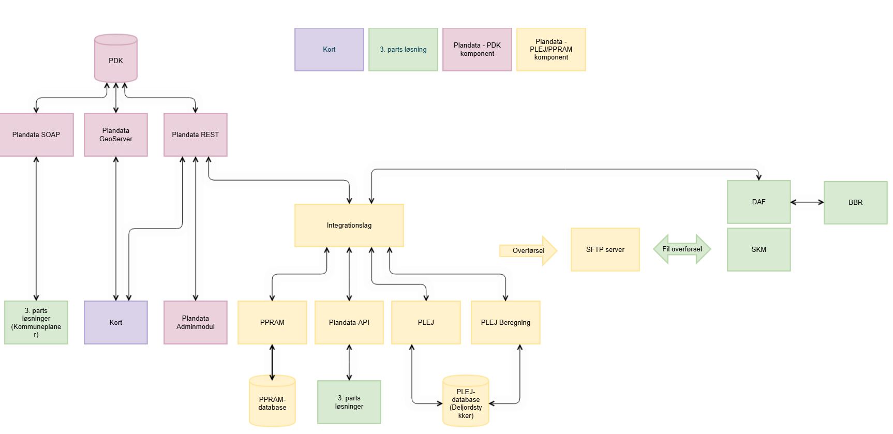
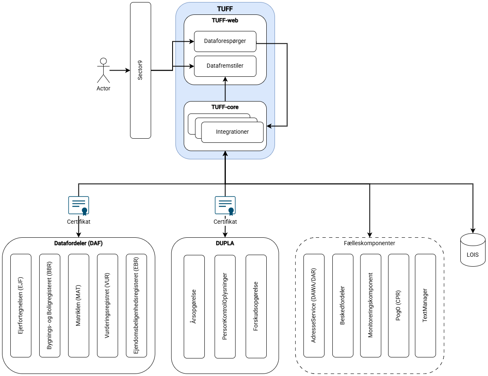

Delaftale 1 (Vedligehold og videreudvikling)

Bilag 1A Systembeskrivelse

Instrukser/vejledning til Kunde og Leverandør vedrørende udfyldelse af dokumentet er markeret med farve:

- Tekst markeret med turkis skal *erstattes* med Kundens tekst inden igangsættelse af miniudbud
- Tekst markeret med gult skal *erstattes* med Leverandørens besvarelse inden tilbudsafgivelse
- Tekst markeret med gråt skal *slettes* af Kunden eller Leverandøren

## 1 Indhold

[1	Systembeskrivelse	3](.)

[1.1	Plandata.dk – PLEJ/PPRAM	3](.)

[1.2	Sommerhusloven – TUFF	6](.)

[1.2.1.1	Teknologi	8](.)

## 2 Systembeskrivelse

Det system Leverandøren skal overtage til vedligeholdelse, omfatter de komponenter og den funktionalitet, som er beskrevet nedenfor.

### 2.1 Plandata.dk – PLEJ/PPRAM

**Indberetningsflade for kommuner**

Brugerfladen muliggør indberetning af oplysninger om en række kommunale plantyper. Oplysningerne er forskelligartede fra plantype til plantype, men involverer næsten altid en geografisk afgrænsning af planen. Indberetningsløsningen understøtter således, at kommuner kan uploade både plangeometrier og planoplysninger i forskellige filformater, aktuelt .shp, xml, GeoJSON og .tab, samt at de kan indberette direkte i brugerfladen bl.a vha. et tegneværktøj til at tegne planens geometrier. Det er desuden muligt at indberette planer til Plandata.dk igennem et REST API, som bruges af tredjeparter på vegne af kommuner.

Udsendelser af høringsmeddelelser er ligeledes en kritisk funktion ifm. at kunne understøtte offentliggørelsen af planer i Plandata.dk. Udsendelsesprocessen har kritiske afhængigheder til flere af ERST’s fælleskomponenter – se afsnit ’Overordnet arkitektur af systemet’ længere nede.

**Nedbrydning til Deljordstykker**

I nedbrydningen til (del)jordstykkeniveau tolkes det på enhver del af et jordstykke, som har fælles samlet plangrundlag, hvilke planbestemmelser der gælder. Ud fra den nedbrydning og oplysninger fra Matriklen og BBR beregnes vejledende anvendelses- og udnyttelsesmuligheder. Den samlede nedbrydning og beregning foretages løbende, samt for årlige, passerede terminsdatoer, og i særlige tilfælde udvælges (del)jordstykker systematisk til manuel kontrol i kommunen. Denne kontrol foregår ligeledes i PLEJ/PPRAM. Både (del)jordstykker og relaterede planoplysninger leveres til SKAT i udtræk flere gange om året.

**Overordnet arkitektur af PLEJ/PPRAM og dets relation til Plandata.dk**

**Figur 1 Overordnet system arkitektur (** [**https://confluence.erst.dk/display/PLP00/A-02+Overordnet+system+tegning**](https:/confluence.erst.dk/display/PLP00/A-02+Overordnet+system+tegning) **)**

Systemet PLEJ/PPRAM består af en række komponenter hvoraf de vigtigste er:

- PPRAM-komponenten sørger for at udstille et ensartet brugerinterface for de registerdata som findes i PLEJ og PDK. Komponenten håndterer processer for indberetning af planer, herunder igangsættelse af validering gennem Regelmotor der ligger i integrationslaget og videre til PDK for at gemme. PPRAM-komponenten udstiller også brugergrænseflade til visning og korrigering af de beregnede deljordstykker der er resultatet af de indberettede planer, samt brugergrænsefladen for både PDK og PLEJ med kortfuktionalitet
- PLEJ komponentens primære opgave er at udstille services med informationer om deljordstykker fra datalageret. Komponenten har ikke nogen brugerinterface og tilgås kun via services.
- PLEJ Beregning komponenten står for at nedbryde og beregne informationer fra planer til deljordstykker.
- Integrationslaget håndterer kommunikation for PLEJ, PPRAM, Plandata-API samt Regelmotor.
- Regelmotoren udstiller funktionalitet til validering af data.
- Plandata-API er udstillingsendepunkt til brug for tredjeparter der udbyder services til kommunerne.

[Man kan læse mere om arkitektur og komponenter her](https:/confluence.erst.dk/x/HSGfAQ)

Al kommunikation til og fra PLEJ/PPRAM-systemet går så vidt muligt igennem Integrationslaget. Der er integrationer med følgende systemer:

- Eksterne systemer:
    - **PDK** : PDK er selve registeret for Plandata.dk. Integrationslaget benytter PDK-REST services dedikeret til PLEJ/PPRAM’s behov ved hent og gem af planer. Udover data omkring planer hentes også kommunegrænser, zonegrænser og matrikeldata fra PDK. PDK er ikke eksternt for ERST, men samtidig ikke etableret som en fælleskomponent.
    - **SKM** : Systemet lægger dataudtræk på en SFTP-server, som Skatteministeriet (SKM) kan tilgå for at få data omkring (del)jordstykker.
    - **DAF** : Datafordeleren, bruges bl.a. til at hente bygningsenheder og ændringer fra **BBR** til brug for (del)jordstykkeberegninger.
    - Services fra **Dataforsyningen** bruges til at hente de baggrundskort (topografi og ortofoto), der bruges på alle kort i systemet.

[Snitfladerne til eksterne systemer er beskrevet her i dokumentationen](https:/confluence.erst.dk/x/ISGfAQ) .

- ERST fælleskomponenter:
    - **Beskedfordeler** (benyttes i forbindelse med udsendelse af meddelelser til høringsparter)
    - **TextManager** (benyttes til at administrere tekster i brugergrænsefladen og til emails, der sendes ud til høringsparter)
    - **Sector9** (Autentificering af bruger, rettigheds- og rollestyring, NemID)
    - **PogO** (opslag på aktører, kommuner, høringslister, Personer og Organisationer)
    - **SAG** (Sagslager og Sagsindex bruges til at gemme/hente sager for deljordstykker samt i forbindelse med journalisering af meddelelser til høringsparter)
    - **Dokumentlager** (benyttes i forbindelse med journalisering af udsendelser og andre sager i sagslager)
    - **TidTil** (benyttes til at igangsætte diverse jobs , f.eks. generering af SKM-udtræk)
    - **Monitorering** (benyttes for at udstille de forskellige komponenters driftsstatus)
    - **DIST** (benyttes til validering af cvrnr for forsyningsselskaber og berigelse af selskabsnavn)

[Integrationer til ERST fælleskomponenter er beskrevet her i dokumentationen](https:/confluence.erst.dk/x/ICGfAQ) .

For yderligere tegninger og forklaringer til at danne overblik over løsningens overordnede dele og integrationer, [se her i dokumentationen](https:/confluence.erst.dk/x/FCGfAQ) .

For en mere detaljeret beskrivelse af systemarkitekturen, [se her i dokumentationen](https:/confluence.erst.dk/x/HSGfAQ) .

**Øvrig dokumentation**

[For link til den samlede dokumentation af systemet](https:/confluence.erst.dk/x/lQBEAQ)

Det vurderes særlig relevant at orientere sig i afsnit S4 Systemdokumentation og S5 Kodedokumentation. Den samlede løsning vurderes grundlæggende at være grundigt dokumenteret, og det er en prioritet også fremadrettet at vedligeholde den løbende ifm. udvikling.

Da integrationen imellem PLEJ/PPRAM og PDK er særligt relevant for al vedligehold og udvikling af Plandata.dk, vurderes det relevant at orientere sig i PDK’s dokumentation. Også her vurderes afsnit S4 Systemdokumentation særlig relevant.

[Dokumentationen kan tilgås her](https:/confluence.erst.dk/x/7g9mAQ) .

### 2.2 Sommerhusloven – TUFF

TUFF henter oplysninger vedrørende ejendomme og lejeindtægter fra en række forskellige datakilder og systemer. Nogle af oplysningerne er offentligt tilgængelige, mens andre kræver særlige adgange for at tilgå. TUFF samler oplysningerne på baggrund af henholdsvis CPR, BFE og Kommune-Ejendomsnummer identifikationerne, der fungerer som systemets unikke nøgler.

TUFF kan alene hente oplysninger på private personer (ikke-juridiske personer). Det er således ikke muligt at slå virksomheder op i TUFF. Der kan desuden alene laves enkeltopslag, så det er ikke muligt at trække en liste af CPR-numre.

**Overordnet arkitektur af systemet**

TUFF er internt opdelt i to moduler: i) TUFF-web, der indeholder Dataforespørger og Datafremviser og ii) TUFF-core, som indhenter relevant data fra løsningens eksterne integrationer og samler dette til information til TUFF-web.

Adgang til systemet opnås gennem Sector9 med NemLogin.

Systemtegningen giver overblik over opbygning og integrationer. Integrationerne listes desuden her:

- Eksterne systemer/datakilder:
    - Datafordeler (DAF)
    - Matriklen (MAT)
    - Ejendomsbeliggenhedsregistret (EBR)
    - Bygnings- og Boligregistret (BBR)
    - Vurderingsregistret (VUR)
    - OIS tabel (LIfa A/S’ LOIS database)
    - DUPLA

- ERST fælleskomponenter:
    - AdresseService
    - Beskedfordeler
    - Monitoreringkomponent
    - PogO
    - Sector9
    - TextManager

**Øvrig dokumentation**

[For yderligere dokumentation af TUFF henvises til Confluence](https:/confluence.erst.dk/x/sg_oAw)

##### 1 Teknologi

De vigtigste teknologier som bruges i de forskellige komponenter findes på listen nedenfor.

| Komponent             | Ansvar                                                                                                                                     | Teknologi                                                                                                                                         | Beskrivelse                                                                                                                                                                                                                                         |
|-----------------------|--------------------------------------------------------------------------------------------------------------------------------------------|---------------------------------------------------------------------------------------------------------------------------------------------------|-----------------------------------------------------------------------------------------------------------------------------------------------------------------------------------------------------------------------------------------------------|
| PPRAM                 | Brugergrænseflade til PDK og PLEJ                                                                                                          | Java 11, Tomcat 9.0.54 Grails v. 6.2.3, Groovy v. 3.0.23, GORM v. 8.1.1 Open Layers v. 4.6.5 (kort funktionalitet) GeoTools v. 32.1 GDAL v. 3.4.3 | Open Layers er open source og bruges til den brugerdefinerede kort funktionalitet. GeoTools er open source og benyttes i forbindelse med upload af geometrier GDAL er open source software, som GeoTools benytter til konvertering af MapInfo-filer |
| PLEJ                  | Udstiller beregnet data og alt der ikke er beregning af vurderingsdata                                                                     | Java 11, Tomcat 9.0.54 Grails v. 6.2.3, Groovy v. 3.0.23, GORM v. 8.1 GeoTools v. 32.1                                                            |                                                                                                                                                                                                                                                     |
| PLEJBEREGNING         | Beregning af vurderingsdata på jordstykke niveau og spacial Er en del af PLEJ der bliver deployed som en separat komponent for performance | Java 11, Tomcat 9.0.54 Grails v. 6.2.3, Groovy v. 3.0.23, GORM v. 8.1.1 GeoTools v. 32.1                                                          |                                                                                                                                                                                                                                                     |
| INTEGRATION           | Enterprise service bus (ESB) mellem de 3 løst koblede komponenter PPRAM, PLEJ og Integrationslaget (Regelmotor)                            | Java 11, Tomcat 9.0.54 Grails v. 6.2.3, Groovy v. 3.0.23                                                                                          |                                                                                                                                                                                                                                                     |
| PLANDATA-API          | REST-API endepunkt til udstilling for 3. parter                                                                                            | Java 11, Tomcat 9.0.54 Grails v. 6.2.3, Groovy v. 3.0.23                                                                                          |                                                                                                                                                                                                                                                     |
| Regelmotor/validering | Validering af forretnings- og dataregler                                                                                                   | Java 11, Tomcat 9.0.54 Grails v. 6.2.3, Groovy v. 3.0.23 Drools v. 7.74.1                                                                         | Drools er en open source regelmotor baseret på Rete algorithm.                                                                                                                                                                                      |
| Databaser             | Persistering og spacial for PPRAM og PLEJ (2 databaser)                                                                                    | Oracle Database 19c - Enterprise Edition Release 19.0.0.0.0 - Production Version 19.26.0.0.0                                                      | ERST standard teknologi med Locator.                                                                                                                                                                                                                |
| TUFF                  | Tilsyn med udlejning til ferie- og fritidsformål                                                                                           | Java 1.8, Tomcat 9.0.52 Grails v. 5.0.13, Groovy v. 3.0.10                                                                                        |                                                                                                                                                                                                                                                     |

For mere information om teknologi: [PLEJ/PPRAM](https:/confluence.erst.dk/x/HiGfAQ) og [TUFF](https:/confluence.erst.dk/x/sg_oAw)