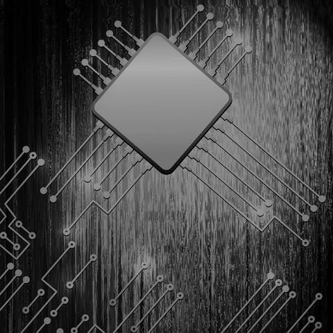

It-rammeaftale 2024-2028

Bilag 7

Databehandleraftale

**Vejledning til udfyldelse af databehandleraftaleskabelonen**

I nedenstående skabelon til databehandleraftale anvendes gule og lilla overstregninger med eksempler på tekst, der kan anvendes.

De gule overstregninger stammer fra Datatilsynets skabelon og beskriver bl.a., hvad du skal gøre.

De lilla overstregninger er Erhvervsstyrelsens forslag til tekst. Det bemærkes, at der er tale om forslag/eksempler, der som alt overvejende hovedregel skal anvendes . Hvis du efter en konkret vurdering mener, at forslagene ikke passer til netop den databehandleraftale, du skal indgå, skal du indsætte en kommentarboks herom med en kort begrundelse.

**Tekst uden farve er standardtekst/-bestemmelser fra Datatilsynet og må** **ikke** **slettes eller revideres.**

Hvis du er i tvivl, om hvordan skabelonen skal udfyldes, kontakt Team Jura på

[erstjura\_nysag@erst.dk](mailto:erstjura_nysag@erst.dk) .

Det er Erhvervsstyrelsens enkelte fagkontorer, der har ansvaret for og kompetence til at indgå kontrakter og tilhørende databehandleraftaler. Dog skal alle udkast til databehandleraftaler til gennemsyn i Team Jura inden underskrift. Databehandleraftalen kan vedlægges kontrakten/hovedaftalen, når denne sendes til gennemsyn i Team Jura.

**HUSK** at indsætte et sagsnr. til F2, hvor Databehandleraftalen er journaliseret, når I lægger kontrakten/hovedaftalen ind i kontraktoverblikket.

Ønsker I at sende skabelonen til eksterne skal I bruge Datatilsynets skabelon, som ligger på [Datatilsynets hjemmeside](https:/www.datatilsynet.dk/hvad-siger-reglerne/vejledning/vejledninger-i-pdf-format) . Denne skabelon er alene til *internt* brug.

Standardkontraktsbestemmelser

i henhold til artikel 28, stk. 3, i forordning 2016/679 (databeskyttelsesforordningen) med henblik på databehandlerens behandling af personoplysninger

mellem

Erhvervsstyrelsen

CVR-nummer 10150817

Langelinie Allé 17

2100 København Ø

Danmark

herefter ”den dataansvarlige”

og

CVR

herefter ”databehandleren”

der hver især er en ”part” og sammen udgør ”parterne”

HAR AFTALT følgende standardkontraktsbestemmelser (Bestemmelserne) med henblik på at overholde databeskyttelsesforordningen og sikre beskyttelse af privatlivets fred og fysiske personers grundlæggende rettigheder og frihedsrettigheder

## Indhold

[2. Præambel	4](.)

[3. Den dataansvarliges rettigheder og forpligtelser	4](.)

[4. Databehandleren handler efter instruks	5](.)

[5. Fortrolighed	5](.)

[6. Behandlingssikkerhed	5](.)

[7. Anvendelse af underdatabehandlere	6](.)

[8. Overførsel til tredjelande eller internationale organisationer	7](.)

[9. Bistand til den dataansvarlige	8](.)

[10. Underretning om brud på persondatasikkerheden	9](.)

[11. Sletning og returnering af oplysninger	10](.)

[12. Revision, herunder inspektion	10](.)

[13. Parternes aftale om andre forhold	10](.)

[14. Ikrafttræden og ophør	10](.)

[15. Kontaktpersoner hos den dataansvarlige og databehandleren	11](.)

[Bilag A	Oplysninger om behandlingen	12](.)

[Bilag B	Underdatabehandlere	13](.)

[Bilag C 	Instruks vedrørende behandling af personoplysninger	14](.)

[Bilag D	Parternes regulering af andre forhold	19](.)

## 1 Præambel

1. Disse Bestemmelser fastsætter databehandlerens rettigheder og forpligtelser, når denne foretager behandling af personoplysninger på vegne af den dataansvarlige.

1. Disse bestemmelser er udformet med henblik på parternes efterlevelse af artikel 28, stk. 3, i Europa-Parlamentets og Rådets forordning (EU) 2016/679 af 27. april 2016 om beskyttelse af fysiske personer i forbindelse med behandling af personoplysninger og om fri udveksling af sådanne oplysninger og om ophævelse af direktiv 95/46/EF (databeskyttelsesforordningen).

1. I forbindelse med leveringen af PLEJ/PPRAM og TUFF behandler databehandleren personoplysninger på vegne af den dataansvarlige i overensstemmelse med disse Bestemmelser.

1. Bestemmelserne har forrang i forhold til eventuelle tilsvarende bestemmelser i andre aftaler mellem parterne.

1. Der hører fire bilag til disse Bestemmelser, og bilagene udgør en integreret del af Bestemmelserne.

1. Bilag A indeholder nærmere oplysninger om behandlingen af personoplysninger, herunder om behandlingens formål og karakter, typen af personoplysninger, kategorierne af registrerede og varighed af behandlingen.

1. Bilag B indeholder den dataansvarliges betingelser for databehandlerens brug af underdatabehandlere og en liste af underdatabehandlere, som den dataansvarlige har godkendt brugen af.

1. Bilag C indeholder den dataansvarliges instruks for så vidt angår databehandlerens behandling af personoplysninger, en beskrivelse af de sikkerhedsforanstaltninger, som databehandleren som minimum skal gennemføre, og hvordan der føres tilsyn med databehandleren og eventuelle underdatabehandlere.

1. Bilag D indeholder bestemmelser vedrørende andre aktiviteter, som ikke af omfattet af Bestemmelserne.

1. Bestemmelserne med tilhørende bilag skal opbevares skriftligt, herunder elektronisk, af begge parter.

1. Disse Bestemmelser frigør ikke databehandleren fra forpligtelser, som databehandleren er pålagt efter databeskyttelsesforordningen eller enhver anden lovgivning.

## 2 Den dataansvarliges rettigheder og forpligtelser

1. Den dataansvarlige er ansvarlig for at sikre, at behandlingen af personoplysninger sker i overensstemmelse med databeskyttelsesforordningen (se forordningens artikel 24), databeskyttelsesbestemmelser i anden EU-ret eller medlemsstaternes nationale ret og disse Bestemmelser.

1. Den dataansvarlige har ret og pligt til at træffe beslutninger om, til hvilke(t) formål og med hvilke hjælpemidler, der må ske behandling af personoplysninger.

1. Den dataansvarlige er ansvarlig for, blandt andet, at sikre, at der er et behandlingsgrundlag for behandlingen af personoplysninger, som databehandleren instrueres i at foretage.

## 3 Databehandleren handler efter instruks

1. Databehandleren må kun behandle personoplysninger efter dokumenteret instruks fra den dataansvarlige, medmindre det kræves i henhold til EU-ret eller medlemsstaternes nationale ret, som databehandleren er underlagt. Denne instruks skal være specificeret i bilag A og C. Efterfølgende instruks kan også gives af den dataansvarlige, mens der sker behandling af personoplysninger, men instruksen skal altid være dokumenteret og opbevares skriftligt, herunder elektronisk, sammen med disse Bestemmelser.

1. Databehandleren underretter omgående den dataansvarlige, hvis en instruks efter vedkommendes mening er i strid med denne forordning eller databeskyttelsesbestemmelser i anden EU-ret eller medlemsstaternes nationale ret.

1. Er den dataansvarliges instruks i strid med denne forordning eller databeskyttelsesbestemmelser i anden EU-ret eller medlemsstaternes nationale ret, jf. Bestemmelse 9.2, foretager den dataansvarlige en vurdering af risikoen for den registrerede forbundet med den ulovlige instruks. Er der som følge af den ulovlige instruks sket et sikkerhedsbrud hos databehandleren, jf. databeskyttelsesforordningens art. 33, bistår den dataansvarlige databehandleren med anmeldelse til Datatilsynet på samme måde, som det fremgår af Bestemmelse 10.3 og 10.4 for databehandleren.

## 4 Fortrolighed

1. Databehandleren må kun give adgang til personoplysninger, som behandles på den dataansvarliges vegne, til personer, som er underlagt databehandlerens instruktionsbeføjelser, som har forpligtet sig til fortrolighed eller er underlagt en passende lovbestemt tavshedspligt, og kun i det nødvendige omfang. Listen af personer, som har fået tildelt adgang, skal løbende gennemgås. På baggrund af denne gennemgang kan adgangen til personoplysninger lukkes, hvis adgangen ikke længere er nødvendig, og personoplysningerne skal herefter ikke længere være tilgængelige for disse personer.

1. Databehandleren skal efter anmodning fra den dataansvarlige kunne påvise, at de pågældende personer, som er underlagt databehandlerens instruktionsbeføjelser, er underlagt ovennævnte tavshedspligt.

## 5 Behandlingssikkerhed

1. Databeskyttelsesforordningens artikel 32 fastslår, at den dataansvarlige og databehandleren, under hensyntagen til det aktuelle tekniske niveau, implementeringsomkostningerne og den pågældende behandlings karakter, omfang, sammenhæng og formål samt risiciene af varierende sandsynlighed og alvor for fysiske personers rettigheder og frihedsrettigheder, gennemfører passende tekniske og organisatoriske foranstaltninger for at sikre et beskyttelsesniveau, der passer til disse risici.

Den dataansvarlige skal vurdere risiciene for fysiske personers rettigheder og frihedsrettigheder som behandlingen udgør og gennemføre foranstaltninger for at imødegå disse risici. Afhængig af deres relevans kan det omfatte:

1. Pseudonymisering og kryptering af personoplysninger

1. evne til at sikre vedvarende fortrolighed, integritet, tilgængelighed og robusthed af behandlingssystemer og -tjenester

1. evne til rettidigt at genoprette tilgængeligheden af og adgangen til personoplysninger i tilfælde af en fysisk eller teknisk hændelse

1. en procedure for regelmæssig afprøvning, vurdering og evaluering af effektiviteten af de tekniske og organisatoriske foranstaltninger til sikring af behandlingssikkerhed.

1. Efter forordningens artikel 32 skal databehandleren – uafhængigt af den dataansvarlige – også vurdere risiciene for fysiske personers rettigheder som behandlingen udgør og gennemføre foranstaltninger for at imødegå disse risici. Med henblik på denne vurdering skal den dataansvarlige stille den nødvendige information til rådighed for databehandleren som gør vedkommende i stand til at identificere og vurdere sådanne risici.

1. Derudover skal databehandleren bistå den dataansvarlige med vedkommendes overholdelse af den dataansvarliges forpligtelse efter forordningens artikel 32, ved bl.a. at stille den nødvendige information til rådighed for den dataansvarlige vedrørende de tekniske og organisatoriske sikkerhedsforanstaltninger, som databehandleren allerede har gennemført i henhold til forordningens artikel 32, og al anden information, der er nødvendig for den dataansvarliges overholdelse af sin forpligtelse efter forordningens artikel 32.

Hvis imødegåelse af de identificerede risici – efter den dataansvarliges vurdering – kræver gennemførelse af yderligere foranstaltninger end de foranstaltninger, som databehandleren allerede har gennemført, skal den dataansvarlige angive de yderligere foranstaltninger, der skal gennemføres, i bilag C.

## 6 Anvendelse af underdatabehandlere

1. Databehandleren skal opfylde de betingelser, der er omhandlet i databeskyttelsesforordningens artikel 28, stk. 2, og stk. 4, for at gøre brug af en anden databehandler (en underdatabehandler).

1. Databehandleren må således ikke gøre brug af en underdatabehandler til opfyldelse af disse Bestemmelser uden forudgående specifik skriftlig godkendelse fra den dataansvarlige

1. [VALG 1 FORUDGÅENDE SPECIFIK GODKENDELSE] Databehandleren må kun gøre brug af underdatabehandlere med den dataansvarliges forudgående specifikke skriftlige godkendelse. Databehandleren skal indgive anmodningen om en specifik godkendelse mindst 3 måneder inden anvendelsen af den pågældende underdatabehandler. Listen over underdatabehandlere, som den dataansvarlige allerede har godkendt, fremgår af bilag B.

1. Når databehandleren gør brug af en underdatabehandler i forbindelse med udførelse af specifikke behandlingsaktiviteter på vegne af den dataansvarlige, skal databehandleren, gennem en kontrakt eller andet retligt dokument i henhold til EU-retten eller medlemsstaternes nationale ret, pålægge underdatabehandleren de samme databeskyttelsesforpligtelser som dem, der fremgår af disse Bestemmelser, hvorved der navnlig stilles de fornødne garantier for, at underdatabehandleren vil gennemføre de tekniske og organisatoriske foranstaltninger på en sådan måde, at behandlingen overholder kravene i disse Bestemmelser og databeskyttelsesforordningen.

Databehandleren er derfor ansvarlig for at kræve, at underdatabehandleren som minimum overholder databehandlerens forpligtelser efter disse Bestemmelser og databeskyttelsesforordningen.

1. Underdatabehandleraftale(r) og eventuelle senere ændringer hertil sendes – efter den dataansvarliges anmodning herom – i kopi til den dataansvarlige, som herigennem har mulighed for at sikre sig, at tilsvarende databeskyttelsesforpligtelser som følger af disse Bestemmelser er pålagt underdatabehandleren. Bestemmelser om kommercielle vilkår, som ikke påvirker det databeskyttelsesretlige indhold af underdatabehandleraftalen, skal ikke sendes til den dataansvarlige.

1. Databehandleren skal i sin aftale med underdatabehandleren indføje den dataansvarlige som begunstiget tredjemand, således at den dataansvarlige i tilfælde af at databehandleren faktisk eller retligt set er ophørt med at eksistere eller i tilfælde af databehandlerens konkurs, har ret til at opsige underdatabehandleraftalen og instruere underdatabehandleren i at slette eller tilbagelevere personoplysningerne.

1. Hvis underdatabehandleren ikke opfylder sine databeskyttelsesforpligtelser, forbliver databehandleren fuldt ansvarlig over for den dataansvarlige for opfyldelsen af underdatabehandlerens forpligtelser. Dette påvirker ikke de registreredes rettigheder, der følger af databeskyttelsesforordningen, herunder særligt forordningens artikel 79 og 82, over for den dataansvarlige og databehandleren, herunder underdatabehandleren.

## 7 Overførsel til tredjelande eller internationale organisationer

1. Enhver overførsel af personoplysninger til tredjelande eller internationale organisationer må kun foretages af databehandleren på baggrund af dokumenteret instruks herom fra den dataansvarlige og skal altid ske i overensstemmelse med databeskyttelsesforordningens kapitel V.

1. Hvis overførsel af personoplysninger til tredjelande eller internationale organisationer, som databehandleren ikke er blevet instrueret i at foretage af den dataansvarlige, kræves i henhold til EU-ret eller medlemsstaternes nationale ret, som databehandleren er underlagt, skal databehandleren underrette den dataansvarlige om dette retlige krav inden behandling, medmindre den pågældende ret forbyder en sådan underretning af hensyn til vigtige samfundsmæssige interesser.

1. Uden dokumenteret instruks fra den dataansvarlige kan databehandleren således ikke inden for rammerne af disse Bestemmelser:

1. overføre personoplysninger til en dataansvarlig eller databehandler i et tredjeland eller en international organisation
2. overlade behandling af personoplysninger til en underdatabehandler i et tredjeland
3. behandle personoplysningerne i et tredjeland

1. Den dataansvarliges instruks vedrørende overførsel af personoplysninger til et tredjeland, herunder det eventuelle overførselsgrundlag i databeskyttelsesforordningens kapitel V, som overførslen er baseret på, skal angives i bilag C.6.

1. Disse Bestemmelser skal ikke forveksles med standardkontraktsbestemmelser som omhandlet i databeskyttelsesforordningens artikel 46, stk. 2, litra c og d, og disse Bestemmelser kan ikke udgøre et grundlag for overførsel af personoplysninger som omhandlet i databeskyttelsesforordningens kapitel V.

## 8 Bistand til den dataansvarlige

1. Databehandleren bistår, under hensyntagen til behandlingens karakter, så vidt muligt den dataansvarlige ved hjælp af passende tekniske og organisatoriske foranstaltninger med opfyldelse af den dataansvarliges forpligtelse til at besvare anmodninger om udøvelsen af de registreredes rettigheder som fastlagt i databeskyttelsesforordningens kapitel III.

Dette indebærer, at databehandleren så vidt muligt skal bistå den dataansvarlige i forbindelse med, at den dataansvarlige skal sikre overholdelsen af:

1. oplysningspligten ved indsamling af personoplysninger hos den registrerede
2. oplysningspligten, hvis personoplysninger ikke er indsamlet hos den registrerede
3. indsigtsretten
4. retten til berigtigelse
5. retten til sletning (”retten til at blive glemt”)
6. retten til begrænsning af behandling
7. underretningspligten i forbindelse med berigtigelse eller sletning af personoplysninger eller begrænsning af behandling
8. retten til dataportabilitet
9. retten til indsigelse
10. retten til ikke at være genstand for en afgørelse, der alene er baseret på automatisk behandling, herunder profilering

1. I tillæg til databehandlerens forpligtelse til at bistå den dataansvarlige i henhold til Bestemmelse 6.3., bistår databehandleren endvidere, under hensyntagen til behandlingens karakter og de oplysninger, der er tilgængelige for databehandleren, den dataansvarlige med:

1. den dataansvarliges forpligtelse til uden unødig forsinkelse og om muligt senest 72 timer, efter at denne er blevet bekendt med det, at anmelde brud på persondatasikkerheden til den kompetente tilsynsmyndighed, Datatilsynet, medmindre at det er usandsynligt, at bruddet på persondatasikkerheden indebærer en risiko for fysiske personers rettigheder eller frihedsrettigheder

1. den dataansvarliges forpligtelse til uden unødig forsinkelse at underrette den registrerede om brud på persondatasikkerheden, når bruddet sandsynligvis vil medføre en høj risiko for fysiske personers rettigheder og frihedsrettigheder

1. den dataansvarliges forpligtelse til forud for behandlingen at foretage en analyse af de påtænkte behandlingsaktiviteters konsekvenser for beskyttelse af personoplysninger (en konsekvensanalyse)

1. den dataansvarliges forpligtelse til at høre den kompetente tilsynsmyndighed, Datatilsynet, inden behandling, såfremt en konsekvensanalyse vedrørende databeskyttelse viser, at behandlingen vil føre til høj risiko i mangel af foranstaltninger truffet af den dataansvarlige for at begrænse risikoen.

1. Parterne skal i bilag C angive de fornødne tekniske og organisatoriske foranstaltninger, hvormed databehandleren skal bistå den dataansvarlige samt i hvilket omfang og udstrækning. Det gælder for de forpligtelser, der følger af Bestemmelse 9.1. og 9.2.

## 9 Underretning om brud på persondatasikkerheden

1. Databehandleren underretter uden unødig forsinkelse den dataansvarlige efter at være blevet opmærksom på, at der er sket et brud på persondatasikkerheden.

1. Databehandlerens underretning til den dataansvarlige skal om muligt ske senest 24 timer efter, at denne er blevet bekendt med bruddet, sådan at den dataansvarlige kan overholde sin forpligtelse til at anmelde bruddet på persondatasikkerheden til den kompetente tilsynsmyndighed, jf. databeskyttelsesforordningens artikel 33.

1. I overensstemmelse med Bestemmelse 9.2.a skal databehandleren bistå den dataansvarlige med at foretage anmeldelse af bruddet til den kompetente tilsynsmyndighed. Det betyder, at databehandleren skal bistå med at tilvejebringe nedenstående information, som ifølge artikel 33, stk. 3, skal fremgå af den dataansvarliges anmeldelse af bruddet til den kompetente tilsynsmyndighed:

1. karakteren af bruddet på persondatasikkerheden, herunder, hvis det er muligt, kategorierne og det omtrentlige antal berørte registrerede samt kategorierne og det omtrentlige antal berørte registreringer af personoplysninger

1. de sandsynlige konsekvenser af bruddet på persondatasikkerheden

1. de foranstaltninger, som den dataansvarlige har truffet eller foreslår truffet for at håndtere bruddet på persondatasikkerheden, herunder, hvis det er relevant, foranstaltninger for at begrænse dets mulige skadevirkninger.

1. Parterne skal i bilag C angive den information, som databehandleren skal tilvejebringe i forbindelse med sin bistand til den dataansvarlige i dennes forpligtelse til at anmelde brud på persondatasikkerheden til den kompetente tilsynsmyndighed.

## 10 Sletning og returnering af oplysninger

1. Ved ophør af tjenesterne vedrørende behandling af personoplysninger, er databehandleren forpligtet til at slette alle personoplysninger, der er blevet behandlet på vegne af den dataansvarlige og bekræfte over for den dataansvarlig, at oplysningerne er slettet medmindre EU-retten eller medlemsstaternes nationale ret foreskriver opbevaring af personoplysningerne.

## 11 Revision, herunder inspektion

1. Databehandleren stiller alle oplysninger, der er nødvendige for at påvise overholdelsen af databeskyttelsesforordningens artikel 28 og disse Bestemmelser, til rådighed for den dataansvarlige og giver mulighed for og bidrager til revisioner, herunder inspektioner, der foretages af den dataansvarlige eller en anden revisor, som er bemyndiget af den dataansvarlige.

1. Procedurerne for den dataansvarliges revisioner, herunder inspektioner, med databehandleren og underdatabehandlere er nærmere angivet i Bilag C.7. og C.8.

1. Databehandleren er forpligtet til at give tilsynsmyndigheder, som efter gældende lovgivningen har adgang til den dataansvarliges eller databehandlerens faciliteter, eller repræsentanter, der optræder på tilsynsmyndighedens vegne, adgang til databehandlerens fysiske faciliteter mod behørig legitimation.

## 12 Parternes aftale om andre forhold

1. Parterne kan aftale andre bestemmelser vedrørende tjenesten vedrørende behandling af personoplysninger om f.eks. erstatningsansvar, så længe disse andre bestemmelser ikke direkte eller indirekte strider imod Bestemmelserne eller forringer den registreredes grundlæggende rettigheder og frihedsrettigheder, som følger af databeskyttelsesforordningen.

## 13 Ikrafttræden og ophør

1. Bestemmelserne træder i kraft på datoen for begge parters underskrift heraf.

1. Begge parter kan kræve Bestemmelserne genforhandlet, hvis lovændringer eller uhensigtsmæssigheder i Bestemmelserne giver anledning hertil.

1. Bestemmelserne er gældende, så længe tjenesten vedrørende behandling af personoplysninger varer. I denne periode kan Bestemmelserne ikke opsiges, medmindre andre bestemmelser, der regulerer levering af tjenesten vedrørende behandling af personoplysninger, aftales mellem parterne.

1. Hvis levering af tjenesterne vedrørende behandling af personoplysninger ophører, og personoplysningerne er slettet eller returneret til den dataansvarlige i overensstemmelse med Bestemmelse 11.1 og Bilag C.4, kan Bestemmelserne opsiges med skriftlig varsel af begge parter.

1. Underskrift

På vegne af den dataansvarlige

Navn

Stilling

Telefonnummer

E-mail

Underskrift

På vegne af databehandleren

Navn

Stilling

Telefonnummer

E-mail

Underskrift

## 14 Kontaktpersoner hos den dataansvarlige og databehandleren

1. Parterne kan kontakte hinanden via nedenstående kontaktpersoner.

1. Parterne er forpligtet til løbende at orientere hinanden om ændringer vedrørende kontaktpersoner.

Navn

Stilling

Telefonnummer

E-mail

Navn

Stilling

Telefonnummer

E-mail

## 15 Bilag A	Oplysninger om behandlingen

**A.1. Formålet med databehandlerens behandling af personoplysninger på vegne af den dataansvarlige**

Vedr. Plandata.dk (PLEJ/PPRAM)

- Behandlingen af personoplysninger for Plandata.dk er nødvendigt, idet Plandata.dk er offentliggørelsessystem for planer efter planloven og i kraft af dette skal kunne advisere høringsparter i forbindelse med offentliggørelse af planer, afgørelser og beslutninger m.v. efter planloven.
- Det er muligt at abonnere på driftsmeddelelser samt nyheder om planlov, planlægning, høringer og konferencer.

Vedr. TUFF

- For at varetage tilsynet med udlejning af sommerhuse m.v. til ferie- og fritidsformål. (Hverken medarbejdere i ERST eller NetCompany har adgang til systemets produktionsmiljø, hvor cpr-numre kan slås op.)
- For at sikre, at opslag på baggrund af cpr-numre ikke misbruges.
- For at sikre, at det kun er relevante brugere, der har adgang til systemet

**A.2. Databehandlerens behandling af personoplysninger på vegne af den dataansvarlige drejer sig primært om (karakteren af behandlingen)**

Databehandlerens behandling af personoplysninger på vegne af den dataansvarlige drejer sig primært om:

Vedr. Plandata.dk (PLEJ/PPRAM)

- Registrering og anvendelse af kontaktoplysninger for høringsparter, der skal adviseres i forbindelse med offentliggørelse af planer, afgørelser og beslutninger m.v. efter planloven.

Vedr. TUFF

- Ved indtastning af cpr-nummer og sagsnummer indhenter systemet oplysninger om ejendomme tilhørende en person og dennes lejeindtægtsrelaterede oplysninger.
- Der gemmes (6 måneder) en audit-log for opslag i TUFF
- Der ajourføres en liste over brugere, der har rollen ’TUFF\_OPSLAG\_ADGANG’.

**A.3. Behandlingen omfatter følgende typer af personoplysninger om de registrerede**

Vedr. Plandata.dk (PLEJ/PPRAM)

- For høringsparter i forbindelse med offentliggørelse af planer, afgørelser og beslutninger m.v. efter planloven: Der behandles navn, e-mailadresse og evt. organisation.

Vedr. TUFF

- Navn, adresse, cpr-nummer, lejeindtægtsrelaterede oplysninger.
- Sector 9-ID (Loginprofil-ID på brugeren), krypteret cpr-nummer på person, der slås op
- Navn og e-mail på brugeren

**A.4. Behandlingen omfatter følgende kategorier af registrerede**

Vedr. Plandata.dk (PLEJ/PPRAM)

- For høringsparter i forbindelse med offentliggørelse af planer, afgørelser og beslutninger m.v. efter planloven: Primært interessenter med professionel interesse i den kommunale planlægning, men i princippet kan alle e-mailadresser og navne tilføjes.

Vedr. TUFF

- Borgere, der udlejer sommerhuse m.v.
- Brugere af systemet – medarbejdere ansat i Bolig- og Planstyrelsen

**A.5. Databehandlerens behandling af personoplysninger på vegne af den dataansvarlige kan påbegyndes efter disse Bestemmelsers ikrafttræden. Behandlingen har følgende varighed**

Eksempel på tekst: Behandlingen er ikke tidsbegrænset og varer indtil hovedaftalen ophører.

## 16 Bilag B	Underdatabehandlere

**B.1. Godkendte underdatabehandlere**

Ved Bestemmelsernes ikrafttræden har den dataansvarlige godkendt brugen af følgende underdatabehandlere

| NAVN   | CVR   | ADRESSE   | BESKRIVELSE AF BEHANDLING   |
|--------|-------|-----------|-----------------------------|
|        |       |           |                             |
|        |       |           |                             |
|        |       |           |                             |
|        |       |           |                             |

Ved Bestemmelsernes ikrafttræden har den dataansvarlige godkendt brugen af ovennævnte underdatabehandlere for den beskrevne behandlingsaktivitet. Databehandleren må ikke – uden den dataansvarliges skriftlige godkendelse – gøre brug af en underdatabehandler til en anden behandlingsaktivitet end den beskrevne og aftalte eller gøre brug af en anden underdatabehandler til denne behandlingsaktivitet.

Ved Bestemmelsernes ikrafttræden har den dataansvarlige godkendt underdatabehandlerens brug af følgende underdatabehandlere:

| NAVN   | CVR   | ADRESSE   | BESKRIVELSE AF BEHANDLING   |
|--------|-------|-----------|-----------------------------|
|        |       |           |                             |
|        |       |           |                             |
|        |       |           |                             |
|        |       |           |                             |

**B.2. Varsel for godkendelse af underdatabehandlere**

Databehandleren må kun tilføje eller erstatte underdatabehandlere på ovenstående liste med den dataansvarliges forudgående specifikke skriftlige godkendelse. Databehandleren skal indgive anmodningen om en specifik godkendelse mindst 3 måneder inden anvendelsen af den pågældende underdatabehandler.

Såfremt den dataansvarlige har indsigelser mod ændringerne, skal den dataansvarlige give meddelelse herom til databehandleren inden 14 dage efter modtagelsen af underretningen. Den dataansvarlige kan alene gøre indsigelse, såfremt den dataansvarlige har rimelige, konkrete årsager hertil.]

## 17 Bilag C 	Instruks vedrørende behandling af personoplysninger

**C.1. Behandlingens genstand/instruks**

Databehandlerens behandling af personoplysninger på vegne af den dataansvarlige sker ved, at databehandleren udfører følgende:

Databehandlerens behandling af personoplysninger på vegne af den dataansvarlige sker ved, at databehandleren udfører følgende:

Vedr. Plandata.dk (PLEJ/PPRAM)

- Registrering af kontaktoplysninger for høringsparter, der skal adviseres i forbindelse med offentliggørelse af planer, afgørelser og beslutninger m.v. efter planloven: Der udsendes e-mails til de pågældende høringsparter.

Vedr. TUFF

- Ajourfører liste over medarbejdere som har adgang til systemet
- Logning af hvilke tilsynssagsbehandlere, der slår hvilke cpr-numre op i systemet. Der logges loginprofil-ID, krypteret cpr-nummer, sagsnummer, tidspunkt. Audit-loggen gemmes i 6 måneder.

**C.2. Behandlingssikkerhed**

Sikkerhedsniveauet skal afspejle:

Behandlingen omfatter en større mængde personoplysninger af ikke-fortrolig eller følsom karakter, jf. databeskyttelsesforordningens art. 6, samt en mindre mængde oplysninger af følsom karakter, f. databeskyttelsesforordningens art. 9.

Databehandleren er herefter berettiget og forpligtet til at træffe beslutninger om, hvilke tekniske og organisatoriske sikkerhedsforanstaltninger, der skal gennemføres for at etableret det nødvendige (og aftalte) sikkerhedsniveau.

Databehandleren skal dog – under alle omstændigheder og som minimum – gennemføre følgende foranstaltninger, som er aftalt med den dataansvarlige:

Databehandleren skal sikre vedvarende fortrolighed, integritet, tilgængelighed og robusthed af behandlingssystemer og –tjenester.

Databehandleren skal efterleve ISO27001-standarden eller tilsvarende standard og efterleve relevante kontroller.

Den dataansvarlige stiller krav om, at databehandleren har et passende beredskab i tilfælde af en utilsigtet fysisk eller teknisk hændelse. Databehandleren skal derved rettidigt kunne genoprette tilgængeligheden af og adgangen til personoplysninger i tilfælde af en utilsigtet fysisk eller teknisk hændelse.

Den dataansvarlige stiller krav om, at oplysningerne er beskyttede under transmission og opbevaring ud fra en betragtning af ovenstående hensyn vedr. sikkerhedsniveauet.

Den dataansvarlige stiller krav om, at databehandleren har foretaget passende sikring af de lokaliteter, hvor oplysningerne behandles, fx ved hjælp af tyverialarmer og videoovervågning.

Databehandleren skal sikre, at hændelseslogning til registrering af brugeraktivitet, undtagelser, fejl og informationssikkerhedshændelser opbevares og gennemgås. Databehandleren skal beskytte logningsfaciliteter og logoplysninger mod manipulation og uautoriseret adgang.

Databehandleren skal sikre, at der foretages maskinel registrering (logning) af alle anvendelser af personoplysninger. Registreringen skal mindst indeholde oplysning om tidspunkt, bruger, type af anvendelse og angivelse af den person, de anvendte oplysninger vedrørte, eller det anvendte søgekriterium. Loggen skal opbevares i 6 måneder, hvorefter den skal slettes.

Databehandleren skal sikre, at aktiviteter udført af systemadministratorer og systemoperatører logges, og databehandleren skal benytte disse logs og gennemgå disse regelmæssigt. Denne log skal ligeledes opbevares i 6 måneder, hvorefter den skal slettes.

Den dataansvarlige forestår konstruktionen af testdata og herunder anonymisering eller pseudonymisering af disse. Databehandleren implementerer de af den dataansvarlige til rådighed stillede testdata i de relevante systemer og løsninger.

Den dataansvarlige stiller krav om, at anvendelse af hjemme-/fjernarbejdspladser foregår via sikrede forbindelser.

Databehandleren skal have en procedure for regelmæssig afprøvning, vurdering og evaluering af effektiviteten af de tekniske og organisatoriske foranstaltninger til sikring af behandlingssik-kerhed.

Såfremt databehandleren bliver opmærksom på, herunder som led i sin løbende risikovurdering, at de af den dataansvarlige krævede foranstaltninger ikke er tilstrækkelige eller passende, skal databehandleren straks efter databehandlerens kendskab hertil skriftligt underrette den dataansvarlige herom samt bistå den dataansvarlige ved hjælp af passende tekniske og organisatoriske foranstaltninger. Databehandleren er derfor forpligtiget til løbende at vurdere, hvor vidt sikkerhedsniveauet er passende og om nødvendigt justere behandlingen derefter. Bistand i relation hertil afregnes efter medgået tid, jf. Bilag D, under forudsætning af, at der er indgået skriftlig aftale om den konkrete bistands indhold og omfang.

Databehandleren skal på den dataansvarliges anmodning give denne tilstrækkelige informationer til, at denne kan påse og dokumentere, at databehandleren har truffet de nødvendige tekniske og organisatoriske sikkerhedsforanstaltninger, jf. Bilag C.7 om tilsyn.

**C.3 Bistand til den dataansvarlige**

Databehandleren skal så vidt muligt – inden for det nedenstående omfang og udstrækning – bistå den dataansvarlige i overensstemmelse med Bestemmelse 9.1 og 9.2 ved at gennemføre følgende tekniske og organisatoriske foranstaltninger:

Databehandleren skal uden ugrundet ophold videresende anmodninger mv. vedrørende de registreredes rettigheder fra de registrerede til den dataansvarlige, hvis disse er sendt til databehandleren. Videresendelsen skal ske til den i Bestemmelse 15 anførte kontaktperson.

Underretninger om sikkerhedsbrud og bistand i den forbindelse, jf. Bestemmelse 9.2 og 10, stiles til styrelsens IT-sikkerhedskoordinator via erst@erst.dk, att.: IT-sikkerhedskoordinatoren.

**C.4 Opbevaringsperiode/sletterutine**

Personoplysningerne opbevares indtil hovedaftalen ophører.

Anmodning om sletning af oplysninger er underlagt Service Level Agreement for hovedaftalen.

Ved anmodning om sletning af oplysninger skal databehandleren bekræfte og om muligt dokumentere, at sletningen er udført.

Ved ophør af tjenesten vedrørende behandling af personoplysninger, skal databehandleren enten slette eller tilbagelevere personoplysningerne i overensstemmelse med bestemmelse 11.1, medmindre den dataansvarlige – efter underskriften af disse bestemmelser – har ændret den dataansvarlige oprindelige valg. Sådanne ændringer skal være dokumenteret og opbevares skriftligt, herunder elektronisk, i tilknytning til bestemmelserne.”

**C.5 Lokalitet for behandling**

Behandling af de af Bestemmelserne omfattede personoplysninger kan ikke uden den dataansvarliges forudgående skriftlige godkendelse ske på andre lokaliteter end følgende:

Erhvervsstyrelsen, Langelinie Allé 17, 2100 København Ø.

Brug af den dataansvarliges netværk gennem en af den dataansvarlige til rådighed stillet stærkt krypteret VPN-adgang anses for at ske fra nærværende lokation uanset brugerens faktiske geografiske placering.

**C.6 Instruks vedrørende overførsel af personoplysninger til tredjelande**

Der vil ikke ske overførsel af personoplysninger til tredjelande, og databehandleren har ikke tilladelse til at overføre personoplysninger hertil, som led i denne aftale. Overfører databehandleren personoplysninger til et tredjeland mod den dataansvarliges instruks, vil databehandleren have handlet i strid med databehandleraftalen.

Hvis den dataansvarlige ikke i disse Bestemmelser eller efterfølgende giver en dokumenteret instruks vedrørende overførsels af personoplysninger til et tredjeland, er databehandleren ikke berettiget til inden for rammerne af disse Bestemmelser at foretage sådanne overførsler.

**C.7 Procedurer for den dataansvarliges revisioner, herunder inspektioner, med behandlingen af personoplysninger, som er overladt til databehandleren**

”Databehandleren skal en gang årligt for egen regning indhente en revisorerklæring fra en uafhængig tredjepart vedrørende databehandlerens overholdelse af databeskyttelsesforordningen, databeskyttelsesbestemmelser i anden EU-ret eller medlemsstaternes nationale ret og disse Bestemmelser.

Der er enighed mellem parterne om, at følgende typer af revisorerklæringer kan anvendes i overensstemmelse med disse Bestemmelser: ISAE 3000 og ISAE 3402

Revisorerklæringen fremsendes uden unødig forsinkelse til den dataansvarlige til orientering. Den dataansvarlige kan anfægte rammerne for og/eller metoden i erklæringen og kan i sådanne tilfælde anmode om en ny revisorerklæring under andre rammer og/eller under anvendelse af anden metode.

Baseret på resultaterne af erklæringen, er den dataansvarlige berettiget til at anmode om gennemførelse af yderligere foranstaltninger med henblik på at sikre overholdelsen af databeskyttelsesforordningen, databeskyttelsesbestemmelser i anden EU-ret eller medlemsstaternes nationale ret og disse Bestemmelser.

Den dataansvarlige eller en repræsentant for den dataansvarlige har herudover adgang til at foretage inspektioner, herunder fysiske inspektioner, med lokaliteterne hvorfra databehandleren foretager behandling af personoplysninger, herunder fysiske lokaliteter og systemer, der benyttes til eller i forbindelse med behandlingen. Sådanne inspektioner kan gennemføres, når den dataansvarlige finder det nødvendigt.”

**C.8 Procedurer for revisioner, herunder inspektioner, med behandling af personoplysninger, som er overladt til underdatabehandlere**

”Databehandleren skal en gang årligt for egen regning indhente en revisorerklæring fra en uafhængig tredjepart vedrørende underdatabehandlerens overholdelse af databeskyttelsesforordningen, databeskyttelsesbestemmelser i anden EU-ret eller medlemsstaternes nationale ret og disse Bestemmelser.

Der er enighed mellem parterne om, at følgende typer af revisorerklæringer kan anvendes i overensstemmelse med disse bestemmelser: ISAE 3000 og ISAE 3402

Revisionserklæringen fremsendes uden unødig forsinkelse til den dataansvarlige til orientering. Den dataansvarlige kan anfægte rammerne for og/eller metoden i erklæringen og kan i sådanne tilfælde anmode om en ny revisionserklæring under andre rammer og/eller under anvendelse af anden metode.

Baseret på resultaterne af erklæringen, er den dataansvarlige berettiget til at anmode om gennemførelse af yderligere foranstaltninger med henblik på at sikre overholdelsen af databeskyttelsesforordningen, databeskyttelsesbestemmelser i anden EU-ret eller medlemsstaternes nationale ret og disse Bestemmelser.

Databehandleren eller en repræsentant for databehandleren har herudover adgang til at foretage inspektioner, herunder fysiske inspektioner, med lokaliteterne hvorfra underdatabehandleren foretager behandling af personoplysninger, herunder fysiske lokaliteter og systemer, der benyttes til eller i forbindelse med behandlingen. Sådanne inspektioner kan gennemføres, når databehandleren (eller den dataansvarlige) finder det nødvendigt.

Dokumentation for sådanne inspektioner fremsendes uden unødig forsinkelse til den dataansvarlige til orientering. Den dataansvarlige kan anfægte rammerne for og/eller metoden af inspektionen og kan i sådanne tilfælde anmode om gennemførelsen af en ny inspektion under andre rammer og/eller under anvendelse af anden metode.”

## 18 Bilag D	Parternes regulering af andre forhold

**Vederlag for særskilt bistand**

I den udstrækning databehandleren bistår den dataansvarlige med sidstnævntes overholdelse af databeskyttelsesforordningen, jf. databehandleraftalens punkt 9, eller med vurdering af den dataansvarliges behandlingssikkerhed, jf. databehandleraftalens Bilag C.2, afregnes der efter medgået tid med den følgende timesats: xxx kr.

Såfremt der fremgår en anden timepris af parternes ”hovedaftale”, jf. databehandleraftalens punkt 2.3, har denne forrang.